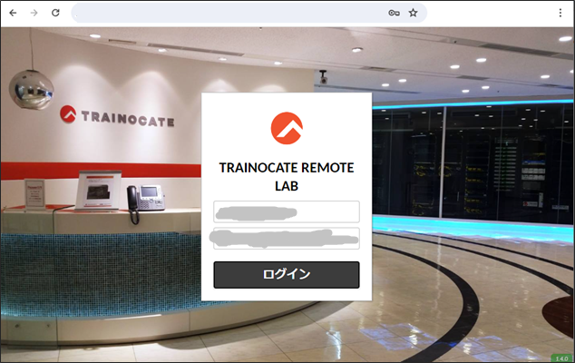
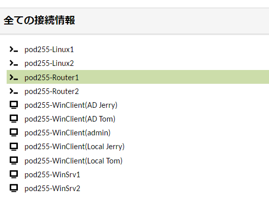

# 演習環境の操作を練習する
---


## 演習における役割と、環境のパラメータ
- X: ご自身のPod番号
- Linux1: podX-Linux1
- Linux2: podX-Linux2
- Windows Server 1: podX-WinSrv1
- Router1: podX-Router1
- Router2: podX-Router2

## 注意
- 手順例の画像は<B>pod255</B>に準拠したパラメータのものです
- 手順内の<B>X</B>表記はご自身のpod番号に読み替えてください

---

# Remote Labにログインする  

1. Remote Labにログインする  

    <kbd></kbd>
  
    > 【補足】  
    > ログインのためのユーザーアカウントは、担当講師がご案内します。  

1. 演習環境のマシンの一覧が表示されていることを確認する  


---  


# Windows Serverの操作を練習する

1. Home画面下部の "全ての接続情報" の "Windows Server 1(podX-WinSrv1)"をクリックする  

    <kbd></kbd>  

    > 【補足】  
    > マシンの操作画面から一覧画面に戻るためには、Webブラウザのブラウザバック(戻る)ボタンを使用します。    

    > 【補足】  
    > 演習環境の操作画面は、Webブラウザのタブ機能を利用して操作することもできます。  

1. "Windows Server 1(podX-WinSrv1)"に接続し、デスクトップ画面が表示されるのを確認する  

    <kbd></kbd>  

    > 【補足】  
    > ログイン時には、数秒の待ち時間が発生します。
    > Webブラウザのタブ機能を利用して接続状態を維持することで、多数の演習環境のマシンに手早くアクセスすることができます。


1. [スタートメニュー]を右クリックし、コンテキストメニュー内の[Windows PowerShell(管理者)]をクリックする  

    <kbd></kbd>  

    > 【補足】  
    > 右クリック時に、お手元のWebブラウザとしての右クリックメニューが重なって表示される場合は、Webブラウザのアドオンが操作を妨げている疑いがあります。  
    > 右クリック機能を強化する操作補助アドオン(例: Enable Right Clickなど)を無効化してください。  


1. ユーザーアカウント制御のポップアップで、[はい]をクリックする  
    <kbd></kbd>  

    > 【補足】  
    > UAC(User Account Control)は、Windows OSのセキュリティ機能です。   
    > 意図しない管理操作を誤って実行してしまうトラブルを予防します。   
    > これから管理操作を意図して実行する場合は、UACのポップアップで[はい]をクリックしてください。  

1. [管理者:Windows PowerShell]が起動したことを確認する  
    <kbd></kbd>  

    > 【補足】  
    > PowerShellはWindows OS標準のコマンドライン操作ツールです。  
    > 後方互換が考慮されているため、従来のコマンドプロンプトの機能(DOSコマンド)も、従来と同様に使用できます。  

1. PowerShellで以下のコマンドを実行し、Windows OSのホスト名を表示する   
    ***hostname***  

    <kbd></kbd>  

    > 【補足】  
    > 演習環境のWindows OSには、それぞれ固有のホスト名が設定されています。  
    > デバイス名と年月日、Pod番号を組み合わせたネーミングルールです。   

1. [スタートメニュー]をクリックし、メニュー内の[Server Manager]をクリックする 
    <kbd></kbd>  

1. [Server Manager]が起動したことを確認する   
    <kbd></kbd>  

    > 【補足】  
    > Server ManagerはWindows Serverの統合管理操作ツールです。  
    > さまざまな管理操作を開始できるショートカットが用意されています。  

---  

# Linuxの操作を練習する  

1. Home画面下部の "全ての接続情報" の "Linux1"をクリックする  

    <kbd></kbd>  

1. "Linux1"の操作画面に接続したことを確認する  

    <kbd></kbd>  

# Linux1のSELinuxを無効化する
SELinuxはLinux OSのセキュリティ機構です。  
OSの動作の安全性を高めますが、サーバー構築の手順が複雑化するため、この研修に限ってはSELinuxを無効化して演習を進めます。  

1. SELinuxの状態を確認する  
    ***sestatus***  

    <kbd></kbd>  

    > 【確認ポイント】  
    > 'Current Mode:'が'enforcing'であることを確認する  
    > 'Mode from config file:'が'enforcing'であることを確認する  


1. SELinuxをOS起動時に無効にする  

    /etc/selinux/configをviで編集し、7行目のSELINUX=enforcingをSELINUX=disabledに書き換えます。  
    編集作業の前に、cpコマンドでconfigのバックアップを作成し、編集作業後にファイルをdiffコマンドで比較することで、作業内容が正確であることを確認します。  

    1. SELinuxのconfigファイルのバックアップを作成する  

        ***sudo cp /etc/selinux/config /etc/selinux/config.bak***   

        <kbd></kbd>   
  
    1. SELinuxのconfigファイルの編集を開始する  
    
        ***sudo vi /etc/selinux/config***  

        <kbd></kbd>   
  
    1. viでconfigファイルを開いた状態であることを確認する    

        <kbd></kbd>  

    1. キーボードの[i]を押下し、コマンドモードからインソートモードに変更する      

        <kbd></kbd>  

    1. インソートモードでキーボードの十字キーを操作し、7行目の行末までカーソルを移動させる       

        <kbd></kbd>  

    1. キーボードの[Back Space]キーを押下し、enforcingの文字を削除する         

        <kbd></kbd>  

    1. キーボードを操作し、disabledを入力する           

        <kbd></kbd>  

    1. キーボードの[Esc]を押下し、インソートモードからコマンドモードに変更する      
      
        <kbd></kbd>  

    1. コマンドモードの状態で キーボードの [:] [w] [q] を入力し、[Enter]キーを押下する        
      
        <kbd></kbd>  

        <kbd></kbd>  

1. SELinuxのconfigファイルの変更内容を確認する  

    1. SELinuxのconfigファイルの中身を確認し、意図した変更ができていることを目視で確認する        
        ***sudo cat /etc/selinux/config***   

        <kbd></kbd>  

        > 【確認ポイント】
        > 7行目が 'SELINUX=disabled' であることを確認する  

    1. SELinuxのconfigファイルを、事前に作成したバックアップファイル(config.bak)と比較し、作業内容が正確であることを確認する          
        ***diff /etc/selinux/config /etc/selinux/config.bak***  

        <kbd></kbd>  

        ```
        [admin@centos ~]$ sudo diff /etc/selinux/config /etc/selinux/config.bak
        7c7
        < SELINUX=disabled
        ---
        > SELINUX=enforcing
        [admin@centos ~]$ 
        ```

        > 【確認ポイント】  
        > 7行目が 'SELINUX=disabled' であること   
        > 意図しない箇所に不要な変更をしていないこと  

# Linux1のホスト名を変更する  
 
1. Linux1の現在のホスト名を確認する  
    ***hostname***  

    <kbd></kbd>  


1. Linux1のホスト名をlinux1に変更する  
    ***sudo hostname linux1***  

    <kbd></kbd>  

    > 【補足】  
    > sudo は特権モードとしてコマンドを実行します。  
    > ホスト名を参照する操作(hostnameコマンド)は通常ユーザーの権限で実行できますが、  
    > ホスト名を変更する操作(hostname <変更後の名前>)を実行するためには管理者の権限が必要です。     

<!--
【補足】
hostnameコマンドを実行すると、この段階で変更後のhostnameが表示されます。  
ただし、プロンプトにユーザー名とあわせて併記されるホスト名の表記は、まだこの段階では変更されません。  
OSを再起動するか、SSH接続を切断して再接続する必要があります。  
演習の進行を簡単にするため、次の操作でLinuxの再起動を実行します。
-->

# Linux1を再起動して設定変更の結果を確認する    
 
1. Linux1を再起動する    
    ***sudo systemctl reboot***  

    <kbd></kbd>  

    <kbd></kbd>  

    <kbd></kbd> 

    > 【補足】
    > 再起動(reboot)の実行により、操作画面に「切断されました」と表記されます。  
    > 再起動処理のため1分程度待機した後、[再接続]をクリックしてください。  

1. SELinuxが無効状態であることを確認する    
    ***sestatus***  

    <kbd></kbd>

    > 【確認ポイント】
    > 'SELinux status:'が'disabled'であることを確認する  

1. Linux1のホスト名を確認する  
    ***hostname***  

    <kbd></kbd>

    > 【確認ポイント】
    > 'linux1'であることを確認する  


# Linux2の設定を変更する
Linux2に対しても、Linux1と同様の設定変更作業を行います。  
SELinuxを無効化し、ホスト名をlinux2に変更します。  

本項においては、手順の表記が簡略化されています。  
Linuxの手順指示は、本項のようにコマンドベースで記述することがあります。  
作業内容は前項と同様ですが、手順の表記方法の違いに混乱しないように注意してください。  

1. Home画面下部の "全ての接続情報" の "Linux2"をクリックする  

1. Linux2のSELinuxの状態を確認する  
    ***sestatus***  

    ```
    [admin@centos ~]$ sestatus
    SELinux status:                 enabled
    SELinuxfs mount:                /sys/fs/selinux
    SELinux root directory:         /etc/selinux
    Loaded policy name:             targeted
    Current mode:                   enforcing
    Mode from config file:          enforcing
    Policy MLS status:              enabled
    Policy deny_unknown status:     allowed
    Max kernel policy version:      31
    [admin@centos ~]$ 
    ```

    > 【確認ポイント】
    > 'Current Mode:'が'enforcing'であることを確認する  
    > 'Mode from config file:'が'enforcing'であることを確認する  

1. Linux2のSELinuxをOS起動時に無効にする  
    ***sudo cp /etc/selinux/config /etc/selinux/config.bak***   
    ***sudo vi /etc/selinux/config***  
    ***diff /etc/selinux/config /etc/selinux/config.bak***   

    ```
    [admin@centos ~]$ sudo cp /etc/selinux/config /etc/selinux/config.bak 
    [admin@centos ~]$ sudo vi /etc/selinux/config    
    [admin@centos ~]$ diff /etc/selinux/config /etc/selinux/config.bak
    7c7
    < SELINUX=disabled
    ---
    > SELINUX=enforcing
    [admin@centos ~]$   
    ```

1. Linux2の現在のホスト名を確認する  
    ***hostname***  

    ```
    [admin@centos ~]$ hostname
    centos
    [admin@centos ~]$ 
    ``` 

1. Linux2のホスト名をlinux2に変更する  
    ***sudo hostname linux2***  

    ```
    [admin@centos ~]$ sudo hostname linux2
    [admin@centos ~]$ 
    ```

1. Linux2を再起動する    
    ***sudo systemctl reboot***  

1. Linux2の再起動完了後、再接続する     

1. Linux2のSELinuxが無効状態であることを確認する    
    ***sestatus***  

    ```
    [admin@linux2 ~]$ sestatus
    SELinux status:                 disabled
    [admin@linux2 ~]$ 
    ```

    > 【確認ポイント】  
    > 'SELinux status:'が'disabled'であることを確認する  

1. Linux2のホスト名を確認する  
    ***hostname***  

    ```
    [admin@linux2 ~]$ hostname
    linux2
    [admin@linux2 ~]$ 
    ```

    > 【確認ポイント】
    > 'linux2'であることを確認する  


---

# VyOSの操作を体験する  

1. Home画面下部の "全ての接続情報" の "Router 1(podX-Router1)"をクリックする  

    <kbd></kbd>

1. Router 1(VyOS)の管理画面に接続していることを確認する  
    ```
    Welcome to VyOS!

    Check out project news at https://blog.vyos.io
    and feel free to report bugs at https://phabricator.vyos.net

    You can change this banner using "set system login banner post-login" command.

    VyOS is a free software distribution that includes multiple components,
    you can check individual component licenses under /usr/share/doc/*/copyright
    Last login: Sat Jun  8 00:28:11 2024 from 10.0.0.4
    trainocatenwadmin@Router:~$ 
    ```


1. Enterキーを複数回押下し、現在のCLIモードがOperational Modeであることを確認する  

    ```
    trainocatenwadmin@Router:~$ 
    trainocatenwadmin@Router:~$ 
    trainocatenwadmin@Router:~$ 
    ```

    > 【補足】  
    > Operational Modeにおいては、プロンプトが以下の様式になります。末尾のドル($)記号に注目してください。  
    > 接続アカウント@デバイス名:~$   

1. [?]キーを入力し、ヘルプ機能で実行可能なコマンドを表示できることを確認する

    ***?***  

    ```
    trainocatenwadmin@Router:~$ 
    Possible completions:
    add                   Add an object to a service
    clear                 Clear system information
    clone                 Clone an object
    configure             Enter configuration mode
    connect               Establish connection
    copy                  Copy an object
    delete                Delete an object
    disconnect            Take down a connection
    force                 Force an operation
    format                Format a device
    generate              Generate an object 
    import                Import an object
    install               Install a new system
    monitor               Monitor system information
    ping                  Send Internet Control Message Protocol (ICMP) echo request
    poweroff              Poweroff the system
    reboot                Reboot the system
    release               Release specified variable
    rename                Rename an object
    renew                 Renew specified variable
    reset                 Reset a service
    restart               Restart individual service
    set                   Set operational options
    show                  Show system information
    telnet                Telnet to a node
    traceroute            Trace network path to node
    update                Update data for a service
    wake-on-lan           Send Wake-On-LAN (WOL) Magic Packet

        
    trainocatenwadmin@Router:~$ 
    ```

    > 【補足】  
    > [?]を入力することで、ヘルプ機能を利用できます。  
    > ヘルプ機能は、その状態で実行可能なコマンドの一覧を表示します。  

1. showコマンドの後に[?]を入力し、入力済みのコマンドによってヘルプ機能で表示される内容が異なることを確認する  
    ***show ?***  

    ```
    trainocatenwadmin@Router:~$ show 
    Possible completions:
    arp                   Show Address Resolution Protocol (ARP) information
    bfd                   Show Bidirectional Forwarding Detection (BFD)
    bgp                   BGP information
    bridge                Show bridging information
    cluster               Show clustering information
    configuration         Show available saved configurations
    conntrack             Show conntrack tables entries
    conntrack-sync        Show connection tracking synchronization information
    console-server        Show Console-Server information
    container             Show containers

    (略)
        
    trainocatenwadmin@Router:~$ show 

    ```

    
    > 【補足】  
    > 1画面に表示しきれないほどの多くの行が出力される場合、1ページごとに情報が表示されます。
    > 次のページを表示するためには、[スペース]キーを押下します。  


1. "show int"まで入力した段階で[Tab]キーを押下することで、コマンド入力の補完ができることを確認する  
    ***show int(Tabキー入力)***  
    ***show interfaces***  

    ```
    trainocatenwadmin@Router:~$ show int
    trainocatenwadmin@Router:~$ show interfaces 
    Codes: S - State, L - Link, u - Up, D - Down, A - Admin Down
    Interface        IP Address                        S/L  Description
    ---------        ----------                        ---  -----------
    eth0             10.255.1.254/24                   u/u  
    eth1             10.255.2.253/24                   u/u  
    lo               127.0.0.1/8                       u/u  
                    ::1/128                                
    trainocatenwadmin@Router:~$ 
    ```

    
    > 【補足】  
    > コマンドの単語を途中まで入力し、[Tab]キーを押下することで、以降のコマンド入力が自動的に保管されます。  
    > 候補となるコマンドが複数個存在する場合は、それら候補のコマンドを表示します。  


1. 以下のコマンドを実行し、ルータのイーサネット インターフェイスに設定されているIPアドレスを確認する   
    ***show interfaces ethernet***  

    ```
    trainocatenwadmin@Router:~$ show interfaces ethernet 
    Codes: S - State, L - Link, u - Up, D - Down, A - Admin Down
    Interface        IP Address                        S/L  Description
    ---------        ----------                        ---  -----------
    eth0             10.255.1.254/24                   u/u  
    eth1             10.255.2.253/24                   u/u  
    trainocatenwadmin@Router:~$ 
    ```
    
    > 【補足】  
    > この環境のルータには、2つのイーサネット インターフェイスが接続されています。  
    > それぞれeth0とeth1と表記されます。

1. 以下のコマンドを実行し、CLIモードをConfiguration Modeに変更する   
    ***configure***  

    ```
    trainocatenwadmin@Router:~$ configure 
    [edit]
    trainocatenwadmin@Router# 
    ```

    > 【補足】  
    > Configuration Modeにおいては、プロンプトが以下の様式になります。末尾のシャープ(#)記号に注目してください。  
    > 接続アカウント@デバイス名:#   


1. 以下のコマンドを実行し、ホスト名をRouterからRouter1に変更する     
    ***set system host-name Router1***  

    ```
    trainocatenwadmin@Router# set system host-name Router1
    [edit]
    trainocatenwadmin@Router# 
    ```

    
    > 【補足】  
    > VyOSのconfig変更は、setキーワードを使用します。  
    > configを削除する場合は、deleteキーワードを使用します。  


1. 以下のコマンドを実行し、ホスト名(host-name)が変更されていることを確認する      
    ***show***  

    ```
    trainocatenwadmin@Router# show
    interfaces {
        ethernet eth0 {
            address dhcp
            hw-id 00:22:48:e8:53:84
        }
        ethernet eth1 {
            address dhcp
            hw-id 00:22:48:e8:5b:26
        }
        loopback lo {
        }
    }
    service {
        ssh {
        }
    }
    system {
        config-management {
            commit-revisions 100
        }
        conntrack {
            modules {
                ftp
                h323
                nfs
                pptp
                sip
                sqlnet
                tftp
            }
        }
        console {
            device ttyS0 {
                speed 115200
            }
        }
    >   host-name Router1
        login {
            user admin {
                authentication {
                    encrypted-password $6$CI1hKHXVz85gysGo$0LgJPULeBXp3HH7ah9d8uTDZpV4lLJTOb5qWo611YRu3p3Uhe8PVj.mxoz37Sg9PlfbD5EWdc3vTbopyhRCfg1
                }
            }
            user trainocatenwadmin {
                authentication {
                    encrypted-password $6$if9qL5iyjLKh51N8$etjh/ANnqmtjPpq7QRZ7lzcSWC2PZKlbTrgVIuQojPaNxd.RHl1CKyC0wUtIz8bCts9h3Qdqf7lqH21mdlYoN0
                }
            }
            user vyos {
                authentication {
                    encrypted-password $6$aH9TbbUpCjxSAJuq$GiAZtRx5NiYFdaKbXcqtBhNNAiYGYjwxGK3r3dF886j7AiOQlzarxpW4zK38SXp8qskxNzbKAOh8FE.UpKCa3/
                    plaintext-password ""
                }
            }
        }
        name-server 8.8.8.8
        ntp {
            server time1.vyos.net {
            }
            server time2.vyos.net {
            }
            server time3.vyos.net {
            }
        }
        syslog {
            global {
                facility all {
                    level info
                }
                facility protocols {
                    level debug
                }
            }
        }
    }
    [edit]
    trainocatenwadmin@Router# 
    ```

    
    > 【補足】  
    > host-name の行の左端に > マークがついていることに注目します。  
    > このマークは、変更箇所がまだcommitされていないことを示します。

    > 【補足】  
    > Configuration Modeでshowコマンドを実行すると、Configurationの全文を表示します。      


1. 以下のコマンドを実行し、ホスト名の変更をRunning Configurationに反映(commit)する     
    ***commit***  

    ```
    trainocatenwadmin@Router# commit
    [edit]
    trainocatenwadmin@Router# 
    ```

    
    > 【補足】  
    > VyOSのconfig変更操作は、まずWorking Configurationに対して実行されます。  
    > Working Configurationの内容を実際のデバイスの動作に反映するためには、Running Configuration (Active Configuration)へのCommit操作が必要です。  


1. 以下のコマンドを実行し、Running ConfigurationをSaved configurationに保存する  
    ***save***  

    ```
    trainocatenwadmin@Router# save
    Saving configuration to '/config/config.boot'...
    Done
    [edit]
    trainocatenwadmin@Router# 
    ```

    
    > 【補足】  
    > VyOSの起動時に読み込まれるのは、Saved configurationです。  
    > config変更操作を保存するためには、Running ConfigurationをSaved Configurationに保存するSave操作が必要です。


1. 以下のコマンドを実行し、Configuration Modeを終了し、CLIモードをOperational Modeに変更する   
    ***exit***  

    ```
    trainocatenwadmin@Router# exit
    exit
    trainocatenwadmin@Router:~$ 

    ```

1. 以下のコマンドを実行し、Router1からログアウトする   
    ***logout***  

    ```
    trainocatenwadmin@Router:~$ logout
    ```
    
    > 【補足】  
    > プロンプトのホスト名の表記は、管理接続を再確立した際に変更が反映されます。  


1. Router1に再接続し、プロンプトのホスト名の表記がRouter1であることを確認する   

    ```
    trainocatenwadmin@Router1:~$ 

    ```


---

# Router 2のホスト名を変更する    

 
1. Home画面下部の "全ての接続情報" の "Router 2(podX-Router2)"をクリックする  

    <kbd></kbd>

1. Router 2に接続していることを確認する  

1. 以下のコマンドを実行し、Router 2のインターフェイスのIPアドレスを確認する    
    ***sh int eth***  

    ```  
    trainocatenwadmin@Router:~$ sh int eth
    Codes: S - State, L - Link, u - Up, D - Down, A - Admin Down
    Interface        IP Address                        S/L  Description
    ---------        ----------                        ---  -----------
    eth0             10.255.2.254/24                   u/u  
    eth1             10.255.3.254/24                   u/u  
    trainocatenwadmin@Router:~$ 
    ```  

    > 【補足】  
    >  sh int eth は show interfaces ethernet です。   
    > VyOSは、コマンドの省略入力をサポートしています。 
    > 省略する場合は、コマンドを一意に特定できる長さまで単語を入力する必要があります。   

1. 以下のコマンドを実行し、Router 2のホスト名を変更する      
    ***conf***  
    ***set sys host Router2***  
    ***commit***  
    ***save***  
    ***exit***  

    ```  
    trainocatenwadmin@Router:~$ conf
    [edit]
    trainocatenwadmin@Router# set sys host Router2
    [edit]
    trainocatenwadmin@Router# commit
    [edit]
    trainocatenwadmin@Router# save
    Saving configuration to '/config/config.boot'...
    Done
    [edit]
    trainocatenwadmin@Router# exit
    exit
    trainocatenwadmin@Router:~$ 
    ```  

    > 【補足】  
    >  set sys host Router2 は set system host-name Router2 です。   


1. 以下のコマンドを実行し、Router 2のRunning Configurationを確認する    

    ***show configuration***  
    ***show configuration commands***  

    ```
    trainocatenwadmin@Router:~$ show configuration 
    interfaces {
        ethernet eth0 {
            address dhcp
            hw-id 60:45:bd:64:fb:17
        }
        ethernet eth1 {
            address dhcp
            hw-id 60:45:bd:64:f9:80
        }
        loopback lo {
        }
    }
    service {
        ssh {
        }
    }
    system {
        config-management {
            commit-revisions 100
        }
        conntrack {
            modules {
                ftp
                h323
                nfs
                pptp
                sip
                sqlnet
                tftp
            }
        }
        console {
            device ttyS0 {
                speed 115200
            }
        }
        host-name Router2
        login {
            user admin {
                authentication {
                    encrypted-password ****************
                }
            }
            user trainocatenwadmin {
                authentication {
                    encrypted-password ****************
                }
            }
            user vyos {
                authentication {
                    encrypted-password ****************
                    plaintext-password ****************
                }
            }
        }
        name-server 8.8.8.8
        ntp {
            server time1.vyos.net {
            }
            server time2.vyos.net {
            }
            server time3.vyos.net {
            }
        }
        syslog {
            global {
                facility all {
                    level info
                }
                facility protocols {
                    level debug
                }
            }
        }
    }
    trainocatenwadmin@Router:~$ 
    trainocatenwadmin@Router:~$
    trainocatenwadmin@Router:~$ show configuration commands 
    set interfaces ethernet eth0 address 'dhcp'
    set interfaces ethernet eth0 hw-id '60:45:bd:64:fb:17'
    set interfaces ethernet eth1 address 'dhcp'
    set interfaces ethernet eth1 hw-id '60:45:bd:64:f9:80'
    set interfaces loopback lo
    set service ssh
    set system config-management commit-revisions '100'
    set system conntrack modules ftp
    set system conntrack modules h323
    set system conntrack modules nfs
    set system conntrack modules pptp
    set system conntrack modules sip
    set system conntrack modules sqlnet
    set system conntrack modules tftp
    set system console device ttyS0 speed '115200'
    set system host-name 'Router2'
    set system login user admin authentication encrypted-password '$6$CI1hKHXVz85gysGo$0LgJPULeBXp3HH7ah9d8uTDZpV4lLJTOb5qWo611YRu3p3Uhe8PVj.mxoz37Sg9PlfbD5EWdc3vTbopyhRCfg1'
    set system login user trainocatenwadmin authentication encrypted-password '$6$if9qL5iyjLKh51N8$etjh/ANnqmtjPpq7QRZ7lzcSWC2PZKlbTrgVIuQojPaNxd.RHl1CKyC0wUtIz8bCts9h3Qdqf7lqH21mdlYoN0'
    set system login user vyos authentication encrypted-password '$6$aH9TbbUpCjxSAJuq$GiAZtRx5NiYFdaKbXcqtBhNNAiYGYjwxGK3r3dF886j7AiOQlzarxpW4zK38SXp8qskxNzbKAOh8FE.UpKCa3/'
    set system login user vyos authentication plaintext-password ''
    set system name-server '8.8.8.8'
    set system ntp server time1.vyos.net
    set system ntp server time2.vyos.net
    set system ntp server time3.vyos.net
    set system syslog global facility all level 'info'
    set system syslog global facility protocols level 'debug'
    trainocatenwadmin@Router:~$ 
    ```

    > 【補足】  
    >  Operational ModeでConfigurationを表示するためには、show configurationコマンドを実行します。
    > show configuration commands と入力すると、コマンド形式で出力されます。  
    
1. 以下のコマンドを実行し、Router2からログアウトする   
    ***logout***  

    ```
    trainocatenwadmin@Router:~$ logout
    ```
    

1. Router2に再接続し、プロンプトのホスト名の表記がRouter2であることを確認する   

    ```
    trainocatenwadmin@Router2:~$ 


---

# 演習完了  
ここまでの手順で、以下の項目を学習できました。
- [x] 演習環境のRemote Labにログインする  
- [x] 演習環境のマシンに接続して操作する  
- [x] viエディタでLinuxのテキストファイルを編集する
- [x] VyOSの操作を体験する  
