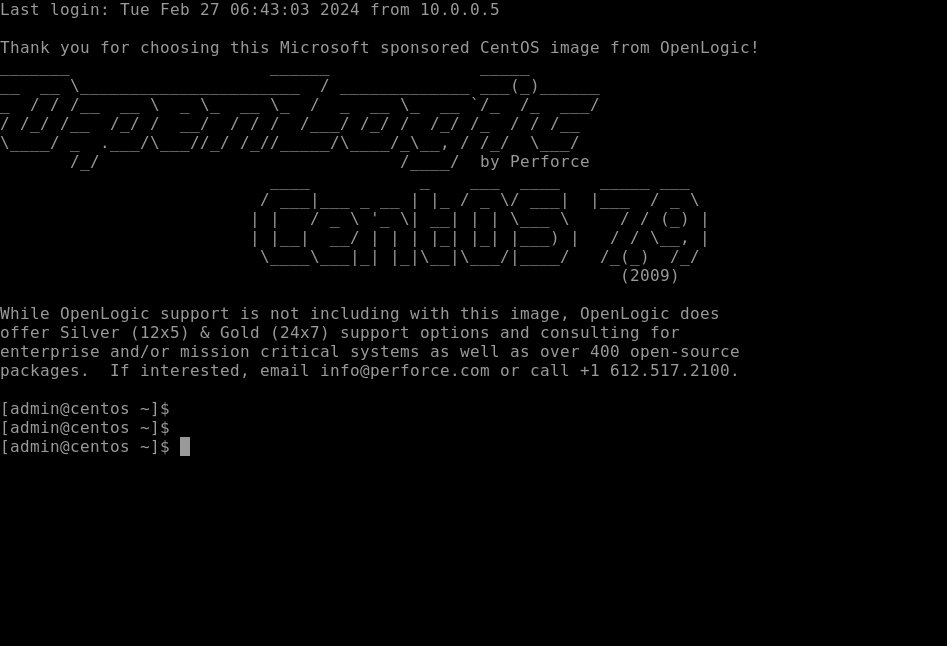

# 演習環境の操作を練習する
---


## 演習における役割と、環境のパラメータ
- X: ご自身のPod番号
- Linux1: podX-Linux1
- Linux2: podX-Linux2
- Windows Server 1: podX-WinSrv1
- Router1: CSR1


## 注意
- 手順例の画像は<B>pod255</B>に準拠したパラメータのものです
- 手順内の<B>X</B>表記はご自身のpod番号に読み替えてください

---

# Remote Labにログインする  

1. Remote Labにログインする  

    <kbd></kbd>
  
    > 【補足】  
    > ログインのためのユーザーアカウントは、担当講師がご案内します。  

1. 演習環境のマシンの一覧が表示されていることを確認する  


---  


# Windows Serverの操作を練習する

1. 画面下部の "全ての接続情報" の "Windows Server 1(podX-WinSrv1)"をクリックする  

    <kbd></kbd>  

    > 【補足】  
    > マシンの操作画面から一覧画面に戻るためには、Webブラウザのブラウザバック(戻る)ボタンを使用します。    

    > 【補足】  
    > 演習環境の操作画面は、Webブラウザのタブ機能を利用して操作することもできます。  

1. "Windows Server 1(podX-WinSrv1)"に接続し、デスクトップ画面が表示されるのを確認する  

    <kbd></kbd>  

    > 【補足】  
    > ログイン時には、数秒の待ち時間が発生します。
    > Webブラウザのタブ機能を利用して接続状態を維持することで、多数の演習環境のマシンに手早くアクセスすることができます。


1. [スタートメニュー]を右クリックし、コンテキストメニュー内の[Windows PowerShell(管理者)]をクリックする  

    <kbd></kbd>  

    > 【補足】  
    > 右クリック時に、お手元のWebブラウザとしての右クリックメニューが重なって表示される場合は、Webブラウザのアドオンが操作を妨げている疑いがあります。  
    > 右クリック機能を強化する操作補助アドオン(例: Enable Right Clickなど)を無効化してください。  


1. ユーザーアカウント制御のポップアップで、[はい]をクリックする  
    <kbd></kbd>  

    > 【補足】  
    > UAC(User Account Control)は、Windows OSのセキュリティ機能です。   
    > 意図しない管理操作を誤って実行してしまうトラブルを予防します。   
    > これから管理操作を意図して実行する場合は、UACのポップアップで[はい]をクリックしてください。  

1. [管理者:Windows PowerShell]が起動したことを確認する  
    <kbd></kbd>  

    > 【補足】  
    > PowerShellはWindows OS標準のコマンドライン操作ツールです。  
    > 後方互換が考慮されているため、従来のコマンドプロンプトの機能(DOSコマンド)も、従来と同様に使用できます。  

1. PowerShellで以下のコマンドを実行し、Windows OSのホスト名を表示する   
    ＞ ***hostname***  

    <kbd></kbd>  

    > 【補足】  
    > 演習環境のWindows OSには、それぞれ固有のホスト名が設定されています。  
    > デバイス名と年月日、Pod番号を組み合わせたネーミングルールです。   

1. [スタートメニュー]をクリックし、メニュー内の[Server Manager]をクリックする 
    <kbd></kbd>  

1. [Server Manager]が起動したことを確認する   
    <kbd></kbd>  

    > 【補足】  
    > Server ManagerはWindows Serverの統合管理操作ツールです。  
    > さまざまな管理操作を開始できるショートカットが用意されています。  

---  

# Linuxの操作を練習する  

1. 画面下部の "全ての接続情報" の "Linux1"をクリックする  

    <kbd></kbd>  

1. "Linux1"の操作画面に接続したことを確認する  

    <kbd></kbd>  

## Linux1のSELinuxを無効化する
SELinuxはLinux OSのセキュリティ機構です。  
OSの動作の安全性を高めますが、サーバー構築の手順が複雑化するため、この研修に限ってはSELinuxを無効化して演習を進めます。  

1. SELinuxの状態を確認する  
    ＞ ***sestatus***  

    <kbd></kbd>  

    > 【確認ポイント】  
    > 'Current Mode:'が'enforcing'であることを確認する  
    > 'Mode from config file:'が'enforcing'であることを確認する  


1. SELinuxをOS起動時に無効にする  

    /etc/selinux/configをviで編集し、7行目のSELINUX=enforcingをSELINUX=disabledに書き換えます。  
    編集作業の前に、cpコマンドでconfigのバックアップを作成し、編集作業後にファイルをdiffコマンドで比較することで、作業内容が正確であることを確認します。  

    1. SELinuxのconfigファイルのバックアップを作成する  

        ＞ ***sudo cp /etc/selinux/config /etc/selinux/config.bak***   

        <kbd></kbd>   
  
    1. SELinuxのconfigファイルの編集を開始する  
    
        ＞ ***sudo vi /etc/selinux/config***  

        <kbd></kbd>   
  
    1. viでconfigファイルを開いた状態であることを確認する    

        <kbd></kbd>  

    1. キーボードの[i]を押下し、コマンドモードからインソートモードに変更する      

        <kbd></kbd>  

    1. インソートモードでキーボードの十字キーを操作し、7行目の行末までカーソルを移動させる       

        <kbd></kbd>  

    1. キーボードの[Back Space]キーを押下し、enforcingの文字を削除する         

        <kbd></kbd>  

    1. キーボードを操作し、disabledを入力する           

        <kbd></kbd>  

    1. キーボードの[Esc]を押下し、インソートモードからコマンドモードに変更する      
      
        <kbd></kbd>  

    1. コマンドモードの状態で キーボードの [:] [w] [q] を入力し、[Enter]キーを押下する        
      
        <kbd></kbd>  

        <kbd></kbd>  

1. SELinuxのconfigファイルの変更内容を確認する  

    1. SELinuxのconfigファイルの中身を確認し、意図した変更ができていることを目視で確認する        
        ＞ ***sudo cat /etc/selinux/config***   

        <kbd></kbd>  

        > 【確認ポイント】
        > 7行目が 'SELINUX=disabled' であることを確認する  

    1. SELinuxのconfigファイルを、事前に作成したバックアップファイル(config.bak)と比較し、作業内容が正確であることを確認する          
        ＞ ***diff /etc/selinux/config /etc/selinux/config.bak***  

        <kbd></kbd>  

        ```
        [admin@centos ~]$ sudo diff /etc/selinux/config /etc/selinux/config.bak
        7c7
        < SELINUX=disabled
        ---
        > SELINUX=enforcing
        [admin@centos ~]$ 
        ```

        > 【確認ポイント】  
        > 7行目が 'SELINUX=disabled' であること   
        > 意図しない箇所に不要な変更をしていないこと  

## Linux1のホスト名を変更する  
 
1. Linux1の現在のホスト名を確認する  
    ＞ ***hostname***  

    <kbd></kbd>  


1. Linux1のホスト名をlinux1に変更する  
    ＞ ***sudo hostname linux1***  

    <kbd></kbd>  

    > 【補足】  
    > sudo は特権モードとしてコマンドを実行します。  
    > ホスト名を参照する操作(hostnameコマンド)は通常ユーザーの権限で実行できますが、  
    > ホスト名を変更する操作(hostname <変更後の名前>)を実行するためには管理者の権限が必要です。     

<!--
【補足】
hostnameコマンドを実行すると、この段階で変更後のhostnameが表示されます。  
ただし、プロンプトにユーザー名とあわせて併記されるホスト名の表記は、まだこの段階では変更されません。  
OSを再起動するか、SSH接続を切断して再接続する必要があります。  
演習の進行を簡単にするため、次の操作でLinuxの再起動を実行します。
-->

## Linux1を再起動して設定変更の結果を確認する    
 
1. Linux1を再起動する    
    ＞ ***sudo systemctl reboot***  

    <kbd></kbd>  

    <kbd></kbd>  

    <kbd></kbd> 

    > 【補足】
    > 再起動(reboot)の実行により、操作画面に「切断されました」と表記されます。  
    > 再起動処理のため1分程度待機した後、[再接続]をクリックしてください。  

1. SELinuxが無効状態であることを確認する    
    ＞ ***sestatus***  

    <kbd></kbd>

    > 【確認ポイント】
    > 'SELinux status:'が'disabled'であることを確認する  

1. Linux1のホスト名を確認する  
    ＞ ***hostname***  

    <kbd></kbd>

    > 【確認ポイント】
    > 'linux1'であることを確認する  


## Linux2の設定を変更する
Linux2に対しても、Linux1と同様の設定変更作業を行います。  
SELinuxを無効化し、ホスト名をlinux2に変更します。  

本項においては、手順の表記が簡略化されています。  
Linuxの手順指示は、本項のようにコマンドベースで記述することがあります。  
作業内容は前項と同様ですが、手順の表記方法の違いに混乱しないように注意してください。  

1. 画面下部の "全ての接続情報" の "Linux2"をクリックする  

1. Linux2のSELinuxの状態を確認する  
    ＞ ***sestatus***  

    ```
    [admin@centos ~]$ sestatus
    SELinux status:                 enabled
    SELinuxfs mount:                /sys/fs/selinux
    SELinux root directory:         /etc/selinux
    Loaded policy name:             targeted
    Current mode:                   enforcing
    Mode from config file:          enforcing
    Policy MLS status:              enabled
    Policy deny_unknown status:     allowed
    Max kernel policy version:      31
    [admin@centos ~]$ 
    ```

    > 【確認ポイント】
    > 'Current Mode:'が'enforcing'であることを確認する  
    > 'Mode from config file:'が'enforcing'であることを確認する  

1. Linux2のSELinuxをOS起動時に無効にする  
    ＞ ***sudo cp /etc/selinux/config /etc/selinux/config.bak***   
    ＞ ***sudo vi /etc/selinux/config***  
    ＞ ***diff /etc/selinux/config /etc/selinux/config.bak***   

    ```
    [admin@centos ~]$ sudo cp /etc/selinux/config /etc/selinux/config.bak 
    [admin@centos ~]$ sudo vi /etc/selinux/config    
    [admin@centos ~]$ diff /etc/selinux/config /etc/selinux/config.bak
    7c7
    < SELINUX=disabled
    ---
    > SELINUX=enforcing
    [admin@centos ~]$   
    ```

1. Linux2の現在のホスト名を確認する  
    ＞ ***hostname***  

    ```
    [admin@centos ~]$ hostname
    centos
    [admin@centos ~]$ 
    ``` 

1. Linux2のホスト名をlinux2に変更する  
    ＞ ***sudo hostname linux2***  

    ```
    [admin@centos ~]$ sudo hostname linux2
    [admin@centos ~]$ 
    ```

1. Linux2を再起動する    
    ＞ ***sudo systemctl reboot***  

1. Linux2の再起動完了後、再接続する     

1. Linux2のSELinuxが無効状態であることを確認する    
    ＞ ***sestatus***  

    ```
    [admin@linux2 ~]$ sestatus
    SELinux status:                 disabled
    [admin@linux2 ~]$ 
    ```

    > 【確認ポイント】  
    > 'SELinux status:'が'disabled'であることを確認する  

1. Linux2のホスト名を確認する  
    ＞ ***hostname***  

    ```
    [admin@linux2 ~]$ hostname
    linux2
    [admin@linux2 ~]$ 
    ```

    > 【確認ポイント】
    > 'linux2'であることを確認する  


---

# Cisco IOSの操作モードを体験する  

1. 画面下部の "全ての接続情報" の "Router 1(podX-Router1)"をクリックする  

1. Router 1(CSR1)に接続していることを確認する  

1. 現在の設定モードが、特権モードであることを確認する  

    ```
    CSR1#
    CSR1#
    CSR1#
    ```
    
    > 【補足】  
    > 特権モードにおいては、プロンプトが以下の様式になります。  
    > デバイス名#   


1. 特権モードでは、デバイスの情報を参照するコマンド(showコマンド)を実行できます。  
    ＞ ***show ip interface brief***  

    ```
    CSR1#show ip interface brief
    Interface              IP-Address      OK? Method Status                Protocol
    GigabitEthernet1       10.255.1.254      YES DHCP   up                    up      
    GigabitEthernet2       10.255.2.253      YES DHCP   up                    up      
    VirtualPortGroup0      192.168.35.101  YES TFTP   up                    up      
    CSR1#
    ```

    > 【補足】  
    > show ip interface brief コマンドは、デバイスのインターフェイスのIPアドレスを表示します。  


1. 特権モードで実行可能な管理操作であるconfigの保存コマンドを実行します。  
    ＞ ***write***  

    ```
    CSR1#write
    Building configuration...
    [OK]
    CSR1#
    ```

1. 以下のコマンドを実行し、特権モードからグローバルコンフィグレーションモードに変更する  
    ＞ ***conf t***  

    ```
    CSR1#conf t
    Enter configuration commands, one per line.  End with CNTL/Z.
    CSR1(config)#
    ```

    > 【補足】
    > グローバルコンフィグレーションモードにおいては、プロンプトが以下の様式になります。  
    > デバイス名(config)#   

    > 【補足】  
    > conf t は configure terminal の省略形です。
    > Cisco IOSにおいては、コマンドを一意に特定可能な長さまで入力することで、コマンドの表記を省略して実行することができます。  


1. 以下のコマンドを実行し、グローバルコンフィグレーションモードでは特権モードのコマンド(showやwrite)が実行できないことを確認する    
    ＞ ***show ip interface brief***  
    ＞ ***write***  


    ```
    CSR1(config)#show ip interface brief
                ^
    % Invalid input detected at '^' marker.

    CSR1(config)#write
                ^
    % Invalid input detected at '^' marker.

    CSR1(config)#
    ```

    > 【補足】
    > 特権モードのコマンドをコンフィグレーションモードで実行するためには、doオプションを使用します。  
    > 以下のように記述すると、showコマンドをグローバルコンフィグレーションモードで実行できます。    
    > CSR1(config)# do show ip interface brief

    > 【補足】  
    > writeは、現在のデバイスの設定を保存します。  


1. Router1の管理接続の自動切断時間を60分に延長する   
    CSR1(config)# ***line vty 0 15***   
    CSR1(config-line)# ***exec-timeout 60 0***  
    CSR1(config-line)# ***exit***  
    CSR1(config)# ***exit***  
    CSR1# ***show running-config***  
    CSR1# ***write***  

    > 【補足】  
    > line vtyは管理接続通信を意味します。  
    > SSHやTelnetの動作を調整します。  

    > 【補足】  
    > show running-configは、現在のデバイスのすべての設定を表示します。  


1. Router2(CSR2)で以下のコマンドを実行し、管理接続の自動切断時間を60分に延長する   

    > 【注意】  
    > この手順はRouter 2で操作します。  


    CSR2# ***conf t***  
    CSR2(config)# ***line vty 0 15***  
    CSR2(config-line)# ***exec-timeout 60 0***  
    CSR2(config-line)# ***end***  
    CSR2# ***show run | section line vty***  
    CSR2# ***write***  

    > 【補足】  
    > show running-configは、show runと省略表記する場合があります。  

    > 【補足】   
    > | (パイプ) とsectionを指定することで、前のコマンドの出力結果から目的の箇所のみを絞り込んで表示することができます。  

    > 【補足】  
    > endコマンドにより、あらゆるコンフィグレーションモードから特権モードに戻ることができます。    


1. (オプション)Router2(CSR2)で以下のコマンドを実行し、管理接続の自動切断時間を55分に設定する   

    CSR2# ***conf t***  
    CSR2(config)# ***line vty 0 15***  
    CSR2(config-line)# ***do show run | section line vty***  
    CSR2(config-line)# ***no exec-timeout 60 0***  
    CSR2(config-line)# ***do show run | sec line vty***  
    CSR2(config-line)# ***exec-timeout 55 0***  
    CSR2(config-line)# ***do show run | sec line vty***  
    CSR2(config-line)# ***end***  
    CSR2# ***write***  

    > 【補足】   
    > do オプションを指定することで、コンフィグレーションモードでもshowコマンドを実行できます。    

    > 【補足】   
    > no オプションを指定することで、configを削除できます。  
    > この操作では、exec-timeout 60 0を削除してから、exec-timeout 55 0を再入力しています。  
    > no オプションは、configの修正をする際に頻繁に使用するオプションです。    

    > 【補足】   
    > secはsectionの省略表記です。     


> [!IMPORTANT]  
> 今後の演習においてCisco IOS-XEのconfigを誤って入力した場合は、以下のStepでconfigを修正できます。   
> ① show run コマンドで現在のconfigを確認する  
> ② no オプションで誤ったconfigを削除する  
> ③ 正しいconfigを再入力する   
> ④ configが修正できたことをshow run コマンドで確認する  


---

## 演習完了  
ここまでの手順で、以下の項目を学習できました。
- [x] 演習環境のRemote Labにログインする  
- [x] 演習環境のマシンに接続して操作する  
- [x] viエディタでLinuxのテキストファイルを編集する
- [x] Cisco IOS-XEの操作モードを体験する  
