# Ciscoルータの基本的なルーティングを設定する
---

## 演習における役割と、環境のパラメータ
- X: ご自身のPod番号
- Router1: CSR1
- Router2: CSR2
- Network1: 10.X.1.0/24
- Network2: 10.X.2.0/24
- Network3: 10.X.3.0/24

## 注意
- 手順例の画像は<B>pod255</B>に準拠したパラメータのものです
- 手順内の<B>X</B>表記はご自身のpod番号に読み替えてください

---

## 1. Router1のStatic Routeを構成する

1. Router1の管理画面に接続する  
    <kbd>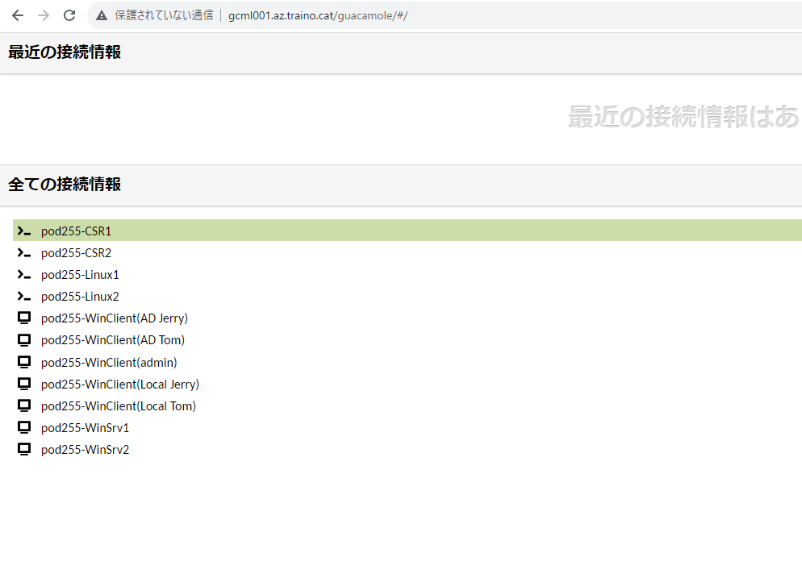</kbd>
1. 管理画面のプロンプト表記を確認し、Router1に接続していることを確認する  
    <kbd>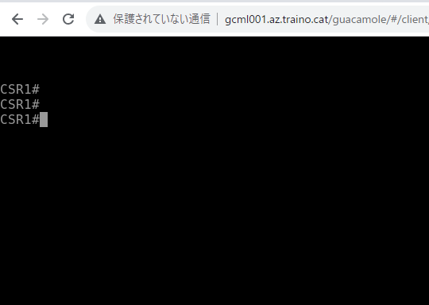</kbd>
1. 以下のコマンドを実行し、特権モードからグローバルコンフィギュレーションモードに遷移する  
    CSR1# ***configure terminal***  
    <kbd>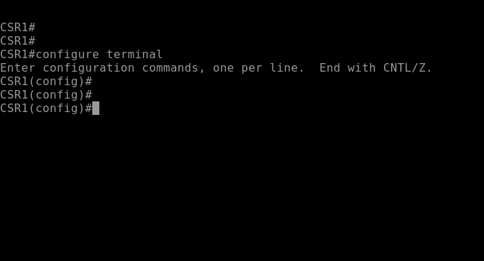</kbd>
1. Router1からNetwork3(10.X.3.0/24)宛のStatic Routeを作成するコマンドを実行する  
    CSR1(config)# ***ip route 10.X.3.0 mask 255.255.255.0 10.X.2.254***
    <kbd>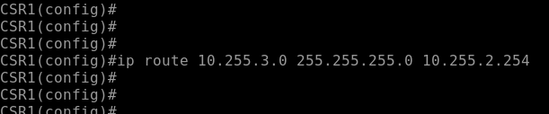</kbd>

---

## 2. Router1のStatic Routeを確認する
1. 以下のコマンドを実行し、グローバルコンフィギュレーションモードから特権モードに遷移する  
    CSR1(config)# ***end***  
    <kbd>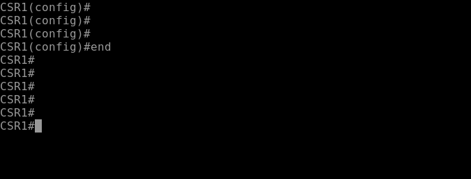</kbd>
1. 以下のコマンドを実行し、Router1のルーティングテーブルを表示する  
    CSR1# ***show ip route***  
1. ルーティングテーブルに、Router2をNext Hop(10.X.2.254)とするNetwork3(10.X.3.0/24)宛の経路情報が登録されていることを確認する  
    <kbd>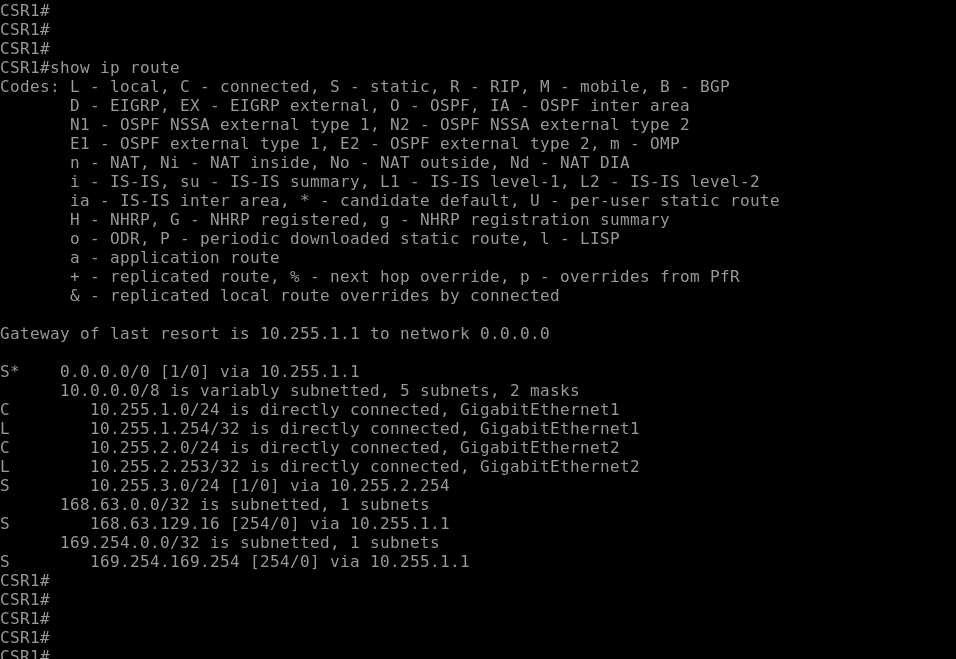</kbd>
    > 【補足】  
    > ルーティング エントリ行の左端のアルファベットは、経路の学習方法を示します。
    > "S" は "Static" の意味です。
1. 以下のコマンドを実行し、Router1のNetwork2のインターフェイスからRouter2への疎通を確認する  
    CSR1# ***ping 10.X.2.254 source 10.X.2.253***  
    CSR1# ***ping 10.X.3.254 source 10.X.2.253***    
    <kbd>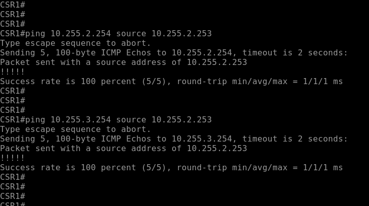</kbd>  
    
    > 【補足】  
    > Cisco IOSにおけるpingの実行結果の解釈は、以下のとおりです  

    |表記|意味|
    |:-----|:-----|
    |!|応答あり(通信成功)|
    |.|応答なし(失敗)|
    |U|到達不能(失敗)|   
1. 以下のコマンドを実行し、Router1のNetwork1のインターフェイスからRouter2への疎通がまだ確立できないことを確認する  
    CSR1# ***ping 10.X.2.254 source 10.X.1.254***  
    CSR1# ***ping 10.X.3.254 source 10.X.1.254***  
    <kbd></kbd>

---

## 3. Router2のStatic Routeを構成する

1. Router2の管理画面に接続する  
    <kbd>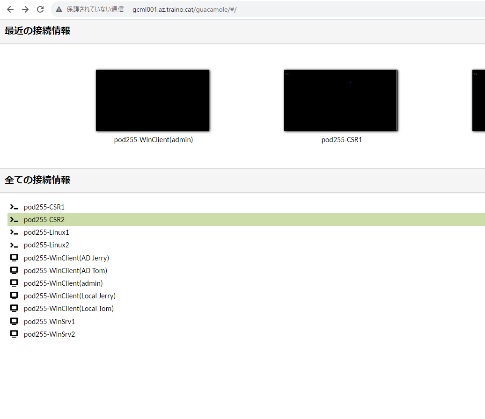</kbd>
1. 管理画面のプロンプト表記を確認し、Router2に接続していることを確認する  
    <kbd></kbd>
1. 以下のコマンドを実行し、特権モードからグローバルコンフィギュレーションモードに遷移する  
    CSR2# ***conf t***  
    <kbd>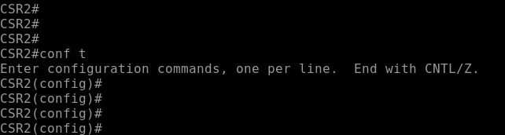</kbd>
    > 【補足】  
    > Cisco IOSのコマンドは省略して入力できます。  
    > conf tはconfigure terminalの省略形です。  
1. Router2からNetwork1(10.X.1.0/24)宛のStatic Routeを作成するコマンドを実行する  
    CSR2(config)# ***ip route 10.X.1.0 mask 255.255.255.0 10.X.2.253***
    <kbd>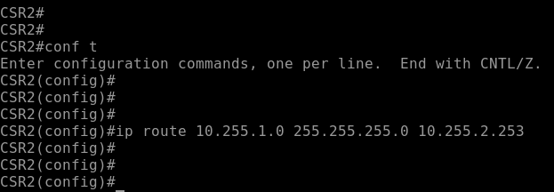</kbd>

---

## 4. Router2のStatic Routeを確認する
1. 以下のコマンドを実行し、グローバルコンフィギュレーションモードから特権モードに遷移する  
    CSR2(config)# ***end***  
1. 以下のコマンドを実行し、Router2のルーティングテーブルを表示する  
    CSR2# ***show ip route***  
1. ルーティングテーブルに、Router1をNext Hop(10.X.2.253)とするNetwork1(10.X.1.0/24)宛の経路情報が登録されていることを確認する  
    <kbd>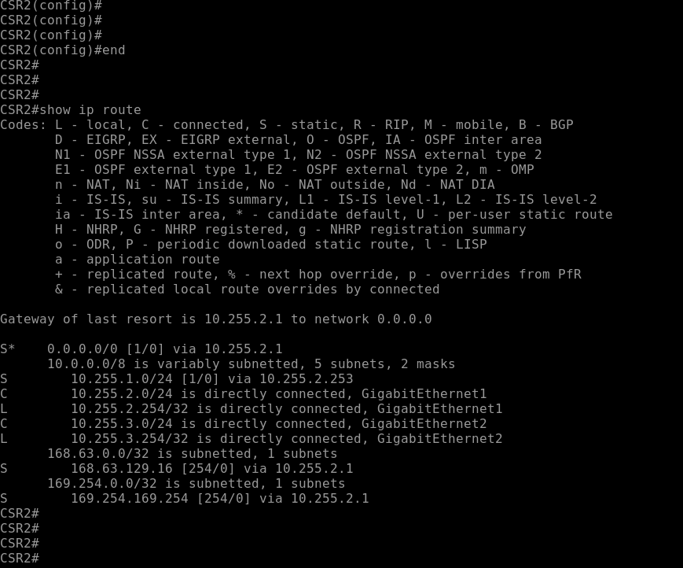</kbd>
1. 以下のコマンドを実行し、Router2のNetwork3のインターフェイスからRouter1への疎通を確認する  
    CSR2# ***ping 10.X.2.253 source 10.X.3.254***  
    CSR2# ***ping 10.X.1.254 source 10.X.3.254***  
    <kbd>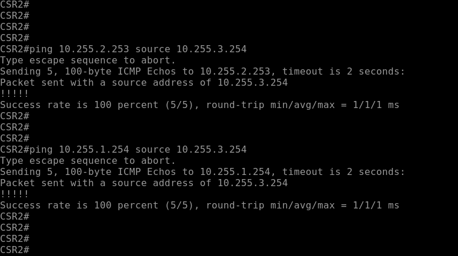</kbd>
    > 【補足】  
    > Network1とNetwork3の疎通を確立するためには、以下の2つの経路情報が必要です。
    > ① Router1からNetwork3宛の経路情報  
    > ② Router2からNetwork1宛の経路情報  
    > ここまでの手順で、これらの経路情報をStatic Routeで2台のルータに構成しました。

---

<!--
【補足】
タイムアウト時間を延長する設定は、最初の操作練習の演習で実施しました。

## 5. Router1とRouter2のセッションタイムアウト時間を調整する  
1. Router1(CSR1)で以下のコマンドを実行し、管理接続の自動切断時間を60分に延長する    
    CSR1# ***conf t***  
    CSR1(config)# ***line vty 0 15***  
    CSR1(config-line)# ***exec-timeout 60 0***  
    CSR1(config-line)# ***end***  
    CSR1# 

1. Router2(CSR2)で以下のコマンドを実行し、管理接続の自動切断時間を60分に延長する   
    CSR2# ***conf t***  
    CSR2(config)# ***line vty 0 15***  
    CSR2(config-line)# ***exec-timeout 60 0***  
    CSR2(config-line)# ***end***  
    CSR2# 

    > 【補足】  
    > line vtyは管理接続通信を意味します。  
    > SSHやTelnetの動作を調整します。  

-->

---

## 6. ルータのconfigを保存する
1. Router1で以下のコマンドを実行し、configを保存する  
    CSR1# ***write***  
    <kbd>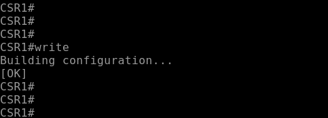</kbd>
1. Router2で以下のコマンドを実行し、configを保存する  
    CSR2# ***wr***  
    <kbd>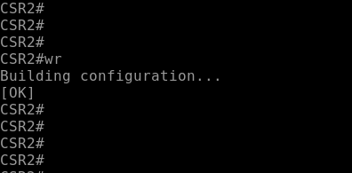</kbd>
> 【補足】  
> Cisco IOSのコマンドは省略して入力できます。  
> wrはwriteの省略形です。 

---
