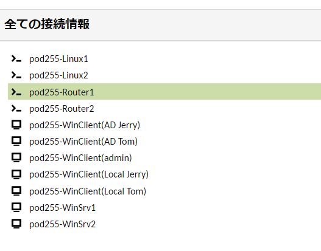
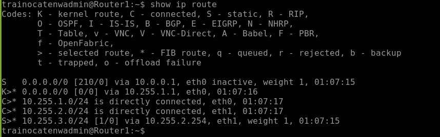
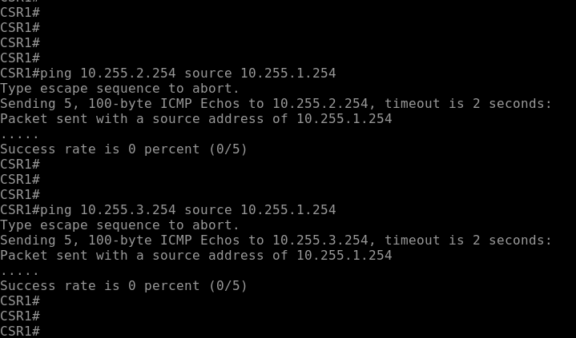
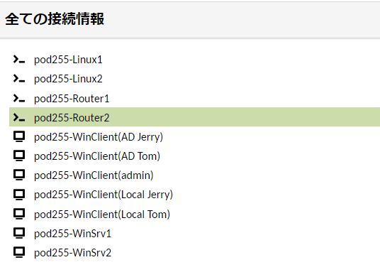
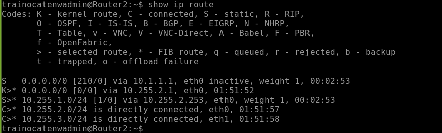

# ルータの基本的なルーティングを設定する
---


## 演習における役割と、環境のパラメータ
- X: ご自身のPod番号
- Network1: 10.X.1.0/24
- Network2: 10.X.2.0/24
- Network3: 10.X.3.0/24


## 注意
- 手順例の画像は<B>pod255</B>に準拠したパラメータのものです
- 手順内の<B>X</B>表記はご自身のpod番号に読み替えてください

---

# 1. Router1のStatic Routeを構成する

1. Router1の管理画面に接続する  

    <kbd></kbd>

1. 以下のコマンドを実行し、CLIモードをConfiguration Modeに変更する   
    ***configure***  

    ```
    trainocatenwadmin@Router1:~$ configure 
    [edit]
    trainocatenwadmin@Router1# 
    ```


1. Router1からNetwork3(10.X.3.0/24)宛のStatic Routeを作成するコマンドを実行する  
    ***set protocols static route 10.X.3.0/24 next-hop 10.X.2.254***  

    ```
    trainocatenwadmin@Router1# set protocols static route 10.255.3.0/24 next-hop 10.255.2.254
    [edit]
    trainocatenwadmin@Router1# 
    ```


1. 以下のコマンドを実行し、前の設定変更内容が正しくWorking Configurationに保持されていることを確認する  
    ***show protocols***  

    ```
    trainocatenwadmin@Router1# show protocols
    +static {
    +    route 10.255.3.0/24 {
    +        next-hop 10.255.2.254 {
    +        }
    +    }
    +}
    [edit]
    trainocatenwadmin@Router1# 
    ```

1. 以下のコマンドを実行し、設定変更をRunning Configurationに反映(commit)し、保存(save)する     
    ***commit***  
    ***save***  

    ```
    trainocatenwadmin@Route1# commit
    [edit]
    trainocatenwadmin@Router1# 
    trainocatenwadmin@Router1# save
    Saving configuration to '/config/config.boot'...
    Done
    [edit]
    trainocatenwadmin@Router1# 
    ```


---


# 2. Router1のStatic Routeを確認する  


1. 以下のコマンドを実行し、Configuration Modeを終了し、CLIモードをOperational Modeに変更する   
    ***exit***  

    ```
    trainocatenwadmin@Router1# exit
    exit
    trainocatenwadmin@Router1:~$ 
    ```


1. 以下のコマンドを実行し、Router1のルーティングテーブルを表示する  
    ***show ip route***  

    ```  
    trainocatenwadmin@Router1:~$ show ip route
    Codes: K - kernel route, C - connected, S - static, R - RIP,
        O - OSPF, I - IS-IS, B - BGP, E - EIGRP, N - NHRP,
        T - Table, v - VNC, V - VNC-Direct, A - Babel, F - PBR,
        f - OpenFabric,
        > - selected route, * - FIB route, q - queued, r - rejected, b - backup
        t - trapped, o - offload failure

    S   0.0.0.0/0 [210/0] via 10.0.0.1, eth0 inactive, weight 1, 01:07:15
    K>* 0.0.0.0/0 [0/0] via 10.255.1.1, eth0, 01:07:16
    C>* 10.255.1.0/24 is directly connected, eth0, 01:07:17
    C>* 10.255.2.0/24 is directly connected, eth1, 01:07:17
    S>* 10.255.3.0/24 [1/0] via 10.255.2.254, eth1, weight 1, 01:07:15
    trainocatenwadmin@Router1:~$ 
    ```  


1. ルーティングテーブルに、Router2をNext Hop(10.X.2.254)とするNetwork3(10.X.3.0/24)宛の経路情報が登録されていることを確認する  

    <kbd></kbd>

    > 【補足】  
    > ルーティング エントリ行の左端のアルファベットは、経路の学習方法を示します。
    > "S" は "Static" の意味です。  


1. 以下のコマンドを実行し、Router1のNetwork2のインターフェイスからRouter2への疎通を確認する  
    ***ping 10.X.2.254 count 5 source-address 10.X.2.253***  
    ***ping 10.X.3.254 count 5 source-address 10.X.2.253***  
    

    ```  
    trainocatenwadmin@Router1:~$ ping 10.255.2.254 count 5 source-address 10.255.2.253
    PING 10.255.2.254 (10.255.2.254) from 10.255.2.253 : 56(84) bytes of data.
    64 bytes from 10.255.2.254: icmp_seq=1 ttl=64 time=0.967 ms
    64 bytes from 10.255.2.254: icmp_seq=2 ttl=64 time=1.04 ms
    64 bytes from 10.255.2.254: icmp_seq=3 ttl=64 time=0.868 ms
    64 bytes from 10.255.2.254: icmp_seq=4 ttl=64 time=1.23 ms
    64 bytes from 10.255.2.254: icmp_seq=5 ttl=64 time=2.03 ms

    --- 10.255.2.254 ping statistics ---
    5 packets transmitted, 5 received, 0% packet loss, time 4041ms
    rtt min/avg/max/mdev = 0.868/1.226/2.030/0.419 ms
    trainocatenwadmin@Router1:~$ 
    trainocatenwadmin@Router1:~$ 
    trainocatenwadmin@Router1:~$ ping 10.255.3.254 count 5 source-address 10.255.2.253
    PING 10.255.3.254 (10.255.3.254) from 10.255.2.253 : 56(84) bytes of data.
    64 bytes from 10.255.3.254: icmp_seq=1 ttl=64 time=1.15 ms
    64 bytes from 10.255.3.254: icmp_seq=2 ttl=64 time=1.31 ms
    64 bytes from 10.255.3.254: icmp_seq=3 ttl=64 time=1.44 ms
    64 bytes from 10.255.3.254: icmp_seq=4 ttl=64 time=1.08 ms
    64 bytes from 10.255.3.254: icmp_seq=5 ttl=64 time=2.11 ms

    --- 10.255.3.254 ping statistics ---
    5 packets transmitted, 5 received, 0% packet loss, time 4006ms
    rtt min/avg/max/mdev = 1.080/1.418/2.114/0.369 ms
    trainocatenwadmin@Router1:~$ 
    ```  
 

<!--
【補足】
演習環境のプラットフォームの都合により、以下のpingは意図せず成功します。  
これはプラットフォーム側がマネージドなルーティング環境を提供しているためです。  
ネットワークの学習を進める上では、以下の通信は失敗するのが本来の形であると認識してください。  

1. 以下のコマンドを実行し、Router1のNetwork1のインターフェイスからRouter2への疎通がまだ確立できないことを確認する  
    CSR1# ***ping 10.X.2.254 source 10.X.1.254***  
    CSR1# ***ping 10.X.3.254 source 10.X.1.254***  
    <kbd></kbd>

    > 【補足】  
    > これは、Router2のルーティングテーブルにNetwork1の経路情報がまだ登録されていないことが原因です。   
    > Network1のIPアドレスから発信されたpingメッセージについて、pingレスポンスをRouter2がNetwork1にルーティングできない状態です。   
    > 通称「戻りのルーティング不足」と呼ばれているありがちな構成ミスです。  
    > 次の手順でRouter2のルーティングテーブルを構成することで、通信が成功するようになります。  
-->


---

# 3. Router2のStatic Routeを構成する  

1. Router2の管理画面に接続する  

    <kbd></kbd>

1. 以下のコマンドを実行し、CLIモードをConfiguration Modeに変更する   
    ***configure***  

    ```
    trainocatenwadmin@Router2:~$ configure 
    [edit]
    trainocatenwadmin@Router2# 
    ```


1. Router2からNetwork1(10.X.1.0/24)宛のStatic Routeを作成するコマンドを実行する  
    ***set protocols static route 10.X.1.0/24 next-hop 10.X.2.253***  

    ```
    trainocatenwadmin@Router2# set protocols static route 10.255.1.0/24 next-hop 10.255.2.253
    [edit]
    trainocatenwadmin@Router2# 
    ```


1. 以下のコマンドを実行し、前の設定変更内容が正しくWorking Configurationに保持されていることを確認する  
    ***show protocols***  

    ```
    trainocatenwadmin@Router2# show protocols 
    +static {
    +    route 10.255.1.0/24 {
    +        next-hop 10.255.2.253 {
    +        }
    +    }
    +}
    [edit]
    trainocatenwadmin@Router2# 
    ```


1. 以下のコマンドを実行し、設定変更をRunning Configurationに反映(commit)し、保存(save)する     
    ***commit***  
    ***save***  

    ```
    trainocatenwadmin@Router2# commit
    [edit]
    trainocatenwadmin@Router2# save
    Saving configuration to '/config/config.boot'...
    Done
    [edit]
    trainocatenwadmin@Router2#
    ```


---

# 4. Router2のStatic Routeを確認する


1. 以下のコマンドを実行し、Configuration Modeを終了し、CLIモードをOperational Modeに変更する   
    ***exit***  

    ```
    trainocatenwadmin@Router2# exit
    exit
    trainocatenwadmin@Router2:~$ 
    ```


1. 以下のコマンドを実行し、Router2のルーティングテーブルを表示する  
    ***show ip route***  

    ```
    trainocatenwadmin@Router2:~$ show ip route
    Codes: K - kernel route, C - connected, S - static, R - RIP,
        O - OSPF, I - IS-IS, B - BGP, E - EIGRP, N - NHRP,
        T - Table, v - VNC, V - VNC-Direct, A - Babel, F - PBR,
        f - OpenFabric,
        > - selected route, * - FIB route, q - queued, r - rejected, b - backup
        t - trapped, o - offload failure

    S   0.0.0.0/0 [210/0] via 10.1.1.1, eth0 inactive, weight 1, 00:02:53
    K>* 0.0.0.0/0 [0/0] via 10.255.2.1, eth0, 01:51:52
    S>* 10.255.1.0/24 [1/0] via 10.255.2.253, eth0, weight 1, 00:02:53
    C>* 10.255.2.0/24 is directly connected, eth0, 01:51:57
    C>* 10.255.3.0/24 is directly connected, eth1, 01:51:58
    trainocatenwadmin@Router2:~$ 
    ```


1. ルーティングテーブルに、Router1をNext Hop(10.X.2.253)とするNetwork1(10.X.1.0/24)宛の経路情報が登録されていることを確認する  

    <kbd></kbd>

    > 【補足】  
    > ルーティング エントリ行の左端のアルファベットは、経路の学習方法を示します。
    > "S" は "Static" の意味です。  


1. 以下のコマンドを実行し、Router2のNetwork3のインターフェイスからRouter1への疎通を確認する  

    ***ping 10.X.2.253 count 5 source-address 10.X.2.254***  
    ***ping 10.X.2.253 count 5 source-address 10.X.3.254***  
    ***ping 10.X.1.254 count 5 source-address 10.X.2.254***  
    ***ping 10.X.1.254 count 5 source-address 10.X.3.254***  

    ```  
    trainocatenwadmin@Router2:~$ ping 10.255.2.253 count 5 source-address 10.255.2.254
    PING 10.255.2.253 (10.255.2.253) from 10.255.2.254 : 56(84) bytes of data.
    64 bytes from 10.255.2.253: icmp_seq=1 ttl=64 time=0.989 ms
    64 bytes from 10.255.2.253: icmp_seq=2 ttl=64 time=1.22 ms
    64 bytes from 10.255.2.253: icmp_seq=3 ttl=64 time=1.15 ms
    64 bytes from 10.255.2.253: icmp_seq=4 ttl=64 time=0.954 ms
    64 bytes from 10.255.2.253: icmp_seq=5 ttl=64 time=1.32 ms

    --- 10.255.2.253 ping statistics ---
    5 packets transmitted, 5 received, 0% packet loss, time 4005ms
    rtt min/avg/max/mdev = 0.954/1.127/1.324/0.139 ms
    trainocatenwadmin@Router2:~$ 
    trainocatenwadmin@Router2:~$
    trainocatenwadmin@Router2:~$ ping 10.255.2.253 count 5 source-address 10.255.3.254
    PING 10.255.2.253 (10.255.2.253) from 10.255.3.254 : 56(84) bytes of data.
    64 bytes from 10.255.2.253: icmp_seq=1 ttl=64 time=1.30 ms
    64 bytes from 10.255.2.253: icmp_seq=2 ttl=64 time=1.22 ms
    64 bytes from 10.255.2.253: icmp_seq=3 ttl=64 time=3.34 ms
    64 bytes from 10.255.2.253: icmp_seq=4 ttl=64 time=0.966 ms
    64 bytes from 10.255.2.253: icmp_seq=5 ttl=64 time=1.21 ms

    --- 10.255.2.253 ping statistics ---
    5 packets transmitted, 5 received, 0% packet loss, time 4006ms
    rtt min/avg/max/mdev = 0.966/1.606/3.339/0.873 ms
    trainocatenwadmin@Router2:~$ 
    trainocatenwadmin@Router2:~$ 
    trainocatenwadmin@Router2:~$ ping 10.255.1.254 count 5 source-address 10.255.2.254
    PING 10.255.1.254 (10.255.1.254) from 10.255.2.254 : 56(84) bytes of data.
    64 bytes from 10.255.1.254: icmp_seq=1 ttl=64 time=1.98 ms
    64 bytes from 10.255.1.254: icmp_seq=2 ttl=64 time=0.867 ms
    64 bytes from 10.255.1.254: icmp_seq=3 ttl=64 time=1.25 ms
    64 bytes from 10.255.1.254: icmp_seq=4 ttl=64 time=1.55 ms
    64 bytes from 10.255.1.254: icmp_seq=5 ttl=64 time=1.36 ms

    --- 10.255.1.254 ping statistics ---
    5 packets transmitted, 5 received, 0% packet loss, time 4005ms
    rtt min/avg/max/mdev = 0.867/1.401/1.979/0.365 ms
    trainocatenwadmin@Router2:~$ 
    trainocatenwadmin@Router2:~$ ping 10.255.1.254 count 5 source-address 10.255.3.254
    PING 10.255.1.254 (10.255.1.254) from 10.255.3.254 : 56(84) bytes of data.
    64 bytes from 10.255.1.254: icmp_seq=1 ttl=64 time=0.957 ms
    64 bytes from 10.255.1.254: icmp_seq=2 ttl=64 time=1.06 ms
    64 bytes from 10.255.1.254: icmp_seq=3 ttl=64 time=1.61 ms
    64 bytes from 10.255.1.254: icmp_seq=4 ttl=64 time=1.40 ms
    64 bytes from 10.255.1.254: icmp_seq=5 ttl=64 time=1.05 ms

    --- 10.255.1.254 ping statistics ---
    5 packets transmitted, 5 received, 0% packet loss, time 4006ms
    rtt min/avg/max/mdev = 0.957/1.216/1.608/0.247 ms
    trainocatenwadmin@Router2:~$ 
    ```


    > 【補足】  
    > Network1とNetwork3の疎通を確立するためには、以下の2つの経路情報が必要です。
    > ① Router1からNetwork3宛の経路情報  
    > ② Router2からNetwork1宛の経路情報  
    > ここまでの手順で、これらの経路情報をStatic Routeで2台のルータに構成しました。


---
