# Windowsの基本的なルーティングを設定する
---

## 演習における役割と、環境のパラメータ
- X: ご自身のPod番号
- Windows Server1: WSrv1-yyMMddX (年月日とPod番号)
- Windows Server2: WSrv2-yyMMddX (年月日とPod番号)
- Windows Client: WinClient
- Router1: Router1
- Router2: Router2
- Network1: 10.X.1.0/24
- Network2: 10.X.2.0/24
- Network3: 10.X.3.0/24

## 注意
- 手順例の画像は<B>pod255</B>に準拠したパラメータのものです
- 手順内の<B>X</B>表記はご自身のpod番号に読み替えてください

---

# 1. Windows Server1のStatic Routeを作成する

1. Windows Server1の管理画面に接続する  
    <kbd>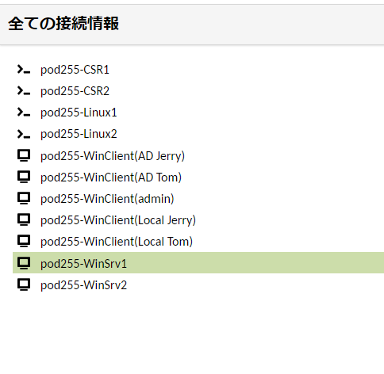</kbd>
1. [スタートメニュー]を右クリックし、コンテキストメニュー内の[Windows PowerShell(管理者)]をクリックする  
    <kbd>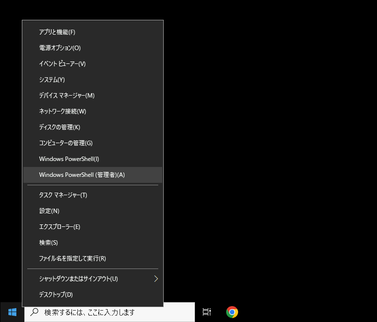</kbd>
1. [ユーザー アカウント制御]のポップアップで[はい]をクリックする  
    <kbd>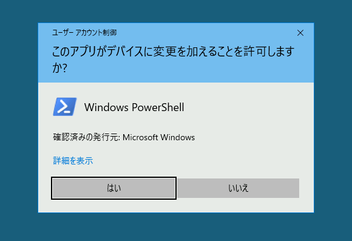</kbd>
1. Windows PowerShellのウィンドウが表示されたことを確認する  
    <kbd>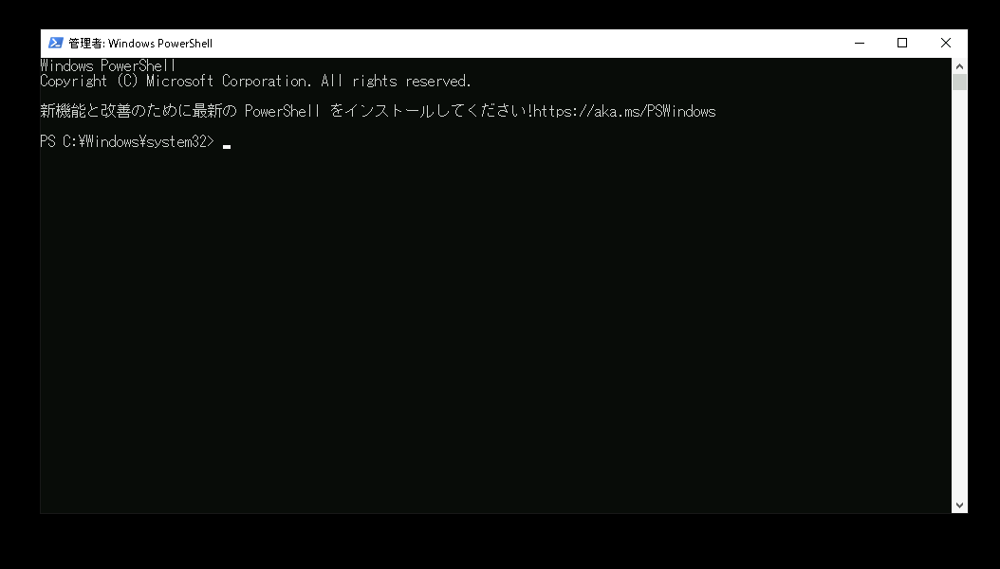</kbd>
1. 以下のコマンドを実行し、Windows Server1に接続していることを確認する  
    ***hostname***  
    <kbd>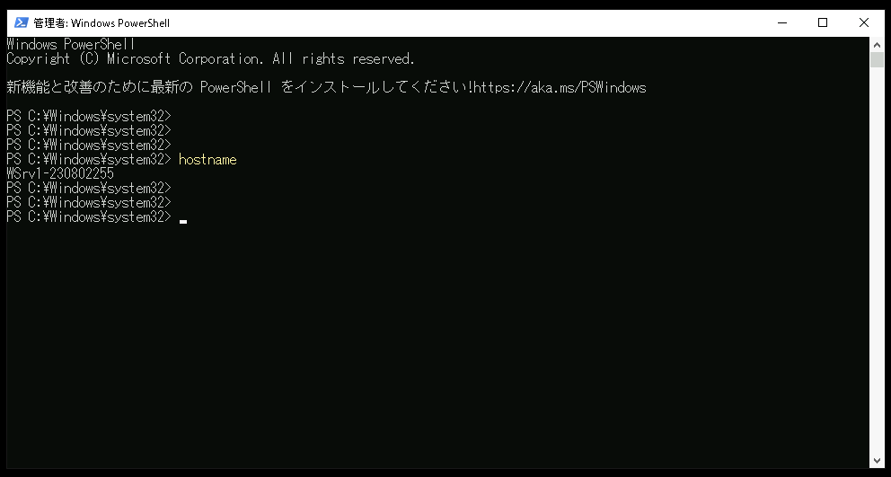</kbd>
    
    > 【補足】  
    > hostnameコマンドはコンピュータの名前を表示します。
    > 複数のWindowsコンピュータを操作する環境において、操作対象のコンピュータを取り違えるトラブルを予防するのに効果的です。
     Windows Server1のコンピュータ名には、"WSrv1-"という接頭辞がつけられています。
    
1. 以下のコマンドを実行し、Windows Server1のStatic Routeを作成する  
    ***route add -p 10.X.2.0 mask 255.255.255.0 10.X.1.254***  
    ***route add -p 10.X.3.0 mask 255.255.255.0 10.X.1.254***
    <kbd>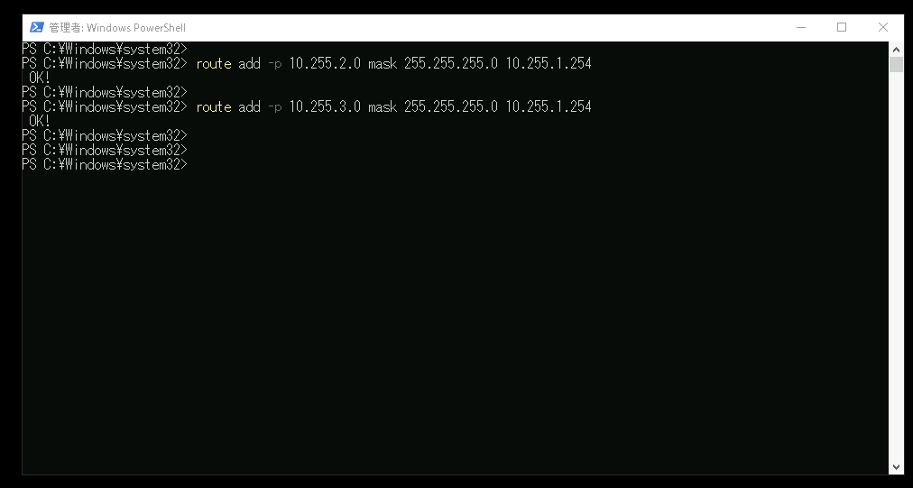</kbd>

    > 【補足1】  
    > route addコマンドは、WindowsコンピュータにStatic Routeを作成します。  
    > 以下の書式でパラメータを指定します。  
    > route add <ネットワークアドレス> mask <サブネットマスク> <ネクストホップ>  

    > 【補足2】  
    > このコマンドで作成したStatic RouteはOSの再起動により削除される一時的な設定です。  
    > "-p"オプションを付与することで永続的(Permanent)な設定として保存されます。  

---

# 2. Windows Server1のStatic Routeを確認する

1. Windows Server1のWindows PowerShellで以下のコマンドを実行し、Windows Server1のルーティングテーブルを確認する  
    ***route print***  
    <kbd>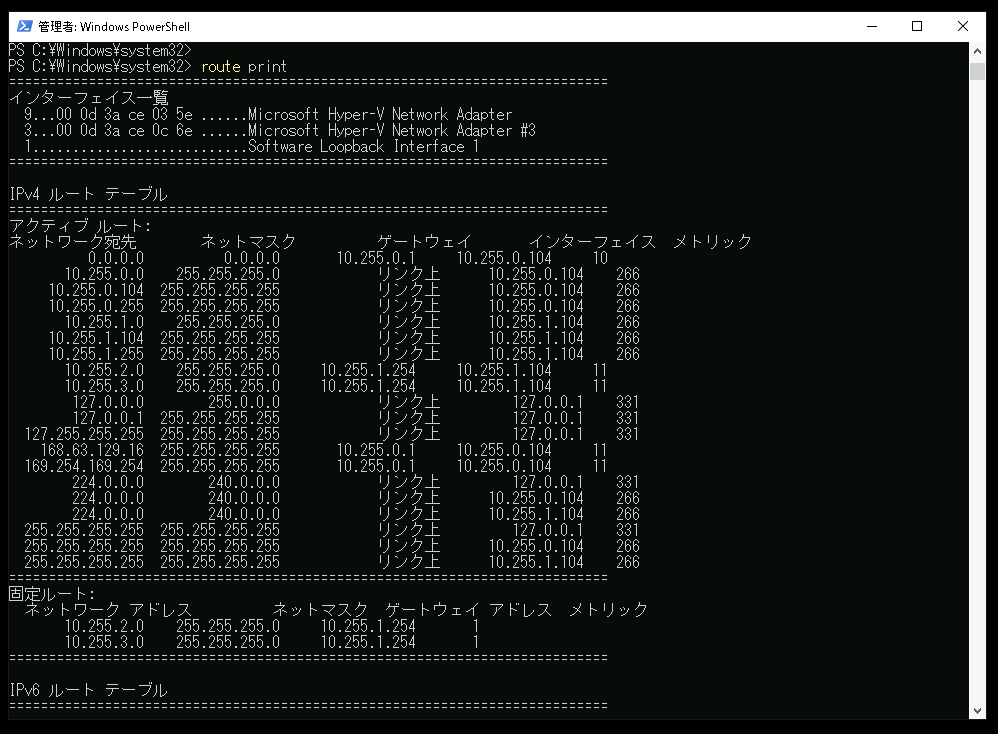</kbd>
    > 【確認ポイント】  
    > [アクティブ ルート]として、10.X.2.0宛と10.X.3.0宛のルーティングエントリ行が作成されており、NextHop(ゲートウェイ)としてRouter1のIPアドレス(10.X.1.254)が指定されていることを確認します。  
    > [固定ルート]としても、同じルーティング情報が登録されています。  
1. 以下のコマンドを実行し、Windows Server1からNetwork2宛とNetwork3宛の疎通を確認する  
    ***ping 10.X.2.254 -S 10.X.1.104***  
    ***ping 10.X.3.254 -S 10.X.1.104***  
    <kbd>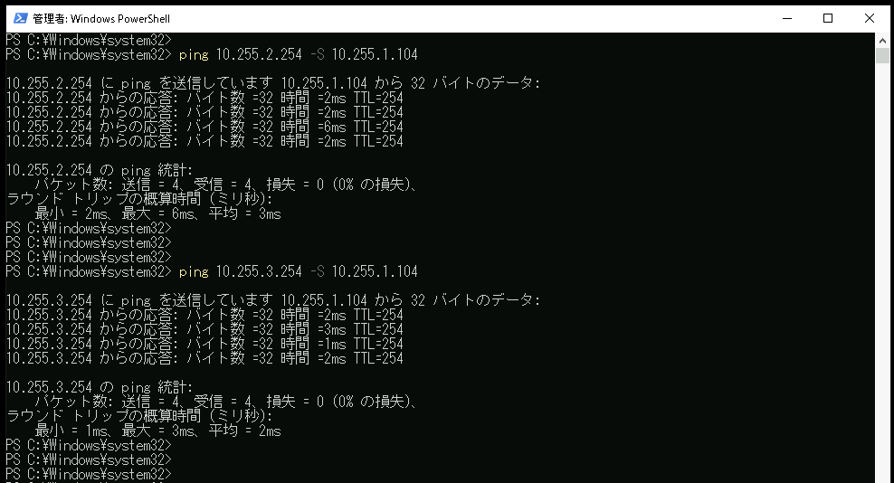</kbd>
    > 【補足】  
    > "-S"オプションを付与することで、ping送信時の送信元IPアドレスを指定できます。
1. 以下のコマンドを実行し、Windows Server1からNetwork2宛とNetwork3宛の経路を確認する  
    ***tracert 10.X.2.254***  
    ***tracert 10.X.3.254***  
    <kbd>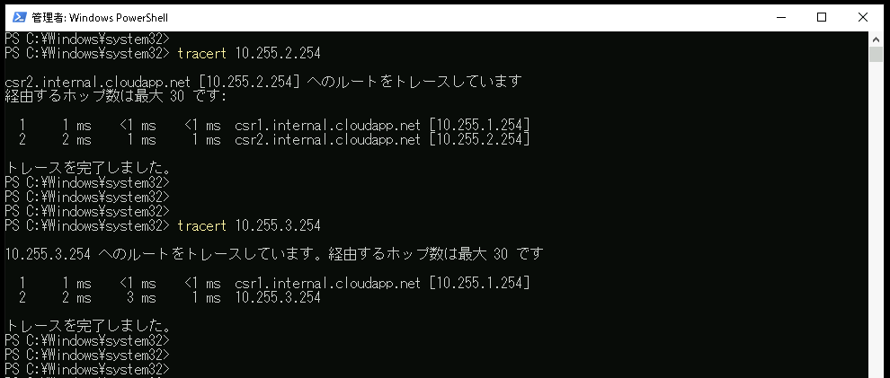</kbd>

    > 【確認ポイント】    
    > route addコマンドでNextHopとして指定した10.X.1.254(Router1)を経由して宛先まで通信していることを確認する。  

---

# 3. Windows Server2のStatic Routeを作成する

1. Windows Server2の管理画面に接続する  
    <kbd>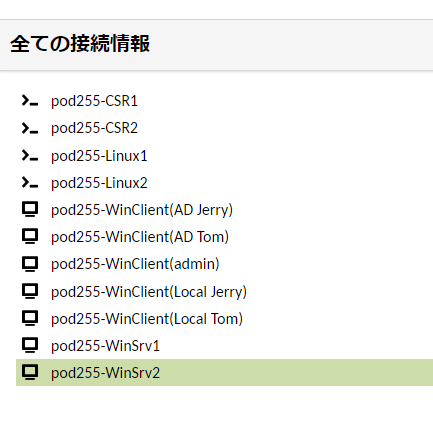</kbd>
1. [スタートメニュー]を右クリックし、コンテキストメニュー内の[Windows PowerShell(管理者)]をクリックする  
1. [ユーザー アカウント制御]のポップアップで[はい]をクリックする  
1. Windows PowerShellのウィンドウが表示されたことを確認する  
1. 以下のコマンドを実行し、Windows Server2に接続していることを確認する  
    ***hostname***  
    <kbd>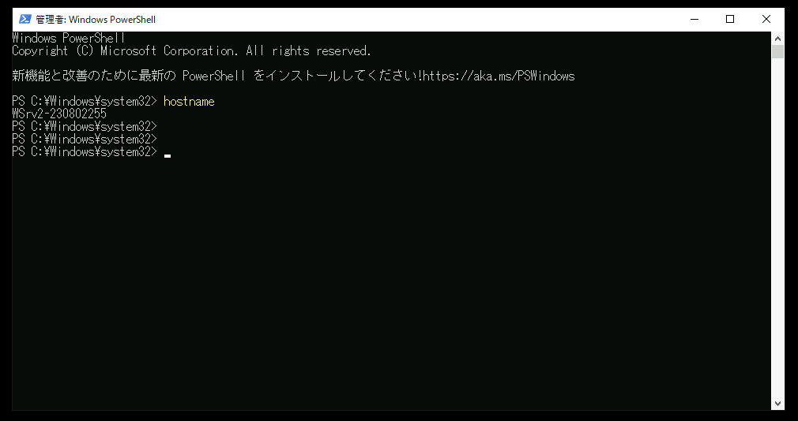</kbd>
    > 【補足】  
    > Windows Server1のコンピュータ名には、"WSrv2-"という接頭辞がつけられています。
1. 以下のコマンドを実行し、Windows Server2のStatic Routeを作成する  
    ***route add -p 10.X.1.0 mask 255.255.255.0 10.X.2.253***  
    ***route add -p 10.X.3.0 mask 255.255.255.0 10.X.2.254***  
    <kbd>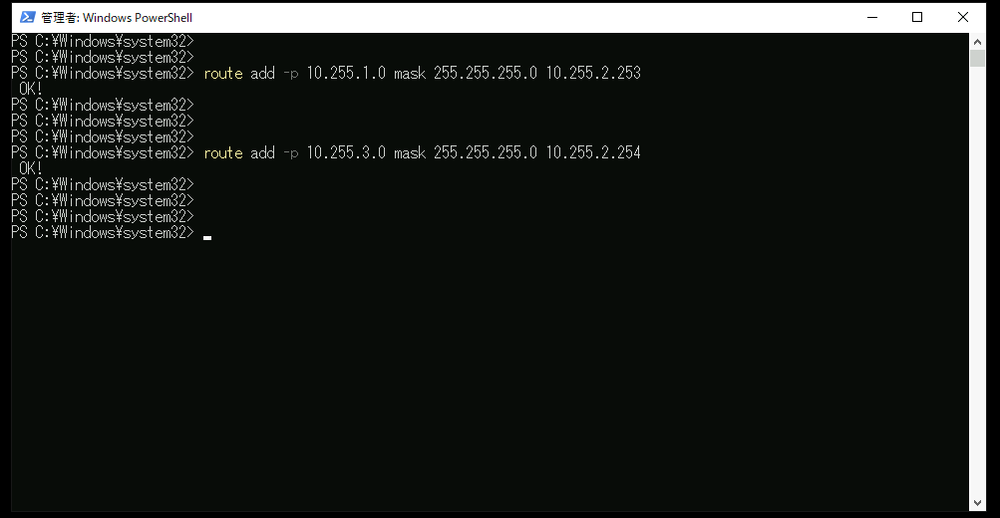</kbd>
    > 【学習のポイント】    
    > Network構成図も参照し、宛先ネットワークごとのNextHopに注目してください。  
    > Windows Server2がNetwork1(10.X.1.0/24)と通信するためのNextHopはRouter1(10.X.2.253)ですが、Network3(10.X.3.0/24)と通信するためのNextHopはRouter2(10.X.2.254)です。  

---

4. Windows Server2のStatic Routeを確認する

1. Windows Server2のWindows PowerShellで以下のコマンドを実行し、Windows Server2のルーティングテーブルを確認する  
    ***route print***  
    <kbd>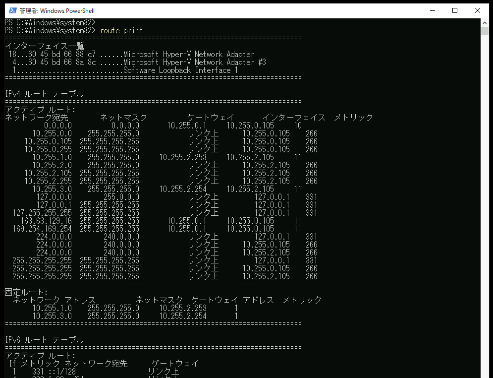</kbd>
    > 【確認ポイント】  
    > [アクティブ ルート]として、以下のルーティングエントリが存在することを確認します。  
    > ・ 10.X.1.0宛のNextHop(ゲートウェイ)としてRouter1のIPアドレス(10.X.2.253)が指定されている  
    > ・ 10.X.3.0宛のNextHop(ゲートウェイ)としてRouter2のIPアドレス(10.X.2.254)が指定されている  
    > [固定ルート]としても、同じルーティング情報が登録されています。
1. 以下のコマンドを実行し、Windows Server2からNetwork1宛とNetwork3宛の疎通を確認する  
    ***ping 10.X.1.254 -S 10.X.2.105***  
    ***ping 10.X.3.254 -S 10.X.2.105***  
    <kbd>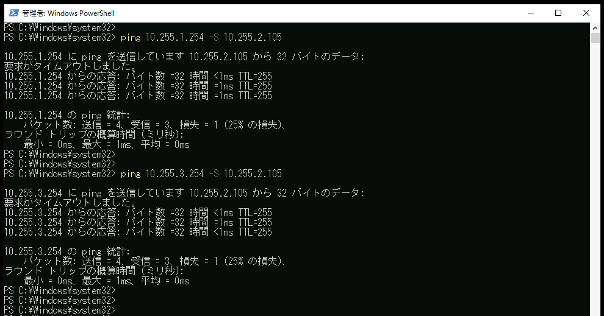</kbd>
    > 【補足】
    > "-S"オプションを付与することで、ping送信時の送信元IPアドレスを指定できます。
1. 以下のコマンドを実行し、Windows Server2(10.X.2.105)からWindows Server1(10.X.1.104)宛の経路を確認する  
    ***ping 10.X.1.104 -S 10.X.2.105***  
    ***tracert 10.X.1.104***  
    <kbd>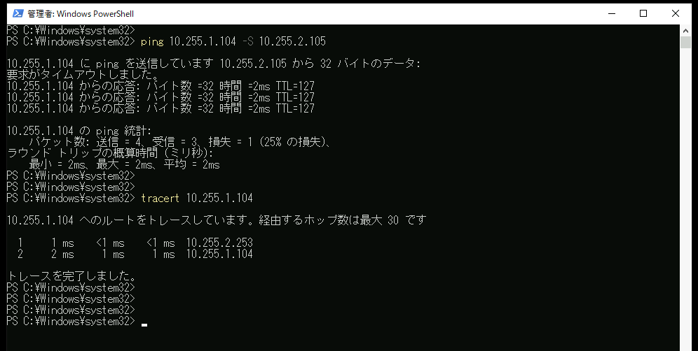</kbd>

    > 【学習のポイント】  
    > 別サブネットのIPアドレスと通信するためには、L3デバイスによるルーティングが必要です。  
    > 今回の環境では、Router1が2つのネットワーク(10.X.1.0/24と10.X.2.0/24)を相互に接続しています。  
    > Windows Server1とWindows Server2は、Router1をNextHopとするStatic Routeを構成したため、相互に通信できる状態です。  

---

# 5. Windows Clientのデフォルトゲートウェイを構成する

1. Windows Clientの管理画面にadminアカウントで接続する  
    <kbd>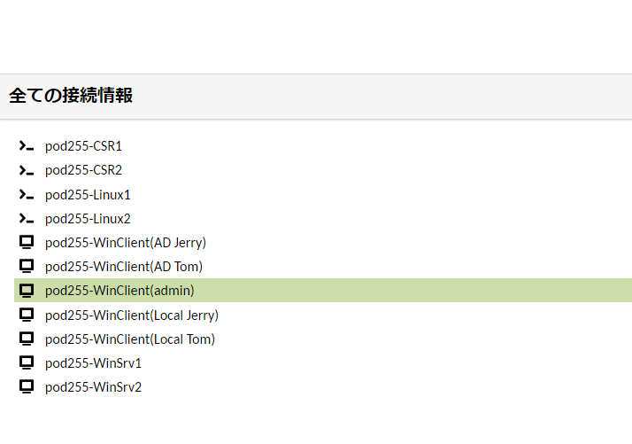</kbd>
1. [スタートメニュー]を右クリックし、コンテキストメニュー内の[Windows PowerShell(管理者)]をクリックする  
1. [ユーザー アカウント制御]のポップアップで[はい]をクリックする  
1. Windows PowerShellのウィンドウが表示されたことを確認する  
1. 以下のコマンドを実行し、Windows Clientにadminアカウントで接続していることを確認する  
    ***hostname***  
    ***whoami***  
    <kbd>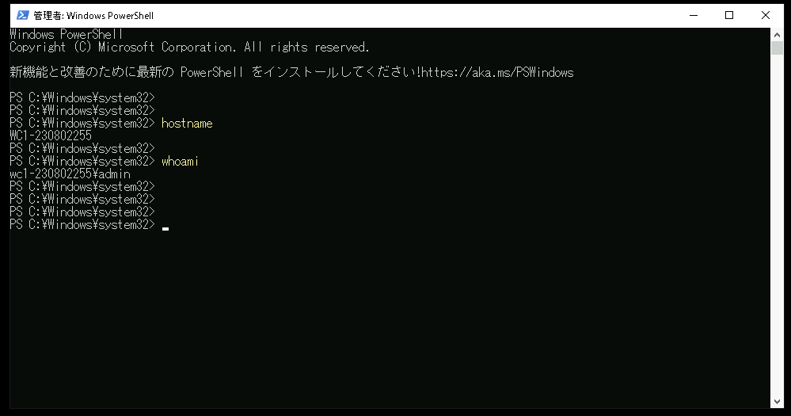</kbd>
    > 【補足1】  
    > Windows Clientのコンピュータ名には、"WC-"という接頭辞がつけられています。  

    > 【補足2】  
    > whoamiはログインしているユーザーアカウント名を表示します。
    > 管理者アカウントであるadminでログインしていることを確認してください。  

1. 以下のコマンドを実行し、コントロールパネルの[ネットワーク接続]画面を表示する
    ***ncpa.cpl***  
    <kbd>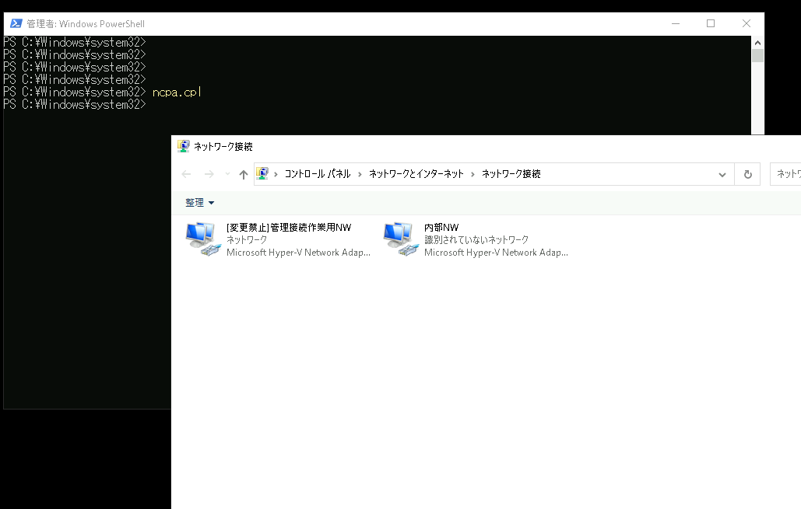</kbd>
1. 2つのネットワーク アダプターのアイコンが表示されていることを確認する
    > 【補足】  
    > 演習環境のコンピュータには、複数のネットワークアダプターが接続されています。
    > このうち "[変更禁止]管理接続作業用NW" のアダプターは、受講者が演習環境にリモート接続するための通信環境を提供します。演習中に誤って設定を変更することがないように注意してください。
1. [内部NW]のアダプターを選択し、右クリック コンテキストメニューの[プロパティ]をクリックする
    <kbd>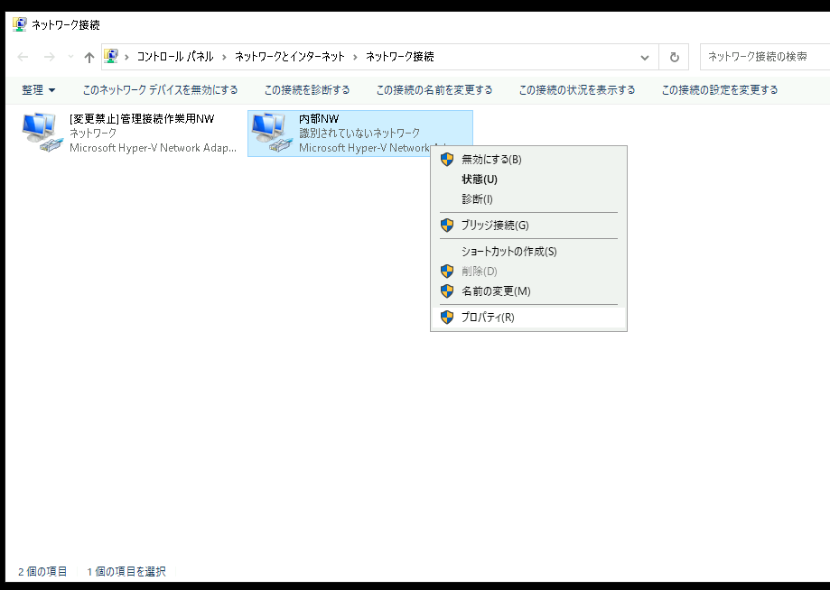</kbd>
1. [内部NWのプロパティ]ウィンドウが表示されることを確認する。
1. ウィンドウ中央部の項目から [インターネット プロトコル バージョン4(TCP/IPv4)]を選択し、[プロパティ]をクリックする
    <kbd>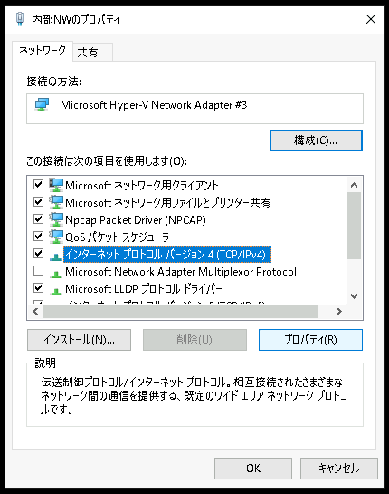</kbd>
1. [インターネット プロトコル バージョン4(TCP/IPv4)のプロパティ]ウィンドウが表示されることを確認する  
    <kbd>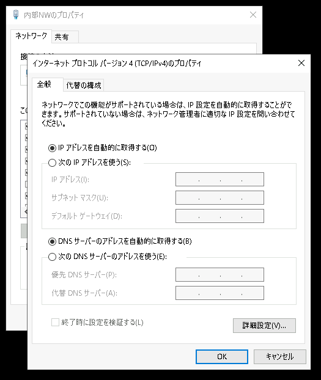</kbd>
1. 以下のパラメータを入力する  
    
    - [ ] IPアドレスを自動的に取得する
    - [x] 次のIPアドレスを使う

    | 項目 | パラメータ |
    | :----- | :----- |
    | IPアドレス | 10.X.1.103 |
    | サブネット マスク | 255.255.255.0 |
    | デフォルト ゲートウェイ | 10.X.1.254 |  

    - [ ] DNSサーバーのアドレスを自動的に取得する
    - [x] 次のDNSサーバーのアドレスを使う

    | 項目 | パラメータ |
    | :----- | :----- |
    | 優先DNSサーバー | <空欄> |
    | 代替DNSサーバー | <空欄> |

    <kbd>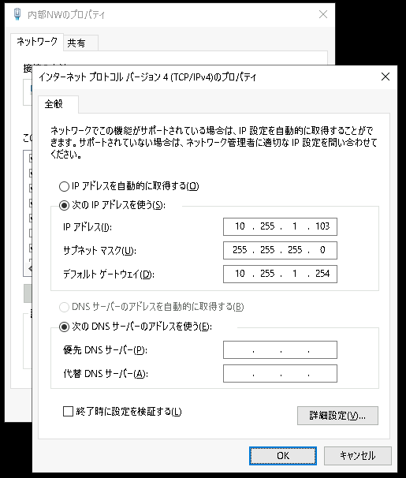</kbd>

1. [OK]をクリックする

1. [内部NWのプロパティ]ウィンドウで、[閉じる]をクリックする  
    <kbd></kbd>

    > 【補足】  
    > ネットワークアダプターの設定変更が保存されるのは、[閉じる]をクリックしたタイミングです。
    > アダプター プロパティのウィンドウで、[閉じる]をクリックするのを見落とさないように注意してください。

1. コントロールパネルの[ネットワーク接続]画面が表示されていることを確認する
    <kbd>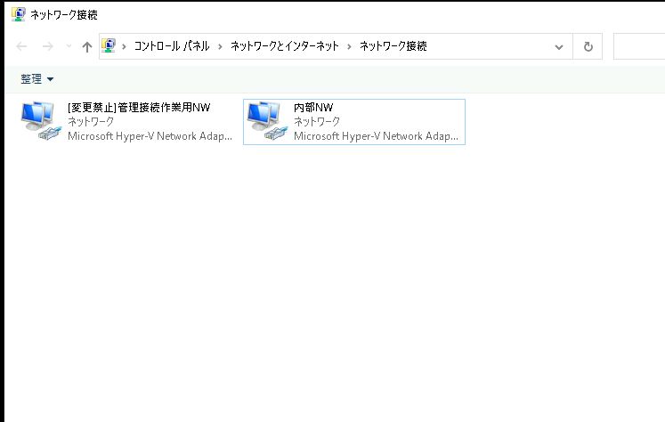</kbd>

---

# 6. Windows Clientのデフォルトゲートウェイを設定を確認する

1. Windows ClientのWindows PowerShellで以下のコマンドを実行し、Windows Clientのデフォルトゲートウェイを確認する  
    ***ipconfig /all***  
    <kbd>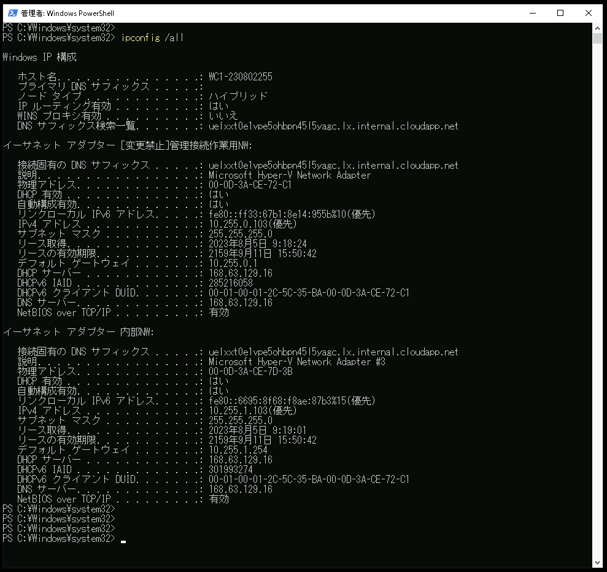</kbd>
    > 【確認ポイント】
    > [イーサネット アダプター 内部NW:]のデフォルト ゲートウェイが、前の手順で設定したRouter1のIPアドレスであることを確認してください。

1. 以下のコマンドを実行し、Windows Clientのデフォルトゲートウェイを確認する  
    ***route print***  
    <kbd>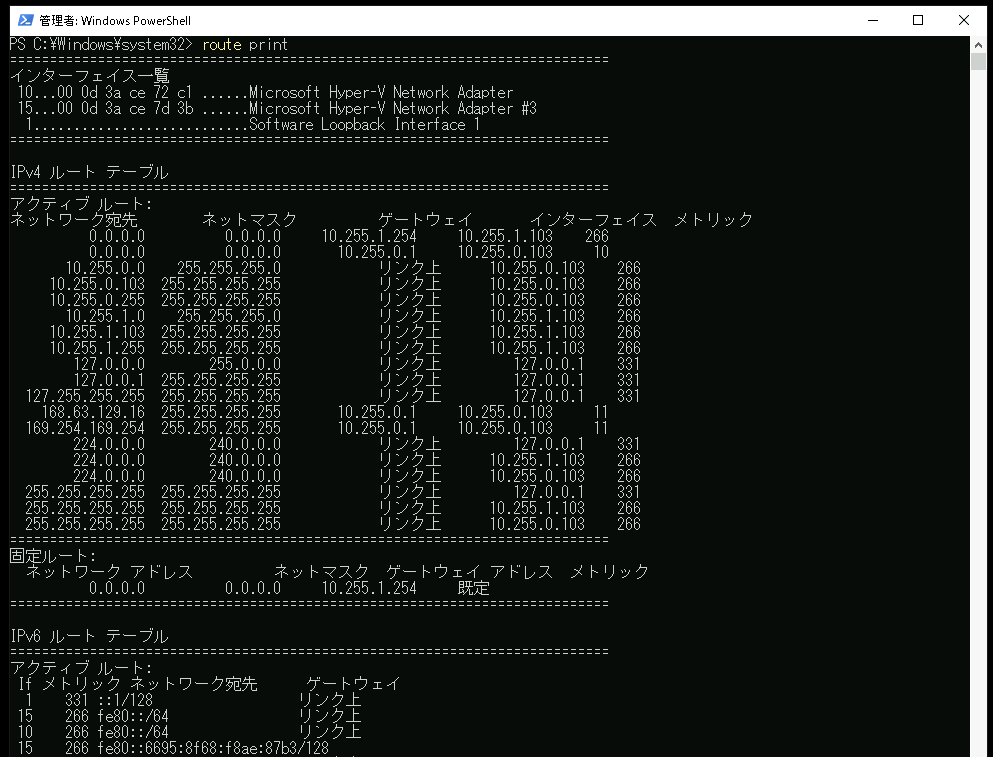</kbd>
    > 【確認ポイント】  
    > [アクティブ ルート]として、以下のルーティングエントリが存在することを確認します。  
    > ・ 0.0.0.0宛のNextHop(ゲートウェイ)としてRouter1のIPアドレス(10.X.1.254)が指定されている  
    > [固定ルート]としても、同じルーティング情報が登録されています。
    > デフォルトゲートウェイを設定することにより、Windows OS内部で自動的にデフォルトルートが作成される動作に注目してください。

    <!--
    > 【補足1】
    > この演習環境においては、プラットフォームから提供されるデフォルトルート(10.X.0.1宛)が優先されるため、このコンピュータのルーティングは実際には変更されません。
    > この手順は、デフォルトゲートウェイの指定方法を理解するための演習であるとご認識ください。

    > 【補足2】
    > インターフェイスのメトリックを変更することで、CSRでルーティングできます。
    > 
    -->
