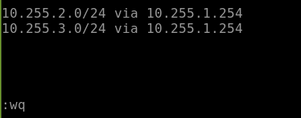

# Linuxの基本的なルーティングを設定する
---

## 演習における役割と、環境のパラメータ
- X: ご自身のPod番号
- Linux1: linux1
- Linux2: linux2
- Router1: CSR1
- Router2: CSR2
- Network1: 10.X.1.0/24
- Network2: 10.X.2.0/24
- Network3: 10.X.3.0/24

## 注意
- 手順例の画像は<B>pod255</B>に準拠したパラメータのものです
- 手順内の<B>X</B>表記はご自身のpod番号に読み替えてください

---

## 1. Linux1のStatic Routeを作成する

1. Linux1の管理画面に接続する  
    <kbd></kbd>
1. コマンドラインで以下のコマンドを実行し、Linux1にadminで接続していることを確認する  
    ＞ ***hostname***  
    ＞ ***whoami***  
    <kbd></kbd>

1. 以下のコマンドを実行し、Linux1の現在のネットワーク設定を確認する  
    ＞ ***ifconfig***  
    <kbd></kbd>
    > 【確認ポイント】
    > ifconfigコマンドを実行すると複数のネットワークアダプターの情報が表示されます。eth0とeth1に注目してください。
    > eth1が演習用のネットワーク(10.X.1.0/24)です。演習環境の他のサーバと通信するために使用します。
    > eth0は管理接続作業用のネットワーク(10.X.0.0/24)です。演習の中では操作しません。
<!-- 
Azure環境においては、DHCPで配布されるデフォルトゲートウェイが有効であるため、以下の手順は不要です。

1. コマンドラインに以下のコマンドを入力し、Linux1の現在のネットワーク設定を確認する  
    ＞ ***ip route***  
    <kbd></kbd>
    > 【確認ポイント】
    > ip routeコマンドは、ルーティングテーブルを表示するコマンドです。
    > 10.X.2.0/24や10.X.3.0/24をルーティングできるエントリが、まだ存在しないことを確認してください。
1. コマンドラインに以下のコマンドを入力し、Linux1が別ネットワークと通信できない状態であることを確認する  
    ＞ ***ping 10.X.1.254***  
    ＞ ***ping 10.X.2.254***  
    ＞ ***ping 10.X.3.254***  
    > 【確認ポイント】
    > 別ネットワークに対するルーティング情報がルーティングテーブルに登録されていないため、eth1と同じネットワーク(10.X.1.0/24)のIPアドレスとは通信できますが、別のネットワークとは通信できない状態であることを確認してください。
-->

1. 以下のコマンドを実行し、Network2(10.X.2.0/24)とNetwork3(10.X.3.0/24)を宛先とするルーティングについて、Router1をNextHopとしたエントリを登録する  
    ＞ ***sudo ip route add 10.X.2.0/24 via 10.X.1.254 dev eth1***   
    ＞ ***sudo ip route add 10.X.3.0/24 via 10.X.1.254 dev eth1***  
    <kbd></kbd>
1. 以下のコマンドを実行し、Network2(10.X.2.0/24)とNetwork3(10.X.3.0/24)のルーティングエントリが登録されていることを確認する  
    ＞ ***ip route***     
    <kbd></kbd>
1. 以下のコマンドを実行し、Router1(CSR1)を経由してNetwork2(10.X.2.0/24)とNetwork3(10.X.3.0/24)と通信できることを確認する
    ＞ ***traceroute 10.X.2.254***  
    ＞ ***traceroute 10.X.3.254***  
    <kbd></kbd>    
    > 【補足】  
    > tracerouteの初回実行時は、アドレス解決(ARP)のタイムラグにより応答失敗が多く記録されがちです。
    > 期待する結果が得られない場合は、再度同じパラメータでtracerouteを再実行して様子をみてください。
    <!--
    <kbd></kbd> 
    -->
---

## 2. Linux1に永続的なStatic Routeを作成する  

1. 作業説明  
    前手順の "ip route add" はルーティングテーブルにエントリを直接登録するコマンドです。  
    ルーティングテーブルのステータスとしては有効ですが、configとしては保存されない情報であるため、コンピュータを再起動するとエントリも失われます。  
    今回の演習では学習を目的として "ip route add" コマンド操作を行いましたが、実際のサーバー構築において、次に紹介するconfigを使用するケースが一般的です。  

    コンピュータ再起動後も有効なスタティックルートを登録するためには、スタティックルートを登録するconfigを作成する必要があります。  
    Linux(CentOS/7.9)におけるスタティックルートのconfigは "/etc/sysconfig/network-scripts/route-<IF名>" のファイルに記述できます。

    > 【参考】  
    > Red Hat Enterprise Linux ネットワークガイド  
    > https://access.redhat.com/documentation/ja-jp/red_hat_enterprise_linux/7/html/networking_guide/sec-configuring_static_routes_with_ip_commands    
    

1. 以下のコマンドを実行し、永続的なStatic Routeの設定ファイル(/etc/sysconfig/network-scripts/route-eth1)を作成し、そのバックアップも作成(copy)する  
    ＞ ***sudo touch /etc/sysconfig/network-scripts/route-eth1***    
    ＞ ***sudo cp /etc/sysconfig/network-scripts/route-eth1 cp /etc/sysconfig/network-scripts/route-eth1_bak***  
    <kbd></kbd>
    > 【補足】  
    > この後の手順でroute-eth1ファイルを編集します。  
    > 編集作業前にバックアップのファイルをcopyで作成しておくと、編集作業後にバックアップファイルとの差分を比較することで自身の作業内容を検査できます。  

    > 【補足】  
    > Linuxでファイル名をパラメータとして入力する際は、Tab補完機能が便利です。  
    > ファイル名を途中まで入力した段階で[Tab]キーを押下すると、キーワードが自動的に補完されます。  
    > ただし、複数のキーワード候補が存在する場合は、1回[Tab]キーを押下するだけでは補完されません。  
    > 2回Tabキーを押下してキーワード候補を表示し、意図するパラメータを一意に特定できる長さまでキーワードを手入力してからTab補完を利用します。  

1. 以下のコマンドを実行し、Static Routeの設定ファイル(/etc/sysconfig/network-scripts/route-eth1)を編集する  
    ＞ ***sudo vi /etc/sysconfig/network-scripts/route-eth1***    

    > 【編集内容:以下を追記する】  
    > 10.X.2.0/24 via 10.X.1.254 dev eth1  
    > 10.X.3.0/24 via 10.X.1.254 dev eth1  
    >
    <kbd></kbd> 
    <kbd></kbd> 
1. 以下のコマンドを実行し、作業内容にミスがないことを確認する  
    ＞ ***diff -u /etc/sysconfig/network-scripts/route-eth1 /etc/sysconfig/network-scripts/route-eth1_bak***  
    > 【補足】  
    > diffコマンドは、ファイル間の差分を抽出します。
    > 編集作業開始前に作成したバックアップファイルとの差分を比較することで、作業内容が正確であること確認できます。  
    <!--
    > この項の手順においては、空のファイルとの比較をとるため、効果的な手順ではありません。
    > 今後の演習手順において頻出する手続きであるため、学習目的でdiff操作をしました。
    -->

    <kbd></kbd> 
1. 以下のコマンドを実行し、ネットワーク設定を再読み込みする  
    ＞ ***sudo service network restart***  
    <kbd></kbd> 

1. 以下のコマンドを実行し、Network2(10.X.2.0/24)とNetwork3(10.X.3.0/24)のルーティングエントリが登録されていることを確認する  
    ＞ ***ip route***  
    <kbd></kbd> 

1. 以下のコマンドを実行し、Router1(CSR1)を経由してNetwork2(10.X.2.0/24)とNetwork3(10.X.3.0/24)と通信できることを確認する  
    ＞ ***traceroute 10.X.2.254***  
    ＞ ***traceroute 10.X.3.254***  
    <kbd></kbd>    

---

## 3. Linux2に集約Static Routeを作成する

1. Linux2の管理画面に接続する  
    <kbd></kbd>
1. コマンドラインで以下のコマンドを実行し、Linux2にadminで接続していることを確認する  
    ＞ ***hostname***  
    ＞ ***whoami***  
    <kbd></kbd>

1. 以下のコマンドを実行し、Linux2の現在のネットワーク設定を確認する  
    ＞ ***ifconfig***  
    <kbd></kbd>
    > 【確認ポイント】  
    > ifconfigコマンドを実行すると複数のネットワークアダプターの情報が表示されます。eth0とeth1に注目してください。  
    > eth1が演習用のネットワーク(10.X.3.0/24)です。演習環境の他のサーバと通信するために使用します。  
    > eth0は管理接続作業用のネットワーク(10.X.0.0/24)です。演習の中では操作しません。  

1. 以下のコマンドを実行し、永続的なStatic Routeの設定ファイル(/etc/sysconfig/network-scripts/route-eth1)を作成し、そのバックアップも作成(copy)する  
    ＞ ***sudo touch /etc/sysconfig/network-scripts/route-eth1***  
    ＞ ***sudo cp /etc/sysconfig/network-scripts/route-eth1 cp /etc/sysconfig/network-scripts/route-eth1_bak***
    <kbd></kbd>

1. 以下のコマンドを実行し、Static Routeの設定ファイル(/etc/sysconfig/network-scripts/route-eth1)を編集する  
    ＞ ***sudo vi /etc/sysconfig/network-scripts/route-eth1***    
    > 【編集内容:以下を追記する】  
    > 10.X.0.0/16 via 10.X.3.254 dev eth1  
    >
    <kbd></kbd> 
    <kbd></kbd> 

    > 【学習のポイント】  
    > Linux2に作成するStatic Routeは、集約ルートです。  
    > Network1(10.X.1.0/24)とNetwork2(10.X.2.0/24)の2つの宛先ネットワーク情報を、10.X.0.0/16として集約経路にまとめています。  
    > 

1. 以下のコマンドを実行し、作業内容にミスがないことを確認する  
    ＞ ***diff -u /etc/sysconfig/network-scripts/route-eth1 /etc/sysconfig/network-scripts/route-eth1_bak***  

    <kbd></kbd> 

1. 以下のコマンドを実行し、ネットワーク設定を再読み込みする
    ＞ ***sudo service network restart***  
1. 以下のコマンドを実行し、集約経路(10.X.0.0/16)のルーティングエントリが登録されていることを確認する  
    ＞ ***ip route***  
    <kbd></kbd> 

1. 以下のコマンドを実行し、Router1(CSR1)を経由してNetwork2(10.X.2.0/24)とNetwork1(10.X.1.0/24)と通信できることを確認する  
    ＞ ***traceroute 10.X.2.254***  
    ＞ ***traceroute 10.X.1.254***  
    <kbd></kbd>    

    <!--
    Linux2からみて近く(10.X.2.0)から遠く(10.X.1.0)の順に疎通を確認しています。
    -->

---