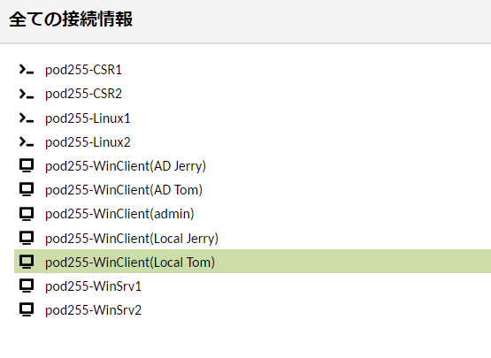
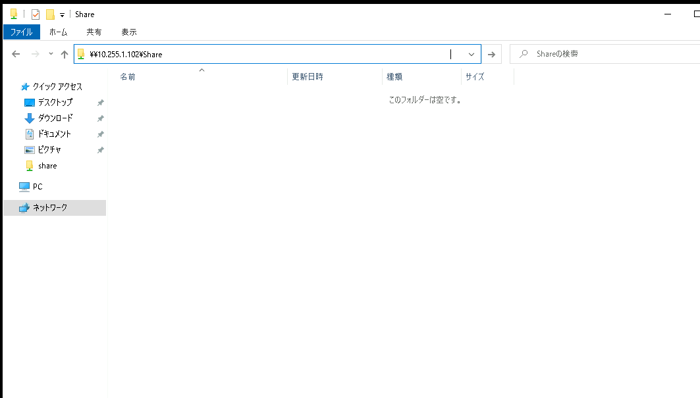
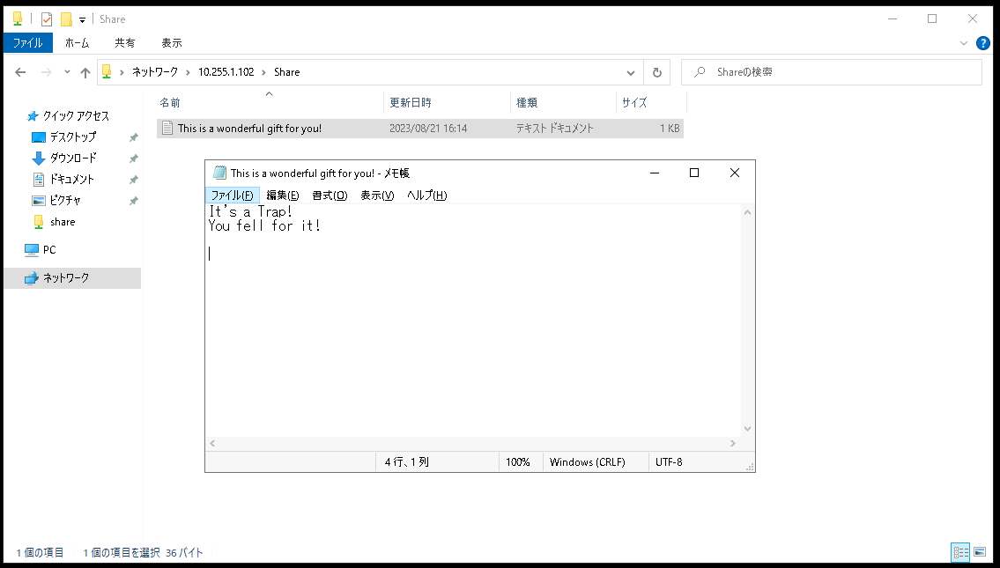
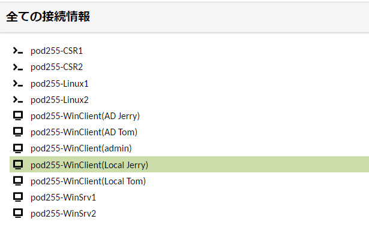
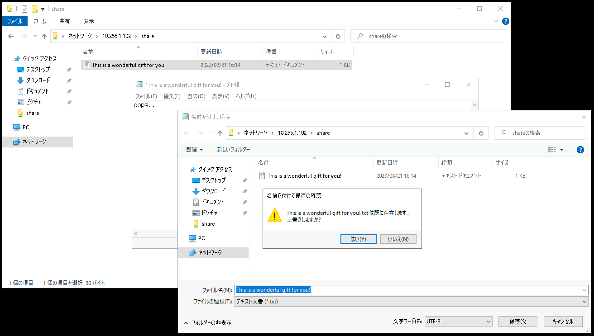
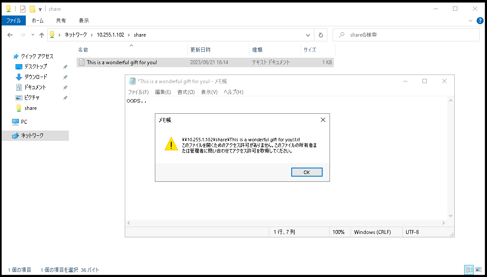

# Linux Serverでファイルサーバーを構築する
---


## 演習における役割と、環境のパラメータ
- X: ご自身のPod番号
- Linuxファイルサーバー役: Linux1  
- クライアント デスクトップ環境: WinClient(WC1-yyMMddX)


## 注意
- 手順例の画像は<B>pod255</B>に準拠したパラメータのものです
- 手順内の<B>X</B>表記はご自身のpod番号に読み替えてください

---

<!--
# SELinuxを無効化する
1. SELinuxの状態を確認する
    ＞ ***sestatus***  
    

    > 【確認ポイント】
    > 'Current Mode:'が'enforcing'であることを確認する  
    > 'Mode from config file:'が'enforcing'であることを確認する  
    > 


1. SELinuxをOS起動時に無効にする  
    ＞ ***sudo cp /etc/selinux/config /etc/selinux/config.bak***   
    ＞ ***sudo vi /etc/selinux/config***  
    ＞ ***diff /etc/selinux/config /etc/selinux/config.bak***   

    ```
    [admin@linux1 ~]$ diff /etc/selinux/config /etc/selinux/config.bak
    7c7
    < SELINUX=disabled
    ---
    > SELINUX=enforcing
    [admin@linux1 ~]$   
    ```

1. SELinuxを一時的に無効にする   
    ＞ ***sudo setenforce 0***   

1. SELinuxの状態を確認する  
    ＞ ***sestatus***  

    > 【確認ポイント】
    > 'Current Mode:'が'permissive'であることを確認する  
    > 'Mode from config file:'が'disabled'であることを確認する  

-->


# フォルダ(/share)を作成する  

1. ルート直下にshareフォルダを作成する  
    ***sudo mkdir /share***  

1. '/share'のパーミッションを変更する  

    1. 変更前の '/share' のパーミッションを確認する  
        ***ls -al /***  

    > 【確認ポイント】  
    > '/share' のパーミッションが 'drwxr-xr-x' であることを確認する   
    
    - [x] 一般ユーザ(Others)が書き込み権限(w)を持っていないこと  

    > 【補足】  
    > Linuxのパーミッションは以下の表記順序です。  
    > 所有者のrwx  
    > 所有グループのrwx  
    > Other(一般ユーザー)のrwx  
    
    > それぞれのアルファベット表記は、以下の意味です。  
    > r Read  
    > w Write  
    > x eXecute  


    1. '/share' のパーミッションを変更し、Userに書き込み権限を与える  
        ***sudo chmod o+w /share***  

    1. 変更後の '/share' のパーミッションを確認する  
        ***ls -al /***  

    > 【確認ポイント】  
    > '/share' のパーミッションが 'drwxr-xrwx' であることを確認する    

    - [x] 一般ユーザ(Others)が書き込み権限(w)を有すること  

---  

# ユーザー(TomとJerry)を作成する 

1. 'Tom'を作成する  
    ***sudo useradd Tom***  
    ***sudo passwd Tom***  
    Changing password for user Tom.  
    New password: ***＜パスワード 'Pa\$\$w0rd' を入力する＞***  
    BAD PASSWORD: The password is shorter than 9 characters   
    Retype new password: ***＜パスワード 'Pa\$\$w0rd' を入力する＞***  
    passwd: all authentication tokens updated successfully.   

    > 【補足】
    > 'BAD PASSWORD'の警告は無視してください。

1. 作成した'Tom'でログインできることを確認する  
    ***su - Tom***  
    Password: ***＜パスワード 'Pa\$\$w0rd' を入力する＞***   
    ***whoami***  
    ***exit***  

    ```
    [admin@linux1 ~]$ su - Tom  
    Password:   
    Last login: Thu Aug 17 07:23:06 UTC 2023 on pts/0  
    [Tom@linux1 ~]$ whoami  
    Tom  
    [Tom@linux1 ~]$ exit  
    logout  
    [admin@linux1 ~]$   
    ```

1. 'Jerry'を作成する  
    ***sudo useradd Jerry***  
    ***sudo passwd Jerry***  
    Changing password for user Jerry.  
    New password: ***＜パスワード 'Pa\$\$w0rd' を入力する＞***  
    BAD PASSWORD: The password is shorter than 9 characters   
    Retype new password: ***＜パスワード 'Pa\$\$w0rd' を入力する＞***  
    passwd: all authentication tokens updated successfully.   

    > 【補足】
    > 'BAD PASSWORD'の警告は無視してください。

1. 作成した'Jerry'でログインできることを確認する  
    ***su - Jerry***  
    Password: ***＜パスワード 'Pa\$\$w0rd' を入力する＞***   
    ***whoami***  
    ***exit***  

    ```
    [admin@linux1 ~]$ su - Jerry  
    Password:   
    Last login: Thu Aug 17 07:23:06 UTC 2023 on pts/0  
    [Jerry@linux1 ~]$ whoami  
    Jerry  
    [Jerry@linux1 ~]$ exit  
    logout  
    [admin@linux1 ~]$   
    ```

---  

# Sambaをインストールする  

<!--
1. Sambaをインストールする  
    ***sudo  yum  -y  install  samba.x86_64  0:4.10.16-24.el7_9***  
-->
1. Sambaをインストールする  
    ***sudo  yum  -y  install  samba.x86_64***  

1. インストールされたパッケージを確認する  
    ***yum list installed | grep samba***  

    > 【確認ポイント】  
    > 'samba.x86_64' がインストールされていることを確認する    

<!--
    > 【確認ポイント】  
    > 'samba.x86_64' が '4.10.16-24.el7_9' であることを確認する  

    > 【補足】  
    > '4.10.16-24.el7_9'よりも新しいバージョンがインストールされる場合がありますが、演習に支障はありません。  
    > そのまま演習を続けてください。
-->

1. Samba(smb)サービスのStatusを確認する   
    ***systemctl status smb***  
 
    > 【確認ポイント】  
    > 'Active:' が 'inactive (dead)'であることを確認する  
    - [x] Samba(smb)が、サービスとして認識されていること  
    - [x] Samba(smb)サービスが、まだ起動していないこと  


---  

# Sambaユーザー(TomとJerry)を作成する

1. TomとJerryをSambaユーザーデータベース(passdb)に追加する  
    ***sudo pdbedit -a Tom***  
    new password: ＜'Pa\$\$w0rd' を入力する＞  
    retype new password: ＜'Pa\$\$w0rd' を入力する＞  
    ***sudo pdbedit -a Jerry***    
    new password: ＜'Pa\$\$w0rd' を入力する＞  
    retype new password: ＜'Pa\$\$w0rd' を入力する＞  


    ```
    [admin@linux1 ~]$ sudo pdbedit -a Tom
    new password:
    retype new password:
    Unix username:        Tom
    NT username:          
    Account Flags:        [U          ]
    User SID:             S-1-5-21-3168856064-4180914094-3528352746-1000
    Primary Group SID:    S-1-5-21-3168856064-4180914094-3528352746-513
    Full Name:            
    Home Directory:       \\linux1\tom
    HomeDir Drive:        
    Logon Script:         
    Profile Path:         \\linux1\tom\profile
    Domain:               LINUX1
    Account desc:         
    Workstations:         
    Munged dial:          
    Logon time:           0
    Logoff time:          Wed, 06 Feb 2036 15:06:39 UTC
    Kickoff time:         Wed, 06 Feb 2036 15:06:39 UTC
    Password last set:    Mon, 21 Aug 2023 04:49:44 UTC
    Password can change:  Mon, 21 Aug 2023 04:49:44 UTC
    Password must change: never
    Last bad password   : 0
    Bad password count  : 0
    Logon hours         : FFFFFFFFFFFFFFFFFFFFFFFFFFFFFFFFFFFFFFFFFF
    [admin@linux1 ~]$ 
    [admin@linux1 ~]$ sudo pdbedit -a Jerry
    new password:
    retype new password:
    Unix username:        Jerry
    NT username:          
    Account Flags:        [U          ]
    User SID:             S-1-5-21-3168856064-4180914094-3528352746-1001
    Primary Group SID:    S-1-5-21-3168856064-4180914094-3528352746-513
    Full Name:            
    Home Directory:       \\linux1\jerry
    HomeDir Drive:        
    Logon Script:         
    Profile Path:         \\linux1\jerry\profile
    Domain:               LINUX1
    Account desc:         
    Workstations:         
    Munged dial:          
    Logon time:           0
    Logoff time:          Wed, 06 Feb 2036 15:06:39 UTC
    Kickoff time:         Wed, 06 Feb 2036 15:06:39 UTC
    Password last set:    Mon, 21 Aug 2023 05:33:19 UTC
    Password can change:  Mon, 21 Aug 2023 05:33:19 UTC
    Password must change: never
    Last bad password   : 0
    Bad password count  : 0
    Logon hours         : FFFFFFFFFFFFFFFFFFFFFFFFFFFFFFFFFFFFFFFFFF
    [admin@linux1 ~]$ 

    ```

<!--
    > 【補足】  
    > Sambaユーザーデータベースに追加できるのは、作成済みのLinuxユーザーのみです。  
    > pdbeditコマンドを実行する前に、useraddコマンドでLinuxユーザーを作成してください。  

    ＞ [admin@linux1 ~]$ sudo pdbedit -a Jerry  
    ＞ new password:  
    ＞ retype new password:  
    ＞ Failed to add entry for user Jerry.  
    ＞ [admin@linux1 ~]$   
    ＞ 
    [admin@linux1 ~]$ sudo useradd Jerry  
    [admin@linux1 ~]$ sudo passwd Jerry  
    Changing password for user Jerry.  
    New password:   
    BAD PASSWORD: The password is shorter than 9 characters  
    Retype new password:   
    passwd: all authentication tokens updated successfully.  
    [admin@linux1 ~]$   
    [admin@linux1 ~]$ sudo pdbedit -a Jerry
    new password:
    retype new password:
    Unix username:        Jerry
    NT username:          
    Account Flags:        [U          ]
    User SID:             S-1-5-21-3168856064-4180914094-3528352746-1001
    Primary Group SID:    S-1-5-21-3168856064-4180914094-3528352746-513
    Full Name:            
    Home Directory:       \\linux1\jerry
    HomeDir Drive:        
    Logon Script:         
    Profile Path:         \\linux1\jerry\profile
    Domain:               LINUX1
    Account desc:         
    Workstations:         
    Munged dial:          
    Logon time:           0
    Logoff time:          Wed, 06 Feb 2036 15:06:39 UTC
    Kickoff time:         Wed, 06 Feb 2036 15:06:39 UTC
    Password last set:    Mon, 21 Aug 2023 05:33:19 UTC
    Password can change:  Mon, 21 Aug 2023 05:33:19 UTC
    Password must change: never
    Last bad password   : 0
    Bad password count  : 0
    Logon hours         : FFFFFFFFFFFFFFFFFFFFFFFFFFFFFFFFFFFFFFFFFF
    [admin@linux1 ~]$ 
-->


1. Sambaユーザーデータベースを参照し、TomとJerryが登録されていることを確認する  
    ***sudo pdbedit -L -v***  
    
    > 【確認ポイント】  
    > 'Tom'と'Jerry'の情報が表示されることを確認する 


---  

# Sambaをconfigする  
1. Samba(smb)のconfigファイルを編集し、ファイルサーバーとしての要件を実装する   
    ***sudo cp /etc/samba/smb.conf /etc/samba/smb.conf.bak***  
    ***sudo vi /etc/samba/smb.conf***  
    ***diff /etc/samba/smb.conf /etc/samba/smb.conf.bak***  

    【要件】  
    - [x] 共有名 'share' で '/share' ディレクトリを公開する  
    - [x] 読み書き可能な共有フォルダとしてアクセスを許可する  
    - [x] Tomは共有フォルダで読み書きができる  
    - [x] Jerryは共有フォルダに読み取りアクセスできるが、書き込みはできない  

    ```
    [admin@linux1 ~]$ diff /etc/samba/smb.conf /etc/samba/smb.conf.bak 
    38,43d37
    < 
    < [share]
    < path = /share
    < writable = Yes
    < read list = Jerry
    < 
    [admin@linux1 ~]$ 
    ```


    <details>
    <summary>[参考]smb.conf全文 (クリックで表示):</summary>  
 
        [admin@linux1 ~]$ cat /etc/samba/smb.conf
        # See smb.conf.example for a more detailed config file or
        # read the smb.conf manpage.
        # Run 'testparm' to verify the config is correct after
        # you modified it.

        [global]
        workgroup = SAMBA
        security = user

        passdb backend = tdbsam

        printing = cups
        printcap name = cups
        load printers = yes
        cups options = raw

        [homes]
        comment = Home Directories
        valid users = %S, %D%w%S
        browseable = No
        read only = No
        inherit acls = Yes

        [printers]
        comment = All Printers
        path = /var/tmp
        printable = Yes
        create mask = 0600
        browseable = No

        [print$]
        comment = Printer Drivers
        path = /var/lib/samba/drivers
        write list = @printadmin root
        force group = @printadmin
        create mask = 0664
        directory mask = 0775

        [share]
        path = /share
        writable = Yes
        read list = Jerry

        [admin@linux1 ~]$ 

    </details>


1. Samba(smb)サービスを自動起動に設定する  
    ***sudo systemctl enable smb***  
 
1. Samba(smb)サービスを起動する  
    ***sudo systemctl start smb***  

1. Samba(smb)サービスのStatusを確認する  
    ***systemctl status smb***  
 
    > 【確認ポイント】  
    > 'Active:' が 'active(running)'であることを確認する  
    - [x] Samba(smb)サービスが起動していること   

--- 

# Linuxファイルサーバーの動作を確認する


この演習では、WinClient(WC1)をクライアント デスクトップ環境と想定して、ファイルサーバーの動作確認に使用します。  
ファイルサーバーとクライアントデスクトップはワークグループ環境であるため、クライアントからファイルサーバーにアクセスするためには、それぞれのコンピュータに同じユーザー アカウントを作成する必要があります。  


1. Windows Clientに"Tom"で接続する  
    1. Windows Client(WinClient)の管理画面に "Tom" で接続する('Local Tom'と'AD Tom'がある場合は'Local Tom'を使用する)  
        <kbd></kbd> 
    1. [スタートメニュー]を右クリックし、コンテキストメニュー内の[Windows PowerShell]をクリックする('管理者'ではなく通常のPowerShellを起動する)  
    1. Windows PowerShellのウィンドウが表示されたことを確認する  
    1. 以下のコマンドを実行し、クライアント デスクトップ環境役のコンピュータ(WC1)に "Tom" で接続していることを確認する  
        ***hostname***  
        ***whoami***         

1. Tomでファイルサーバーにアクセスする  
    1. ファイルエクスプローラを起動し、アドレス欄ファイルサーバーのUNCパス(\\\\10.X.1.102\\Share)を入力してEnterキーを押下する            
    1. ファイルサーバーのShareフォルダにアクセスできることを確認する  
        <kbd></kbd> 
    1. Tomでファイルサーバーの動作テストを実行する  
        > 【動作テストの観点】  
        > TomはShareフォルダでファイルの読み書きができることを確認する  

        - [x] Shareフォルダに任意の名称のテキストファイルを作成できること  
        - [x] 作成したテキストファイルを開き、任意の文言を記入してファイルを保存できること  
        - [x] 保存されたファイルを開き、テキストファイルの中身を閲覧できること  

        <kbd></kbd> 

1. Windows Clientに"Jerry"で接続する  
    1. Windows Client(WinClient)の管理画面に "Jerry" で接続する('Local Jerry'と'AD Jerry'がある場合は'Local Jerry'を使用する)  
        <kbd></kbd>   
    1. [スタートメニュー]を右クリックし、コンテキストメニュー内の[Windows PowerShell]をクリックする('管理者'ではなく通常のPowerShellを起動する)  
    1. Windows PowerShellのウィンドウが表示されたことを確認する  
    1. 以下のコマンドを実行し、クライアント デスクトップ環境役のコンピュータ(WC1)に "Jerry" で接続していることを確認する  
        ***hostname***  
        ***whoami***         
 
1. Jerryでファイルサーバーにアクセスする  
    1. ファイルエクスプローラを起動し、アドレス欄ファイルサーバーのUNCパス(\\\\10.X.1.102\\Share)を入力してEnterキーを押下する      
    1. ファイルサーバーのShareフォルダにアクセスできることを確認する  
    1. Jerryでファイルサーバーの動作テストを実行する  

        <kbd></kbd>   
        <kbd></kbd>   
        > 【動作テストの観点】  
        > JerryはShareフォルダで、ファイルの読み取りはできるが、書き込みはできないことを確認する   

        - [x] Shareフォルダに新しいファイルを作成できないこと  
        - [x] Jerryは、Tomが作成したファイルの中身を閲覧できること   
        - [x] Jerryは、Tomが作成したファイルを変更した後、保存ができないこと  

---

# 演習完了  
ここまでの手順で、以下の項目を学習できました。
- [x] Linuxユーザーアカウントを作成する
- [x] LinuxでSambaサービスをインストールする  
- [x] Sambaのconfigファイルを編集して、アクセス権を設定する  

