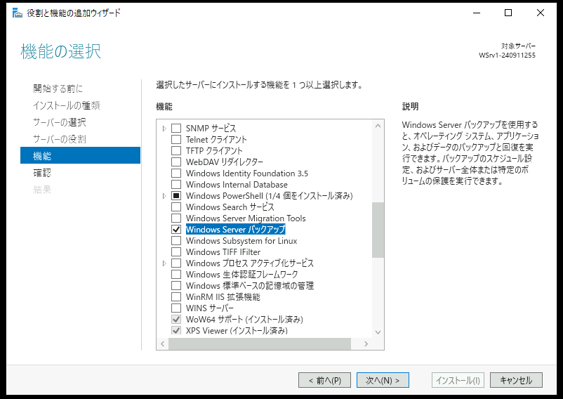
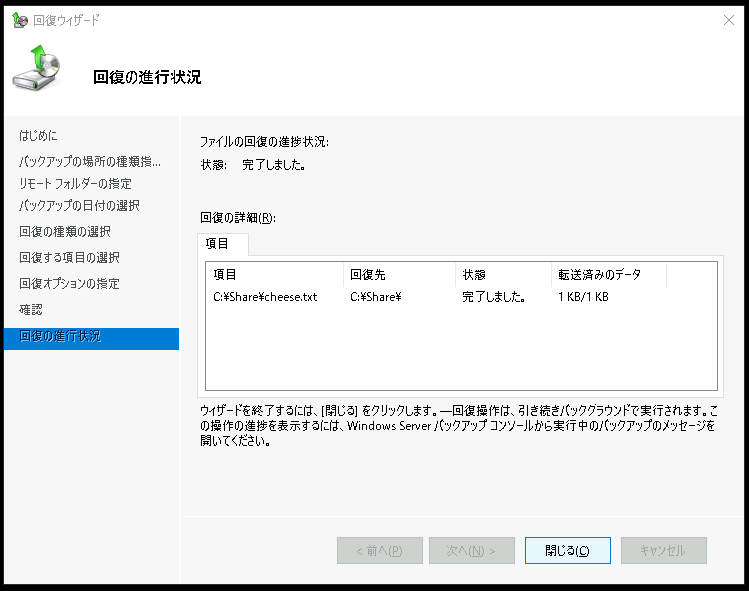

# (オプション) Windows Serverでバックアップ環境を構成する  
---

## 手順について  
ここまでの演習で学習済みの作業については、手順の詳細を省略して表記しています。  

## 演習の位置づけ
この演習を省略しても、後の演習に支障はありません。  
興味のある方のみ取り組んでください。  

## 演習における役割と、環境のパラメータ
- X: ご自身のPod番号
- バックアップ取得対象サーバー役: WinSrv2(WSrv2-yyMMddX)
- バックアップデータ保存用ファイルサーバー役: WinSrv1(WSrv1-yyMMddX)

## 注意
- 手順例の画像は<B>pod255</B>に準拠したパラメータのものです
- 手順内の<B>X</B>表記はご自身のpod番号に読み替えてください

---  

# バックアップデータ保存用ファイルサーバー(WinSrv1)の共有フォルダ(backup)の準備    

1. WinSrv1の管理画面に接続する    

1. WinSrv1にローカルユーザー(backupadmin)を作成する  
    1. ローカルユーザー backupadmin を作成する

        | 項目 | パラメータ |
        | :----- | :----- |
        | ユーザー名 | backupadmin |
        | パスワード | Pa$$w0rd |

1. WinSrv1に共有フォルダ(backup)を作成する    
    1. C:\Backup フォルダを作成する   
    1. C:\Backup フォルダをネットワークに公開し、共有アクセス許可を設定する

        | 項目 | パラメータ |
        | :----- | :----- |
        | アカウント | Everyone |
        | 許可 | フルコントロール |

    1. C:\Backup フォルダにNTFSアクセス許可を設定する  

        | 項目 | パラメータ |
        | :----- | :----- |
        | アカウント | backupadmin |
        | 許可 | 変更 |

---  

# バックアップ取得対象サーバー(WinSrv2)にWindows Server バックアップの機能を追加  

1. WinSrv2の管理画面に接続する    

1. Windows Server 2 に Windows Server バックアップの機能を追加する  
    1. 役割と機能の追加ウィザードを開始する  
        1. [スタートメニュー]をクリックする  
        1. スタートメニュー内の[サーバー マネージャー]をクリックし、サーバーマネージャを起動する    
        1. サーバーマネージャーのダッシュボード画面内の[役割と機能の追加]をクリックする   
        1. [役割と機能の追加ウィザード]ウィンドウが起動したことを確認する  
    1. Windows Server バックアップの機能を追加する
        1. [役割と機能の追加ウィザード]ウィンドウの[開始する前に]画面で、[次へ]をクリックする  
        1. [インストールの種類]画面で、[次へ]をクリックする  
        1. [サーバーの選択]画面で、[次へ]をクリックする  
        1. [サーバーの役割]画面で、[次へ]をクリックする  
        1. [機能の選択]画面で、以下のパラメータを選択する  

           - [x] Windows Server バックアップ  

            <kbd></kbd> 

        1. [機能の選択]画面で、上のパラメータを選択したことを確認し、[次へ]をクリックする  
        1. [確認]画面で、[インストール]をクリックする  
        1. [結果]画面で、インストール進捗を示すプログレスバーが右端に到達するまで数分間待機する  
        1. [結果]画面で、インストールが正常に完了したことを確認し、[閉じる]をクリックする  

    1. Windows Server バックアップ インストール後の確認のために、管理コンソールを起動する  
        1. サーバーマネージャーウィンドウ右上の[ツール]をクリックする  
        1. メニュー内の[Windows Server バックアップ]をクリックし、Windows Server バックアップ 管理コンソールを起動する  
            <kbd></kbd> 
        1. [Windows Server バックアップ]が起動したことを確認する  
            <kbd></kbd> 

---  

# バックアップ取得対象サーバー(WinSrv2)でバックアップ処理用アカウントを準備  

1. WinSrv2の管理画面に接続する    

1. WinSrv2にローカルユーザー backupadmin を作成する

    | 項目 | パラメータ |
    | :----- | :----- |
    | ユーザー名 | backupadmin |
    | パスワード | Pa$$w0rd |

1. WinSrv2のローカルユーザー backupadmin を、ローカルグループ Backup Operators のメンバーにする  

    <kbd></kbd> 

---  

# バックアップ取得対象サーバー(WinSrv2)でWindows Serverバックアップ スケジュールを構成  

1. WinSrv2の管理画面に接続する    

1. [Windows Server バックアップ]の管理コンソールを起動する    

1. 左側コンソールツリーの[Windows Serverバックアップ(ローカル)]-[ローカル バックアップ]をクリックして選択する  

1. [ローカル バックアップ]を右クリックし、コンテキストメニューの[バックアップ スケジュール]をクリックする  

    <kbd></kbd>  

1. [バックアップ スケジュール ウィザード]ウィンドウが表示されたことを確認する  

    <kbd></kbd>  

1. [はじめに]画面で、[次へ]をクリックする  

1. [バックアップの構成の選択]画面で、以下のパラメータを選択する  

    - [ ] サーバー全体(推奨)  
    - [x] カスタム  

    <kbd></kbd>  

1. [バックアップの構成の選択]画面で、上のパラメータを選択したことを確認し、[次へ]をクリックする  

1. [バックアップする項目を選択]画面で、"C:\Share" を選択する  

    1. [バックアップする項目を選択]画面で、[項目の追加]をクリックする  

        <kbd></kbd>  

    1. [項目の選択]ウィンドウが表示されたことを確認する  

        <kbd></kbd>  

    1. [項目の選択]ウィンドウで、C:\Share フォルダを選択する  

    1. [項目の選択]ウィンドウの"Windows (C:)"項目左のプラス記号をクリックして下層を展開する  

    1. "Share"項目左のチェックボックスにチェックをつける  

        <kbd></kbd>  

    1. [項目の選択]ウィンドウで、[OK]をクリックする

    1. [バックアップする項目を選択]画面の"名前"欄に、"C:\Share"が表示されていることを確認する  

        <kbd></kbd>  

1. [バックアップする項目を選択]画面で、[次へ]をクリックする     

1. [バックアップの時間の指定]画面で、[次へ]をクリックする     

    <kbd></kbd>  

    > 【補足】  
    > バックアップをスケジュールされた時刻に自動実行させるのが一般的な運用ですが、この演習においては、後の手順でバックアップ処理を手動で開始します。  
    > そのため、この画面で指定するバックアップの時間(開始時刻)を考慮する必要はありません。    

1. [作成先の種類の指定]画面で、以下のパラメータを選択する  

    - [ ] バックアップ専用のハードディスクにバックアップする(推奨)  
    - [ ] ボリュームにバックアップする    
    - [x] 共有ネットワーク フォルダーにバックアップする   

    <kbd></kbd>  

1. [作成先の種類の指定]画面で、上のパラメータを選択したことを確認し、[次へ]をクリックする  

1. [Windows Server バックアップ]の仕様についての警告ポップアップウィンドウが表示されたことを確認し、[OK]をクリックする   

    <kbd></kbd>  

    > 【補足】  
    > Windows Server バックアップ機能で取得するバックアップデータは、それをローカルストレージに保存する場合に限り、差分データによる世代管理が自動的に構成されます。  
    > しかし今回の演習環境のようにリモートサーバーの共有フォルダにバックアップデータを保存する場合は、差分データによる世代管理は利用できません。  

1. [リモート共有フォルダーの指定]画面で、以下のパラメータを選択する  

    | 項目 | パラメータ |
    | :----- | :----- |
    | 場所 | \\\\10.X.1.104\\backup |

    アクセス制御: 
    - [ ] 継承しない      
    - [x] 継承する     

    <kbd></kbd>  

1. [リモート共有フォルダーの指定]画面で、上のパラメータを選択したことを確認し、[次へ]をクリックする  

1. [Windows セキュリティ]で、バックアップ処理に使用するアカウント情報を入力する  

    1. [Windows セキュリティ - バックアップ スケジュールの登録]ウィンドウが表示されたことを確認する  

    1. 以下のパラメータを入力する  

        | 項目 | パラメータ |
        | :----- | :----- |
        | ユーザー名 | backupadmin |
        | パスワード | Pa$$w0rd |
    
        <kbd></kbd>  

    1. [Windows セキュリティ - バックアップ スケジュールの登録]ウィンドウで、上のパラメータを入力したことを確認し、[次へ]をクリックする  

1. [バックアップ スケジュール ウィザード]ウィンドウの[確認]画面で、[完了]をクリックする  

    <kbd></kbd>  

1. [要約]画面で、[閉じる]をクリックする  

    <kbd></kbd>  

1. [Windows Server バックアップ]の管理コンソールの中央ペインの下部を参照し、スケジュールされたバックアップが構成されていることを確認する  

    <kbd></kbd>  

---  

# Windows Serverバックアップを開始

1. WinSrv2の管理画面に接続する    

1. [Windows Server バックアップ]の管理コンソールを起動する    

1. 左側コンソールツリーの[Windows Serverバックアップ(ローカル)]-[ローカル バックアップ]をクリックして選択する  

1. [ローカル バックアップ]を右クリックし、、コンテキストメニューの[単発バックアップ]をクリックする  
    
    <kbd></kbd>  

1. [単発バックアップ ウィザード]ウィンドウが表示されたことを確認する  

1. [バックアップ オプション]画面で、以下のパラメータを選択する  

    今回のバックアップの作成に使用するオプション: 
    - [x] スケジュールされたバックアップのオプション      
    - [ ] 別のオプション     

    <kbd></kbd>  

1. [バックアップ オプション]面で、上のパラメータを選択したことを確認し、[次へ]をクリックする  

1. [確認]画面で、[バックアップ]をクリックする  

    <kbd></kbd>  

1. [バックアップの進行状況]画面で、バックアップ処理の進捗を示すプログレスバーが表示されていることを確認する  

    <kbd></kbd>  

1. 数秒後、バックアップ処理が完了したことを確認する  

    <kbd></kbd>  

1. [バックアップの進行状況]画面で、[閉じる]をクリックする  

1. [Windows Server バックアップ]の管理コンソールの中央ペインの下部を参照し、バックアップが成功してることを確認する  

    <kbd></kbd>  

1. バックアップデータの状態を確認する    
    1. WinSrv1 に接続する  
    1. バックアップデータ保存用ファイルサーバー(WinSrv1)の共有フォルダ(C:\backup)を参照し、"WindowsImageBackup"が作成されていることを確認する  

    <kbd></kbd>  

---  

# Windows Serverバックアップによるリストア

1. WinSrv2の管理画面に接続する    

1. C:\Shareフォルダ内のファイルを削除する  

    <kbd></kbd>  

    <kbd></kbd>  

1. [Windows Server バックアップ]の管理コンソールを起動する    

1. 左側コンソールツリーの[Windows Serverバックアップ(ローカル)]-[ローカル バックアップ]をクリックして選択する  

1. [ローカル バックアップ]を右クリックし、コンテキストメニューの[回復]をクリックする  

    <kbd></kbd>  

1. [回復ウィザード]ウィンドウが表示されたことを確認する  

1. [はじめに]画面で、以下のパラメータを選択する  
  
    - [ ] このサーバー    
    - [x] 別の場所に保存されているバックアップ    

    <kbd></kbd>  

1. [はじめに]画面で、上のパラメータを選択したことを確認し、[次へ]をクリックする  

1. [バックアップの場所の種類指定]画面で、以下のパラメータを選択する  
  
    - [ ] ローカル ドライブ    
    - [x] リモート共有フォルダー   

    <kbd></kbd>  

1. [バックアップの場所の種類指定]画面で、上のパラメータを選択したことを確認し、[次へ]をクリックする  

1. [リモート フォルダーの指定]画面で、以下のパラメータを指定する  

    `\\10.X.1.104\backup`
    
    <kbd></kbd>  

1. [リモート フォルダーの指定]画面で、上のパラメータを指定したことを確認し、[次へ]をクリックする  

1. [バックアップの日付の選択]画面で、前の手順でバックアップを取得した時刻が表示されていることを確認し、[次へ]をクリックする  

    <kbd></kbd>  

1. [回復の種類の選択]画面で、以下のパラメータを指定する  

    - [x] ファイルおおびフォルダー   
    - [ ] Hyper-V   
    - [ ] ボリューム    
    - [ ] アプリケーション  
    - [ ] システム状態  

    <kbd></kbd>  

1. [回復の種類の選択]画面で、上のパラメータを指定したことを確認し、[次へ]をクリックする  

1. [回復する項目の選択]画面で、以下のパラメータを指定する  

    利用可能な項目: 
    `WSrv2`
    ` - Windows`
    `   - Share`

    回復する項目: 
        `<リストア対象のファイル名>`

    <kbd></kbd>  

1. [回復する項目の選択]画面で、上のパラメータを指定したことを確認し、[次へ]をクリックする 

1. [回復オプションの指定]画面で、以下のパラメータを指定する  

    回復先:
    - [ ] 元の場所     
    - [x] 別の場所   
        `C:\Share`

    バックアップ内の項目が回復先に既にある場合:
    - [x] コピーを作成して両方のバージョンを保持する    
    - [ ] 回復したバージョンで既存のバージョンを上書きする   
    - [ ] 回復先に既に存在する項目は回復しない    

    セキュリティ設定:
    - [x] 回復するファイルまたはフォルダーに対し、アクセス制御リスト(ACL)のアクセス許可を復元する

    <kbd></kbd>  

1. [回復オプションの指定]画面で、上のパラメータを指定したことを確認し、[次へ]をクリックする 

1. [確認]画面で、[回復]をクリックする  

    <kbd></kbd>  

1. [回復の進行状況]画面で、リストア処理の進捗を示すプログレスバーが表示されていることを確認する  

    <kbd></kbd>  

1. 数秒後、リストア処理が完了したことを確認する  

    <kbd></kbd>  

1. [回復の進行状況]画面で、[閉じる]をクリックする  

1. C:\Shareフォルダ内のファイルが回復していることを確認する    

    <kbd></kbd>  

---

# 演習完了  
ここまでの手順で、以下の項目を学習できました。
- [x] Windows Serverバックアップを構成する   
- [x] ファイルのバックアップを取得する  
- [x] バックアップデータからファイルをリストアする  

