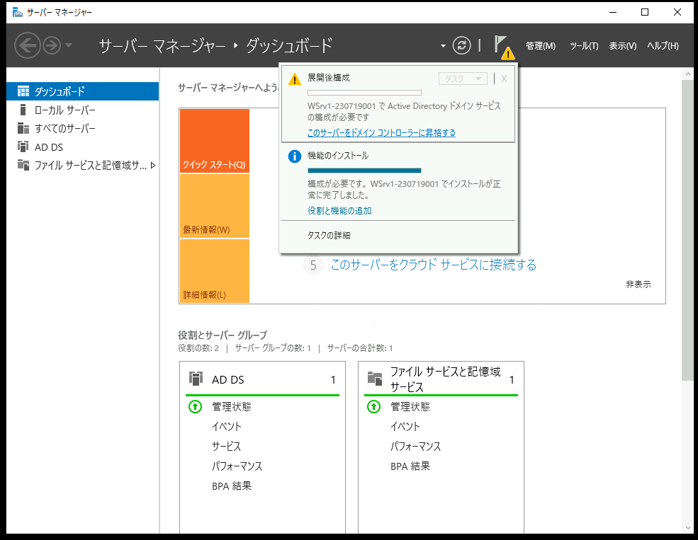
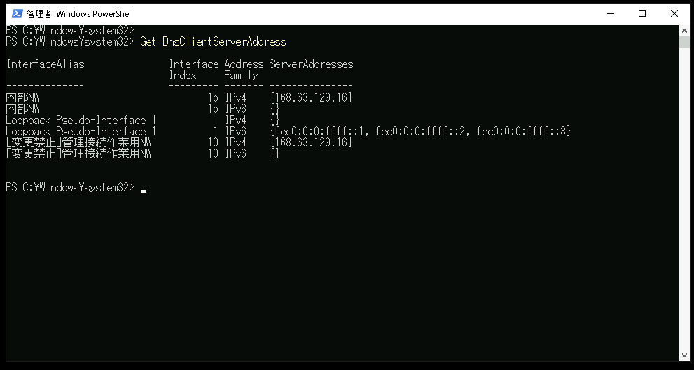
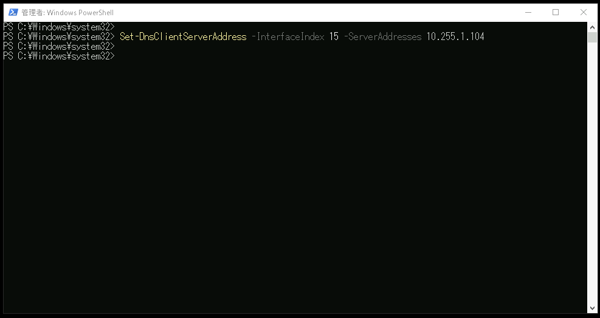
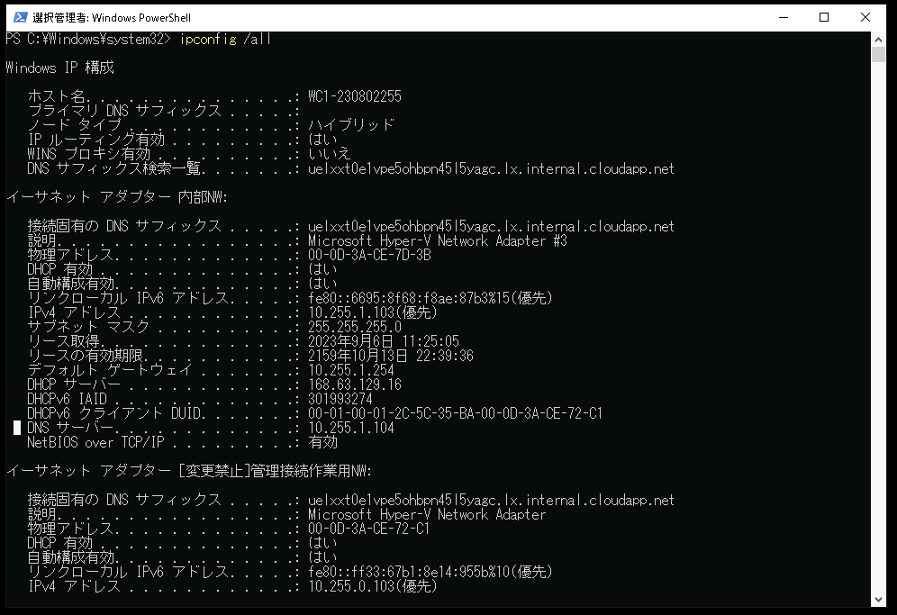

# Active Directory 環境構成の準備をする

---

## 演習における役割と、環境のパラメータ
- X: ご自身のPod番号
- Active Directory ドメインコントローラー役: WinSrv1(WSrv1-yyMMddX)
- クライアント デスクトップ環境: WinClient(WC1-yyMMddX)

## 注意
- 手順例の画像は<B>pod255</B>に準拠したパラメータのものです
- 手順内の<B>X</B>表記はご自身のpod番号に読み替えてください

---

## 1. Active Directory 環境構築の準備
この演習では、Windows Server1(WinSrv1)をActive Directoryドメイン コントローラーとして構築します。  

1. Windows Server1サーバー(WinSrv1)の管理画面に接続する  
1. [スタートメニュー]を右クリックし、コンテキストメニュー内の[Windows PowerShell(管理者)]をクリックする  
1. [ユーザー アカウント制御]のポップアップで[はい]をクリックする  
1. Windows PowerShellのウィンドウが表示されたことを確認する  
1. 以下のコマンドを実行し、ドメイン コントローラー役のコンピュータ(WinSrv1)に接続していることを確認する  
    ＞ ***hostname***  
    
    > 【補足】  
    > Active Directory役のコンピュータであるWinSrv1には、"WSrv1-yyMMddX(年月日とPod番号)"形式のホスト名が設定されています。  


## 2. Active Directoryドメイン サービスの役割を追加  
1. 役割と機能の追加ウィザードを開始する  
    1. [スタートメニュー]をクリックする  
    1. スタートメニュー内の[サーバー マネージャー]をクリックし、サーバーマネージャを起動する    
    1. サーバーマネージャーのダッシュボード画面内の[役割と機能の追加]をクリックする   
    1. [役割と機能の追加ウィザード]ウィンドウが起動したことを確認する  

1. Active Directory ドメイン サービス(AD DS)の役割を追加する
    1. [役割と機能の追加ウィザード]ウィンドウの[開始する前に]画面で、[次へ]をクリックする  
    1. [インストールの種類]画面で、[次へ]をクリックする  
    1. [サーバーの選択]画面で、[次へ]をクリックする  
    1. [サーバーの役割]画面で、以下のパラメータを選択する  

        - [x] Active Directory ドメイン サービス  
    
        > 【補足】  
        > "Active Directory ドメイン サービス"のチェックをつけると、[Active Directory ドメイン サービスに必要な機能を追加しますか？]の確認ポップアップが表示されます。  
        > [Active Directory ドメイン サービスに必要な機能を追加しますか？]ウィンドウで、[機能の追加] をクリックします。  

    1. [サーバーの役割]画面で、上のパラメータを選択したことを確認し、[次へ]をクリックする  
    1. [機能の選択]画面で、[次へ]をクリックする  
    1. [Active Directory ドメイン サービス]画面で、[次へ]をクリックする  
    1. [確認]画面で、[インストール]をクリックする  
    1. [結果]画面で、インストール進捗を示すプログレスバーが右端に到達するまで数分間待機する  
    1. [結果]画面で、インストールが正常に完了したことを確認し、[閉じる]をクリックする  


## 3. ドメインコントローラを構成する  


1. Active Directory ドメイン サービス構成ウィザードを開始する  
    1. サーバーマネージャを起動する    
    1. サーバーマネージャーのダッシュボード画面上部の通知アイコンをクリックし、"展開後構成"の[このサーバーをドメイン コントローラーに昇格する]をクリックする  
        <kbd></kbd>      
    1. [Active Directory ドメイン サービス構成ウィザード]ウィンドウが起動したことを確認する  


1. Active Directory ドメイン サービス構成ウィザードを開始する  
    1. [Active Directory ドメイン サービス構成ウィザード]ウィンドウの[配置構成]画面で、以下のパラメータを選択する  

        配置操作を選択してください:  
        - [ ] 既存のドメインにドメインコントローラを追加する    
        - [ ] 新しいドメインを既存のフォレストに追加する    
        - [x] 新しいフォレストを追加する    
    
        | 項目 | パラメータ |
        | :----- | :----- |
        | ルートドメイン名 | example.local |

    1. [配置構成]画面で、[次へ]をクリックする  
    1. [ドメイン コントローラー オプション]画面で、以下のパラメータを選択する  


        新しいフォレストおよびルートドメインの機能レベルを選択してください:  
        | 項目 | パラメータ |
        | :----- | :----- |
        | フォレストの機能レベル | Windows Server 2016 |
        | ドメインの機能レベル | Windows Server 2016 |

        ドメインコントローラーの機能を指定してください  
        - [x] ドメイン ネーム システム (DNS) サーバー    
        - [x] グローバル カタログ (GC)    
        - [ ] 読み取り専用ドメイン コントローラー (RODC)    

        ディレクトリ サービス復元モード (DSRM) のパスワードを入力してください:  
        | 項目 | パラメータ |
        | :----- | :----- |
        | パスワード | Pa$$w0rd |
        | パスワードの確認 | Pa$$w0rd |

    1. [ドメイン コントローラー オプション]画面で、[次へ]をクリックする  
    1. [DNS オプション]画面で、以下のパラメータであることを確認する  

        DNS委任オプションの指定:    
        - [ ] DNS委任の作成      

    1. [DNS オプション]画面で、[次へ]をクリックする 
    1. [追加 オプション]画面で、以下のパラメータであることを確認する  

        
        | 項目 | パラメータ |
        | :----- | :----- |
        | NetBIOS ドメイン名 | EXAMPLE |     
        
    1. [追加 オプション]画面で、[次へ]をクリックする 

    1. [パス]画面で、以下のパラメータであることを確認する   

        
        | 項目 | パラメータ |
        | :----- | :----- |
        | データベースのフォルダー | C:\Windows\NTDS |     
        | ログ ファイルのフォルダー | C:\Windows\NTDS |     
        | SYSVOLのフォルダー | C:\Windows\SYSVOL |     
        
    1. [パス]画面で、[次へ]をクリックする 
    1. [オプションの確認]画面で、[次へ]をクリックする   
    1. [前提条件のチェック]画面で、[インストール]をクリックする  
    1. [インストール]画面で、インストール進捗を示すプログレスバーが表示されたことを確認する  

        > 【補足】  
        > このインストール処理には、数分～数十分かかる場合があります。   
        > その間に次の項目(Windows ClientのActive Directoryドメイン参加の準備)の作業を進めてください。

    1. [結果]画面で、インストールが正常に完了したことを確認し、[閉じる]をクリックする  


## 4. Windows ClientのActive Directoryドメイン参加の準備
この手順では、Windows ClientをActive Directoryドメインに参加させる準備をします。

1. Clientのネットワーク設定を変更する   
    1. 操作コンピュータを変更するため、演習環境のトップページに戻る  
    1. Windows Client(WinClient)の管理画面に "admin" で接続する   

1. PowerShellを起動する  
    1. [スタートメニュー]を右クリックし、コンテキストメニュー内の[Windows PowerShell(管理者)]をクリックする  
    1. [ユーザー アカウント制御]のポップアップで[はい]をクリックする  
    1. 以下のコマンドを実行し、Windowsクライアント役のコンピュータ(WinClient)に接続していることを確認する  
        ＞ ***hostname***  
        
        > 【補足】  
        > クライアント デスクトップ環境役のコンピュータであるWinClientは、"WC1-yyMMddX(年月日とPod番号)"形式のホスト名が設定されています。  

1. PowerShellでDNSサーバーの設定を変更する

    1. 以下のコマンドを実行し、変更前のネットワーク設定を確認する  
        ＞ ipconfig /all  

        > 【補足】  
        > このコンピュータには、2つのネットワークアダプター(管理接続作業用NW, 内部NW)が構成されています。
        > "内部NW" アダプターのDNSサーバーの設定を、この後のコマンドで変更します。   

    1. 以下のコマンドを実行し、"内部NW"アダプターのInterface Indexを調べる    
        ＞ ***Get-DnsClientServerAddress***  
        <kbd></kbd>   

        > 【補足】  
        > "内部NW" アダプターのInterface Indexの数字を調べます(上の画像例の場合は "15" です)。  
        > この数字は、次の手順のコマンドでパラメータとして入力します。

    1. 以下のコマンドを実行し、問い合わせ先のDNSサーバーをWindows Server1(WinSrv1)に変更する  
        ＞ ***Set-DnsClientServerAddress -InterfaceIndex <前手順で調べた数字> -ServerAddresses 10.X.1.104***  
        <kbd></kbd>   

    1. 以下のコマンドを実行し、変更操作後のネットワーク設定を確認する  
        ＞ ipconfig /all  

        > 【補足】  
        > "内部NW" アダプターのDNSサーバーの設定が、Windows Sever1(WinSrv1)であることを確認してください。

        <kbd></kbd>  

    1. 以下のコマンドを実行し、DNSリゾルバの問い合わせ先("Address")がWindows Sever1(WinSrv1)であることを確認する  
        ＞ nslookup  
        ＞ exit  
        ```
        PS C:\Windows\system32> nslookup
        既定のサーバー:  UnKnown
        Address:  10.255.1.104
        >
        > exit
        PS C:\Windows\system32>
        ```

        > 【補足1】  
        > nslookupは、DNSリゾルバ(クライアント)ツールです。  
        > "Address"には、DNSクエリの送信先DNSサーバーの情報が表示されます。  
        > この値が Windows Server1 のIPアドレスであることを確認します。  
        
        > 【補足2】
        > もしも異なるIPアドレス(168.63...)がAddressとして表示されている場合は、以下のコマンドを実行します。
        > Get-NetAdapter -Name "[変更禁止]管理接続作業用NW" | Set-NetIPInterface -InterfaceMetric 300


---

## 演習完了  
ここまでの手順で、以下の項目を学習できました。
- [x] Active Directory ドメインサービスの役割を追加する  
- [x] Windows Serverをドメインコントローラーに昇格させる  
- [x] Windows Clientの参照先DNSサーバーをPowerShellで変更する  


