# Active Directory 環境を構成する

---

## 演習における役割と、環境のパラメータ
- X: ご自身のPod番号
- Active Directory ドメインコントローラー役: WinSrv1(WSrv1-yyMMddX)
- クライアント デスクトップ環境: WinClient(WC1-yyMMddX)

## 注意
- 手順例の画像は<B>pod255</B>に準拠したパラメータのものです
- 手順内の<B>X</B>表記はご自身のpod番号に読み替えてください

---

## 1. (オプション)ドメインコントローラーの状態を確認する  
この項目の手順は省略できます。  
興味のある方のみ行ってください。  

1. Active Directory ドメイン コントローラー(WinSrv1)の管理画面に接続する 

> 【補足】  
> ドメインコントローラーの昇格処理の最終段階で、WinSrv1のOS再起動が自動的に開始されます。  
> 再起動完了後、お手元のWebブラウザからWinSrv1に正常に再接続できない場合があります。  
> その場合は、開いているタブをいったん閉じて終了し、RemoteLabのホーム画面から再度WinSrv1の接続を行ってください。  

1. PowerShellを起動する  
    1. [スタートメニュー]を右クリックし、コンテキストメニュー内の[Windows PowerShell(管理者)]をクリックする  
    1. [ユーザー アカウント制御]のポップアップで[はい]をクリックする  
    1. Windows PowerShellのウィンドウが表示されたことを確認する  

1. 以下のコマンドを実行し、EXAMPLEドメインの管理者アカウント(admin)でログインしていることを確認する  
    ＞ ***whoami***  

    ```
    PS C:\Windows\system32> whoami
    example\admin
    PS C:\Windows\system32>
    ```

1. 以下のコマンドを実行し、Windows Server1(WinSrv1)がActive Directory ドメイン コントローラーとして認識されていることを確認する  
    ＞ ***netdom query dc***  

    ```
    PS C:\Windows\system32> netdom query dc
    ドメインにアカウントがあるドメイン コントローラーの一覧:

    WSrv1-230802255
    コマンドは正しく完了しました。

    PS C:\Windows\system32>
    ```
1. 以下のコマンドを実行し、ドメイン コントローラーの状態を診断する    
    ＞ ***dcdiag***  

    > 【補足】  
    > dcdiagは、ドメインコントローラーの各機能についてステータスを検査するツールです。  
    > ドメインコントローラーが起動した直後には"失敗"が多数記録される場合がありますが、時間の経過により問題は自然解消します。  
    > なお、今回の演習環境においては"DFSREvent"機能の"失敗"は無視できます。   

    ```
    PS C:\Windows\system32> dcdiag

    ディレクトリ サーバー診断

    初期セットアップを実行しています:
    ホーム サーバーの検索を試みています...
    ホーム サーバー = WSrv1-230802255
    * AD フォレストが識別されました。
    初期情報の収集が完了しました。

    必須の初期テストを実行しています

    サーバーをテストしています: Default-First-Site-Name\WSrv1-230802255
        テストを開始しています: Connectivity
            ......................... WSrv1-230802255 はテスト Connectivity に合格しました

    プライマリ テストを実行しています

    サーバーをテストしています: Default-First-Site-Name\WSrv1-230802255
        テストを開始しています: Advertising
            ......................... WSrv1-230802255 はテスト Advertising に合格しました
        テストを開始しています: FrsEvent
            ......................... WSrv1-230802255 はテスト FrsEvent に合格しました
        テストを開始しています: DFSREvent
            SYSVOL の共有後、この 24 時間以内に発生した警告またはエラー イベントがあります。 SYSVOL レプリケーション失敗の 問題があると、グループ ポリシーの問題が発生する場合 があります。
            ......................... WSrv1-230802255 はテスト DFSREvent に失敗しました
        テストを開始しています: SysVolCheck
            ......................... WSrv1-230802255 はテスト SysVolCheck に合格しました
        テストを開始しています: KccEvent
            ......................... WSrv1-230802255 はテスト KccEvent に合格しました
        テストを開始しています: KnowsOfRoleHolders
            ......................... WSrv1-230802255 はテスト KnowsOfRoleHolders に合格しました
        テストを開始しています: MachineAccount
            ......................... WSrv1-230802255 はテスト MachineAccount に合格しました
        テストを開始しています: NCSecDesc
            ......................... WSrv1-230802255 はテスト NCSecDesc に合格しました
        テストを開始しています: NetLogons
            ......................... WSrv1-230802255 はテスト NetLogons に合格しました
        テストを開始しています: ObjectsReplicated
            ......................... WSrv1-230802255 はテスト ObjectsReplicated に合格しました
        テストを開始しています: Replications
            ......................... WSrv1-230802255 はテスト Replications に合格しました
        テストを開始しています: RidManager
            ......................... WSrv1-230802255 はテスト RidManager に合格しました
        テストを開始しています: Services
            ......................... WSrv1-230802255 はテスト Services に合格しました
        テストを開始しています: SystemLog
            ......................... WSrv1-230802255 はテスト SystemLog に合格しました
        テストを開始しています: VerifyReferences
            ......................... WSrv1-230802255 はテスト VerifyReferences に合格しました


    パーティション テストを実行しています: ForestDnsZones
        テストを開始しています: CheckSDRefDom
            ......................... ForestDnsZones はテスト CheckSDRefDom に合格しました
        テストを開始しています: CrossRefValidation
            ......................... ForestDnsZones はテスト CrossRefValidation に合格しました

    パーティション テストを実行しています: DomainDnsZones
        テストを開始しています: CheckSDRefDom
            ......................... DomainDnsZones はテスト CheckSDRefDom に合格しました
        テストを開始しています: CrossRefValidation
            ......................... DomainDnsZones はテスト CrossRefValidation に合格しました

    パーティション テストを実行しています: Schema
        テストを開始しています: CheckSDRefDom
            ......................... Schema はテスト CheckSDRefDom に合格しました
        テストを開始しています: CrossRefValidation
            ......................... Schema はテスト CrossRefValidation に合格しました

    パーティション テストを実行しています: Configuration
        テストを開始しています: CheckSDRefDom
            ......................... Configuration はテスト CheckSDRefDom に合格しました
        テストを開始しています: CrossRefValidation
            ......................... Configuration はテスト CrossRefValidation に合格しました

    パーティション テストを実行しています: example
        テストを開始しています: CheckSDRefDom
            ......................... example はテスト CheckSDRefDom に合格しました
        テストを開始しています: CrossRefValidation
            ......................... example はテスト CrossRefValidation に合格しました

    エンタープライズ テストを実行しています: example.local
        テストを開始しています: LocatorCheck
            ......................... example.local はテスト LocatorCheck に合格しました
        テストを開始しています: Intersite
            ......................... example.local はテスト Intersite に合格しました
    PS C:\Windows\system32>
    ```


---

## 2. Active Directory ドメインユーザーを作成する  

この項の手順では、以下のユーザーアカウントを作成します。  
| 名前 | 役割 |
| :----- | :----- | 
| Tom | Clientの管理者 |
| Jerry |  一般ユーザー |
| Spike | ADドメイン全体の管理者 |

1. Active Directoryユーザー 管理コンソールを起動する 
    1. Active Directory ドメイン コントローラー(WinSrv1)の管理画面に接続する  
    1. サーバーマネージャーウィンドウ右上の[ツール]をクリックする  
    1. メニュー内の[Active Directoryユーザーとコンピューター]をクリックし、Active Directoryユーザー管理コンソールを起動する  
    1. [Active Directoryユーザーとコンピューター]が起動したことを確認する

1. 新しいOU(組織単位) "Employees" を作成する
    1. 左側コンソールツリーの[Active Directory ユーザーとコンピューター]-[example.local]をクリックして選択する    
    1. [example.local]を右クリックし、コンテキストメニュー内の[新規作成]-[組織単位(OU)]をクリックする 
    1. [新しいオブジェクト - 組織単位 (OU)]ウィンドウが起動したことを確認する  
    1. [新しいオブジェクト - 組織単位 (OU)]ウィンドウで、以下のパラメータを入力する

        | 項目 | パラメータ |
        | :----- | :----- |
        | 名前 | Employees |

        - [x] 間違って削除されないようにコンテナーを保護する  

    1. [新しいオブジェクト - 組織単位 (OU)]ウィンドウで、[OK]をクリックする    
    1. 左側コンソールツリーを参照し、[Active Directory ユーザーとコンピューター]-[example.local]-[Employees]が作成されたことを確認する  


1. 新しいユーザー "Tom" を作成する
    1. 左側コンソールツリーの[Active Directory ユーザーとコンピューター]-[example.local]-[Employees]をクリックして選択する    
    1. [Employees]を右クリックし、コンテキストメニュー内の[新規作成]-[ユーザー]をクリックする 
    1. [新しいオブジェクト - ユーザー]ウィンドウが起動したことを確認する  
    1. [新しいオブジェクト - ユーザー]ウィンドウで、以下のパラメータを入力する
        | 項目 | パラメータ |
        | :----- | :----- |
        | 姓 | <空欄> |
        | 名 | Tom |
        | イニシャル | <空欄> |
        | フル ネーム | Tom |
        | ユーザーログオン名 | Tom@example.local |
        | ユーザーログオン名(Windows2000より以前) | EXAMPLE\Tom |
    1. [新しいオブジェクト - ユーザー]ウィンドウで、[次へ]をクリックする  

    1. [新しいオブジェクト - ユーザー]ウィンドウで、以下のパラメータを入力する

        | 項目 | パラメータ |
        | :----- | :----- |
        | パスワード | Pa$$w0rd |
        | パスワードの確認入力 | Pa$$w0rd |

        - [ ] ユーザーは次回ログオン時にパスワード変更が必要    
        - [ ] ユーザーはパスワードを変更できない  
        - [x] パスワードを無期限にする    
        - [ ] アカウントは無効  

    1. [新しいオブジェクト - ユーザー]ウィンドウで、[次へ]をクリックする 

    1. [新しいオブジェクト - ユーザー]ウィンドウで、[完了]をクリックする 

    1. 左側コンソールツリーの[Active Directory ユーザーとコンピューター]-[example.local]-[Employees]をクリックして選択し、画面の右側ペインにユーザー"Tom"が表示されていることを確認する  


1. 新しいユーザー "Jerry" を作成する
    1. 左側コンソールツリーの[Active Directory ユーザーとコンピューター]-[example.local]-[Employees]をクリックして選択する    
    1. [Employees]を右クリックし、コンテキストメニュー内の[新規作成]-[ユーザー]をクリックする 
    1. [新しいオブジェクト - ユーザー]ウィンドウが起動したことを確認する  
    1. [新しいオブジェクト - ユーザー]ウィンドウで、以下のパラメータを入力する
        | 項目 | パラメータ |
        | :----- | :----- |
        | 姓 | <空欄> |
        | 名 | Jerry |
        | イニシャル | <空欄> |
        | フル ネーム | Jerry |
        | ユーザーログオン名 | Jerry@example.local |
        | ユーザーログオン名(Windows2000より以前) | EXAMPLE\Jerry |
    1. [新しいオブジェクト - ユーザー]ウィンドウで、[次へ]をクリックする  

    1. [新しいオブジェクト - ユーザー]ウィンドウで、以下のパラメータを入力する

        | 項目 | パラメータ |
        | :----- | :----- |
        | パスワード | Pa$$w0rd |
        | パスワードの確認入力 | Pa$$w0rd |

        - [ ] ユーザーは次回ログオン時にパスワード変更が必要    
        - [ ] ユーザーはパスワードを変更できない  
        - [x] パスワードを無期限にする    
        - [ ] アカウントは無効  

    1. [新しいオブジェクト - ユーザー]ウィンドウで、[次へ]をクリックする 

    1. [新しいオブジェクト - ユーザー]ウィンドウで、[完了]をクリックする 

    1. 左側コンソールツリーの[Active Directory ユーザーとコンピューター]-[example.local]-[Employees]をクリックして選択し、画面の右側ペインにユーザー"Jerry"が表示されていることを確認する  


1. 新しいユーザー "Spike" を作成する
    1. 左側コンソールツリーの[Active Directory ユーザーとコンピューター]-[example.local]-[Employees]をクリックして選択する    
    1. [Employees]を右クリックし、コンテキストメニュー内の[新規作成]-[ユーザー]をクリックする 
    1. [新しいオブジェクト - ユーザー]ウィンドウが起動したことを確認する  
    1. [新しいオブジェクト - ユーザー]ウィンドウで、以下のパラメータを入力する
        | 項目 | パラメータ |
        | :----- | :----- |
        | 姓 | <空欄> |
        | 名 | Spike |
        | イニシャル | <空欄> |
        | フル ネーム | Spike |
        | ユーザーログオン名 | Spike@example.local |
        | ユーザーログオン名(Windows2000より以前) | EXAMPLE\Spike |
    1. [新しいオブジェクト - ユーザー]ウィンドウで、[次へ]をクリックする  

    1. [新しいオブジェクト - ユーザー]ウィンドウで、以下のパラメータを入力する

        | 項目 | パラメータ |
        | :----- | :----- |
        | パスワード | Pa$$w0rd |
        | パスワードの確認入力 | Pa$$w0rd |

        - [ ] ユーザーは次回ログオン時にパスワード変更が必要    
        - [ ] ユーザーはパスワードを変更できない  
        - [x] パスワードを無期限にする    
        - [ ] アカウントは無効  

    1. [新しいオブジェクト - ユーザー]ウィンドウで、[次へ]をクリックする 

    1. [新しいオブジェクト - ユーザー]ウィンドウで、[完了]をクリックする 

    1. 左側コンソールツリーの[Active Directory ユーザーとコンピューター]-[example.local]-[Employees]をクリックして選択し、画面の右側ペインにユーザー"Spike"が表示されていることを確認する  


--- 

## 3. Active Directory グループを作成する  

この演習では、以下のActive Directory グループを操作します。  
| グループ名 | 用途 | 作成方法 |
| :----- | :----- |  :----- | 
| G_ClientAdmins | Client環境を管理するユーザーをグルーピングする(メンバーとして所属させる) | 本項で作成する |
| DL_WinClient_FullControl | Windows Client管理者権限のセキュリティ設定対象にする | 本項で作成する |
| Domain Admins | Active Directoryに所属する全コンピュータの管理権限を有する | 自動的に作成されている |
| Domain Users | Active Directoryに所属する全コンピュータの一般ユーザー権限を有する | 自動的に作成されている |
| DL_FileServer_ReadOnly | ファイルサーバーで読み取り専用アクセスのセキュリティ設定対象にする | 後の手順で作成する |
| DL_FileServer_FullAccess | ファイルサーバーでフルコントロールアクセスのセキュリティ設定対象にする | 後の手順で作成する |

1. Active Directoryユーザー 管理コンソールを起動する 
    1. Active Directory ドメイン コントローラー(WinSrv1)の管理画面に接続する  
    1. [Active Directoryユーザーとコンピューター]を起動する

1. 新しいOU(組織単位) "Groups" を作成する
    1. 左側コンソールツリーの[Active Directory ユーザーとコンピューター]-[example.local]をクリックして選択する    
    1. [example.local]を右クリックし、コンテキストメニュー内の[新規作成]-[組織単位(OU)]をクリックする 
    1. [新しいオブジェクト - 組織単位 (OU)]ウィンドウが起動したことを確認する  
    1. [新しいオブジェクト - 組織単位 (OU)]ウィンドウで、以下のパラメータを入力する

        | 項目 | パラメータ |
        | :----- | :----- |
        | 名前 | Groups |

        - [x] 間違って削除されないようにコンテナーを保護する  

    1. [新しいオブジェクト - 組織単位 (OU)]ウィンドウで、[OK]をクリックする    
    1. 左側コンソールツリーを参照し、[Active Directory ユーザーとコンピューター]-[example.local]-[Groups]が作成されたことを確認する  

1. 新しいグループ "G_ClientAdmins" を作成する
    1. 左側コンソールツリーの[Active Directory ユーザーとコンピューター]-[example.local]-[Groups]をクリックして選択する    
    1. [Groups]を右クリックし、コンテキストメニュー内の[新規作成]-[グループ]をクリックする 
    1. [新しいオブジェクト - グループ]ウィンドウが起動したことを確認する  
    1. [新しいオブジェクト - グループ]ウィンドウで、以下のパラメータを入力する
        | 項目 | パラメータ |
        | :----- | :----- |
        | グループ名 | G_ClientAdmins |
        | グループ名(Windows2000より以前) | G_ClientAdmins |

        グループのスコープ:  
        - [ ] ドメイン ローカル  
        - [x] グローバル  
        - [ ] ユニバーサル  

        グループの種類:  
        - [x] セキュリティ  
        - [ ] 配布  

    1. [新しいオブジェクト - グループ]ウィンドウで、[OK]をクリックする  

    1. 左側コンソールツリーの[Active Directory ユーザーとコンピューター]-[example.local]-[Groups]をクリックして選択し、画面の右側ペインにグループ"G_ClientAdmins"が表示されていることを確認する  


1. 新しいグループ "DL_WinClient_FullControl" を作成する
    1. 左側コンソールツリーの[Active Directory ユーザーとコンピューター]-[example.local]-[Groups]をクリックして選択する    
    1. [Groups]を右クリックし、コンテキストメニュー内の[新規作成]-[グループ]をクリックする 
    1. [新しいオブジェクト - グループ]ウィンドウが起動したことを確認する  
    1. [新しいオブジェクト - グループ]ウィンドウで、以下のパラメータを入力する
        | 項目 | パラメータ |
        | :----- | :----- |
        | グループ名 | DL_WinClient_FullControl |
        | グループ名(Windows2000より以前) | DL_WinClient_FullControl |

        グループのスコープ:  
        - [x] ドメイン ローカル  
        - [ ] グローバル  
        - [ ] ユニバーサル  

        グループの種類:  
        - [x] セキュリティ  
        - [ ] 配布  

    1. [新しいオブジェクト - グループ]ウィンドウで、[OK]をクリックする  

    1. 左側コンソールツリーの[Active Directory ユーザーとコンピューター]-[example.local]-[Groups]をクリックして選択し、画面の右側ペインにグループ"DL_WinClient_FullControl"が表示されていることを確認する  

1. "Domain Admins"グループと"Domain Users"グループが作成されていることを確認する  
    1. 左側コンソールツリーの[Active Directory ユーザーとコンピューター]-[example.local]-[Users]をクリックして選択する    
    1. 画面の右側ペインの一覧を参照し、"Domain Admins"グループが存在することを確認する  
    1. 画面の右側ペインの一覧を参照し、"Domain Users"グループが存在することを確認する  

--- 

## 4. Active Directory グループのメンバーシップを構成する    

この項の手順では、以下のユーザーアカウントを作成します。  
| アカウント | 所属させるグループ |
| :----- | :----- | 
| Tom | G_ClientAdmins |
| Jerry |  一般ユーザー(変更なし) |
| Spike | Domain Admins |
| G_ClientAdmins | DL_WinClient_FullControl |


1. Active Directoryユーザー 管理コンソールを起動する 
    1. Active Directory ドメイン コントローラー(WinSrv1)の管理画面に接続する  
    1. [Active Directoryユーザーとコンピューター]を起動する


1. "G_ClientAdmins" グループに、"Tom" を所属させる  
    1. 左側コンソールツリーの[Active Directory ユーザーとコンピューター]-[example.local]-[Groups]をクリックして選択する  
    1. 画面の右側ペインの[G_ClientAdmins]をクリックして選択する      
    1. [G_ClientAdmins]を右クリックし、コンテキストメニュー内の[プロパティ]をクリックする  
    1. [G_ClientAdminsのプロパティ]ウィンドウが起動したことを確認する  
    1. [G_ClientAdminsのプロパティ]ウィンドウで、[メンバー]タブをクリックして選択する  
    1. [メンバー]タブで、[追加]をクリックする  
    1. [ユーザー、連絡先、コンピュータ、サービスアカウントまたはグループの選択]ウィンドウが表示されたことを確認する
    1. [ユーザー、連絡先、コンピュータ、サービスアカウントまたはグループの選択]ウィンドウで、以下のパラメータを入力する
        | 項目 | パラメータ |
        | :----- | :----- |
        | 選択するオブジェクトを入力してください | Tom |
    1. [ユーザー、連絡先、コンピュータ、サービスアカウントまたはグループの選択]ウィンドウで、[名前の確認]をクリックする  
    1. "Tom" の名前の確認に成功し、"Tom(Tom@example.local)"表記に下線がついたことを確認する  
    1. [ユーザー、連絡先、コンピュータ、サービスアカウントまたはグループの選択]ウィンドウで、[OK]をクリックする  
    1. [G_ClientAdminsのプロパティ]ウィンドウの"所属するメンバー"の欄に"Tom"が追加されたことを確認する  
    1. [G_ClientAdminsのプロパティ]ウィンドウで、[OK]をクリックする  

1. "DL_WinClient_FullControl" グループに、"G_ClientAdmins" グループを所属させる  
    1. 左側コンソールツリーの[Active Directory ユーザーとコンピューター]-[example.local]-[Groups]をクリックして選択する  
    1. 画面の右側ペインの[DL_WinClient_FullControl]をクリックして選択する      
    1. [DL_WinClient_FullControl]を右クリックし、コンテキストメニュー内の[プロパティ]をクリックする  
    1. [DL_WinClient_FullControlのプロパティ]ウィンドウが起動したことを確認する  
    1. [DL_WinClient_FullControlのプロパティ]ウィンドウで、[メンバー]タブをクリックして選択する  
    1. [メンバー]タブで、[追加]をクリックする  
    1. [ユーザー、連絡先、コンピュータ、サービスアカウントまたはグループの選択]ウィンドウが表示されたことを確認する
    1. [ユーザー、連絡先、コンピュータ、サービスアカウントまたはグループの選択]ウィンドウで、以下のパラメータを入力する
        | 項目 | パラメータ |
        | :----- | :----- |
        | 選択するオブジェクトを入力してください | G_ClientAdmins |
    1. [ユーザー、連絡先、コンピュータ、サービスアカウントまたはグループの選択]ウィンドウで、[名前の確認]をクリックする  
    1. "G_ClientAdmins" の名前の確認に成功し、"G_ClientAdmins"表記に下線がついたことを確認する  
    1. [ユーザー、連絡先、コンピュータ、サービスアカウントまたはグループの選択]ウィンドウで、[OK]をクリックする  
    1. [DL_WinClient_FullControlのプロパティ]ウィンドウの"所属するメンバー"の欄に"G_ClientAdmins"が追加されたことを確認する  
    1. [DL_WinClient_FullControlのプロパティ]ウィンドウで、[OK]をクリックする  

1. "Domain Admins" グループに、"Spike" を所属させる  
    > 【補足】  
    > ユーザーが所属するグループを管理するには、以下の2つの方法があります。  
    > 方法①グループのプロパティを変更し、そのグループに所属するメンバーを追加する  
    > 方法②ユーザーのプロパティを変更し、そのユーザーの所属先グループを追加する  
    > "Spike"を"Domain Admins"に追加する手順では、学習目的のため、ユーザー(Spike)の所属先グループを追加する方法②でメンバーシップを変更します。  

    1. 左側コンソールツリーの[Active Directory ユーザーとコンピューター]-[example.local]-[Employees]をクリックして選択する  
    1. 画面の右側ペインの[Spike]をクリックして選択する      
    1. [Spike]を右クリックし、コンテキストメニュー内の[プロパティ]をクリックする  
    1. [Spikeのプロパティ]ウィンドウが起動したことを確認する  
    1. [Spikeのプロパティ]ウィンドウで、[所属するグループ]タブをクリックして選択する  
    1. [所属するグループ]タブで、[追加]をクリックする  
    1. [グループの選択]ウィンドウが表示されたことを確認する
    1. [グループの選択]ウィンドウで、以下のパラメータを入力する
        | 項目 | パラメータ |
        | :----- | :----- |
        | 選択するオブジェクトを入力してください | Domain Admins |
    1. [ユーザー、連絡先、コンピュータ、サービスアカウントまたはグループの選択]ウィンドウで、[名前の確認]をクリックする  
    1. " Domain Admins " の名前の確認に成功し、" Domain Admins "表記に下線がついたことを確認する  
    1. [グループの選択]ウィンドウで、[OK]をクリックする  
    1. [Spikeのプロパティ]ウィンドウの"所属するグループ"の欄に"Domain Admins"が追加されたことを確認する  
    1. [Spikeのプロパティ]ウィンドウで、[OK]をクリックする  


---

## Windows ClientをActive Directoryドメインに参加させる  

1. Windows Clientに"admin"で接続する  
    1. Windows Client(WinClient)の管理画面に "admin" で接続する 
    1. [スタートメニュー]を右クリックし、コンテキストメニュー内の[Windows PowerShell(管理者)]をクリックする  
    1. [ユーザー アカウント制御]のポップアップで[はい]をクリックする  
    1. Windows PowerShellのウィンドウが表示されたことを確認する  
    1. 以下のコマンドを実行し、クライアント デスクトップ環境役のコンピュータ(WC1)に "admin" で接続していることを確認する  
        ＞ ***hostname***  
        ＞ ***whoami***         
        > 【補足】  
        > クライアント デスクトップ環境役のコンピュータであるWinClientは、"WC1-yyMMddX(年月日とPod番号)"形式のホスト名が設定されています。  


1. Windows PowerShellで以下のコマンドを実行し、Windows ClientがActive Directoryドメイン名をDNS名前解決できることを確認する  
    ＞ ***nslookup example.local***  

    ```
    PS C:\Windows\system32> nslookup example.local
    サーバー:  UnKnown
    Address:  10.255.1.104

    名前:    example.local
    Addresses:  10.255.1.104
            10.255.0.104

    PS C:\Windows\system32>
    ```

    > 【補足】  
    > "名前:example.local" の "Addresses" として、Windows Server 1 のIPアドレス(10.X.1.104)が解決できていることを確認します。    


1. [システムのプロパティ]設定画面を起動する  
    1. [スタートメニュー]を右クリックし、コンテキストメニュー内の[システム]をクリックする  
    1. [設定 - 詳細情報]ウィンドウが起動したことを確認する  
    1. [設定 - 詳細情報]ウィンドウ右端の"関連設定"の[このPCの名前を変更(詳細設定)]をクリックする  
    
        > 【補足】  
        > [設定]ウィンドウの幅が狭い場合は、右端ではなく画面下部に"関連設定"の項目が表示されます。  

    1. [システムのプロパティ]ウィンドウが起動したことを確認する  

1. コンピュータをActive Directoryドメイン(example.local)に参加させる
    1. [システムのプロパティ]ウィンドウの[コンピューター名]タブの[変更]をクリックする  
    1. [コンピューター名/ドメイン名の変更]ウィンドウが起動したことを確認する  
    1. [コンピューター名/ドメイン名の変更]ウィンドウで、"所属するグループ"の設定を以下のパラメータに変更する  

        - [x] ドメイン   
            | example.local |
            | :----- |

        - [ ] ワークグループ  

        <kbd>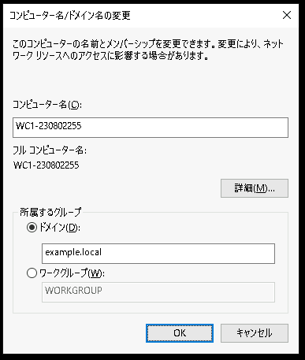</kbd> 
    1. [コンピューター名/ドメイン名の変更]ウィンドウで、[OK]をクリックする  
    1. [Windowsセキュリティ]ウィンドウが起動したことを確認する  
    1. [Windowsセキュリティ]ウィンドウで、以下のパラメータを入力する  

        | 項目 | パラメータ |
        | :----- | :----- |
        | ユーザー名 | EXAMPLE\Tom |
        | パスワード | Pa$$w0rd |

        <kbd>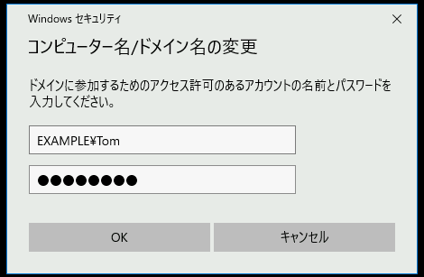</kbd> 

    1. [Windowsセキュリティ]ウィンドウで、[OK]をクリックする   

    1. 一時的に演習環境の画面表示が不安定になりますが、数十秒で接続が安定します  

    1. [コンピューター名/ドメイン名の変更]ポップアップで、[OK]をクリックする  

        <kbd>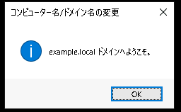</kbd> 

    1. [コンピューター名/ドメイン名の変更]ポップアップで、[OK]をクリックする  

        <kbd>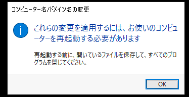</kbd> 

    1. [システムのプロパティ]ウィンドウで、[閉じる]をクリックする   

        <kbd>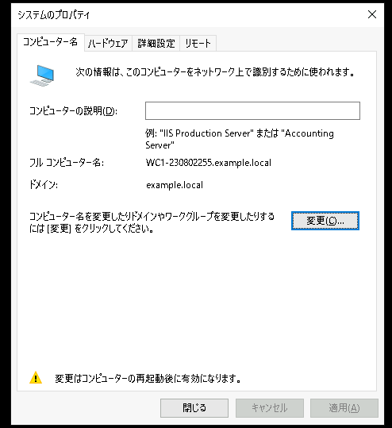</kbd> 


    1. [Microsoft Windows]ポップアップで、[今すぐ再起動する]をクリックする   

        <kbd>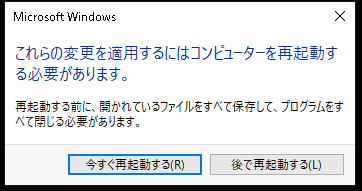</kbd> 

    1. 一時的に演習環境の画面表示が途絶えますが、数十秒で接続が安定します  


---  

## Windows ClientのActive Directoryドメイン参加後の確認

1. Windows Clientに"admin"で接続する  
    1. Windows Client(WinClient)の管理画面に "admin" で接続する 

1. [システムのプロパティ]設定画面を起動する  
    1. [スタートメニュー]を右クリックし、コンテキストメニュー内の[システム]をクリックする  
    1. [設定 - 詳細情報]ウィンドウが起動したことを確認する  
    1. [設定 - 詳細情報]ウィンドウ右端の"関連設定"の[このPCの名前を変更(詳細設定)]をクリックする  
    1. [システムのプロパティ]ウィンドウが起動したことを確認する  
    1. [システムのプロパティ]ウィンドウの[コンピューター名]タブを参照し、コンピューターの状態を確認する     
        > 【動作テストの観点】  
        > コンピューターのActive Directoryドメインに参加できていることを確認する  

        - [x] "ドメイン名:" が "example.local" であること  
                
---  

## Active Directoryドメイン グループに、Windows Clientのセキュリティ権限を付与する  

1. Windows Clientに"admin"で接続し、[ローカルユーザーとグループ]管理コンソールを起動する    
    1. Windows Client(WinClient)の管理画面に "admin" で接続する 
    1. [スタートメニュー]を右クリックし、コンテキストメニュー内の[Windows PowerShell(管理者)]をクリックする  
    1. [ユーザー アカウント制御]のポップアップで[はい]をクリックする  
    1. Windows PowerShellのウィンドウが表示されたことを確認する  。  
    1. Windows PowerShellで以下のコマンドを実行し、[ローカルユーザーとグループ]管理コンソールを起動する  
        ＞ ***lusrmgr.msc***    

1. ローカル Adminsitrators グループに、"DL_WinClient_FullControl"グループをメンバーとして所属させる    
    1. 左側コンソールツリーの[ローカル ユーザーとグループ]-[グループ]をクリックする  
    1. 中央ペインのユーザーの一覧を参照し、[Administrators]をクリックして選択する
    1. 右クリック コンテキストメニューの[プロパティ]をクリックする  
    1. [Administratorsのプロパティ]ウィンドウで、[追加]をクリックする  
    1. [ユーザー、コンピュータ、サービスアカウントまたはグループの選択]ウィンドウが表示されたことを確認する  
    1. "選択するオブジェクト名を入力してください" の欄に "DL_WinClient_FullControl" と入力する  
    1. [名前の確認]をクリックする  
    1. [Windowsセキュリティ]ウィンドウが起動したことを確認する  
    1. [Windowsセキュリティ]ウィンドウで、以下のパラメータを入力する  

        | 項目 | パラメータ |
        | :----- | :----- |
        | ユーザー名 | EXAMPLE\Tom |
        | パスワード | Pa$$w0rd |

    1. [Windowsセキュリティ]ウィンドウで、[OK]をクリックする  
    1. "DL_WinClient_FullControl" の表記に下線がついたことを確認する  
    1. [OK]をクリックする  
    1. [Administratorsのプロパティ]ウィンドウの "所属するメンバー" に "EXAMPLE\DL_WinClient_FullControl" が表示されていることを確認する
    1. [Administratorsのプロパティ]ウィンドウで、[OK]をクリックする  

1. ローカル "Remote Desktop Users" グループに、"Domain Users"グループをメンバーとして所属させる    
    1. 左側コンソールツリーの[ローカル ユーザーとグループ]-[グループ]をクリックする  
    1. 中央ペインのユーザーの一覧を参照し、[Remote Desktop Users]をクリックして選択する
    1. 右クリック コンテキストメニューの[プロパティ]をクリックする  
    1. [Remote Desktop Usersのプロパティ]ウィンドウで、[追加]をクリックする  
    1. [ユーザー、コンピュータ、サービスアカウントまたはグループの選択]ウィンドウが表示されたことを確認する  
    1. "選択するオブジェクト名を入力してください" の欄に "Domain Users" と入力する  
    1. [名前の確認]をクリックする  
    1. [Windowsセキュリティ]ウィンドウが起動したことを確認する  
        > 【補足】  
        > [Windowsセキュリティ]ウィンドウが表示されない場合は、そのまま手順を進めてください。  
        > [ユーザー、コンピュータ、サービスアカウントまたはグループの選択]ウィンドウで[OK]をクリックします。
    1. [Windowsセキュリティ]ウィンドウで、以下のパラメータを入力する  

        | 項目 | パラメータ |
        | :----- | :----- |
        | ユーザー名 | EXAMPLE\Tom |
        | パスワード | Pa$$w0rd |

    1. [Windowsセキュリティ]ウィンドウで、[OK]をクリックする  
    1. "Domain Users" の表記に下線がついたことを確認する  
    1. [OK]をクリックする  
    1. [Remote Desktop Usersのプロパティ]ウィンドウの "所属するメンバー" に "EXAMPLE\Domain Users" が表示されていることを確認する
    1. [Remote Desktop Usersのプロパティ]ウィンドウで、[OK]をクリックする  

    1. [ローカルユーザーとグループ]管理コンソールを終了します。


---  

## Active Directory ドメインユーザーでWindows Clientにログインする

1. EXAMPLE\Tom でログインする  
    1. 操作コンピュータを変更するため、演習環境のトップページに戻る  
    1. Windows Client(WinClient)の管理画面に "AD Tom" で接続する  
        <kbd>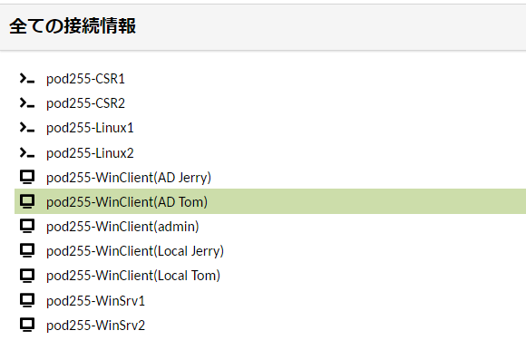</kbd> 

1. ユーザーアカウントの情報を確認する      
    1. [スタートメニュー]を右クリックし、コンテキストメニュー内の[Windows PowerShell(管理者)]をクリックする  
    1. [ユーザー アカウント制御]のポップアップで[はい]をクリックする  
    1. Windows PowerShellのウィンドウが表示されたことを確認する 。     
    1. Windows PowerShellで以下のコマンドを実行し、Active Directory ドメインユーザーの"EXAMPLE\Tom"でログインしていることを確認する   
        ＞ ***whoami***    

        ```
        PS C:\Users\tom.EXAMPLE> whoami
        example\tom
        PS C:\Users\tom.EXAMPLE>        
        ```

    > 【補足1】  
    > "ローカルユーザーのTom" と "Active DirectoryドメインユーザーのTom(example\tom)" は全く別のアカウントです。  
    > そのため、 "ローカルユーザーのTom" が FileServerの動作確認のためにデスクトップにコピーしたファイルは、"Active DirectoryドメインユーザーのTom(example\tom)"のデスクトップには存在しません。    
    > これは、Windows Clientログイン時のユーザー プロファイルが異なるためです。  

    > 【補足2】  
    > "ローカルユーザーのTom" が "whoami" コマンドを実行した場合は、以下の出力を得ます。
    > ローカルユーザーのアカウント名は "<ローカルコンピュータ名>\ユーザー名" の形式です。  
    >
    > PS C:\Users\Tom> whoami
    > wc1-230802255\tom
    > PS C:\Users\Tom>

1. EXAMPLE\Tom がWindows Clientの管理操作ができることを確認する    
  
    1. Windows PowerShellで以下のコマンドを実行し、[ローカルユーザーとグループ]管理コンソールを起動する  
        ＞ ***lusrmgr.msc***    
    1. 左側コンソールツリーの[ローカル ユーザーとグループ]-[ユーザー]をクリックする  
    1. 中央ペインのユーザーの一覧を参照し、[Jerry]をクリックして選択する
    1. 右クリック コンテキストメニューの[プロパティ]をクリックする  
    1. [Jerryのプロパティ]ウィンドウで、"説明"欄に任意の文言を記入する  
            <kbd>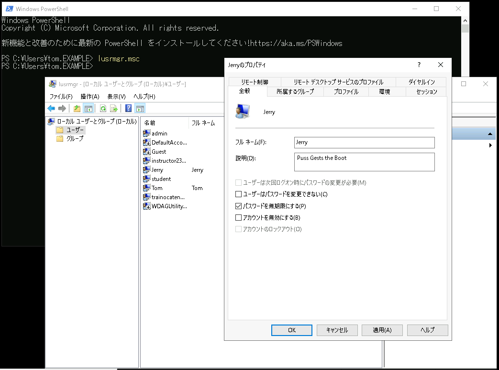</kbd>
    1. [Jerryのプロパティ]ウィンドウで、[OK]をクリックする    
        > 【補足】  
        > "EXAMPLE\Tom"はWindows Clientの管理者権限を持っているため、"Windows ClientローカルユーザーのJerry" の設定を変更できます。  


1. EXAMPLE\Jerry でログインする  
    1. 操作コンピュータを変更するため、演習環境のトップページに戻る  
    1. Windows Client(WinClient)の管理画面に "AD Jerry" で接続する  
        <kbd>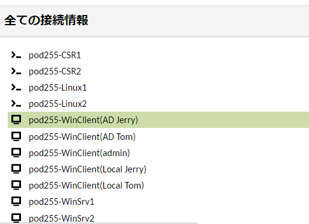</kbd> 
1. ユーザーアカウントの情報を確認する      
    1. [スタートメニュー]を右クリックし、コンテキストメニュー内の[Windows PowerShell]をクリックする  

        > 【補足】  
        > "EXAMPLE\Jerry"はWindows Clientの管理者権限を持っていないため、管理者権限のPowerShell([Windows PowerShell(管理者)])は実行できません。  

    1. Windows PowerShellのウィンドウが表示されたことを確認する 。     
    1. Windows PowerShellで以下のコマンドを実行し、Active Directory ドメインユーザーの"EXAMPLE\Jerry"でログインしていることを確認する   
        ＞ ***whoami***    

        ```
        PS C:\Users\Jerry.EXAMPLE> whoami
        example\jerry
        PS C:\Users\Jerry.EXAMPLE>   
        ```

1. EXAMPLE\Jerry がWindows Clientの管理操作ができないことを確認する    
  
    1. Windows PowerShellで以下のコマンドを実行し、[ローカルユーザーとグループ]管理コンソールを起動する  
        ＞ ***lusrmgr.msc***    
    1. 左側コンソールツリーの[ローカル ユーザーとグループ]-[ユーザー]をクリックする  
    1. 中央ペインのユーザーの一覧を参照し、[Tom]をクリックして選択する
    1. 右クリック コンテキストメニューの[プロパティ]をクリックする  
    1. [Tomのプロパティ]ウィンドウで、"説明"欄に任意の文言を記入する  
            <kbd>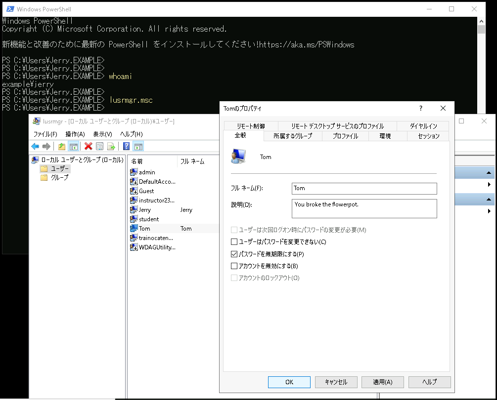</kbd>
    1. [Tomのプロパティ]ウィンドウで[OK]をクリックしても、設定変更ができないことを確認する      
            <kbd>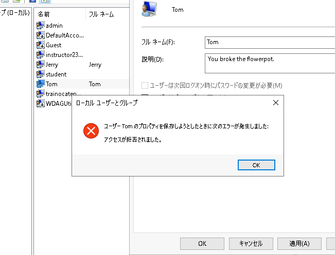</kbd>

        > 【補足】  
        > "EXAMPLE\Jerry"はWindows Clientの管理者権限を持っていない一般ユーザーであるため、"Windows ClientのローカルユーザーのTom" の設定を変更できません。  
    1. [ローカルユーザーとグループ]のエラー ポップアップで、[OK]をクリックする  
    1. [Tomのプロパティ]ウィンドウで[キャンセル]をクリックする   


---  

## Windows Server 2(WinSrv2)のActive Directoryドメイン参加  
この手順では、Windows Server 2(WinSrv2)をActive Directoryドメインに参加させる準備をします。

1. Clientのネットワーク設定を変更する   
    1. 操作コンピュータを変更するため、演習環境のトップページに戻る  
    1. Windows Server 2(WinSrv2)の管理画面に "admin" で接続する   

1. PowerShellを起動する  
    1. [スタートメニュー]を右クリックし、コンテキストメニュー内の[Windows PowerShell(管理者)]をクリックする  
    1. [ユーザー アカウント制御]のポップアップで[はい]をクリックする  
    1. 以下のコマンドを実行し、Windowsクライアント役のコンピュータ(WinClient)に接続していることを確認する  
        ＞ ***hostname***  
        
        > 【補足】  
        > クライアント デスクトップ環境役のコンピュータであるWinClientは、"WSrv2-yyMMddX(年月日とPod番号)"形式のホスト名が設定されています。  

1. PowerShellでDNSサーバーの設定を変更する

    1. 以下のコマンドを実行し、変更前のネットワーク設定を確認する  
        ＞ ipconfig /all  

        > 【補足】  
        > このコンピュータには、2つのネットワークアダプター(管理接続作業用NW, トランクNW)が構成されています。 
        > 2つのアダプターのDNSサーバーの設定を、この後のコマンドで変更します。    

    1. 以下のコマンドを実行し、問い合わせ先のDNSサーバーをWindows Server1(WinSrv1)に変更する   
        ＞ ***Get-NetAdapter | Set-DnsClientServerAddress -ServerAddresses 10.X.1.104***   

        > 【補足】  
        > Get-NetAdapter コマンドにより、このコンピュータに接続された2つのアダプター情報を取得できます。  
        > 取得した2つのアダプターオブジェクトを、パイプ(|)記号で次のSet-DnsClientServerAddressコマンドのパラメータに受け渡しています。  
        > その結果、2つのアダプターの参照先DNS Server設定が10.X.1.104に変更されます。  

    1. 以下のコマンドを実行し、変更操作後のネットワーク設定を確認する  
        ＞ ipconfig /all  

        > 【補足】  
        > 2つのアダプターのDNSサーバーの設定が、Windows Sever1(10.X.1.104)であることを確認してください。


1. [システムのプロパティ]設定画面を起動する  
    1. [スタートメニュー]を右クリックし、コンテキストメニュー内の[システム]をクリックする  
    1. [設定 - 詳細情報]ウィンドウが起動したことを確認する  
    1. [設定 - 詳細情報]ウィンドウ右端の"関連設定"の[このPCの名前を変更(詳細設定)]をクリックする

        > 【補足】  
        > [設定]ウィンドウの幅が狭い場合は、右端ではなく画面下部に"関連設定"の項目が表示されます。  

    1. [システムのプロパティ]ウィンドウが起動したことを確認する  

1. コンピュータをActive Directoryドメイン(example.local)に参加させる
    1. [システムのプロパティ]ウィンドウの[コンピューター名]タブの[変更]をクリックする  
    1. [コンピューター名/ドメイン名の変更]ウィンドウが起動したことを確認する  
    1. [コンピューター名/ドメイン名の変更]ウィンドウで、"所属するグループ"の設定を以下のパラメータに変更する  

        - [x] ドメイン   
            | example.local |
            | :----- |

        - [ ] ワークグループ  

    1. [コンピューター名/ドメイン名の変更]ウィンドウで、[OK]をクリックする  
    1. [Windowsセキュリティ]ウィンドウが起動したことを確認する  
    1. [Windowsセキュリティ]ウィンドウで、以下のパラメータを入力する  

        | 項目 | パラメータ |
        | :----- | :----- |
        | ユーザー名 | EXAMPLE\Spike |
        | パスワード | Pa$$w0rd |

        <!--
        【補足】
        TomがWinSrv2のドメイン参加操作を行うのはシナリオとして不自然であるため、Spikeを使用します。  
        ただし、以降のWinSrv2のオペレーションでは、引き続きローカルのadminを使用します。
        -->

    1. [Windowsセキュリティ]ウィンドウで、[OK]をクリックする   

    1. 一時的に演習環境の画面表示が不安定になりますが、数十秒で接続が安定します  

    1. [コンピューター名/ドメイン名の変更]ポップアップで、[OK]をクリックする  

    1. [コンピューター名/ドメイン名の変更]ポップアップで、[OK]をクリックする  

    1. [システムのプロパティ]ウィンドウで、[閉じる]をクリックする   

    1. [Microsoft Windows]ポップアップで、[今すぐ再起動する]をクリックする   

    1. 一時的に演習環境の画面表示が途絶えますが、数十秒で接続が安定します  


---  


## Active Directoryドメイン環境でFile Serverを構成する

1. File Serverのセキュリティ設定のために、以下のActive Directory セキュリティグループを構成する  

    | グループ名 | 所属するメンバー |
    | :----- | :----- |
    | G_ClientAdmins | Tom |
    | DL_FileServer_ReadOnly | Domain Users |
    | DL_FileServer_FullAccess |  G_ClientAdmins |

    1. Active Directoryユーザー 管理コンソールを起動する 
        1. Active Directory ドメイン コントローラー(WinSrv1)の管理画面に接続する  
        1. [Active Directoryユーザーとコンピューター]を起動する  

    1. 新しいグループ "DL_FileServer_ReadOnly" を作成する  
        1. 左側コンソールツリーの[Active Directory ユーザーとコンピューター]-[example.local]-[Groups]をクリックして選択する    
        1. [Groups]を右クリックし、コンテキストメニュー内の[新規作成]-[グループ]をクリックする  
        1. [新しいオブジェクト - グループ]ウィンドウが起動したことを確認する  
        1. [新しいオブジェクト - グループ]ウィンドウで、以下のパラメータを入力する  
            | 項目 | パラメータ |
            | :----- | :----- |
            | グループ名 | DL_FileServer_ReadOnly |
            | グループ名(Windows2000より以前) | DL_FileServer_ReadOnly |

            グループのスコープ:  
            - [x] ドメイン ローカル  
            - [ ] グローバル  
            - [ ] ユニバーサル  

            グループの種類:  
            - [x] セキュリティ  
            - [ ] 配布  

        1. [新しいオブジェクト - グループ]ウィンドウで、[OK]をクリックする  

        1. 左側コンソールツリーの[Active Directory ユーザーとコンピューター]-[example.local]-[Groups]をクリックして選択し、画面の右側ペインにグループ"DL_FileServer_ReadOnly"が表示されていることを確認する  

    1. 新しいグループ "DL_FileServer_FullAccess" を作成する  
        1. 左側コンソールツリーの[Active Directory ユーザーとコンピューター]-[example.local]-[Groups]をクリックして選択する    
        1. [Groups]を右クリックし、コンテキストメニュー内の[新規作成]-[グループ]をクリックする  
        1. [新しいオブジェクト - グループ]ウィンドウが起動したことを確認する  
        1. [新しいオブジェクト - グループ]ウィンドウで、以下のパラメータを入力する  
            | 項目 | パラメータ |
            | :----- | :----- |
            | グループ名 | DL_FileServer_FullAccess |
            | グループ名(Windows2000より以前) | DL_FileServer_FullAccess |

            グループのスコープ:  
            - [x] ドメイン ローカル  
            - [ ] グローバル  
            - [ ] ユニバーサル  

            グループの種類:  
            - [x] セキュリティ  
            - [ ] 配布  

        1. [新しいオブジェクト - グループ]ウィンドウで、[OK]をクリックする  

        1. 左側コンソールツリーの[Active Directory ユーザーとコンピューター]-[example.local]-[Groups]をクリックして選択し、画面の右側ペインにグループ"DL_FileServer_FullAccess"が表示されていることを確認する  

    1. "DL_FileServer_ReadOnly" グループに、"Domain Users" を所属させる  
        1. 左側コンソールツリーの[Active Directory ユーザーとコンピューター]-[example.local]-[Groups]をクリックして選択する  
        1. 画面の右側ペインの[DL_FileServer_ReadOnly]をクリックして選択する      
        1. [DL_FileServer_ReadOnly]を右クリックし、コンテキストメニュー内の[プロパティ]をクリックする  
        1. [DL_FileServer_ReadOnlyのプロパティ]ウィンドウが起動したことを確認する  
        1. [DL_FileServer_ReadOnlyのプロパティ]ウィンドウで、[メンバー]タブをクリックして選択する  
        1. [メンバー]タブで、[追加]をクリックする  
        1. [ユーザー、連絡先、コンピュータ、サービスアカウントまたはグループの選択]ウィンドウが表示されたことを確認する
        1. [ユーザー、連絡先、コンピュータ、サービスアカウントまたはグループの選択]ウィンドウで、以下のパラメータを入力する
            | 項目 | パラメータ |
            | :----- | :----- |
            | 選択するオブジェクトを入力してください | Domain Users |
        1. [ユーザー、連絡先、コンピュータ、サービスアカウントまたはグループの選択]ウィンドウで、[名前の確認]をクリックする  
        1. "Domain Users" の名前の確認に成功し、"Domain Users"表記に下線がついたことを確認する  
        1. [ユーザー、連絡先、コンピュータ、サービスアカウントまたはグループの選択]ウィンドウで、[OK]をクリックする  
        1. [DL_FileServer_ReadOnlyのプロパティ]ウィンドウの"所属するメンバー"の欄に"Domain Users"が追加されたことを確認する  
        1. [DL_FileServer_ReadOnlyのプロパティ]ウィンドウで、[OK]をクリックする  

    1. "DL_FileServer_FullAccess" グループに、"G_ClientAdmins" を所属させる  
        1. 左側コンソールツリーの[Active Directory ユーザーとコンピューター]-[example.local]-[Groups]をクリックして選択する  
        1. 画面の右側ペインの[DL_FileServer_FullAccess]をクリックして選択する      
        1. [DL_FileServer_FullAccess]を右クリックし、コンテキストメニュー内の[プロパティ]をクリックする  
        1. [DL_FileServer_FullAccessのプロパティ]ウィンドウが起動したことを確認する  
        1. [DL_FileServer_FullAccessのプロパティ]ウィンドウで、[メンバー]タブをクリックして選択する  
        1. [メンバー]タブで、[追加]をクリックする  
        1. [ユーザー、連絡先、コンピュータ、サービスアカウントまたはグループの選択]ウィンドウが表示されたことを確認する
        1. [ユーザー、連絡先、コンピュータ、サービスアカウントまたはグループの選択]ウィンドウで、以下のパラメータを入力する
            | 項目 | パラメータ |
            | :----- | :----- |
            | 選択するオブジェクトを入力してください | G_ClientAdmins |

        1. [ユーザー、連絡先、コンピュータ、サービスアカウントまたはグループの選択]ウィンドウで、[名前の確認]をクリックする  
        1. "G_ClientAdmins" の名前の確認に成功し、"G_ClientAdmins"表記に下線がついたことを確認する  
        1. [ユーザー、連絡先、コンピュータ、サービスアカウントまたはグループの選択]ウィンドウで、[OK]をクリックする  
        1. [DL_FileServer_FullAccessのプロパティ]ウィンドウの"所属するメンバー"の欄に"G_ClientAdmins"が追加されたことを確認する  
        1. [DL_FileServer_FullAccessのプロパティ]ウィンドウで、[OK]をクリックする  


1. File Serverのセキュリティ設定のために、Active Directory セキュリティグループを利用する  

    | グループ名 | C:\ShareフォルダのNTFSアクセス権 |
    | :----- | :----- |
    | DL_FileServer_ReadOnly | 読み取り |
    | DL_FileServer_FullAccess |  フルコントロール | 

    1. File Server(Windows Server 2)に接続する     
        1. 操作コンピュータを変更するため、演習環境のトップページに戻る  
        1. Windows Server 2(WinSrv2)の管理画面に "admin" で接続する   

    1. C:\Shareフォルダの[セキュリティ]タブを開く   
        1. ファイル エクスプローラーを起動する   
        1. Cドライブ直下にアクセスする  
        1. [Share]フォルダをクリックし、右クリック コンテキストメニューの[プロパティ]をクリックする  
        1. [プロパティ]ウィンドウの[セキュリティ]タブをクリックする  
            <kbd>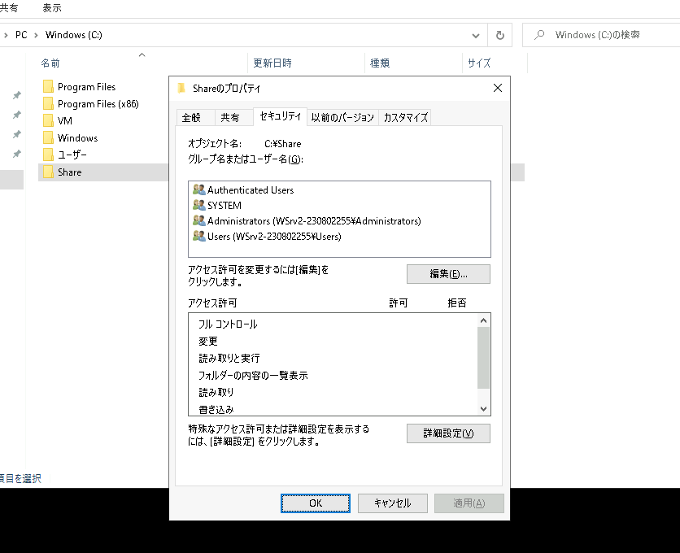</kbd>

    1. "DL_FileServer_ReadOnly"グループに読み取りの許可を与える  
        1. [編集]をクリックする  
        1. [Shareのアクセス許可]ウィンドウが表示されたことを確認する   
        1. [追加]をクリックする  
        1. [ユーザーまたはグループの選択]ウィンドウが表示されたことを確認する  
        1. "選択するオブジェクト名を入力してください" の欄に "DL_FileServer_ReadOnly" と入力する  
        1. [名前の確認]をクリックする  
        1. "DL_FileServer_ReadOnly" の表記に下線がついたことを確認する  
        1. [OK]をクリックする  
        1. [Shareのアクセス許可]ウィンドウで、"DL_FileServer_ReadOnly"が追加されていることを確認する  
        1. [DL_FileServer_ReadOnly]をクリックして選択する  
        1. [Shareのアクセス許可]ウィンドウ下部の "アクセス許可" を参照し、読み取りアクセス許可のみが与えられていることを確認する ("書き込み" の "許可" にチェックがついていないことを確認する)      
        1. [Shareのアクセス許可]ウィンドウで、[OK]をクリックする 
            > 【補足】  
            > [セキュリティの適用エラー - セキュリティじゅほうを適用中にエラーが発生しました]のポップアップが表示された場合は、[続行]をクリックします。
            > この警告ポップアップは複数回表示される場合がありますが、演習の進行に支障はありません。  

            <!--
            UACの兼ね合いにより、このエラーが発生します。  
            作業アカウント(admin)にフルコントロール権限を直接割り当てることで、エラーの発生を回避できます(グループではなくユーザーに設定する必要があります)
            所有者変更でも、エラーを回避できます。  
            -->

        1. [プロパティ]ウィンドウで、"DL_FileServer_ReadOnly"が追加されていることを確認する  

    1. "DL_FileServer_FullAccess"グループにフルコントロールの許可を与える  
        1. [編集]をクリックする  
        1. [Shareのアクセス許可]ウィンドウが表示されたことを確認する   
        1. [追加]をクリックする  
        1. [ユーザーまたはグループの選択]ウィンドウが表示されたことを確認する  
        1. "選択するオブジェクト名を入力してください" の欄に "DL_FileServer_ReadOnly" と入力する  
        1. [名前の確認]をクリックする  
        1. "DL_FileServer_FullAccess" の表記に下線がついたことを確認する  
        1. [OK]をクリックする  
        1. [Shareのアクセス許可]ウィンドウで、"DL_FileServer_FullAccess"が追加されていることを確認する  
        1. [DL_FileServer_FullAccess]をクリックして選択する  
        1. [Shareのアクセス許可]ウィンドウ下部の "アクセス許可" を参照し、"フルコントロール" の "許可" にチェックをつける       
        1. [Shareのアクセス許可]ウィンドウで、[OK]をクリックする 
            > 【補足】  
            > [セキュリティの適用エラー - セキュリティじゅほうを適用中にエラーが発生しました]のポップアップが表示された場合は、[続行]をクリックします。
            > この警告ポップアップは複数回表示される場合がありますが、演習の進行に支障はありません。  

        1. [プロパティ]ウィンドウで、"DL_FileServer_FullAccess"が追加されていることを確認する  


1. EXAMPLE\Tom でログインする  
    1. 操作コンピュータを変更するため、演習環境のトップページに戻る  
    1. Windows Client(WinClient)の管理画面に "AD Tom" で接続する  
        <kbd></kbd> 

1. EXAMPLE\Tomでファイルサーバーにアクセスする  
    1. ファイルエクスプローラを起動し、アドレス欄ファイルサーバーのUNCパス(\\\\10.X.2.105\\Share)を入力してEnterキーを押下する     
    1. EXAMPLE\Tomでファイルサーバーの動作テストを実行する  
        > 【動作テストの観点】  
        > EXAMPLE\TomはShareフォルダでファイルの読み書きができることを確認する  

        - [x] Shareフォルダに任意の名称のテキストファイルを作成できること  
        - [x] 作成したテキストファイルを開き、任意の文言を記入してファイルを保存できること  
        - [x] 保存されたファイルを開き、テキストファイルの中身を閲覧できること  

        <kbd>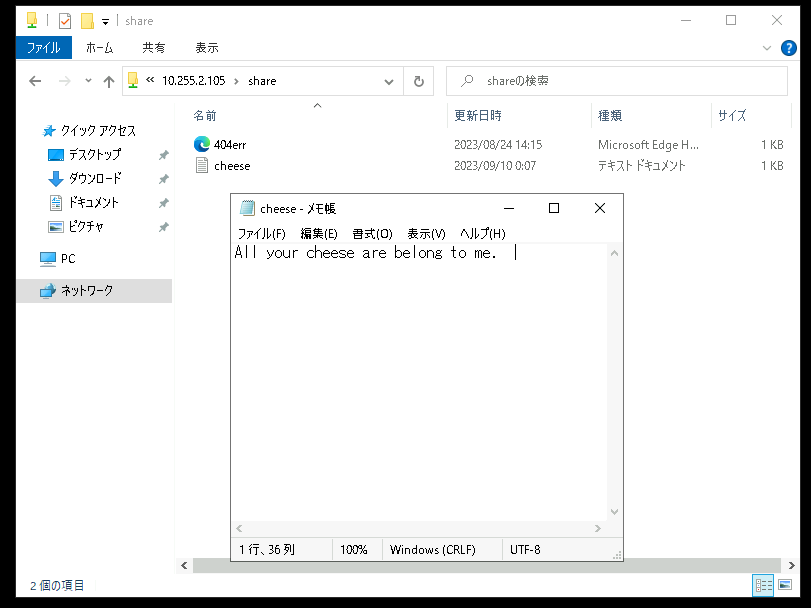</kbd> 

1. EXAMPLE\Jerry でログインする  
    1. 操作コンピュータを変更するため、演習環境のトップページに戻る  
    1. Windows Client(WinClient)の管理画面に "AD Jerry" で接続する  

1. EXAMPLE\Jerryでファイルサーバーにアクセスする   
    1. ファイルエクスプローラを起動し、アドレス欄ファイルサーバーのUNCパス(\\\\10.X.2.105\\Share)を入力してEnterキーを押下する     
    1. EXAMPLE\Tomでファイルサーバーの動作テストを実行する  
        > 【動作テストの観点】  
        > EXAMPLE\JerryはShareフォルダで、ファイルの読み取りはできるが、書き込みはできないことを確認する  

        - [x] Shareフォルダに新しいファイルを作成できないこと  
        - [x] Tomが作成したファイルの中身を閲覧できること  
        - [x] テキストファイルに任意の文言を記入してファイルを上書き保存しようとすると、アクセス権がない旨の警告が表示されること  

        <kbd></kbd> 

                
---  

## Active Directoryドメイン グループのメンバーシップを変更する    

1. Active Directoryユーザー 管理コンソールを起動する 
    1. Active Directory ドメイン コントローラー(WinSrv1)の管理画面に接続する  
    1. [Active Directoryユーザーとコンピューター]を起動する

1. "G_ClientAdmins" グループに、"Jerry" を所属させる  
    1. 左側コンソールツリーの[Active Directory ユーザーとコンピューター]-[example.local]-[Groups]をクリックして選択する  
    1. 画面の右側ペインの[G_ClientAdmins]をクリックして選択する      
    1. [G_ClientAdmins]を右クリックし、コンテキストメニュー内の[プロパティ]をクリックする  
    1. [G_ClientAdminsのプロパティ]ウィンドウが起動したことを確認する  
    1. [G_ClientAdminsのプロパティ]ウィンドウで、[メンバー]タブをクリックして選択する  
    1. [メンバー]タブで、[追加]をクリックする  
    1. [ユーザー、連絡先、コンピュータ、サービスアカウントまたはグループの選択]ウィンドウが表示されたことを確認する
    1. [ユーザー、連絡先、コンピュータ、サービスアカウントまたはグループの選択]ウィンドウで、以下のパラメータを入力する
        | 項目 | パラメータ |
        | :----- | :----- |
        | 選択するオブジェクトを入力してください | Jerry |
    1. [ユーザー、連絡先、コンピュータ、サービスアカウントまたはグループの選択]ウィンドウで、[名前の確認]をクリックする  
    1. "Jerry" の名前の確認に成功し、"Jerry(Jerry@example.local)"表記に下線がついたことを確認する  
    1. [ユーザー、連絡先、コンピュータ、サービスアカウントまたはグループの選択]ウィンドウで、[OK]をクリックする  
    1. [G_ClientAdminsのプロパティ]ウィンドウの"所属するメンバー"の欄に"Jerryのプロパティが追加されたことを確認する  
    1. [G_ClientAdminsのプロパティ]ウィンドウで、[OK]をクリックする  


1. EXAMPLE\Jerry でログインする  
    1. 操作コンピュータを変更するため、演習環境のトップページに戻る  
    1. Windows Client(WinClient)の管理画面に "AD Jerry" で接続する  

1. ユーザーアカウントの情報を確認する      
    1. [スタートメニュー]を右クリックし、コンテキストメニュー内の[Windows PowerShell]をクリックする  

        > 【補足】  
        > "EXAMPLE\Jerry"はWindows Clientの管理者権限を持っていないため、管理者権限のPowerShell([Windows PowerShell(管理者)])は実行できません。  

    1. Windows PowerShellのウィンドウが表示されたことを確認する 。     

    1. Windows PowerShellで以下のコマンドを実行し、Windows Clientからログオフする     
        ＞ ***logoff***   
        
1. EXAMPLE\Jerry で再ログインする  
    1. 演習環境のトップページに戻る  
    1. Windows Client(WinClient)の管理画面に "AD Jerry" で接続する  
  
    1. Windows PowerShellで以下のコマンドを実行し、[ローカルユーザーとグループ]管理コンソールを起動する  
        ＞ ***lusrmgr.msc***    

    1. 左側コンソールツリーの[ローカル ユーザーとグループ]-[ユーザー]をクリックする  
    1. 中央ペインのユーザーの一覧を参照し、[Tom]をクリックして選択する
    1. 右クリック コンテキストメニューの[プロパティ]をクリックする  
    1. [Tomのプロパティ]ウィンドウで、"説明"欄に任意の文言を記入する  
            <kbd>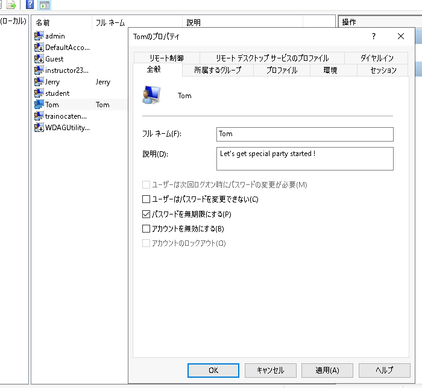</kbd>
    1. [Tomのプロパティ]ウィンドウで[OK]をクリックし、設定変更ができることを確認する      

        > 【補足】  
        > "G_ClientAdmins"のメンバーとなったことで、"EXAMPLE\Jerry"も Windows Client の管理者権限を所有しました。  
        > Active Directory ドメイングループのメンバーシップを操作するだけで、メンバーコンピュータのさまざまなセキュリティ設定を制御できます。    

---  

## 演習完了  
ここまでの手順で、以下の項目を学習できました。
- [x] ワークグループ環境のコンピューターを、ActiveD Directory ドメインに参加させる  
- [x] Active Directory ドメイン ユーザーやドメイン グループを操作する
- [x] Active Directory ドメイン環境のセキュリティ設定を制御する  
- [x] Active Directory ドメイン グループのメンバーシップを操作して、セキュリティ設定を制御する  

