# Active Directory 環境を活用する (グループ ポリシー)

---

## 演習における役割と、環境のパラメータ
- X: ご自身のPod番号
- Active Directory ドメインコントローラー役: WinSrv1(WSrv1-yyMMddX)
- クライアント デスクトップ環境: WinClient(WC1-yyMMddX)

## 注意
- 手順例の画像は<B>pod255</B>に準拠したパラメータのものです
- 手順内の<B>X</B>表記はご自身のpod番号に読み替えてください

---

# 追加のOUを作成してユーザーオブジェクトを移動させる  

1. Active Directoryユーザー 管理コンソールを起動する 
    1. Active Directory ドメイン コントローラー(WinSrv1)の管理画面に接続する  
    1. サーバーマネージャーウィンドウ右上の[ツール]をクリックする  
    1. メニュー内の[Active Directoryユーザーとコンピューター]をクリックし、[Active Directoryユーザーとコンピューター]を起動する  

1. "Employees" OUの下に "WallHole" OUを作成する  
    1. 左側コンソールツリーの[Active Directory ユーザーとコンピューター]-[example.local]-[Employee]をクリックして選択する    
    1. [Employee]を右クリックし、コンテキストメニュー内の[新規作成]-[組織単位(OU)]をクリックする 
    1. [新しいオブジェクト - 組織単位 (OU)]ウィンドウが起動したことを確認する  
    1. [新しいオブジェクト - 組織単位 (OU)]ウィンドウで、以下のパラメータを入力する

        | 項目 | パラメータ |
        | :----- | :----- |
        | 名前 | WallHole |

        - [x] 間違って削除されないようにコンテナーを保護する  

    1. [新しいオブジェクト - 組織単位 (OU)]ウィンドウで、[OK]をクリックする    
    1. 左側コンソールツリーを参照し、[Active Directory ユーザーとコンピューター]-[example.local]-[Employees]-[WallHole]が作成されたことを確認する  

1. "WallHole" OU に "Jerry" を移動させる  
    1. 左側コンソールツリーの[Active Directory ユーザーとコンピューター]-[example.local]-[Employee]をクリックして選択する    
    1. 右側ペインの[Jerry]を選択してクリックする  
    1. [Jerry]を右クリックし、コンテキストメニュー内の[移動]をクリックする  
    1. [移動]ウィンドウで、[example.local]-[Employees]-[WallHole]を選択し、[OK]をクリックする  
    1. [Active Directory ユーザーとコンピューター]-[example.local]-[Employees]-[WallHole]にJerryが移動していることを確認する  
        <kbd>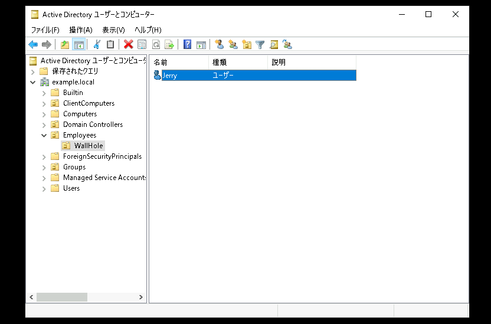</kbd>  

---  

# "ユーザーの構成"のグループポリシーをユーザーオブジェクトに適用する  

1. [グループポリシーの管理]を起動する  
    1. サーバーマネージャーウィンドウ右上の[ツール]をクリックする  
    1. メニュー内の[グループ ポリシーの管理]をクリックし、[グループ ポリシーの管理]を起動する  

1. "Employees" OUにリンクされた新しいグループポリシーオブジェクト "HideClock" を作成する  
    1. [Employees]をクリックして選択する
    1. [Employees]を右クリックし、コンテキストメニューの[このドメインにGPOを作成し、このコンテナーにリンクする]をクリックする  
    1. [新しいGPO]ウィンドウが表示されたことを確認する  
    1. [新しいGPO]ウィンドウで、以下のパラメータを入力する  

        | 項目 | パラメータ |
        | :----- | :----- |
        | 名前 | HideClock |
        | ソーススターター GPO | (なし) |
    1. [新しいGPO]ウィンドウで、[OK]をクリックする    
    1. 右側ペインのグループポリシーオブジェクトの一覧を参照し、[HideClock]が作成されていることを確認する      
    > 【補足】  
    > [グループポリシーオブジェクト(GPO)へのリンクを選択しました。~]のポップアップが表示された場合は、[OK]をクリックする  
        <kbd>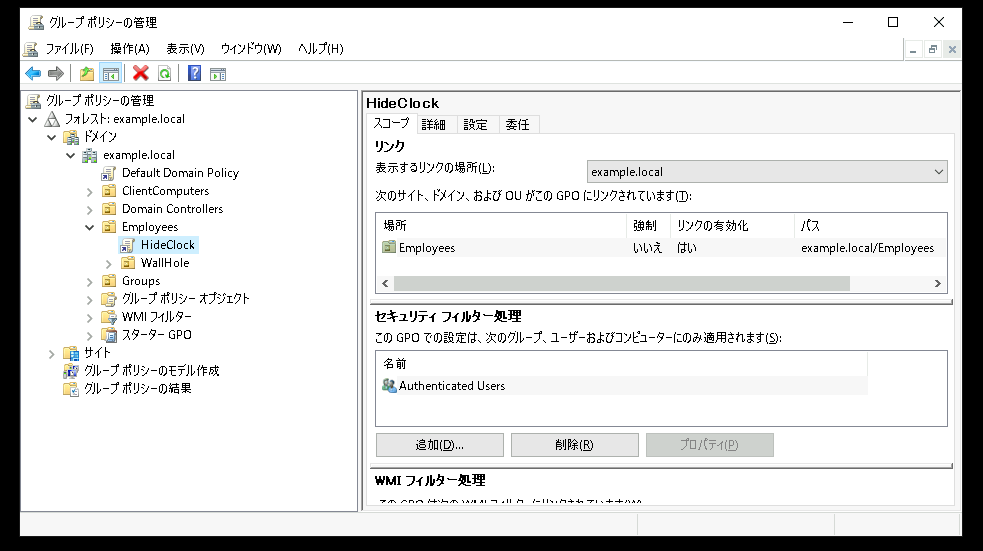</kbd>  

1. [グループポリシー管理エディター]を起動する  
    1. グループポリシーオブジェクトの一覧を参照し、[HideClock]をクリックして選択する  
    1. [HideClock]を右クリックし、コンテキストメニューの[編集]をクリックする  
    1. [グループポリシー管理エディター]が起動したことを確認する  

1. グループポリシーオブジェクト("HideClock")を編集する  
    1. [グループポリシー管理エディター]の左側コンソールツリーの[ユーザーの構成]-[ポリシー]-[管理用テンプレート]-[タスクバーと[スタート]メニュー]をクリックして選択する    
    1. 右側ペインのグループポリシー項目の一覧を参照し、[システム通知領域には時刻を表示しない]をクリックして選択する   
    1. [システム通知領域には時刻を表示しない]を右クリックし、コンテキストメニューの[編集]をクリックする  
    1. [システム通知領域には時刻を表示しない]ウィンドウが表示されたことを確認する  
    1. [システム通知領域には時刻を表示しない]ウィンドウで、以下のパラメータを選択する  

        - [ ] 未構成  
        - [x] 有効  
        - [ ] 無効  

        | 項目 | パラメータ |
        | :----- | :----- |
        | コメント | <空欄> |

        <kbd>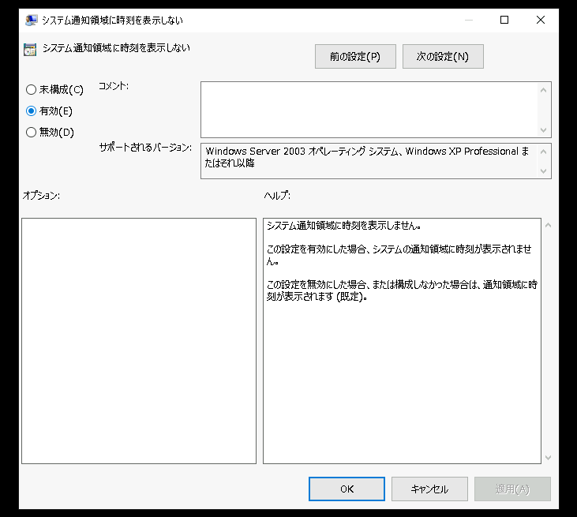</kbd>  

    1. [システム通知領域には時刻を表示しない]ウィンドウで、[OK]をクリックする    
    1. 右側ペインのグループポリシー項目の一覧を参照し、[システム通知領域には時刻を表示しない]の状態が "有効" であることを確認する  
        <kbd>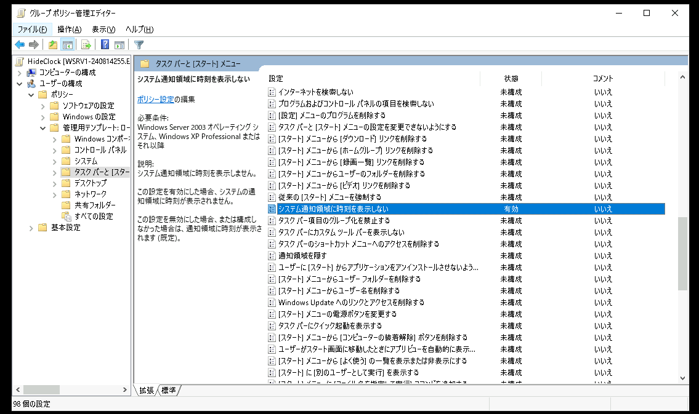</kbd>  
    1. [グループポリシー管理エディター]を終了する  

1. "WallHole" OUにリンクされた新しいグループポリシーオブジェクト "HideTrashBox" を作成する  
    1. [Employees]-[WallHole]をクリックして選択する
    1. [WallHole]を右クリックし、コンテキストメニューの[このドメインにGPOを作成し、このコンテナーにリンクする]をクリックする  
    1. [新しいGPO]ウィンドウが表示されたことを確認する  
    1. [新しいGPO]ウィンドウで、以下のパラメータを入力する  

        | 項目 | パラメータ |
        | :----- | :----- |
        | 名前 | HideTrashBox |
        | ソーススターター GPO | (なし) |

    1. [新しいGPO]ウィンドウで、[OK]をクリックする    
    1. 右側ペインのグループポリシーオブジェクトの一覧を参照し、[HideTrashBox]が作成されていることを確認する      
    > 【補足】  
    > [グループポリシーオブジェクト(GPO)へのリンクを選択しました。~]のポップアップが表示された場合は、[OK]をクリックする  

        <kbd>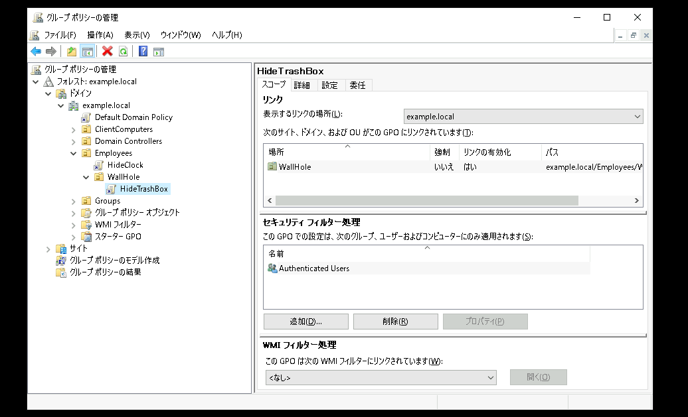</kbd>  

1. [グループポリシー管理エディター]を起動する  
    1. グループポリシーオブジェクトの一覧を参照し、[HideTrashBox]をクリックして選択する  
    1. [HideTrashBox]を右クリックし、コンテキストメニューの[編集]をクリックする  
    1. [グループポリシー管理エディター]が起動したことを確認する  

1. グループポリシーオブジェクト("HideTrashBox")を編集する  
    1. [グループポリシー管理エディター]の左側コンソールツリーの[ユーザーの構成]-[ポリシー]-[管理用テンプレート]-[デスクトップ]をクリックして選択する    
    1. 右側ペインのグループポリシー項目の一覧を参照し、[デスクトップから[ゴミ箱]アイコンを削除する]をクリックして選択する   
    1. [デスクトップから[ゴミ箱]アイコンを削除する]を右クリックし、コンテキストメニューの[編集]をクリックする  
    1. [デスクトップから[ゴミ箱]アイコンを削除する]ウィンドウが表示されたことを確認する  
    1. [デスクトップから[ゴミ箱]アイコンを削除する]ウィンドウで、以下のパラメータを選択する  

        - [ ] 未構成  
        - [x] 有効  
        - [ ] 無効  

        | 項目 | パラメータ |
        | :----- | :----- |
        | コメント | <空欄> |

    1. [デスクトップから[ゴミ箱]アイコンを削除する]ウィンドウで、[OK]をクリックする    
    1. 右側ペインのグループポリシー項目の一覧を参照し、[デスクトップから[ゴミ箱]アイコンを削除する]の状態が "有効" であることを確認する  
        <kbd>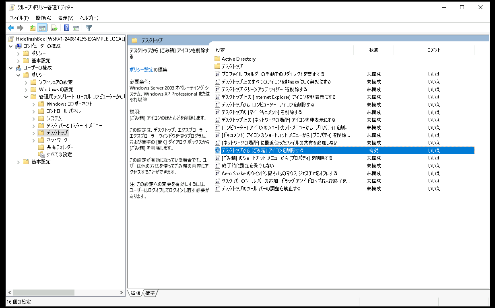</kbd>  
    1. [グループポリシー管理エディター]を終了する  

---   

# "ユーザーの構成"のグループポリシーの動作を確認する    

1. "HideClock"の動作を確認する  
    1. Windows ClientのAD Jerryでログインする
    1. Windows PowerShellで以下のコマンドを実行し、AD JerryをWindows Clientからログオフさせる  
        ***logoff***  
        
    1. Windows ClientのAD Jerryで、再接続(再ログイン)する
    1. 画面右下のタスクバーの時刻が表示されていないことを確認する    
    1. デスクトップのゴミ箱アイコンが削除されていることを確認する  

1. "HideTrashBox"の動作を確認する  
    1. Windows ClientのAD Tomでログインする
    1. Windows PowerShellで以下のコマンドを実行し、AD TomをWindows Clientからログオフさせる  
        ***logoff***  
        
    1. Windows ClientのAD Tomで、再接続(再ログイン)する
    1. 画面右下のタスクバーの時刻が表示されていないことを確認する    
    1. デスクトップのゴミ箱アイコンが表示されている(削除されていない)ことを確認する  
        > 【補足】  
        > [HideTrashBox]のGPOは、[Employees]-[WallHole]のOUに適用されています。  
        > そのため、[WallHole]に配置されているJerryには適用されますが、上の階層である[Employees]OUに所属するTomには適用されません。  

---  

# "コンピューターの構成"のグループポリシーをコンピューターオブジェクトに適用する   

1. "example.local" ドメインの下に、 "ClientComputers" OUを作成する  
1. "Computers"コンテナ内の Windows Client コンピューターオブジェクト(WC1-) を、"ClientComputers" OU に 移動させる  

    > 【補足】  
    > もしもComputers コンテナ内にコンピュータオブジェクトが表示されない場合は、コンソールの画面表示が更新されていない疑いがあります。   
    > コンソール上部の[更新]アイコンをクリックしてください。   

        <kbd>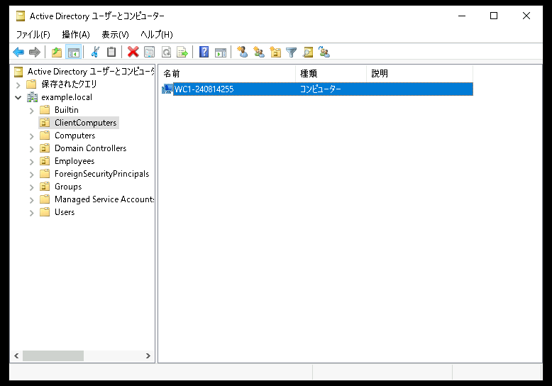</kbd>  

1. [グループポリシーの管理]を起動する  

1. "ClientComputers" OUにリンクされた新しいグループポリシーオブジェクト "DisablePowerControl" を作成する  
    1. [ClientComputers]をクリックして選択する
    1. [ClientComputers]を右クリックし、コンテキストメニューの[このドメインにGPOを作成し、このコンテナーにリンクする]をクリックする  
    1. [新しいGPO]ウィンドウが表示されたことを確認する  
    1. [新しいGPO]ウィンドウで、以下のパラメータを入力する  

        | 項目 | パラメータ |
        | :----- | :----- |
        | 名前 | DisablePowerControl |
        | ソーススターター GPO | (なし) |
        
    1. [新しいGPO]ウィンドウで、[OK]をクリックする    
    1. 右側ペインのグループポリシーオブジェクトの一覧を参照し、[DisablePowerControl]が作成されていることを確認する      
    > 【補足】  
    > [グループポリシーオブジェクト(GPO)へのリンクを選択しました。~]のポップアップが表示された場合は、[OK]をクリックする  

        <kbd>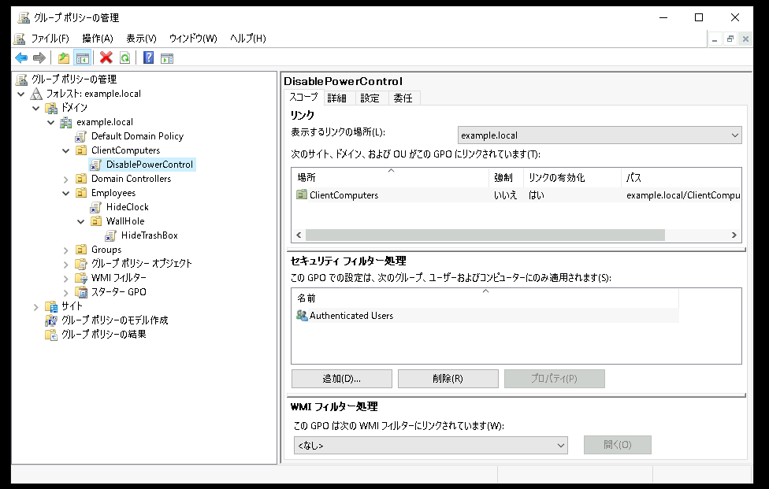</kbd>  

1. [グループポリシー管理エディター]を起動する  
    1. グループポリシーオブジェクトの一覧を参照し、[DisablePowerControl]をクリックして選択する  
    1. [DisablePowerControl]を右クリックし、コンテキストメニューの[編集]をクリックする  
    1. [グループポリシー管理エディター]が起動したことを確認する  

1. グループポリシーオブジェクト("DisablePowerControl")を編集する  
    1. [グループポリシー管理エディター]の左側コンソールツリーの[コンピューターの構成]-[ポリシー]-[管理用テンプレート]-[タスクバーと[スタート]メニュー]をクリックして選択する    
    1. 右側ペインのグループポリシー項目の一覧を参照し、[シャットダウン、再起動、スリープ、休止コマンドを削除してアクセスできないようにする]をクリックして選択する   
    1. [シャットダウン、再起動、スリープ、休止コマンドを削除してアクセスできないようにする]を右クリックし、コンテキストメニューの[編集]をクリックする  
    1. [シャットダウン、再起動、スリープ、休止コマンドを削除してアクセスできないようにする]ウィンドウが表示されたことを確認する  
    1. [シャットダウン、再起動、スリープ、休止コマンドを削除してアクセスできないようにする]ウィンドウで、以下のパラメータを選択する  

        - [ ] 未構成  
        - [x] 有効  
        - [ ] 無効  

        | 項目 | パラメータ |
        | :----- | :----- |
        | コメント | <空欄> |

    1. [シャットダウン、再起動、スリープ、休止コマンドを削除してアクセスできないようにする]ウィンドウで、[OK]をクリックする    
    1. 右側ペインのグループポリシー項目の一覧を参照し、[シャットダウン、再起動、スリープ、休止コマンドを削除してアクセスできないようにする]の状態が "有効" であることを確認する  
        <kbd>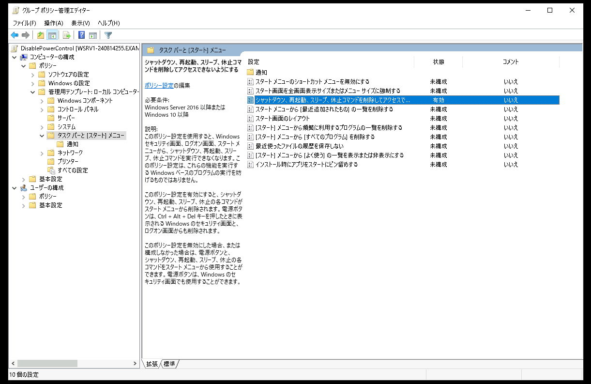</kbd>  
    1. [グループポリシー管理エディター]を終了する  

---   

# "コンピューターの構成"のグループポリシーの動作を確認する    

1. Windows Clientのadminでログインする
1. Windows PowerShellで以下のコマンドを実行し、グループポリシーオブジェクトを即時適用する    
    ***gpupdate /force***  
1. Windowsスタートメニューから再起動操作やシャットダウン操作のメニューが選択できない(ログオフと切断のみが表示される)ことを確認する  
    
    <kbd>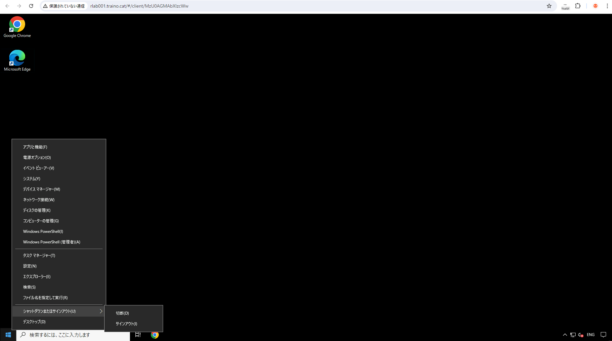</kbd>

---
 
# (オプション)グループポリシーの適用順序を再検証する     
この項目の手順は省略できます。  
興味のある方のみ行ってください。  

1. "WallHole"OUにリンクされているグループポリシーオブジェクト("HideTrashBox")を編集し、[システム通知領域には時刻を表示しない]を"無効"に設定する    
    1. [グループポリシー管理エディター]の左側コンソールツリーの[ユーザーの構成]-[ポリシー]-[管理用テンプレート]-[タスクバーと[スタート]メニュー]をクリックして選択する    
    1. 右側ペインのグループポリシー項目の一覧を参照し、[システム通知領域には時刻を表示しない]をクリックして選択する   
    1. [システム通知領域には時刻を表示しない]を右クリックし、コンテキストメニューの[編集]をクリックする  
    1. [システム通知領域には時刻を表示しない]ウィンドウが表示されたことを確認する  
    1. [システム通知領域には時刻を表示しない]ウィンドウで、以下のパラメータを選択する  

        - [ ] 未構成  
        - [ ] 有効  
        - [x] 無効  

        | 項目 | パラメータ |
        | :----- | :----- |
        | コメント | <空欄> |

    1. [システム通知領域には時刻を表示しない]ウィンドウで、[OK]をクリックする    
    1. 右側ペインのグループポリシー項目の一覧を参照し、[システム通知領域には時刻を表示しない]の状態が "無効" であることを確認する  
    1. [グループポリシー管理エディター]を終了する  

1. グループポリシーの適用順序を確認する  

    1. Windows ClientのAD Jerryでログインする
    1. Windows PowerShellで以下のコマンドを実行し、AD JerryをWindows Clientからログオフさせる  
        ***logoff***  
        
    1. Windows ClientのAD Jerryで、再接続(再ログイン)する
    1. 画面右下のタスクバーの時刻が "表示されていること" を確認する   

        > 【補足】  
        > "HideClock"GPOを"Employees"OUにリンクすることで、"Employees"OU階層下の全ユーザーオブジェクトに対して [システム通知領域には時刻を表示しない]が有効になります。  
        > しかし、"HideClock"の適用処理を完了した後で、"WallHole"OUにリンクされた"HideTrashBox"GPOの処理が実行されるため、先に適用された"HideClock"の適用結果を上書きします。
        > そのため、最終的にJerryに適用されるグループポリシーでは、[システム通知領域には時刻を表示しない]は"無効"状態となるため、Jerryのデスクトップ環境にはシステム時計が表示されています。  

---
 
# (オプション)適用されているグループポリシーを確認する   
この項目の手順は省略できます。  
興味のある方のみ行ってください。  

1. Windows ClientのAD Jerryでログインする  
1. Windows PowerShell(管理者)を起動する(注.管理者として起動すること)  
1. Windows PowerShell(管理者)で以下のコマンドを実行し、C:\reportフォルダを作成する    
    ***mkdir C:\report***  
1. Windows PowerShell(管理者)で以下のコマンドを実行し、適用されているグループポリシーのレポートを出力する    
    ***gpresult /h C:\report\gp.html***  
1. 出力されたレポートファイルを参照し、適用されているグループポリシーを確認する      

    <kbd>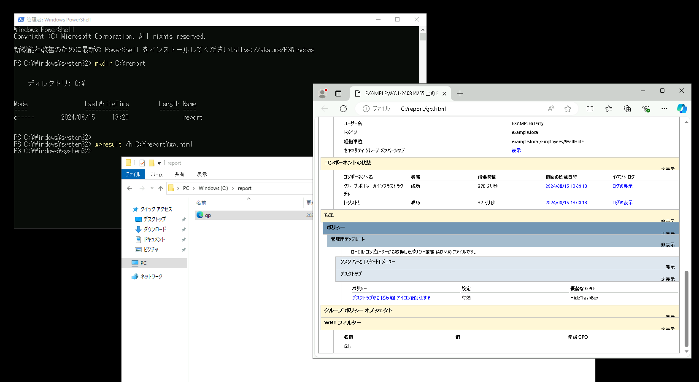</kbd>

---  

# 演習完了  
ここまでの手順で、以下の項目を学習できました。  
- [x] グループポリシーの優先順位を考慮して、OU構造を整理する  
- [x] グループポリシー適用のために、オブジェクトを移動する  
- [x] OUにリンクされたグループポリシーを作成して、編集する  
- [x] グループポリシーオブジェクトとして、コンピューターの管理とユーザーの管理をそれぞれ構成する  
- [x] グループポリシーがクライアントに適用されるタイミングを操作する    

