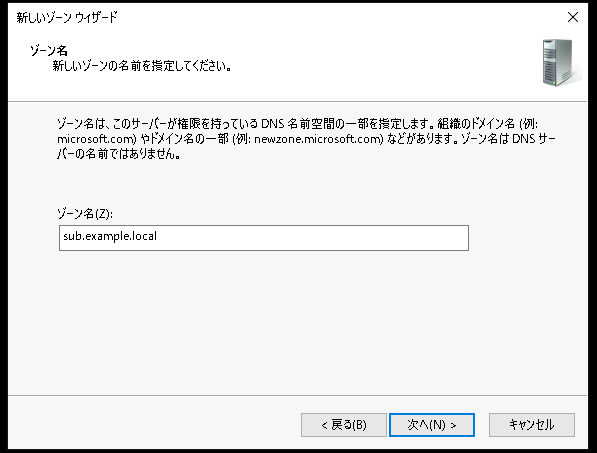

# Windows ServerでDNSサーバーを構築する

---


## 演習における役割と、環境のパラメータ
- X: ご自身のPod番号
- Windows DNSサーバー役: WinSrv1(WSrv1-yyMMddX)
    - example.local ゾーンの権威サーバー(プライマリ)  
- Windows DNSサーバー役: WinSrv2(WSrv2-yyMMddX)
    - example.local ゾーンの権威サーバー(セカンダリ)  
    - sub.example.local ゾーンの権威サーバー

- クライアント デスクトップ環境: WinClient(WC1-yyMMddX)

## 注意
- 手順例の画像は<B>pod255</B>に準拠したパラメータのものです
- 手順内の<B>X</B>表記はご自身のpod番号に読み替えてください

---


# Wndows Server 1のDNSサーバーの状態を確認する
Active Directoryドメインコントローラー構築時に自動的にDNSサーバーの役割も追加されています。  
"example.local" Active Directoryドメインのサービスを提供するために、DNSサーバーには "example.local" DNSゾーンが構成されていることを確認します。  

<!--
    Active DirectoryのセクションでDNSの学習を深堀しすぎるのを防止するために、Active Directory学習後にDNSを学習します。  
-->

1. DNSサーバー管理コンソールを起動する
    1. [スタートメニュー]をクリックする  
    1. スタートメニュー内の[サーバー マネージャー]をクリックし、サーバーマネージャーを起動する  
    1. サーバーマネージャーウィンドウ右上の[ツール]をクリックする  
    1. メニュー内の[DNS]をクリックし、DNSサーバー管理コンソール(DNSマネージャー)を起動する  

        <kbd></kbd> 
        <kbd></kbd> 


1. 左側コンソールツリーの[DNS]-[<サーバー名>]-[前方参照ゾーン]-[example.local]をクリックして選択する  

1. "example.local" ゾーンが作成されていることを確認する  

    > 【補足】  
    > "example.local"ゾーンと"_msdcs.example.local"ゾーンの、2つのゾーンがDNSサーバーに作成されています。    
    > DNSサーバーの演習で操作するのは、"example.local"ゾーンのみです。    
    > "_msdcs.example.local"ゾーンは、Active Directoryのために作成される特殊なDNSゾーンであり、演習では操作しません。  

1. "example.local" ゾーンに登録されているDNSレコードを確認する  

    > 【補足】  
    > "example.local"ゾーンは、Active Directoryドメインサービスのために使用されています。  
    > Active Directoryドメインに参加するコンピュータ(Active Directoryドメインコントローラーやメンバー)の情報が、自動的に登録されています。  

---  

# Windows Server 2にDNSサーバー役割をインストールする  
1. 役割と機能の追加ウィザードを開始する  
    1. [スタートメニュー]をクリックする  
    1. スタートメニュー内の[サーバー マネージャー]をクリックし、サーバーマネージャーを起動する    
    1. サーバーマネージャーのダッシュボード画面内の[役割と機能の追加]をクリックする   
    1. [役割と機能の追加ウィザード]ウィンドウが起動したことを確認する  

1. DNSサーバーの役割を追加する
    1. [役割と機能の追加ウィザード]ウィンドウの[開始する前に]画面で、[次へ]をクリックする  
    1. [インストールの種類]画面で、[次へ]をクリックする  
    1. [サーバーの選択]画面で、[次へ]をクリックする  
    1. [サーバーの役割]画面で、以下のパラメータを選択する  

        - [x] DNSサーバー   
    
        > 【補足1】  
        > "DNSサーバー"のチェックをつけると、[DNSサーバーに必要な機能を追加しますか？]の確認ポップアップが表示されます。  
        > [DNSサーバーに必要な機能を追加しますか？]ウィンドウで、[機能の追加] をクリックします。   

        > 【補足2】  
        > [役割と機能の追加ウィザード - 検証結果]のポップアップが表示され、静的IPアドレスが設定されていない旨を警告されます。  
        > この演習環境においては、この警告は無視して作業を継続できます。  
        > [役割と機能の追加ウィザード - 検証結果]ウィンドウで、[続行]をクリックします。  
           
        <kbd></kbd> 

    1. [サーバーの役割]画面で、上のパラメータを選択したことを確認し、[次へ]をクリックする  
        <kbd></kbd> 
    1. [機能の選択]画面で、[次へ]をクリックする  
    1. [DNSサーバー]画面で、[次へ]をクリックする   
    1. [確認]画面で、[インストール]をクリックする  
    1. [結果]画面で、インストール進捗を示すプログレスバーが右端に到達するまで数分間待機する  

        > 【補足】  
        > このインストール処理には、数分～かかる場合があります。   
        > その間に次の項目の作業を進めてください。  

    1. [結果]画面で、インストールが正常に完了したことを確認し、[閉じる]をクリックする  

---  

## Windows Server 1の "example.local"ゾーンにDNSレコードを登録する    

1. Windows Server 1(WinSrv1)の管理画面に接続する  
1. [DNSマネージャー]を起動する  
1. 左側コンソールツリーの[DNS]-[<サーバー名>]-[前方参照ゾーン]-[example.local]をクリックして選択する  

1. "example.local"ゾーンにAレコードを作成する
    1. [DNS]-[<サーバー名>]-[前方参照ゾーン]-[example.local]を右クリックし、コンテキストメニュー内の[その他の新しいレコード]をクリックする  
        <kbd></kbd> 
    1. [リソース レコードの種類]ウィンドウが表示されたことを確認する  
    1. "リソースレコードの種類:"として、[Host(AまたはAAAA)]をクリックして選択する  
        <kbd></kbd> 
    1. [リソース レコードの種類]ウィンドウで、[レコードの作成]をクリックする  
    1. [新しいリソース レコード]ウィンドウが表示され、[ホスト(A)]タブが表示されていることを確認する  
        <kbd></kbd> 
    1. [新しいリソース レコード]ウィンドウで、以下のパラメータを入力する  

        | 名前 | 完全修飾ドメイン名 | IPアドレス |   
        | :----- | :----- | :----- |  
        | Linux1 | Linux1.example.local | 10.X.1.102 | 

        - [ ] 関連付けられたポインター(PTR)レコードを作成する    
        - [ ] 同じ名前のDNSレコードすべての更新を認証されたユーザーに許可する

        <kbd></kbd> 
    1. [新しいリソース レコード]ウィンドウで、[OK]をクリックする  
    1. [example.local]ゾーンにAレコードが作成されていることを確認する  
        <kbd></kbd>  
    
    1. [リソース レコードの種類]ウィンドウで、"リソースレコードの種類:"として、[Host(AまたはAAAA)]をクリックして選択する  
    1. ここまでと同じ手順を繰り返し、以下の "新規Aレコード 一覧"表 のすべてのAレコードを作成する  

        新規Aレコード 一覧:
        | 名前 | 完全修飾ドメイン名 | IPアドレス |   
        | :----- | :----- | :----- |  
        | Linux1 | Linux1.example.local | 10.X.1.102 |  
        | Linux2 | Linux2.example.local | 10.X.3.106 |   
        | CSR1 | CSR1.example.local | 10.X.2.253 |
        | CSR2 | CSR2.example.local | 10.X.2.254 |     

    1. "新規Aレコード 一覧"表 のすべてのAレコードが作成されたことを確認する  

        <kbd></kbd>  


1. "example.local"ゾーンにCNAMEレコードを作成する
    1. [DNS]-[<サーバー名>]-[前方参照ゾーン]-[example.local]を右クリックし、コンテキストメニュー内の[その他の新しいレコード]をクリックする  
        <kbd></kbd> 
    1. [リソース レコードの種類]ウィンドウが表示されたことを確認する  
    1. "リソースレコードの種類:"として、[Alias(CNAME)]をクリックして選択する  
        <kbd></kbd> 
    1. [リソース レコードの種類]ウィンドウで、[レコードの作成]をクリックする  
    1. [新しいリソース レコード]ウィンドウが表示され、[Alias(CNAME)]タブが表示されていることを確認する  
        <kbd></kbd> 
    1. [新しいリソース レコード]ウィンドウで、以下のパラメータを入力する  

        新規CNAMEレコード 一覧:
        | エイリアス名 | 完全修飾ドメイン名 | ターゲット ホスト用の完全修飾ドメイン名  |
        | :----- | :----- | :----- |
        | AD | AD.example.local | WSrv1-yyMMddX(年月日とPod番号).example.local |

        - [ ] 同じ名前のDNSレコードすべての更新を認証されたユーザーに許可する

        > 【補足】  
        > [参照]をクリックすることで、"ターゲット ホスト用の完全修飾ドメイン名"のパラメータを、DNSゾーン内に作成済みのレコードから検索して入力させることができます    
        > 手順:   
        > ①[新しいリソース レコード]ウィンドウで、[参照]をクリックする  
        > ②[参照]ウィンドウが表示されたことを確認する  
        > ③"レコード:"の項目の[<サーバー名>]をダブルクリックする  
        > ④"レコード:"の項目の[前方参照ゾーン]をダブルクリックする  
        > ⑤"レコード:"の項目の[example.local]をダブルクリックする  
        > ⑥"レコード:"の項目の[WSrv1-yyMMddX(年月日とPod番号).example.local]をダブルクリックする  
        > ⑦[新しいリソース レコード]ウィンドウの"ターゲット ホスト用の完全修飾ドメイン名"のパラメータが入力されていることを確認する  

        <kbd></kbd> 

    1. [新しいリソース レコード]ウィンドウで、[OK]をクリックする  

    1. [example.local]ゾーンにCNAMEレコードが作成されていることを確認する  
        <kbd></kbd>  
    
    1. [リソース レコードの種類]ウィンドウで、"リソースレコードの種類:"として、[Alias(CNAME)]をクリックして選択する  
    1. ここまでと同じ手順を繰り返し、以下の "新規CNAMEレコード 一覧"表 のすべてのCNAMEレコードを作成する  

        新規CNAMEレコード 一覧:
        | エイリアス名 | 完全修飾ドメイン名 | ターゲット ホスト用の完全修飾ドメイン名  |
        | :----- | :----- | :----- |
        | AD | AD.example.local | WSrv1-yyMMddX(年月日とPod番号).example.local |
        | Web1 | Web1.example.local | WSrv2-yyMMddX(年月日とPod番号).example.local |
        | Web2 | Web2.example.local | Linux1.example.local |
        | File1 | File1.example.local | WSrv2-yyMMddX(年月日とPod番号).example.local |
        | File2 | File2.example.local | Linux1.example.local |
        | DNS1 | DNS1.example.local | WSrv1-yyMMddX(年月日とPod番号).example.local |
        | DNS2 | DNS2.example.local | WSrv2-yyMMddX(年月日とPod番号).example.local |    
        | DNS3 | DNS3.example.local | Linux2.example.local |    

    1. "新規CNAMEレコード 一覧"表 のすべてのCNAMEレコードが作成されたことを確認する  

        <kbd></kbd>  


---  

## Windows Server 2でセカンダリDNSサーバーを構成する

1. Windows Server 1で、セカンダリDNSサーバー(Windows Server 2)へのゾーン転送を許可する  
    1. Windows Server 1(WinSrv1)の管理画面に接続する  
    1. [DNSマネージャー]を起動する  
    1. 左側コンソールツリーの[DNS]-[<サーバー名>]-[前方参照ゾーン]-[example.local]をクリックして選択する  
    1. [DNS]-[<サーバー名>]-[前方参照ゾーン]-[example.local]を右クリックし、コンテキストメニュー内の[プロパティ]をクリックする  
    1. [example.localのプロパティ]ウィンドウが表示されたことを確認する  
    1. [example.localのプロパティ]ウィンドウで、[ゾーンの転送]タブをクリックする  
    1. [example.localのプロパティ]ウィンドウの[ゾーンの転送]タブで、以下のパラメータを選択する
        
        配置操作を選択してください:  
        - [x] ゾーン転送を許可するサーバー:  
            - [x] すべてのサーバー    
            - [ ] ネーム サーバー タブの一覧にあるサーバーのみ      
            - [ ] 次のサーバーのみ
        
                <kbd></kbd> 
    1. [example.localのプロパティ]ウィンドウで、[OK]をクリックする  


1. Windows Server 2 を "example.local" のセカンダリDNSサーバーとして構成する  
    1. Windows Server 2(WinSrv2)の管理画面に接続する  
    1. [DNSマネージャー]を起動する 
    1. 左側コンソールツリーの[DNS]-[<サーバー名>]-[前方参照ゾーン]をクリックして選択する 
    1. [DNS]-[<サーバー名>]-[前方参照ゾーン]を右クリックし、コンテキストメニュー内の[新しいゾーン]をクリックする  
        <kbd></kbd> 
    1. [新しいゾーン ウィザード]ウィンドウが表示されたことを確認する  
        <kbd></kbd> 
    1. [新しいゾーン ウィザードの開始]画面で、[次へ]をクリックする  
    1. [ゾーンの種類]画面で、以下のパラメータを選択する  

        作成するゾーンの種類を選択してください:  
        - [ ] プライマリ ゾーン  
        - [x] セカンダリ ゾーン  
        - [ ] スタブ ゾーン  
        - [ ] Active Directoryにゾーンを格納する  
        
            <kbd></kbd> 

    1. [ゾーンの種類]画面で、[次へ]をクリックする  

    1. [ゾーン名]画面で、以下のパラメータを入力する  
        | 項目 | パラメータ |
        | :----- | :----- |
        | ゾーン名 | example.local |

        <kbd></kbd> 
    1. [ゾーン名]画面で、[次へ]をクリックする  

    1. [マスターDNSサーバー]画面で、以下のパラメータを入力する  

        | 項目 | パラメータ |
        | :----- | :----- |
        | マスター サーバー| 10.X.1.104 |

        <kbd></kbd> 
        <kbd></kbd> 
        <kbd></kbd> 

    1. [マスターDNSサーバー]画面で、[次へ]をクリックする  
    1. [新しいゾーン ウィザードの完了]画面で、[完了]をクリックする  
        <kbd></kbd> 


1. セカンダリDNSサーバーでゾーン転送の動作を確認する    
    1. Windows Server 2(WinSrv2)の管理画面に接続する  
    1. [DNSマネージャー]を起動する 
    1. 左側コンソールツリーの[DNS]-[<サーバー名>]-[前方参照ゾーン]-[example.local]をクリックして選択する  
    1. 右側ペインのDNSレコード一覧に、Windows Server 1(プライマリDNSサーバー)と同じ情報が表示されることを確認する       

        > 【補足】
        > もしもゾーン転送処理が完了していない場合は、 [example.local]を右クリックし、コンテキストメニュー内の[マスターから転送]をクリックします。  

        <kbd></kbd>  
        <kbd></kbd>  

    1. セカンダリDNSサーバーでは、ゾーンに新しいレコードを作成できないことを確認する  
        > 【補足】
        > [example.local]を右クリックして表示されるコンテキストメニュー内に、レコードを作成する操作項目が表示されません。
        > セカンダリDNSサーバーは読み取り専用のゾーンデータベースを保有しているためです。  

---  


## Windows Server 1からWindows Server 2に"sub.example.local"ゾーンを委任する  


1. Windows Server 2に、"sub.example.local"ゾーンを構成する  
    1. Windows Server 2(WinSrv2)の管理画面に接続する  
    1. [DNSマネージャー]を起動する  
    1. 左側コンソールツリーの[DNS]-[<サーバー名>]-[前方参照ゾーン]をクリックして選択する    
    1. [DNS]-[<サーバー名>]-[前方参照ゾーン]を右クリックし、コンテキストメニュー内の[新しいゾーン]をクリックする  
        <kbd></kbd>
    1. [新しいゾーン ウィザード]ウィンドウが表示されたことを確認する  
    1. [新しいゾーン ウィザードの開始]画面で、[次へ]をクリックする  
    1. [ゾーンの種類]画面で、以下のパラメータを選択する  
        
        作成するゾーンの種類を選択してください:  
        - [x] プライマリ ゾーン  
        - [ ] セカンダリ ゾーン  
        - [ ] スタブ ゾーン  
        - [ ] Active Directoryにゾーンを格納する  

        <kbd></kbd> 

    1. [ゾーンの種類]画面で、[次へ]をクリックする  

    1. [ゾーン名]画面で、以下のパラメータを入力する  
        
        | 項目 | パラメータ |
        | :----- | :----- |
        | ゾーン名 | sub.example.local |

        <kbd></kbd> 

    1. [ゾーン名]画面で、[次へ]をクリックする  

    1. [ゾーン ファイル]画面で、[次へ]をクリックする  
        <kbd></kbd>

    1. [動的更新]画面で、[次へ]をクリックする  
        <kbd></kbd>

    1. [新しいゾーン ウィザードの完了]画面で、[完了]をクリックする  
        <kbd></kbd> 


1. "sub.example.local"ゾーンにDNSレコードを登録する  
    1. Windows Server 2(WinSrv2)の管理画面に接続する  
    1. [DNSマネージャー]を起動する  
    1. [DNS]-[<サーバー名>]-[前方参照ゾーン]-[sub.example.local]を右クリックし、コンテキストメニュー内の[その他の新しいレコード]をクリックする  
    1. [リソース レコードの種類]ウィンドウが表示されたことを確認する  
    1. "リソースレコードの種類:"として、[Alias(CNAME)]をクリックして選択する  
    1. [リソース レコードの種類]ウィンドウで、[レコードの作成]をクリックする  
    1. [新しいリソース レコード]ウィンドウが表示され、[Alias(CNAME)]タブが表示されていることを確認する  
    1. [新しいリソース レコード]ウィンドウで、以下のパラメータを入力する  

        新規CNAMEレコード 一覧:
        | エイリアス名 | 完全修飾ドメイン名 | ターゲット ホスト用の完全修飾ドメイン名  |
        | :----- | :----- | :----- |
        | Proxy | Proxy.sub.example.local | Linux1.example.local |

        - [ ] 同じ名前のDNSレコードすべての更新を認証されたユーザーに許可する

    1. [新しいリソース レコード]ウィンドウで、[OK]をクリックする  

    1. [sub.example.local]ゾーンにCNAMEレコードが作成されていることを確認する  
        <kbd></kbd>


1. Windows Server 1で、サブドメインの委任を作成する    
    1. Windows Server 1(WinSrv1)の管理画面に接続する  
    1. [DNSマネージャー]を起動する  
    1. 左側コンソールツリーの[DNS]-[<サーバー名>]-[前方参照ゾーン]-[example.local]をクリックして選択する  
    1. [DNS]-[<サーバー名>]-[前方参照ゾーン]-[example.local]を右クリックし、コンテキストメニュー内の[新しい委任]をクリックする  
        <kbd></kbd>  
    1. [新しい委任]ウィンドウが表示されたことを確認する  
        <kbd></kbd>  
    1. [新しい委任ウィザードの開始]画面で、[次へ]をクリックする  
    1. [委任されたドメイン名]画面で、以下のパラメータを入力する  

        | 項目 | パラメータ |
        | :----- | :----- |
        | 委任されたドメイン | sub |
        | 完全修飾ドメイン名(FQDN)| sub.example.local |

        <kbd></kbd>  

    1. [委任されたドメイン名]画面で、[次へ]をクリックする  
    1. [ネームサーバー]画面で、[追加]をクリックする  
        <kbd></kbd>  

    1. [新規ネーム サーバー レコード]ウィンドウが表示されたことを確認する  
        <kbd></kbd>  

    1. [新規ネーム サーバー レコード]ウィンドウの "サーバーの完全修飾ドメイン名(FQDN)" の項目で、"DNS2.example.local (Windows Server 2)"と入力する  

        | 項目 | パラメータ |
        | :----- | :----- |
        | サーバーの完全修飾ドメイン名(FQDN) | DNS2.example.local |

        <kbd></kbd>  

    1. [解決]をクリックし、DNSサーバーの検証が "OK" になることを確認する  
        <kbd></kbd>  

    1. [新規ネーム サーバー レコード]ウィンドウで、[OK]をクリックする  

    1. [ネームサーバー]画面で、[次へ]をクリックする  
        <kbd></kbd>  

    1. [新しい委任ウィザードの完了]画面で、[完了]をクリックする  
        <kbd></kbd>  

    1. DNS管理コンソールの左側コンソールツリーの[DNS]-[<サーバー名>]-[前方参照ゾーン]-[example.local]-[sub]をクリックして選択する  
    1. "sub.example.local" ゾーンのネームサーバー(NSレコード)として、"DNS2.example.local (Windows Server 2)"が登録されていることを確認する  
        <kbd></kbd>  


--- 

## 名前解決の動作を確認する  


1. Windows Clientに"admin"で接続する  
    1. Windows Client(WinClient)の管理画面に "admin" で接続する     
    1. [スタートメニュー]を右クリックし、コンテキストメニュー内の[Windows PowerShell(管理者)]をクリックする  
    1. [ユーザー アカウント制御]のポップアップで[はい]をクリックする  
    1. Windows PowerShellのウィンドウが表示されたことを確認する  

1. nslookupツールを起動する  
    1. PowerShellで以下のコマンドを実行し、nslookupツールを起動する  
        ＞ ***nslookup***  
    
        ```
        PS C:\Windows\system32> nslookup
        既定のサーバー:  UnKnown
        Address:  10.255.1.104

        >
        >
        ```

        <kbd></kbd>  

1. PowerShellで実行中のnslookupツールで以下のコマンドを実行し、DNS名前解決要求送信時に自動的に付加するDNSサフィックスを明示的に指定する   
    ＞ ***set domain=example.local***  

    > 【補足1】
    > DNSサフィックスをset domainオプションで指定すると、nslookupツールに入力したコマンドの末尾に自動的にドメイン名が付加されます。  
    > 例えば、以下の操作をした場合は、"Host.example.local"の名前解決をDNSサーバーに要求します。  
    > 例:
    > ＞ set domain=example.local
    > ＞ Host
    > ＞ (DNSサーバーに"Host.example.local"のDNSレコードを問い合わせた結果が表示される)

    > 【補足2】
    > Active Direcotryドメイン環境では、Active Direcotryドメイン名と同じDNSドメイン名をDNSサフィックスとし付加します。  
    > そのため、このオプションを指定するコマンドを省略しても、nslookupの動作は変わりません。  
    > この手順では、DNSサーバーの動作確認の手続きを学習するために、このコマンドでDNSサフィックスを明示的に指定しています。  


1. PowerShellで実行中のnslookupツールで以下のコマンドを実行し、DNS名前解決要求を送信する宛先DNSサーバーを明示的に指定する    
    ＞ ***server 10.X.1.104***  

    > 【補足】
    > serverオプションにより、nslookupツールのDNS名前解決要求の送信先DNSサーバーを指定できます。  
    > Windows Server 1を優先DNSサーバーとして使用するようにOSで設定されていますが、DNSサーバーの動作確認の手続きを学習するために、このコマンドで問い合わせ先のDNSサーバーを明示的に指定しています。 

    <kbd></kbd>  


1. PowerShellで実行中のnslookupツールで以下のホスト名を入力し、DNSサーバーの名前解決の動作を確認する        

    - Linux1 
    - Linux2  
    - CSR1  
    - CSR2 
    - AD  
    - Web1   
    - Web2  
    - File1  
    - File2  
    - DNS1  
    - DNS2  
    - DNS3  
    - Proxy.sub

    | ホスト名 | 期待する結果(名前解決されたIPアドレス)  |
    | :----- |:----- |
    | Linux1 | 10.X.1.102 |  
    | Linux2 | 10.X.3.106 |   
    | CSR1 | 10.X.2.253 |
    | CSR2 | 10.X.2.254 |     
    | AD |  10.X.1.104 |
    | Web1 | 10.X.2.105 |
    | Web2 | 10.X.1.102 |
    | File1 | 10.X.2.105 |
    | File2 | 10.X.1.102 |
    | DNS1 | 10.X.1.104 |
    | DNS2 | 10.X.2.105 |    
    | DNS3 | 10.X.3.106 |    
    | Proxy.sub | 10.X.1.102 |    


    > 【動作テストの観点】  
    > ホスト名について問い合わせることで、正しいIPアドレスに名前解決できることを確認する  

    <kbd></kbd>  


    ```
    >
    > Linux1
    サーバー:  [10.255.1.104]
    Address:  10.255.1.104

    名前:    Linux1.example.local
    Address:  10.255.1.102

    > Linux2
    サーバー:  [10.255.1.104]
    Address:  10.255.1.104

    名前:    Linux2.example.local
    Address:  10.255.3.106

    > CSR1
    サーバー:  [10.255.1.104]
    Address:  10.255.1.104

    名前:    CSR1.example.local
    Address:  10.255.2.253

    > CSR2
    サーバー:  [10.255.1.104]
    Address:  10.255.1.104

    名前:    CSR2.example.local
    Address:  10.255.2.254

    > AD
    サーバー:  [10.255.1.104]
    Address:  10.255.1.104

    名前:    wsrv1-230802255.example.local
    Addresses:  10.255.1.104
            10.255.0.104
    Aliases:  AD.example.local

    > Web1
    サーバー:  [10.255.1.104]
    Address:  10.255.1.104

    名前:    WSrv2-230802255.example.local
    Address:  10.255.2.105
    Aliases:  Web1.example.local

    > Web2
    サーバー:  [10.255.1.104]
    Address:  10.255.1.104

    名前:    Linux1.example.local
    Address:  10.255.1.102
    Aliases:  Web2.example.local

    > File1
    サーバー:  [10.255.1.104]
    Address:  10.255.1.104

    名前:    WSrv2-230802255.example.local
    Address:  10.255.2.105
    Aliases:  File1.example.local

    > File2
    サーバー:  [10.255.1.104]
    Address:  10.255.1.104

    名前:    Linux1.example.local
    Address:  10.255.1.102
    Aliases:  File2.example.local

    > DNS1
    サーバー:  [10.255.1.104]
    Address:  10.255.1.104

    名前:    wsrv1-230802255.example.local
    Addresses:  10.255.1.104
            10.255.0.104
    Aliases:  DNS1.example.local

    > DNS2
    サーバー:  [10.255.1.104]
    Address:  10.255.1.104

    名前:    WSrv2-230802255.example.local
    Address:  10.255.2.105
    Aliases:  DNS2.example.local

    > DNS3
    サーバー:  [10.255.1.104]
    Address:  10.255.1.104

    名前:    Linux2.example.local
    Address:  10.255.3.106
    Aliases:  DNS3.example.local

    > Proxy.sub
    サーバー:  [10.255.1.104]
    Address:  10.255.1.104

    権限のない回答:
    名前:    Linux1.example.local
    Address:  10.255.1.102
    Aliases:  Proxy.sub.example.local

    >
    ``` 
    
    1. PowerShellで実行中のnslookupツールで以下のコマンドを実行し、nslookupツールを終了する      
    ＞ ***exit***  

    ```
    >
    >
    > exit
    PS C:\Windows\system32>
    PS C:\Windows\system32>
    ```

--- 

## (オプション)セカンダリDNSサーバーの名前解決の動作を確認する  
この項の手順は省略しても後続の演習に支障ありません。  
興味のある方だけ実施してください。  

1. Windows Clientに"admin"で接続する  
    1. Windows Client(WinClient)の管理画面に "admin" で接続する     
    1. [スタートメニュー]を右クリックし、コンテキストメニュー内の[Windows PowerShell(管理者)]をクリックする  
    1. [ユーザー アカウント制御]のポップアップで[はい]をクリックする  
    1. Windows PowerShellのウィンドウが表示されたことを確認する  

1. nslookupツールを起動する  
    1. PowerShellで以下のコマンドを実行し、nslookupツールを起動する  
        ＞ ***nslookup***  
    
        ```
        PS C:\Windows\system32> nslookup
        既定のサーバー:  UnKnown
        Address:  10.255.1.104

        >
        >
        ```
1. PowerShellで実行中のnslookupツールで以下のコマンドを実行し、DNS名前解決要求送信時に自動的に付加するDNSサフィックスを明示的に指定する   
    ＞ ***set domain=example.local***  


1. PowerShellで実行中のnslookupツールで以下のコマンドを実行し、セカンダリDNSサーバーを宛先DNSサーバーとして指定する      
    ＞ ***server=10.X.2.105***  

1. PowerShellで実行中のnslookupツールで以下のホスト名を入力し、DNSサーバーの名前解決の動作を確認する        

    > 【補足】
    > 以下のすべてのホスト名を入力して動作確認する必要はありません。
    > プライマリDNSサーバー(10.X.1.104)と同じゾーン情報に基づいて、セカンダリDNSサーバー(10.X.2.105)でも名前解決ができることを確認してください。  

    - Linux1 
    - Linux2  
    - CSR1  
    - CSR2 
    - AD  
    - Web1   
    - Web2  
    - File1  
    - File2  
    - DNS1  
    - DNS2  
    - DNS3  

    | ホスト名 | 期待する結果(名前解決されたIPアドレス)  |
    | :----- |:----- |
    | Linux1 | 10.X.1.102 |  
    | Linux2 | 10.X.3.106 |   
    | CSR1 | 10.X.2.253 |
    | CSR2 | 10.X.2.254 |     
    | AD |  10.X.1.104 |
    | Web1 | 10.X.2.105 |
    | Web2 | 10.X.1.102 |
    | File1 | 10.X.2.105 |
    | File2 | 10.X.1.102 |
    | DNS1 | 10.X.1.104 |
    | DNS2 | 10.X.2.105 |    

    > 【動作テストの観点】  
    > ホスト名について問い合わせることで、正しいIPアドレスに名前解決できることを確認する  

1. PowerShellで実行中のnslookupツールで以下のコマンドを実行し、nslookupツールを終了する      
    ＞ ***exit***  


--- 

## (オプション)逆引き参照ゾーンを構成する    
この項の手順は省略しても後続の演習に支障ありません。  
興味のある方だけ実施してください。  

1. Windows Server 1に、逆引き参照ゾーンを構成する  
    1. Windows Server 1(WinSrv1)の管理画面に接続する  
    1. [DNSマネージャー]を起動する  
    1. 左側コンソールツリーの[DNS]-[<サーバー名>]-[逆引き参照ゾーン]をクリックして選択する    
    1. [DNS]-[<サーバー名>]-[逆引き参照ゾーン]を右クリックし、コンテキストメニュー内の[新しいゾーン]をクリックする
        <kbd></kbd> 

    1. [新しいゾーン ウィザード]ウィンドウが表示されたことを確認する  

    1. [新しいゾーン ウィザードの開始]画面で、[次へ]をクリックする  

    1. [ゾーンの種類]画面で、以下のパラメータを選択する  

        作成するゾーンの種類を選択してください:  
        - [x] プライマリ ゾーン  
        - [ ] セカンダリ ゾーン  
        - [ ] スタブ ゾーン  
        - [x] Active Directoryにゾーンを格納する  

        <kbd></kbd> 

    1. [ゾーンの種類]画面で、[次へ]をクリックする  

    1. [Active Directoryゾーン レプリケーション スコープ]画面で、以下のパラメータを選択する  
        ゾーン データのレプリケート方法を選択してください:  
        - [ ] このフォレストのドメインコントローラー上で実行しているすべてのDNSサーバー  
        - [x] このドメインのドメインコントローラー上で実行しているすべてのDNSサーバー  
        - [ ] このドメインのすべてのドメインコントローラー   
        - [ ] このディレクトリパーティションのスコープで指定されたすべてのドメインコントローラー    

        <kbd></kbd>  

    1. [Active Directoryゾーン レプリケーション スコープ]画面で、[次へ]をクリックする  

    1. [逆引き参照ゾーン名]画面で、以下のパラメータを選択する  

        - [x] IPv4 逆引き参照ゾーン    
        - [ ] IPv6 逆引き参照ゾーン  

        <kbd></kbd>  

    1. [逆引き参照ゾーン名]画面で、[次へ]をクリックする  

    1. [逆引き参照ゾーン名]画面で、以下のパラメータを入力する  

        - [x] ネットワークID      
            | 10.X.1 |
            | :----- |

        - [ ] 逆引き参照ゾーンの名前  

        <kbd></kbd>  

    1. [逆引き参照ゾーン名]画面で、[次へ]をクリックする  


    1. [動的更新]画面で、以下のパラメータを入力する  

        - [ ] セキュリティで保護された動的更新のみを許可する  
        - [ ] 非セキュリティ保護およびセキュリティ保護の両方による動的更新を許可する    
        - [x] 動的更新を許可しない  
        
        <kbd></kbd>
    
    1. [動的更新]画面で、[次へ]をクリックする  

    1. [新しいゾーン ウィザードの完了]画面で、[完了]をクリックする  
        <kbd></kbd>


1. 逆引き参照ゾーンにDNSレコードを登録する    
    1. 左側コンソールツリーの[DNS]-[<サーバー名>]-[逆引き参照ゾーン]-[1.X.10.in-addr.arpa]をクリックして選択する    
    1. [DNS]-[<サーバー名>]-[逆引き参照ゾーン]-[1.X.10.in-addr.arpa]を右クリックし、コンテキストメニュー内の[その他の新しいレコード]をクリックする  
        <kbd></kbd>
    1. [リソース レコードの種類]ウィンドウが表示されたことを確認する  
    1. "リソースレコードの種類:"として、[Pointer(PTR)]をクリックして選択する  
        <kbd></kbd>
    1. [リソース レコードの種類]ウィンドウで、[レコードの作成]をクリックする  
    1. [新しいリソース レコード]ウィンドウが表示され、[Pointer(PTR)]タブが表示されていることを確認する  
    1. [新しいリソース レコード]ウィンドウで、以下のパラメータを入力する  

        
        | ホストIPアドレス | 完全修飾ドメイン名 | ホスト名  |
        | :----- | :----- | :----- |
        | 10.X.1.104 | 104.1.X.10.in-addr.arpa | WindowsDNS.example.local |

        - [ ] 同じ名前のDNSレコードすべての更新を認証されたユーザーに許可する  

        <kbd></kbd>


    1. [新しいリソース レコード]ウィンドウで、[OK]をクリックする  

    1. [1.X.10.in-addr.arpa]ゾーンにPTRレコードが作成されていることを確認する  
        <kbd></kbd>


1. Windows Clientで逆引き参照ゾーンの動作を確認する    
    1. Windows Client(WinClient)の管理画面に "admin" で接続する     
    1. [スタートメニュー]を右クリックし、コンテキストメニュー内の[Windows PowerShell(管理者)]をクリックする  
    1. [ユーザー アカウント制御]のポップアップで[はい]をクリックする  
    1. Windows PowerShellのウィンドウが表示されたことを確認する  


    1. PowerShellで以下のコマンドを実行し、nslookupツールを起動する  
        ＞ ***nslookup***  

        > 【補足】
        > 逆引き参照ゾーンを構成したことにより、ユーザーインターフェイスの一部が改善されることがあります。  
        > nslookupツールの開始時には、OSに設定された既定の問い合わせ先DNSサーバーのIPアドレスが "Address:" として表示されますが、"既定のサーバー" は "Unknown" と表示されます。
        > 逆引き名前解決ができる環境では、"既定のサーバー"に逆引き解決したレコード情報が表示されます。  
    

        nslookupツール起動時: 
        ```
        PS C:\Windows\system32> nslookup
        既定のサーバー:  WindowsDNS.example.local
        Address:  10.255.1.104

        >
        >
        ```

        (参考) 逆引き参照ゾーン構成前のnslookupツール起動時の表記: 
        ```
        PS C:\Windows\system32> nslookup
        既定のサーバー:  UnKnown
        Address:  10.255.1.104

        >
        >
        ```


    1. PowerShellで実行中のnslookupツールで以下のコマンドを実行し、逆引き参照ゾーンでIPアドレスを検索できることを確認する         
        ＞ ***server=10.X.1.104***  
        ＞ ***10.X.1.104***  
        ＞ ***exit***  


        ```
        PS C:\Windows\system32> nslookup
        既定のサーバー:  WindowsDNS.example.local
        Address:  10.255.1.104

        >
        > server 10.255.1.104
        既定のサーバー:  WindowsDNS.example.local
        Address:  10.255.1.104

        >
        > 10.255.1.104
        サーバー:  WindowsDNS.example.local
        Address:  10.255.1.104

        名前:    WindowsDNS.example.local
        Address:  10.255.1.104

        >
        > exit
        PS C:\Windows\system32>
        PS C:\Windows\system32>

        ```

        <kbd></kbd>

---


## (オプション)DNSサーバーのActive Directory統合ゾーンのデータベースを参照する  
この項の手順は省略しても後続の演習に支障ありません。  
興味のある方だけ実施してください。  

1. Active Directory データベース管理コンソールを起動する
    1. [スタートメニュー]をクリックする  
    1. スタートメニュー内の[サーバー マネージャー]をクリックし、サーバーマネージャーを起動する  
    1. サーバーマネージャーウィンドウ右上の[ツール]をクリックする  
    1. メニュー内の[ADSIエディター]をクリックし、Active Directory データベース管理コンソール(ADSIエディター)を起動する  
        <kbd></kbd>

1. Active Directory データベースに接続する
    1. 左側コンソールツリーの[ADSI エディター]をクリックして選択する  
    1. [ADSI エディター]を右クリックし、コンテキストメニュー内の[接続]をクリックする  
        <kbd></kbd>  
    1. [接続の設定]ウィンドウが表示されたことを確認する   
    1. [接続の設定]ウィンドウで、以下のパラメータを入力する


        | 項目 |  パラメータ  |
        | :----- | :----- |
        | 名前 | DNS |
        | パス | <変更しない> |

        接続ポイント:
        - [x] 識別名または名前付けコンテキストを選択または入力する   
            | DC=DomainDNSZones, DC=example, DC=local |
            | :----- |
        - [ ] 既知の名前付けコンテキストを選択する  
            | 既定の名前付けコンテキスト |
            | :----- |  
        
        コンピューター:
        - [ ] ドメインまたはサーバーを選択または入力する   
        - [x] 既定 (ログインしたドメインまたはサーバー)  

        - [ ] SSLベースの暗号化を使用する  
    
        <kbd></kbd>  

    1. [ADSI エディター]の左側コンソールツリーに、[DNS]の項目が追加されたことを確認する  
        <kbd></kbd>  
        
1. Active Directory データベースの中を調査する  
    1. 左側コンソールツリーの[ADSI エディター]-[DNS]-[DC=DomainDNSZones, DC=example, DC=local]-[CN=MicrosoftDNS]-[DC=example.local]をクリックして選択する  
        <kbd></kbd>  
    1. 右側ペインのLDAPオブジェクト一覧を参照し、DNSサーバーの"example.local"ゾーンに登録したDNSレコードが保存されていることを確認する  


## (オプション)Windows DNSサーバーのゾーンファイルを参照する  
この項の手順は省略しても後続の演習に支障ありません。  
興味のある方だけ実施してください。  


1. dnsフォルダを参照する 
    1. Windows Server 2(WinSrv2)の管理画面に接続する  
    1. ファイルエクスプローラーを起動する  
    1. "C:\\Windows\\System32\\dns" フォルダにアクセスする  
        <kbd></kbd>

1. ゾーンファイルを参照する  
    1. [sub.example.local] ファイルをクリックして選択する  
    1. [sub.example.local.dns] を右クリックし、コンテキストメニュー内の[プログラムから開く]をクリックする
        <kbd></kbd>
    1. [メモ帳]を選択し、[OK]をクリックする    
        <kbd></kbd>   
    1. "sub.example.local" DNSゾーンに登録されているDNSレコードのテキストデータが保存されていることを確認する       
        <kbd></kbd> 


---  

## 演習完了  
ここまでの手順で、以下の項目を学習できました。  
- [x] Windows DNSサーバーにDNSレコードを登録する   
- [x] セカンダリDNSサーバーを構成して、ゾーン情報を転送する  
- [x] サブドメインを作成し、委任を構成する  
- [x] nslookupツールで名前解決の動作を確認する  
- [x] (オプション)逆引き参照ゾーンを構成する  
