# Linux ServerでDNSサーバーを構築する

---


## 演習における役割と、環境のパラメータ
- X: ご自身のPod番号  
- Linux DNSサーバー役: Linux1  
    - example.comゾーンの権威サーバー   

- Windows DNSサーバー役: WinSrv1(WSrv1-yyMMddX)  
    - "example.com"ドメインの問い合わせをLinux1にフォワーディングする  

- クライアント デスクトップ環境: WinClient(WC1-yyMMddX)
    - WinSrv1を優先DNSサーバーとして使用する  


## 注意
- 手順例の画像は<B>pod255</B>に準拠したパラメータのものです
- 手順内の<B>X</B>表記はご自身のpod番号に読み替えてください

---


## Linux Server 1(Linux1)にBINDをインストールする

1. Linux1の管理画面に接続する  
    <kbd>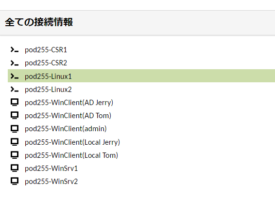</kbd>


1. BINDをインストールする  
    ＞ ***sudo yum -y install bind bind-utils***  

    <details>
    <summary>[参考]yum実行時のログ出力例 (クリックで表示):</summary>

        ```
        [admin@linux1 ~]$ sudo yum -y install bind bind-utils
        Loaded plugins: langpacks
        Resolving Dependencies
        --> Running transaction check
        ---> Package bind.x86_64 32:9.11.4-26.P2.el7_9.14 will be installed
        --> Processing Dependency: bind-libs-lite(x86-64) = 32:9.11.4-26.P2.el7_9.14 for package: 32:bind-9.11.4-26.P2.el7_9.14.x86_64
        --> Processing Dependency: bind-libs(x86-64) = 32:9.11.4-26.P2.el7_9.14 for package: 32:bind-9.11.4-26.P2.el7_9.14.x86_64
        --> Processing Dependency: python-ply for package: 32:bind-9.11.4-26.P2.el7_9.14.x86_64
        ---> Package bind-utils.x86_64 32:9.11.4-26.P2.el7_9.13 will be updated
        ---> Package bind-utils.x86_64 32:9.11.4-26.P2.el7_9.14 will be an update
        --> Running transaction check
        ---> Package bind-libs.x86_64 32:9.11.4-26.P2.el7_9.13 will be updated
        ---> Package bind-libs.x86_64 32:9.11.4-26.P2.el7_9.14 will be an update
        --> Processing Dependency: bind-license = 32:9.11.4-26.P2.el7_9.14 for package: 32:bind-libs-9.11.4-26.P2.el7_9.14.x86_64
        ---> Package bind-libs-lite.x86_64 32:9.11.4-26.P2.el7_9.13 will be updated
        ---> Package bind-libs-lite.x86_64 32:9.11.4-26.P2.el7_9.14 will be an update
        ---> Package python-ply.noarch 0:3.4-11.el7 will be installed
        --> Running transaction check
        ---> Package bind-license.noarch 32:9.11.4-26.P2.el7_9.13 will be updated
        ---> Package bind-license.noarch 32:9.11.4-26.P2.el7_9.14 will be an update
        --> Finished Dependency Resolution

        Dependencies Resolved

        ========================================================================================================================================================================================
        Package                                    Arch                               Version                                              Repository                                     Size
        ========================================================================================================================================================================================
        Installing:
        bind                                       x86_64                             32:9.11.4-26.P2.el7_9.14                             updates-openlogic                             2.3 M
        Updating:
        bind-utils                                 x86_64                             32:9.11.4-26.P2.el7_9.14                             updates-openlogic                             262 k
        Installing for dependencies:
        python-ply                                 noarch                             3.4-11.el7                                           base-openlogic                                123 k
        Updating for dependencies:
        bind-libs                                  x86_64                             32:9.11.4-26.P2.el7_9.14                             updates-openlogic                             158 k
        bind-libs-lite                             x86_64                             32:9.11.4-26.P2.el7_9.14                             updates-openlogic                             1.1 M
        bind-license                               noarch                             32:9.11.4-26.P2.el7_9.14                             updates-openlogic                              92 k

        Transaction Summary
        ========================================================================================================================================================================================
        Install  1 Package (+1 Dependent package)
        Upgrade  1 Package (+3 Dependent packages)

        Total download size: 4.1 M
        Downloading packages:
        Delta RPMs disabled because /usr/bin/applydeltarpm not installed.
        (1/6): bind-9.11.4-26.P2.el7_9.14.x86_64.rpm                                                                                                                     | 2.3 MB  00:00:00     
        (2/6): bind-libs-9.11.4-26.P2.el7_9.14.x86_64.rpm                                                                                                                | 158 kB  00:00:00     
        (3/6): bind-license-9.11.4-26.P2.el7_9.14.noarch.rpm                                                                                                             |  92 kB  00:00:00     
        (4/6): bind-utils-9.11.4-26.P2.el7_9.14.x86_64.rpm                                                                                                               | 262 kB  00:00:00     
        (5/6): bind-libs-lite-9.11.4-26.P2.el7_9.14.x86_64.rpm                                                                                                           | 1.1 MB  00:00:00     
        (6/6): python-ply-3.4-11.el7.noarch.rpm                                                                                                                          | 123 kB  00:00:00     
        ----------------------------------------------------------------------------------------------------------------------------------------------------------------------------------------
        Total                                                                                                                                                   9.1 MB/s | 4.1 MB  00:00:00     
        Running transaction check
        Running transaction test
        Transaction test succeeded
        Running transaction
        Updating   : 32:bind-license-9.11.4-26.P2.el7_9.14.noarch                                                                                                                        1/10 
        Updating   : 32:bind-libs-lite-9.11.4-26.P2.el7_9.14.x86_64                                                                                                                      2/10 
        Updating   : 32:bind-libs-9.11.4-26.P2.el7_9.14.x86_64                                                                                                                           3/10 
        Installing : python-ply-3.4-11.el7.noarch                                                                                                                                        4/10 
        Installing : 32:bind-9.11.4-26.P2.el7_9.14.x86_64                                                                                                                                5/10 
        Updating   : 32:bind-utils-9.11.4-26.P2.el7_9.14.x86_64                                                                                                                          6/10 
        Cleanup    : 32:bind-utils-9.11.4-26.P2.el7_9.13.x86_64                                                                                                                          7/10 
        Cleanup    : 32:bind-libs-9.11.4-26.P2.el7_9.13.x86_64                                                                                                                           8/10 
        Cleanup    : 32:bind-libs-lite-9.11.4-26.P2.el7_9.13.x86_64                                                                                                                      9/10 
        Cleanup    : 32:bind-license-9.11.4-26.P2.el7_9.13.noarch                                                                                                                       10/10 
        Verifying  : 32:bind-libs-lite-9.11.4-26.P2.el7_9.14.x86_64                                                                                                                      1/10 
        Verifying  : 32:bind-utils-9.11.4-26.P2.el7_9.14.x86_64                                                                                                                          2/10 
        Verifying  : python-ply-3.4-11.el7.noarch                                                                                                                                        3/10 
        Verifying  : 32:bind-license-9.11.4-26.P2.el7_9.14.noarch                                                                                                                        4/10 
        Verifying  : 32:bind-9.11.4-26.P2.el7_9.14.x86_64                                                                                                                                5/10 
        Verifying  : 32:bind-libs-9.11.4-26.P2.el7_9.14.x86_64                                                                                                                           6/10 
        Verifying  : 32:bind-license-9.11.4-26.P2.el7_9.13.noarch                                                                                                                        7/10 
        Verifying  : 32:bind-utils-9.11.4-26.P2.el7_9.13.x86_64                                                                                                                          8/10 
        Verifying  : 32:bind-libs-lite-9.11.4-26.P2.el7_9.13.x86_64                                                                                                                      9/10 
        Verifying  : 32:bind-libs-9.11.4-26.P2.el7_9.13.x86_64                                                                                                                          10/10 

        Installed:
        bind.x86_64 32:9.11.4-26.P2.el7_9.14                                                                                                                                                  

        Dependency Installed:
        python-ply.noarch 0:3.4-11.el7                                                                                                                                                        

        Updated:
        bind-utils.x86_64 32:9.11.4-26.P2.el7_9.14                                                                                                                                            

        Dependency Updated:
        bind-libs.x86_64 32:9.11.4-26.P2.el7_9.14                 bind-libs-lite.x86_64 32:9.11.4-26.P2.el7_9.14                 bind-license.noarch 32:9.11.4-26.P2.el7_9.14                

        Complete!
        [admin@linux1 ~]$ 
        ```

    </details>


    <!--
    yumのインストール処理が途中で停止することがあります。(killed)  
    その場合は sudo yum-complete-transaction を実行します。

    [admin@linux2 ~]$ sudo yum install bind bind-utils
    Loaded plugins: langpacks
    Resolving Dependencies

    --＞ Running transaction check
    ---＞ Package bind.x86_64 32:9.11.4-26.P2.el7_9.14 will be installed
    --＞ Processing Dependency: bind-libs-lite(x86-64) = 32:9.11.4-26.P2.el7_9.14 for package: 32:bind-9.11.4-26.P2.el7_9.14.x86_64
    --＞ Processing Dependency: bind-libs(x86-64) = 32:9.11.4-26.P2.el7_9.14 for package: 32:bind-9.11.4-26.P2.el7_9.14.x86_64
    --＞ Processing Dependency: python-ply for package: 32:bind-9.11.4-26.P2.el7_9.14.x86_64
    ---＞ Package bind-utils.x86_64 32:9.11.4-26.P2.el7_9.13 will be updated
    ---＞ Package bind-utils.x86_64 32:9.11.4-26.P2.el7_9.14 will be an update
    --＞ Running transaction check
    ---＞ Package bind-libs.x86_64 32:9.11.4-26.P2.el7_9.13 will be updated
    ---＞ Package bind-libs.x86_64 32:9.11.4-26.P2.el7_9.14 will be an update
    --＞ Processing Dependency: bind-license = 32:9.11.4-26.P2.el7_9.14 for package: 32:bind-libs-9.11.4-26.P2.el7_9.14.x86_64
    ---＞ Package bind-libs-lite.x86_64 32:9.11.4-26.P2.el7_9.13 will be updated
    ---＞ Package bind-libs-lite.x86_64 32:9.11.4-26.P2.el7_9.14 will be an update
    ---＞ Package python-ply.noarch 0:3.4-11.el7 will be installed
    --＞ Running transaction check
    ---＞ Package bind-license.noarch 32:9.11.4-26.P2.el7_9.13 will be updated
    ---＞ Package bind-license.noarch 32:9.11.4-26.P2.el7_9.14 will be an update
    --＞ Finished Dependency Resolution

    Dependencies Resolved

    ========================================================================================================================================================================================
    Package                                    Arch                               Version                                              Repository                                     Size
    ========================================================================================================================================================================================
    Installing:
    bind                                       x86_64                             32:9.11.4-26.P2.el7_9.14                             updates-openlogic                             2.3 M
    Updating:
    bind-utils                                 x86_64                             32:9.11.4-26.P2.el7_9.14                             updates-openlogic                             262 k
    Installing for dependencies:
    python-ply                                 noarch                             3.4-11.el7                                           base-openlogic                                123 k
    Updating for dependencies:
    bind-libs                                  x86_64                             32:9.11.4-26.P2.el7_9.14                             updates-openlogic                             158 k
    bind-libs-lite                             x86_64                             32:9.11.4-26.P2.el7_9.14                             updates-openlogic                             1.1 M
    bind-license                               noarch                             32:9.11.4-26.P2.el7_9.14                             updates-openlogic                              92 k

    Transaction Summary
    ========================================================================================================================================================================================
    Install  1 Package (+1 Dependent package)
    Upgrade  1 Package (+3 Dependent packages)

    Total download size: 4.1 M
    Is this ok [y/d/N]: y
    Downloading packages:
    Delta RPMs disabled because /usr/bin/applydeltarpm not installed.
    (1/6): bind-libs-9.11.4-26.P2.el7_9.14.x86_64.rpm                                                                                                                | 158 kB  00:00:00     
    (2/6): bind-libs-lite-9.11.4-26.P2.el7_9.14.x86_64.rpm                                                                                                           | 1.1 MB  00:00:00     
    (3/6): bind-9.11.4-26.P2.el7_9.14.x86_64.rpm                                                                                                                     | 2.3 MB  00:00:00     
    (4/6): bind-license-9.11.4-26.P2.el7_9.14.noarch.rpm                                                                                                             |  92 kB  00:00:00     
    (5/6): bind-utils-9.11.4-26.P2.el7_9.14.x86_64.rpm                                                                                                               | 262 kB  00:00:00     
    (6/6): python-ply-3.4-11.el7.noarch.rpm                                                                                                                          | 123 kB  00:00:00     
    ----------------------------------------------------------------------------------------------------------------------------------------------------------------------------------------
    Total                                                                                                                                                   8.6 MB/s | 4.1 MB  00:00:00     
    Running transaction check
    Running transaction test
    Transaction test succeeded
    Running transaction
    Updating   : 32:bind-license-9.11.4-26.P2.el7_9.14.noarch                                                                                                                        1/10 
    Updating   : 32:bind-libs-lite-9.11.4-26.P2.el7_9.14.x86_64                                                                                                                      2/10 
    Updating   : 32:bind-libs-9.11.4-26.P2.el7_9.14.x86_64                                                                                                                           3/10 
    Installing : python-ply-3.4-11.el7.noarch                                                                                                                                        4/10 
    Installing : 32:bind-9.11.4-26.P2.el7_9.14.x86_64                                                                                                                                5/10 
    Killed
    [admin@linux2 ~]$ 


    [admin@linux2 ~]$ sudo yum install bind bind-utils
    BDB2053 Freeing read locks for locker 0x24: 2526/140218772551488
    BDB2053 Freeing read locks for locker 0x26: 2526/140218772551488
    BDB2053 Freeing read locks for locker 0x35: 2526/140218772551488
    BDB2053 Freeing read locks for locker 0x37: 2526/140218772551488
    BDB2053 Freeing read locks for locker 0x38: 2526/140218772551488
    BDB2053 Freeing read locks for locker 0x39: 2526/140218772551488
    BDB2053 Freeing read locks for locker 0x3a: 2526/140218772551488
    BDB2053 Freeing read locks for locker 0x3b: 2526/140218772551488
    BDB2053 Freeing read locks for locker 0x3c: 2526/140218772551488
    BDB2053 Freeing read locks for locker 0x3d: 2526/140218772551488
    BDB2053 Freeing read locks for locker 0x3e: 2526/140218772551488
    BDB2053 Freeing read locks for locker 0x3f: 2526/140218772551488
    BDB2053 Freeing read locks for locker 0x40: 2526/140218772551488
    BDB2053 Freeing read locks for locker 0x41: 2526/140218772551488
    BDB2053 Freeing read locks for locker 0x42: 2526/140218772551488
    Loaded plugins: langpacks
    Package 32:bind-9.11.4-26.P2.el7_9.14.x86_64 already installed and latest version
    Resolving Dependencies
    There are unfinished transactions remaining. You might consider running yum-complete-transaction, or "yum-complete-transaction --cleanup-only" and "yum history redo last", first to fin
    ish them. If those don't work you'll have to try removing/installing packages by hand (maybe package-cleanup can help).
    --＞ Running transaction check
    ---＞ Package bind-utils.x86_64 32:9.11.4-26.P2.el7_9.13 will be updated
    ---＞ Package bind-utils.x86_64 32:9.11.4-26.P2.el7_9.14 will be an update
    --＞ Finished Dependency Resolution

    Dependencies Resolved

    ========================================================================================================================================================================================
    Package                                 Arch                                Version                                               Repository                                      Size
    ========================================================================================================================================================================================
    Updating:
    bind-utils                              x86_64                              32:9.11.4-26.P2.el7_9.14                              updates-openlogic                              262 k

    Transaction Summary
    ========================================================================================================================================================================================
    Upgrade  1 Package

    Total size: 262 k
    Is this ok [y/d/N]: 

    [admin@linux2 ~]$ sudo yum-complete-transaction
    Loaded plugins: langpacks
    There are 1 outstanding transactions to complete. Finishing the most recent one
    The remaining transaction had 6 elements left to run
    Package 32:bind-9.11.4-26.P2.el7_9.14.x86_64 already installed and latest version
    Removing bind-utils.x86_64 32:9.11.4-26.P2.el7_9.13 - ud from the transaction
    Removing bind-utils.x86_64 32:9.11.4-26.P2.el7_9.14 - u from the transaction
    --＞ Running transaction check
    ---＞ Package bind-libs.x86_64 32:9.11.4-26.P2.el7_9.13 will be erased
    ---＞ Package bind-libs-lite.x86_64 32:9.11.4-26.P2.el7_9.13 will be erased
    ---＞ Package bind-license.noarch 32:9.11.4-26.P2.el7_9.13 will be erased
    ---＞ Package bind-utils.x86_64 32:9.11.4-26.P2.el7_9.13 will be erased
    --＞ Finished Dependency Resolution

    Dependencies Resolved

    ========================================================================================================================================================================================
    Package                                      Arch                                 Version                                                 Repository                              Size
    ========================================================================================================================================================================================
    Removing:
    bind-libs                                    x86_64                               32:9.11.4-26.P2.el7_9.13                                @updates                               185 k
    bind-libs-lite                               x86_64                               32:9.11.4-26.P2.el7_9.13                                @updates                               3.0 M
    bind-license                                 noarch                               32:9.11.4-26.P2.el7_9.13                                @updates                                29 k
    bind-utils                                   x86_64                               32:9.11.4-26.P2.el7_9.13                                @updates                               584 k

    Transaction Summary
    ========================================================================================================================================================================================
    Remove  4 Packages

    Installed size: 3.7 M
    Is this ok [y/N]: y
    Downloading packages:
    Running transaction check
    Running transaction test
    Transaction test succeeded
    Running transaction
    Warning: RPMDB altered outside of yum.
    ** Found 3 pre-existing rpmdb problem(s), 'yum check' output follows:
    diffutils-3.3-6.el7_9.x86_64 is a duplicate with diffutils-3.3-5.el7.x86_64
    samba-client-libs-4.10.16-24.el7_9.x86_64 has missing requires of samba-common = ('0', '4.10.16', '24.el7_9')
    samba-common-libs-4.10.16-24.el7_9.x86_64 has missing requires of samba-common = ('0', '4.10.16', '24.el7_9')
    Erasing    : 32:bind-utils-9.11.4-26.P2.el7_9.13.x86_64                                                                                                                           1/4 
    Erasing    : 32:bind-libs-9.11.4-26.P2.el7_9.13.x86_64                                                                                                                            2/4 
    Erasing    : 32:bind-libs-lite-9.11.4-26.P2.el7_9.13.x86_64                                                                                                                       3/4 
    Erasing    : 32:bind-license-9.11.4-26.P2.el7_9.13.noarch                                                                                                                         4/4 
    Verifying  : 32:bind-libs-9.11.4-26.P2.el7_9.13.x86_64                                                                                                                            1/4 
    Verifying  : 32:bind-license-9.11.4-26.P2.el7_9.13.noarch                                                                                                                         2/4 
    Verifying  : 32:bind-utils-9.11.4-26.P2.el7_9.13.x86_64                                                                                                                           3/4 
    Verifying  : 32:bind-libs-lite-9.11.4-26.P2.el7_9.13.x86_64                                                                                                                       4/4 

    Removed:
    bind-libs.x86_64 32:9.11.4-26.P2.el7_9.13  bind-libs-lite.x86_64 32:9.11.4-26.P2.el7_9.13  bind-license.noarch 32:9.11.4-26.P2.el7_9.13  bind-utils.x86_64 32:9.11.4-26.P2.el7_9.13 

    Complete!
    Cleaning up completed transaction file
    [admin@linux2 ~]$ 

    -->


1. インストールされたパッケージを確認する  
    ＞ ***yum list installed | grep bind***  

    ```
    [admin@linux1 ~]$ yum list installed | grep bind
    bind.x86_64                    32:9.11.4-26.P2.el7_9.14       @updates-openlogic             
    (略)
    [admin@linux1 ~]$ 
    ```

    > 【確認ポイント】
    > 'bind.x86_64' の行が表示されることを確認する  


1. インストールされたBIND(named)ツールがコマンドから実行可能であることを確認する    
    ＞ ***named -v***  

    ```
    [admin@linux1 ~]$ named -v
    BIND 9.11.4-P2-RedHat-9.11.4-26.P2.el7_9.14 (Extended Support Version) <id:7107deb>
    [admin@linux1 ~]$ 
    ```

    > 【確認ポイント】
    > 'named -v' コマンドの実行結果が出力されることを確認する    


1. BIND(named)サービスのStatusを確認する  
    ＞ ***systemctl status named***  
    
    ```
    [admin@linux1 ~]$ systemctl status named
    ● named.service - Berkeley Internet Name Domain (DNS)
        Loaded: loaded (/usr/lib/systemd/system/named.service; disabled; vendor preset: disabled)
        Active: inactive (dead)
    [admin@linux1 ~]$ 
    ```
 
    > 【確認ポイント】  
    > 'Active:' が 'inactive (dead)'であることを確認する  
    - [x] BIND(named)が、サービスとして認識されていること  
    - [x] BIND(named)サービスが、まだ起動していないこと  

---  


## "`example.com`"ゾーン ファイルを構成する   

1. "`example.com`"ゾーン ファイルを作成する  
    ＞ ***sudo touch /etc/named/example.com.zone***  

1. "`example.com`"ゾーン ファイル("/etc/named/example.com.zone")のバックアップを作成する  
    ＞ ***sudo cp /etc/named/example.com.zone /etc/named/example.com.zone.bak***  

1. "`example.com`"ゾーン ファイル("/etc/named/example.com.zone")に、DNSゾーン情報を記述する    
    ＞ ***sudo vi /etc/named/example.com.zone***  
    ＞ ***sudo diff /etc/named/example.com.zone /etc/named/example.com.zone.bak***

    ```
    [admin@linux1 ~]$ sudo vi /etc/named/example.com.zone
    [admin@linux1 ~]$ sudo diff /etc/named/example.com.zone /etc/named/example.com.zone.bak
    1,14d0
    < $TTL  300
    < @     IN  SOA     ns.example.com.  admin.example.com.(
    <                   1; Serial
    <                   600; Refresh
    <                   600; Retry
    <                   600; Expire
    <                   300 ); Negative Cache TTL
    < @     IN  NS      ns.example.com.
    < ns    IN  A       10.X.1.102
    < www   IN  A       10.X.2.105
    < 
    < 
    < 
    [admin@linux1 ~]$ 
    ```

    /etc/named/example.com.zone の情報(サンプルconfig)
    ```
    $TTL    300
    @       IN      SOA     ns.example.com. admin.example.com. (
                            1; Serial
                            600     ; Refresh
                            600     ; Retry
                            600     ; Expire
                            300 )   ; Negative Cache TTL
    @       IN      NS      ns.example.com.
    ns      IN      A       10.255.1.102
    www     IN      A       10.255.2.105
    ```

    > 【補足1】  
    > ゾーンファイルにFQDNを記述する際は、文字列末尾のドットを見落とさないように注意しましょう。  
    > 例:
    > 　　`ns.example.com.`　　←末尾のcomの右の '.' は必須
    
    > 【補足2】  
    > 上のサンプルconfigに記述された'X'は、自身のPod番号に置き換えてください。

    > 【補足3】  
    > ゾーンファイル内のスペースやインデント(行頭の空白による字下げ)は必須ではありませんが、可読性を保つために一定間隔の空白を挿入するのが一般的です。
    > Tabキーもしくは複数個の半角スペースを使用してください。


    <!--
    > Tabキーでインデントを作成するのは、トラブルの原因になる場合があります。。  
    > Tabは環境によって解釈が異なる場合があるため、コピー&貼り付け操作が正常に動作しないことがあるためです。    
    -->


    <!--
    > SOAレコードの解説です。  
    > ns.example.com. はDNSサーバーです。  
    > admin.example.com. は admin@example.comのメールアドレスがこのDNSゾーンの管理者であることを示します。  
    -->
---  


## BINDの構成ファイルを編集する  

1. BINDの構成ファイル("/etc/named.conf")のバックアップを作成する  
    ＞ ***sudo cp /etc/named.conf /etc/named.conf.bak***  

1. BIND(named)のconfigファイルを編集する       
    ＞ ***sudo vi /etc/named.conf ***  
    ＞ ***diff /etc/named.conf /etc/named.conf.bak***  


    ```
    [admin@linux1 ~]$ sudo vi  /etc/named.conf  
    [admin@linux1 ~]$ sudo diff /etc/named.conf /etc/named.conf.bak
    13c13
    < listen-on port 53 { any; };
    ---
    > listen-on port 53 { 127.0.0.1; };
    21c21
    < allow-query     { any; };
    ---
    > allow-query     { localhost; };
    61,66d60
    < 
    < zone "example.com" IN {
    <     type master;
    <     file "/etc/named/example.com.zone";
    < };
    < 
    [admin@linux1 ~]$ 
    ```
    

    > 【パラメータ解説】
    > - listen-on:  
    >   - DNS問い合わせを待ち受けするIPアドレスを指定します。  
    >   - 初期値の"127.0.0.1"はループバックIPアドレスであり、Linux1自身のみが利用できるアドレスです。  
    >   - これをanyに変更することで、Linux1のすべてのIPアドレスでDNS問い合わせを待ち受けます。  
    > - allow-query:  
    >   - このサーバーにDNS問い合わせができるクライアントを制限するAccess Control Listです。  
    >   - 初期値の"localhost"はLinux1自身を示すconfigであり、他のコンピュータ(クライアント)からの問い合わせをdenyします。  
    >   - これをanyに変更することで、すべてのIPアドレス(すべてのクライアント)からのDNS問い合わせに応答できるようになります。  
    > - zone:  
    >   - このDNSサーバーで提供するDNSゾーン情報を指定します。  
    >   - "type master"は、このサーバーが権威サーバーであることを示します。  
    >   - 作成済みのDNSゾーンファイル(example.com.zone)をインポートします。  


    <details>
    <summary>[参考]named.conf全文 (クリックで表示):</summary>  

    ```     
    [admin@linux1 ~]$ sudo  cat  /etc/named.conf
    //
    // named.conf
    //
    // Provided by Red Hat bind package to configure the ISC BIND named(8) DNS
    // server as a caching only nameserver (as a localhost DNS resolver only).
    //
    // See /usr/share/doc/bind*/sample/ for example named configuration files.
    //
    // See the BIND Administrator's Reference Manual (ARM) for details about the
    // configuration located in /usr/share/doc/bind-{version}/Bv9ARM.html
   
    options {
    listen-on port 53 { any; };
    listen-on-v6 port 53 { ::1; };
    directory "/var/named";
    dump-file "/var/named/data/cache_dump.db";
    statistics-file "/var/named/data/named_stats.txt";
    memstatistics-file "/var/named/data/named_mem_stats.txt";
    recursing-file  "/var/named/data/named.recursing";
    secroots-file   "/var/named/data/named.secroots";
    allow-query     { any; };

    /* 
    - If you are building an AUTHORITATIVE DNS server, do NOT enable recursion.
    - If you are building a RECURSIVE (caching) DNS server, you need to enable 
    recursion. 
    - If your recursive DNS server has a public IP address, you MUST enable access 
    control to limit queries to your legitimate users. Failing to do so will
    cause your server to become part of large scale DNS amplification 
    attacks. Implementing BCP38 within your network would greatly
    reduce such attack surface 
    */
    recursion yes;

    dnssec-enable yes;
    dnssec-validation yes;

    /* Path to ISC DLV key */
    bindkeys-file "/etc/named.root.key";

    managed-keys-directory "/var/named/dynamic";

    pid-file "/run/named/named.pid";
    session-keyfile "/run/named/session.key";
    };

    logging {
            channel default_debug {
                    file "data/named.run";
                    severity dynamic;
            };
    };

    zone "." IN {
    type hint;
    file "named.ca";
    };

    include "/etc/named.rfc1912.zones";
    include "/etc/named.root.key";

    zone "example.com" IN {
    type master;
    file "/etc/named/example.com.zone";
    };

    ```
    </details>

    <!--
    detailsタグを使用する際は、3連バッククォートとの間にスペースなしの完全な空行を挿入する必要がある  
    -->


1. BIND(named)サービスを自動起動に設定する  
    ＞ ***sudo systemctl enable named***  
 
1. BIND(named)サービスを起動する  
    ＞ ***sudo systemctl restart named***  


    > 【確認ポイント】  
    > サービスの起動に失敗した場合は、"journalctl -xe | grep named" コマンドでログを確認し、エラーの原因を調査します。
    > configを修正してから "sudo systemctl restart named" でサービスを再起動します。

    <!--
    "sudo systemctl status named.service"でサービス起動時のログを参照できます。  
    /usr/sbin/named-checkzone でゾーンファイルの検証ができます。
    使用例:
        /usr/sbin/named-checkzone example.com /etc/named/example.com.zone
    -->

1. BIND(named)サービスのStatusを確認する  
    ＞ ***systemctl status named***  
 
    > 【確認ポイント】  
    > 'Active:' が 'active(running)'であることを確認する  
    - [x] BIND(named)サービスが起動していること   


## DNS条件付きフォワーダーを構成する  
1. Windows Server 1に条件付きフォワーダーを構成し、"`example.com`"ドメインについてのDNS問い合わせをLinux1に転送する    
    1. Windows Server 1(WinSrv1)の管理画面に接続する  
    1. [DNSマネージャー]を起動する  
    1. 左側コンソールツリーの[DNS]-[<サーバー名>]-[条件付きフォワーダー]をクリックして選択する    
    1. [DNS]-[<サーバー名>]-[条件付きフォワーダー]を右クリックし、コンテキストメニュー内の[新規条件付きフォワーダー]をクリックする
        <kbd>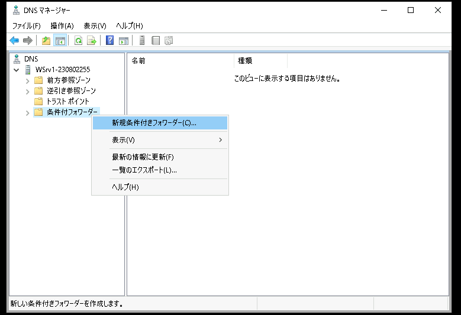</kbd> 
    1. [新規条件付きフォワーダー]ウィンドウが表示されたことを確認する
    1. [新規条件付きフォワーダー]ウィンドウで、以下のパラメータを入力する  

        DNSドメイン:
        | `example.com` | 
        | :----- |
 
        マスターサーバーのIPアドレスを構成する:
        | 10.X.1.102 | 
        | :----- |

        - [ ] このActive Directoryに条件付きフォワーダーを保存し、次の方法でレプリケートする  

        クエリ転送のタイムアウト(秒):
        | 5 | 
        | :----- |
 
        <kbd>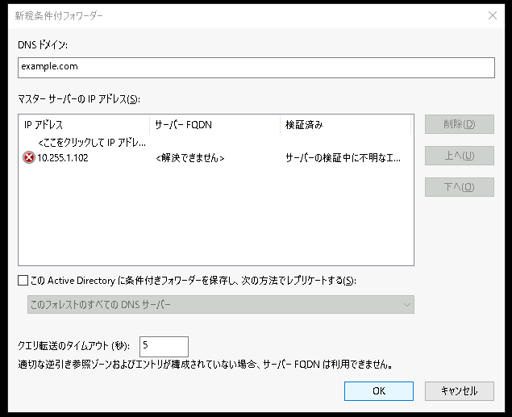</kbd> 

        > 【補足】  
        > マスターサーバーのIPアドレスの検証に失敗するエラーが表示されます。  
        > これはマスターサーバー(Linux1)の逆引き参照が構成されていないために発生するエラーです。  
        > 今回の演習環境では、このエラーを無視できます。  

    1. [新規条件付きフォワーダー]ウィンドウで、[OK]をクリックする    

1. 構成された条件付きフォワーダーを確認する  
    1. 左側コンソールツリーの[DNS]-[<サーバー名>]-[条件付きフォワーダー]-[`example.com`]をクリックして選択する    
    1. Linux1(10.X.1.102)のIPアドレスが指定されていることを確認する  
        <kbd>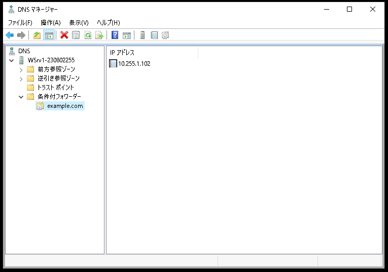</kbd> 

---  

## 動作確認  

1. Windows Clientに"admin"で接続する  
    1. Windows Client(WinClient)の管理画面に "admin" で接続する     
    1. [スタートメニュー]を右クリックし、コンテキストメニュー内の[Windows PowerShell(管理者)]をクリックする  
    1. [ユーザー アカウント制御]のポップアップで[はい]をクリックする  
    1. Windows PowerShellのウィンドウが表示されたことを確認する  

1. PowerShellで以下のコマンドを実行し、nslookupツールを起動する  
    ＞ ***nslookup***  

1. PowerShellで実行中のnslookupツールで以下のFQDNを入力し、DNSサーバーの名前解決の動作を確認する        

    - `www.example.com.`

    | FQDN | 期待する結果(名前解決されたIPアドレス)  |
    | :----- |:----- |
    | `www.example.com.` | 10.X.2.105 |  

    ```
    PS C:\Windows\system32> nslookup
    既定のサーバー:  WindowsDNS.example.local
    Address:  10.255.1.104

    >
    > www.example.com.
    サーバー:  WindowsDNS.example.local
    Address:  10.255.1.104

    権限のない回答:
    名前:    www.example.com
    Address:  10.255.2.105

    >
    > quit
    PS C:\Windows\system32>
    PS C:\Windows\system32>
    ```

    <kbd>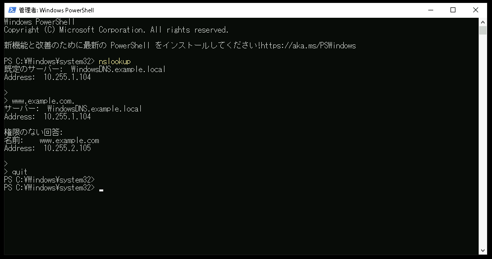</kbd> 

1. ClientからWebサーバーにアクセスする
    1. Webブラウザ(Google Chrome)を起動する  
    1. Webブラウザのアドレス欄に [`http://www.example.com/web1`] と入力し、[Enter]キーを押下する  

        <kbd>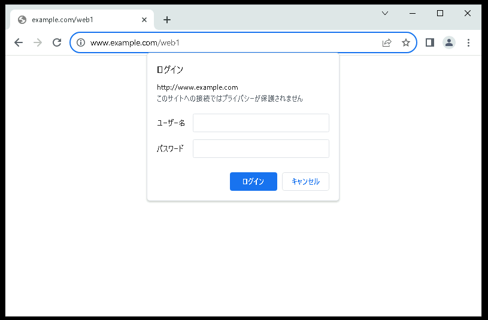</kbd> 

    1. 認証情報を入力するポップアップが表示されたことを確認する  
    1. 以下のパラメータを入力する  
        | 項目 | パラメータ |  
        | :----- | :----- |  
        | ユーザー名 | Tom |   
        | パスワード | Pa$$w0rd |   
    1. 上のパラメータを入力し、[ログイン]をクリックする  
    1. 基本認証を経て、Webコンテンツを利用できることを確認する

        > 【動作テストの観点】  
        > DNSサーバーで名前解決できることを確認する     

        - [x] Webブラウザのアドレス欄にFQDNを指定してWebコンテンツを表示できること    

        <kbd>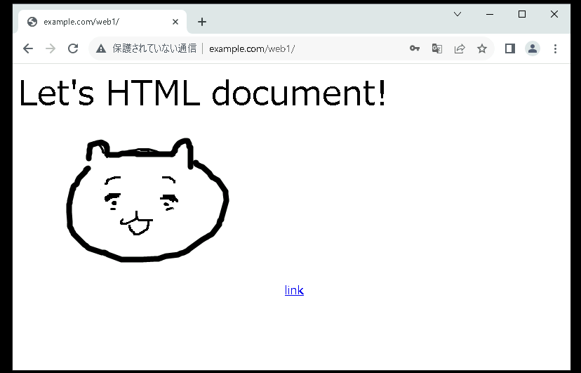</kbd> 


--- 

## (オプション)BINDのACLを構成する      
この項の手順は省略しても後続の演習に支障ありません。  
興味のある方だけ実施してください。  

1. BINDの構成ファイル("/etc/named.conf")の2つめのバックアップを作成する  
    ＞ ***sudo cp /etc/named.conf /etc/named.conf.bak2***  

1. BIND(named)のconfigファイルを編集する       
    ＞ ***sudo vi /etc/named.conf ***  
    ＞ ***diff /etc/named.conf /etc/named.conf.bak2***  


    ```
    [admin@linux1 ~]$ sudo diff /etc/named.conf /etc/named.conf.bak2
    21c21
    < allow-query     { dnsclientnw; };
    ---
    > allow-query     { any; };
    67,69d66
    < acl dnsclientnw{
    <     10.255.1.0/24;
    < };
    [admin@linux1 ~]$ 
    ```


    <details>
    <summary>[参考]named.conf全文 (クリックで表示):</summary>  

    ```     
    [admin@linux1 ~]$ sudo cat /etc/named.conf
    //
    // named.conf
    //
    // Provided by Red Hat bind package to configure the ISC BIND named(8) DNS
    // server as a caching only nameserver (as a localhost DNS resolver only).
    //
    // See /usr/share/doc/bind*/sample/ for example named configuration files.
    //
    // See the BIND Administrator's Reference Manual (ARM) for details about the
    // configuration located in /usr/share/doc/bind-{version}/Bv9ARM.html

    options {
    listen-on port 53 { any; };
    listen-on-v6 port 53 { ::1; };
    directory "/var/named";
    dump-file "/var/named/data/cache_dump.db";
    statistics-file "/var/named/data/named_stats.txt";
    memstatistics-file "/var/named/data/named_mem_stats.txt";
    recursing-file  "/var/named/data/named.recursing";
    secroots-file   "/var/named/data/named.secroots";
    allow-query     { dnsclientnw; };

    /* 
    - If you are building an AUTHORITATIVE DNS server, do NOT enable recursion.
    - If you are building a RECURSIVE (caching) DNS server, you need to enable 
    recursion. 
    - If your recursive DNS server has a public IP address, you MUST enable access 
    control to limit queries to your legitimate users. Failing to do so will
    cause your server to become part of large scale DNS amplification 
    attacks. Implementing BCP38 within your network would greatly
    reduce such attack surface 
    */
    recursion yes;

    dnssec-enable yes;
    dnssec-validation yes;

    /* Path to ISC DLV key */
    bindkeys-file "/etc/named.root.key";

    managed-keys-directory "/var/named/dynamic";

    pid-file "/run/named/named.pid";
    session-keyfile "/run/named/session.key";
    };

    logging {
            channel default_debug {
                    file "data/named.run";
                    severity dynamic;
            };
    };

    zone "." IN {
    type hint;
    file "named.ca";
    };

    include "/etc/named.rfc1912.zones";
    include "/etc/named.root.key";

    zone "example.com" IN {
    type master;
    file "/etc/named/example.com.zone";
    };

    acl dnsclientnw{
        10.255.1.0/24;
    };

    [admin@linux1 ~]$ 
    ```

    </details>

    <!--
    detailsタグを使用する際は、3連バッククォートとの間にスペースなしの完全な空行を挿入する必要がある
    -->


1. 10.X.1.0/24(Windows Client)からのDNS問い合わせはLinux1で許可されていることを確認する
    1. Windows Clientに"admin"で接続する  
        1. Windows Client(WinClient)の管理画面に "admin" で接続する     
        1. [スタートメニュー]を右クリックし、コンテキストメニュー内の[Windows PowerShell(管理者)]をクリックする  
        1. [ユーザー アカウント制御]のポップアップで[はい]をクリックする  
        1. Windows PowerShellのウィンドウが表示されたことを確認する  

    1. PowerShellで以下のコマンドを実行し、nslookupツールを起動する  
        ＞ ***nslookup***  

    1. PowerShellで実行中のnslookupツールで以下のコマンドを実行し、DNS名前解決要求を送信する宛先DNSサーバーをLinux1(10.X.1.102)に指定する    
        ＞ ***server 10.X.1.102***  

    1. PowerShellで実行中のnslookupツールで以下のFQDNを入力し、DNSサーバーの名前解決の動作を確認する        
        - `www.example.com.`

        > 【動作テストの観点】  
        > BINDのACLでdnsclientnw(10.X.1.0/24)としてallowされたWindows Client(10.X.1.103)は、名前解決ができることを確認する       
        - [x] Linux1からDNS応答が返されること    

        ```
        PS C:\Windows\system32> nslookup
        既定のサーバー:  WindowsDNS.example.local
        Address:  10.255.1.104

        >
        > server 10.255.1.102
        既定のサーバー:  [10.255.1.102]
        Address:  10.255.1.102

        >
        > www.example.com.
        サーバー:  [10.255.1.102]
        Address:  10.255.1.102

        名前:    www.example.com
        Address:  10.255.2.105

        >
        > quit
        PS C:\Windows\system32>
        ```
        <kbd>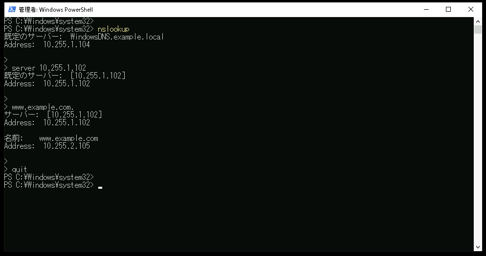</kbd> 


1. 10.X.2.0/24(Windows Server 2)からのDNS問い合わせは、Linux1で拒否(Query refused)されることを確認する
    1. Windows Server 2に"admin"で接続する  
        1. Windows Server 2(WinSrv2)の管理画面に "admin" で接続する     
        1. [スタートメニュー]を右クリックし、コンテキストメニュー内の[Windows PowerShell(管理者)]をクリックする  
        1. [ユーザー アカウント制御]のポップアップで[はい]をクリックする  
        1. Windows PowerShellのウィンドウが表示されたことを確認する  

    1. PowerShellで以下のコマンドを実行し、nslookupツールを起動する  
        ＞ ***nslookup***  

    1. PowerShellで実行中のnslookupツールで以下のコマンドを実行し、DNS名前解決要求を送信する宛先DNSサーバーをLinux1(10.X.1.102)に指定する    
        ＞ ***server 10.X.1.102***  

    1. PowerShellで実行中のnslookupツールで以下のFQDNを入力し、DNSサーバーの名前解決の動作を確認する        
        - `www.example.com.`

        > 【動作テストの観点】  
        > BINDのACLでdnsclientnw(10.X.1.0/24)としてallowされていないWindows Server 2(10.X.2.105)は、名前解決ができないことを確認する       
        - [x] Linux1からDNS応答が返されないこと    

        ```
        PS C:\Windows\system32> nslookup
        既定のサーバー:  WindowsDNS.example.local
        Address:  10.255.1.104

        > server 10.255.1.102
        既定のサーバー:  [10.255.1.102]
        Address:  10.255.1.102

        >
        > www.example.com.
        サーバー:  [10.255.1.102]
        Address:  10.255.1.102

        *** [10.255.1.102] が www.example.com. を見つけられません: Query refused
        >
        > quit
        PS C:\Windows\system32>
        ```
        <kbd>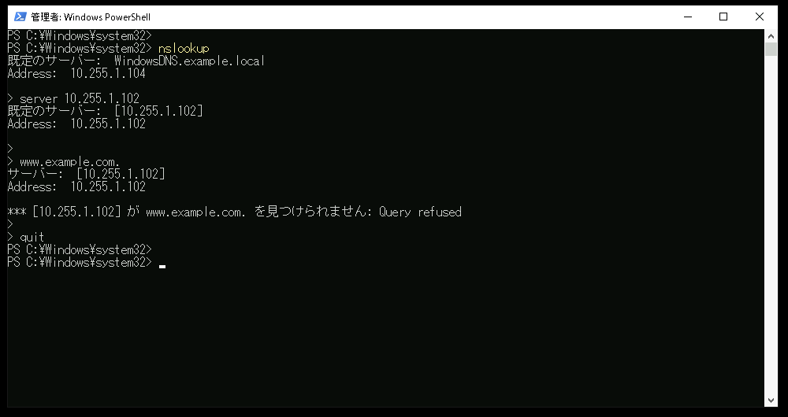</kbd> 


--- 

## (オプション)DNSキャッシュの参照と削除
この項の手順は省略しても後続の演習に支障ありません。  
興味のある方だけ実施してください。  

1. DNSクライアント(Windows)のDNSキャッシュを参照する
    1. Windows Clientに"admin"で接続する  
        1. Windows Client(WinClient)の管理画面に "admin" で接続する     
        1. [スタートメニュー]を右クリックし、コンテキストメニュー内の[Windows PowerShell(管理者)]をクリックする  
        1. [ユーザー アカウント制御]のポップアップで[はい]をクリックする  
        1. Windows PowerShellのウィンドウが表示されたことを確認する  

    1. PowerShellで以下のコマンドを実行し、DNSクライアントのキャッシュを参照する    
        > ***ipconfig /displaydns***

        > 【動作テストの観点】  
        > これまでの演習手順で実行したDNS名前解決の情報がキャッシュされていることを確認する  

        - [x] www.example.com. の情報がキャッシュされていること(コマンドの実行結果として表示されること)     

1. DNSクライアント(Windows)のDNSキャッシュを削除する
    1. PowerShellで以下のコマンドを実行し、DNSクライアントのキャッシュを参照する    
        > ***ipconfig /flushdns***

    1. PowerShellで以下のコマンドを実行し、DNSクライアントのキャッシュが削除されていることをする    
        > ***ipconfig /displaydns***

        > 【動作テストの観点】  
        > DNS名前解決のキャッシュ情報が削除されていることを確認する  

        - [x] ipconfig /displaydnsの実行結果が何も表示されないこと       

1. DNSサーバー(Windows)のDNSキャッシュを参照する      
    1. Windows Server 1(WinSrv1)の管理画面に接続する  
    1. [DNSマネージャー]を起動する  
    1. 左側コンソールツリーの[DNS]-[<サーバー名>]をクリックして選択する    
        <kbd>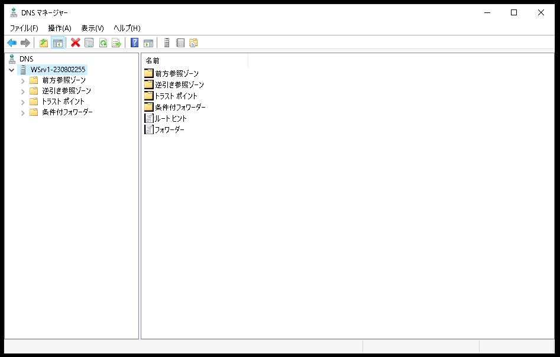</kbd>   
    1. [DNSマネージャー]ウィンドウ上部の[表示]メニュー内の[詳細設定]をクリックする  
        <kbd>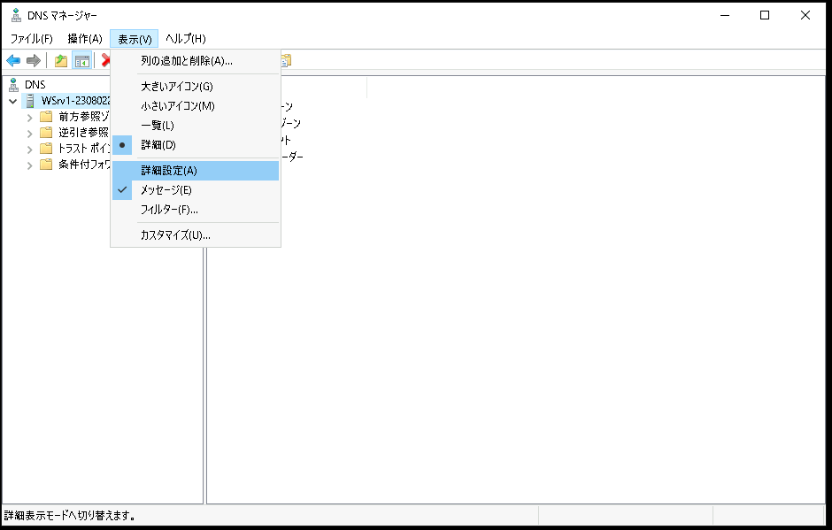</kbd>   
    1. 左側コンソールツリーの[DNS]-[<サーバー名>]-[キャッシュされた参照]が表示されたことを確認する  
        <kbd>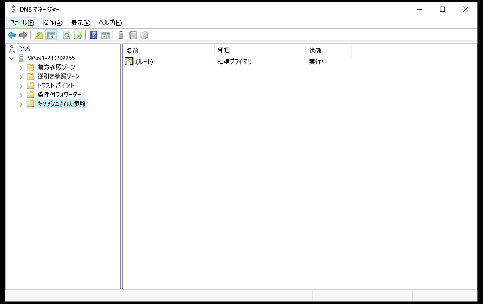</kbd>   
    1. 左側コンソールツリーの[DNS]-[<サーバー名>]-[キャッシュされた参照]を展開し、これまでの演習手順で実行したDNS名前解決の情報がキャッシュされていることを確認する  
        <kbd>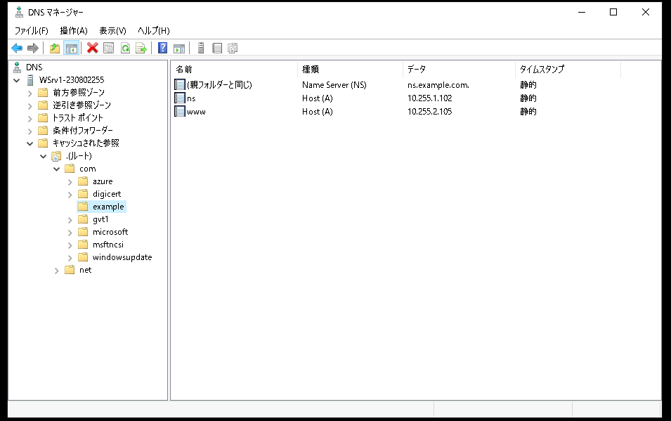</kbd>   

        > 【補足】
        > example.com のキャッシュ情報が表示されない場合は、example.comドメインのキャッシュ有効時間(TTL300秒)を超過したことで、キャッシュ情報が自動消去されています。  
        > Windows Clientでexample.comドメインの名前解決を再実行してから、Windows Sever 1でDNSマネージャーの画面を更新することで、example.comドメインのキャッシュを参照することができます。  

1. DNSサーバー(Windows)のDNSキャッシュを削除する      
    1. [DNSマネージャー]の左側コンソールツリーの[DNS]-[<サーバー名>]をクリックして選択する    
    1. 左側コンソールツリーの[DNS]-[<サーバー名>]を右クリックし、コンテキストメニュー内の[キャッシュの消去]をクリックする  
        <kbd>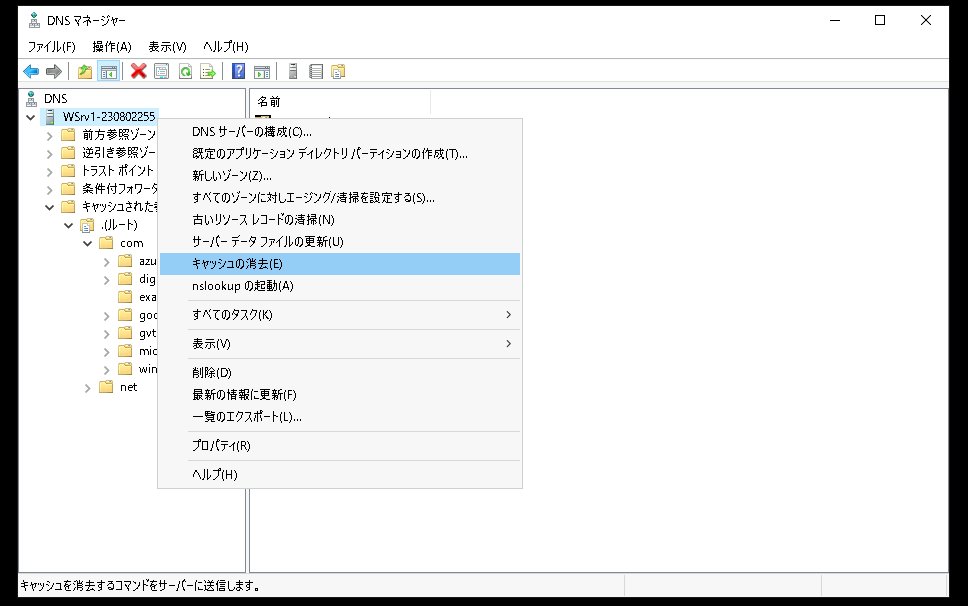</kbd>   
    1. 左側コンソールツリーの[DNS]-[<サーバー名>]-[キャッシュされた参照]を展開し、DNSキャッシュが削除されていることを確認する  
        <kbd>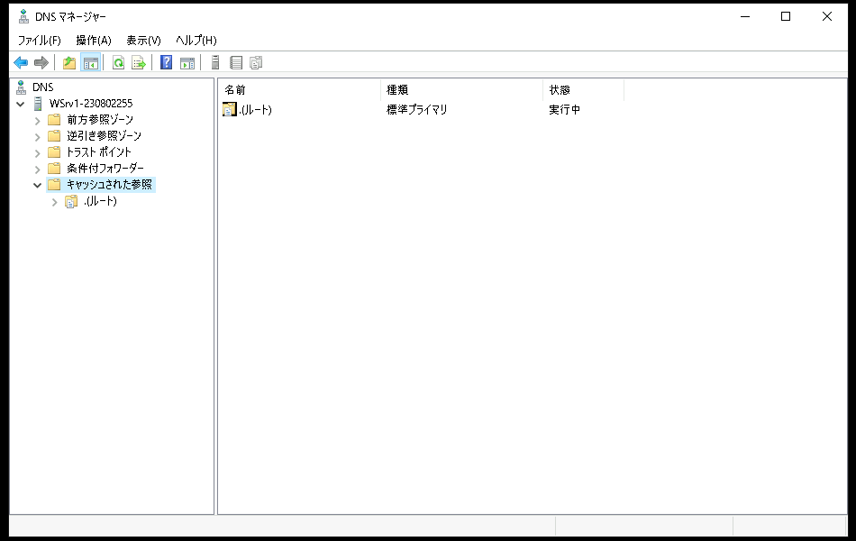</kbd>   

        > 【補足】
        > 一部のキャッシュは削除されずに残留しますが、正常な動作です。      
        > また、バックグラウンドで動作しているさまざまなアプリケーションが常にインターネットとの通信を実行しているため、DNSキャッシュは自動的に増えていきますが、正常な動作です。   

---  

<!--
## (オプション) フォワーダーの動作を確認する        
この項の手順は省略しても後続の演習に支障ありません。  
興味のある方だけ実施してください。  

DNSフォワーダーのON/OFF演習は、この演習環境では実施しません。  
Windows Clientに2つのアダプターが構成されるため、WinSrv1からフォワーダー無効のRefuseを受信すると、Windows Clientはもう一方のアダプターに構成されたDNSサーバーに問い合わせを行います。  
DNSを学習するのに適切な演習とはならない動作です。
-->


---  

## 演習完了  
ここまでの手順で、以下の項目を学習できました。  
- [x] LinuxのBINDでDNSサービスを提供する  
- [x] 条件付きフォワーダーを実装する    
- [x] (オプション) Linux DNSでACLを実装する  
- [x] (オプション) DNSのキャッシュを削除する    

