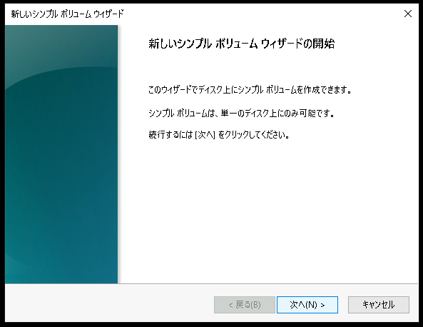
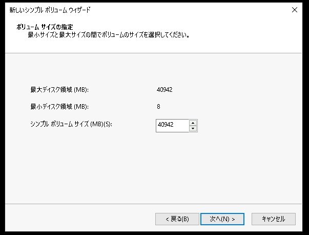

# iSCSI で Storage Area Network 環境を構築する
---

## 演習における役割と、環境のパラメータ
- X: ご自身のPod番号
- iSCSIイニシエータ役: WinSrv1(WSrv1-yyMMddX)
- iSCSIターゲット役: WinSrv2(WSrv2-yyMMddX)

## 注意
- 手順例の画像は<B>pod255</B>に準拠したパラメータのものです
- 手順内の<B>X</B>表記はご自身のpod番号に読み替えてください

---

# iSCSIターゲットの役割をインストールする  

1. iSCSIターゲット役のWindows Server 2(WinSrv2)の管理画面に"admin"で接続する  

1. 役割と機能の追加ウィザードを開始する  
    1. [スタートメニュー]をクリックする  
    1. スタートメニュー内の[サーバー マネージャー]をクリックし、サーバーマネージャを起動する    
    1. サーバーマネージャーのダッシュボード画面内の[役割と機能の追加]をクリックする   
    1. [役割と機能の追加ウィザード]ウィンドウが起動したことを確認する  

1. iSCSIターゲット サーバーの役割を追加する
    1. [役割と機能の追加ウィザード]ウィンドウの[開始する前に]画面で、[次へ]をクリックする  
    1. [インストールの種類]画面で、[次へ]をクリックする  
    1. [サーバーの選択]画面で、[次へ]をクリックする  
    1. [サーバーの役割]画面で、以下のパラメータを選択する  

        - [x] iSCSI ターゲット サーバー 
    
        <kbd></kbd> 

    1. [サーバーの役割]画面で、上のパラメータを選択したことを確認し、[次へ]をクリックする  
    1. [機能の選択]画面で、[次へ]をクリックする  
    1. [確認]画面で、[インストール]をクリックする  

        <kbd></kbd> 

    1. [結果]画面で、インストール進捗を示すプログレスバーが右端に到達するまで数分間待機する  
    1. [結果]画面で、インストールが正常に完了したことを確認し、[閉じる]をクリックする  

---  

# iSCSIサービスとして提供するディスク領域を構成する    

1. iSCSIターゲット役のWindows Server 2(WinSrv2)の管理画面に"admin"で接続する  

1. [新しいiSCSI仮想ディスク]ウィザードを起動する
    1. [サーバーマネージャー]の左側コンソールツリーの[ファイルサービスと記憶域サービス]をクリックして選択する  
    1. 左側コンソールツリーの[iSCSI]をクリックして選択する  
        <kbd></kbd> 
    1. 画面右側ペインの[タスク]をクリックし、プルダウンメニューの[新しいiSCSI仮想ディスク]をクリックする  
        <kbd></kbd> 
    1. [新しいiSCSI仮想ディスク]ウィザードが起動したことを確認する  

1. iSCSI仮想ディスクを構成する  
    1. [新しいiSCSI仮想ディスク]ウィザードの[iSCSI仮想ディスクの場所]画面で、以下のパラメータを選択する  

        記憶域の場所:
        - [x] ボリュームで選択
            - [x] C:
            - [ ] D:
        - [ ] カスタムパスを入力してください  

        <kbd></kbd> 

    1. [iSCSI仮想ディスクの場所]画面で、[次へ]をクリックする  

    1. [iSCSI仮想ディスク名]画面で、以下のパラメータを選択する  

        名前:  
        | iscsidisk |
        | :----- |
 
        説明:  
        | <空欄> |
        | :----- |

        <kbd></kbd> 

    1. [iSCSI仮想ディスク名]画面で、[次へ]をクリックする   

    1. [iSCSI仮想ディスクのサイズ]画面で、以下のパラメータを選択する  

        サイズ:  
        | 40 (GB) |
        | :----- |
 
        - [ ] 容量固定  
        - [x] 容量可変  
        - [ ] 差分

        <kbd></kbd> 

    1. [iSCSI仮想ディスクのサイズ]画面で、[次へ]をクリックする   

    1. [iSCSIターゲット]画面で、以下のパラメータを入力する  
 
        - [ ] 既存のiSCSIターゲット  
        - [x] 新しいISCSIターゲット    

        <kbd></kbd>          

    1. [iSCSIターゲット]画面で、[次へ]をクリックする  

    1. [ターゲット名およびアクセス]画面で、以下のパラメータを入力する  

        名前:
        | iscsi |
        | :----- |

         説明:
        | <空欄> |
        | :----- |

        <kbd></kbd>     

    1. [ターゲット名およびアクセス]画面で、[次へ]をクリックする    

    1. [アクセス サーバーの指定]画面で、[追加]をクリックする  

        <kbd></kbd>     

    1. [イニシエータIDの追加]ウィンドウが表示されたことを確認する  

    1. [イニシエータIDの追加]ウィンドウで、以下のパラメータを入力する  
        - [ ] イニシエーター コンピュータをIDで紹介する  
        - [ ] ターゲット サーバーのイニシエーターのキャッシュから選択する    
        - [x] 選択した種類の値の入力   
        
            種類:
            | IPアドレス |
            | :----- |
            
            値:
            | 10.X.1.104 |
            | :----- |

        <kbd></kbd>   

    1. [イニシエータIDの追加]ウィンドウで、[OK]をクリックする  
    1. [アクセス サーバーの指定]画面で、[次へ]をクリックする 

        <kbd></kbd>   

    1. [認証サービスを有効にする]画面で、[次へ]をクリックする 

        <kbd></kbd>   

    1. [確認]画面で、[作成]をクリックする 

        <kbd></kbd>   

    1. [結果]画面で、インストール進捗を示すプログレスバーが右端に到達するまで数分間待機する  
        <kbd></kbd>   

    1. [結果]画面で、[閉じる]をクリックする   
        <kbd></kbd>   

1. iSCSI仮想ディスクが作成されたことを確認する  
    1. [サーバーマネージャー]の[iSCSI]画面で、ターゲット名 "iSCSI" の仮想ディスクが作成されていることを確認する  
        <kbd></kbd>

    1. ファイルエクスプローラーを起動して"C:\\iSCSIVirtualDisks"にアクセスし、"iscsidisk.vhdx" が作成されていることを確認する    
        <kbd></kbd>

---  

# iSCSIクライアント(iSCSIイニシエーター)から、iSCSI仮想ディスクを使用する  

1. iSCSIイニシエーター役のWindows Server 1(WinSrv1)の管理画面に"admin"で接続する  

1. iSCSIイニシエーター管理コンソールを起動する  
    1. サーバーマネージャーウィンドウ右上の[ツール]をクリックする  
    1. メニュー内の[iSCSI イニシエーター]をクリック
        <kbd></kbd>

    1. [Microsoft iSCSI]ポップアップが表示されたことを確認する  
    
    1. [Microsoft iSCSI]ポップアップで、[はい]をクリックする  
        <kbd></kbd>

    1. [iSCSIイニシエーターのプロパティ]ウィンドウが起動したことを確認する  

1. iSCSIイニシエーターを構成する   
    1. [iSCSIイニシエーターのプロパティ]ウィンドウの[ターゲット]タブで、以下のパラメータを入力する  

        ターゲット:  
        | 10.X.2.105 |
        | :----- |

        <kbd></kbd>

    1. [iSCSIイニシエーターのプロパティ]ウィンドウの[ターゲット]タブで、[クイック接続]をクリックする    

    1. [クイック接続]ウィンドウが表示されたことを確認する  
    1. [クイック接続]ウィンドウで、検出されたターゲットの状態が "接続完了" であることを確認する
        <kbd></kbd>
    1. [クイック接続]ウィンドウで、[完了]をクリックする    
    
    1. [iSCSIイニシエーターのプロパティ]ウィンドウで、[OK]をクリックする  
        <kbd></kbd>
        
1. 仮想ディスクをフォーマットしてマウントする  
    1. サーバーマネージャーウィンドウ右上の[ツール]をクリックする  
        <kbd></kbd>
    1. メニュー内の[コンピューターの管理]をクリックし、コンピューターの管理コンソールを起動する  
    1. [コンピューターの管理]が起動したことを確認する
        <kbd></kbd>
    1. 左側コンソールツリーの[コンピュータの管理]-[記憶域]-[ディスクの管理]をクリックして選択する  
    1. [ディスクの初期化]ウィンドウが表示されたことを確認する  

    1. [ディスクの初期化]ウィンドウで、[OK]をクリックする    
        <kbd></kbd>
        <kbd></kbd>

    1. [未割り当て]領域を右クリックし、[新しいシンプル ボリューム]をクリックする  
    1. [新しいシンプル ボリューム ウィザード]が起動したことを確認する  
    1. [新しいシンプル ボリューム ウィザード]ウィンドウで、[次へ]をクリックする  
        <kbd></kbd>
    1. [ボリュームサイズの指定]画面で、[次へ]をクリックする  
        <kbd></kbd>
    1. [ドライブ文字またはパスの割り当て]画面で、[次へ]をクリックする  
        <kbd></kbd>
    1. [パーティションのフォーマット]画面で、[次へ]をクリックする  
        <kbd></kbd>

    1. [新しいシンプル ボリューム ウィザードの完了]画面で、[完了]をクリックする  
        <kbd></kbd>
        <kbd></kbd>

    1. フォーマット処理が完了するまで、数十分、待機する  
        
        > 【補足】
        > 次の演習を開始してください。  

1. フォーマット処理が完了したことを確認する    
        
    <kbd></kbd>
    <kbd></kbd>

---

# 演習完了  
ここまでの手順で、以下の項目を学習できました。
- [x] iSCSIターゲットをWindows Serverで構成する  
- [x] Windows ServerをiSCSIイニシエーターとして構成する    
- [x] 新しいディスクをフォーマットしてマウントする  
