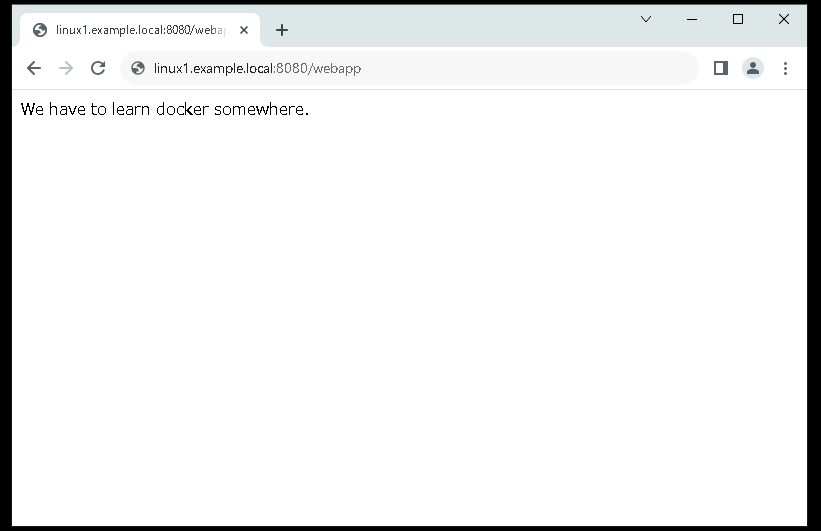

# Linux ServerでDockerを操作する

---


## 演習における役割と、環境のパラメータ
- X: ご自身のPod番号  
- Dockerプラットフォーム役: Linux1     

- クライアント デスクトップ環境: WinClient(WC1-yyMMddX)


## 注意
- 手順例の画像は<B>pod255</B>に準拠したパラメータのものです
- 手順内の<B>X</B>表記はご自身のpod番号に読み替えてください

---

# Linux1の環境を確認する  

1. Linux1の管理画面に接続する  


1. Linux1の管理操作環境を確認する    
    ＞ ***hostname***  
    ＞ ***whoami***  
    ＞ ***pwd***  


    ```
    [admin@linux1 ~]$ hostname
    linux1
    [admin@linux1 ~]$ 
    [admin@linux1 ~]$ whoami
    admin
    [admin@linux1 ~]$ 
    [admin@linux1 ~]$ pwd
    /home/admin
    [admin@linux1 ~]$ 
    ```

1. Linux1のOSバージョンを確認する  
    ＞ ***cat /etc/redhat-release***  

    ```
    [admin@linux1 ~]$ cat /etc/redhat-release
    CentOS Linux release 7.9.2009 (Core)
    [admin@linux1 ~]$ 
    ```

1. Linux1にインストールされているPythonのバージョンを確認する  
    ＞ ***python***  
    ＞ ***import sys***  
    ＞ ***print(sys.version)***  
    ＞ ***quit()***  

    ```
    [admin@linux1 ~]$ python
    Python 2.7.5 (default, Jun 28 2022, 15:30:04) 
    [GCC 4.8.5 20150623 (Red Hat 4.8.5-44)] on linux2
    Type "help", "copyright", "credits" or "license" for more information.
    >>> 
    >>> import sys
    >>> print(sys.version)
    2.7.5 (default, Jun 28 2022, 15:30:04) 
    [GCC 4.8.5 20150623 (Red Hat 4.8.5-44)]
    >>> 
    >>> quit()
    [admin@linux1 ~]$ 
    ```

    > 【補足】  
    > Linux1(CentOS7.9)には、Python2(2.7.5)が既定でインストールされています。   

1. Linux1には、すでにDockerがインストールされていることを確認する   
    ＞ ***docker --version***  

    ```
    [admin@linux1 ~]$ docker --version
    Docker version 23.0.5, build bc4487a
    [admin@linux1 ~]$ 
    ```

    > 【補足】  
    > 演習を円滑に進行するため、Linuxには事前にDockerがインストールされています。  
    > Dockerのインストールの手順については、本ページ末尾の参考資料を参照してください。  


---  

# Python WebアプリケーションをLinux1にダウンロードする  

1. カレントディレクトリがadminのホームディレクトリであることを確認する  
    ＞ ***pwd***  
    ```
    [admin@linux1 ~]$ pwd
    /home/admin
    [admin@linux1 ~]$ 
    ```

1. 演習用に用意されているPythonソースコードとライブラリ情報をインターネットからダウンロードする   

    ＞ ***wget http://ccw.traino.cat/u/1***  
    ＞ ***wget http://ccw.traino.cat/u/2***  

    > 【補足】  
    > 上のURLは短縮されています。   
    > 以下のURLにリダイレクトされています。   
    > ***wget https://raw.githubusercontent.com/training-documents/NFC0643G-1/main/code/webapp.py***   
    > ***wget https://raw.githubusercontent.com/training-documents/NFC0643G-1/main/code/Pipfile***   


1. ダウンロードしたファイルの名前を変更する     

    ＞ ***mv ./1 ./webapp.py***  
    ＞ ***mv ./2 ./Pipfile***  

    > 【補足】  
    > mv(MoVe)コマンドはファイルを移動するコマンドです。     
    > ファイル名の変更に利用することもできます。  

1. ダウンロードしたファイルの中身を確認する       
    ＞ ***ls -l***  
    ＞ ***cat ./webapp.py***  
    ＞ ***cat ./Pipfile***  

    ```
    [admin@linux1 ~]$ ls -l
    total 808
    -rw-rw-r-- 1 admin admin 816272 Oct 19  2022 nginx-1.22.1-1.el7.ngx.x86_64.rpm
    -rw-rw-r-- 1 admin admin    151 Sep 20 02:49 Pipfile
    -rw-rw-r-- 1 admin admin    253 Sep 20 02:49 webapp.py
    [admin@linux1 ~]$ 
    [admin@linux1 ~]$ cat ./webapp.py 
    from flask import Flask

    app = Flask(__name__)

    @app.route('/webapp', methods=['GET'])
    def webapp():
        return 'We have to learn docker somewhere.', 200

    @app.route('/notify', methods=['POST'])
    def notify():
        with open('/share/notify.txt', 'a'):
            pass
        return 'Thank you for notifying me.', 200

    if __name__ == '__main__':
        app.run(debug=False, host='0.0.0.0', port=80, threaded=True)
    [admin@linux1 ~]$ 
    [admin@linux1 ~]$ cat ./Pipfile 
    [[source]]
    url = "https://pypi.org/simple"
    verify_ssl = true
    name = "pypi"

    [packages]
    flask = "*"

    [dev-packages]

    [requires]
    python_version = "3.11"
    [admin@linux1 ~]$ 
    ```

    > 【補足】  
    > このPython Webアプリケーションは、前提条件としてPython3.11環境のpipenvライブラリが必要です。  
    > このままではLinux1で実行することはできません。  

---

# Base Imageをダウンロードする  

1. Base Imageとして、Python3.11を組み込んだalpineをDocker Hubからダウンロードする  
    ＞ ***docker pull python:3.11-alpine***  

    ```
    [admin@linux1 ~]$ docker pull python:3.11-alpine
    3.11-alpine: Pulling from library/python
    7264a8db6415: Pull complete 
    66e1d5e70e42: Pull complete 
    0448660c92fc: Pull complete 
    3ce23f846e31: Pull complete 
    efebc2e683d2: Pull complete 
    Digest: sha256:5d769f990397afbb2aca24b0655e404c0f2806d268f454b052e81e39d87abf42
    Status: Downloaded newer image for python:3.11-alpine
    docker.io/library/python:3.11-alpine
    [admin@linux1 ~]$ 
    ```

1. ダウンロード(pull)したalpineイメージが、ローカルのDockerイメージのリストに登録されていることを確認する  
    ＞ ***docker image ls***

    ```
    [admin@linux1 ~]$ docker image ls
    REPOSITORY   TAG           IMAGE ID       CREATED       SIZE
    python       3.11-alpine   b9b301ab01c2   3 weeks ago   52.1MB
    [admin@linux1 ~]$ 
    ```

---  

# python:3.11-alpineのコンテナを操作する  

> 【補足】  
> ダウンロード(pull)したイメージが正常に動作することを確認するため、コンテナを起動して動作を確認します。  


1. python:3.11-alpineをコンテナとして起動し、対話操作を開始する    
    ＞ ***docker run -it python:3.11-alpine /bin/sh***  

    ```  
    [admin@linux1 ~]$ docker run -it python:3.11-alpine /bin/sh
    / # 
    / # 
    / # 
    / # 
    / # 
    ```  

1. python:3.11-alpine コンテナの管理操作環境を確認する    
    ＞ ***hostname***  
    ＞ ***whoami***  
    ＞ ***pwd***  
    ＞ ***ls***  

    ```
    / # hostname
    abf8cac8d680
    / # 
    / # whoami
    root
    / # 
    / # pwd
    /
    / # 
    / # ls
    bin    dev    etc    home   lib    media  mnt    opt    proc   root   run    sbin   srv    sys    tmp    usr    var
    / # 
    / # 
    ```

1. python:3.11-alpine コンテナのPythonのバージョンを確認する  
    ＞ ***python***  
    ＞ ***import sys***  
    ＞ ***print(sys.version)***  
    ＞ ***quit()***  

    ```
    / # 
    / # python
    Python 3.11.5 (main, Aug 26 2023, 00:26:34) [GCC 12.2.1 20220924] on linux
    Type "help", "copyright", "credits" or "license" for more information.
    >>> 
    >>> import sys
    >>> 
    >>> print(sys.version)
    3.11.5 (main, Aug 26 2023, 00:26:34) [GCC 12.2.1 20220924]
    >>> 
    >>> quit()
    / # 
    ```

1. python:3.11-alpine コンテナの対話操作を終了する  
    ＞ ***exit***  
    ＞ ***hostname***  

    ```
    / # 
    / # exit
    [admin@linux1 ~]$ 
    [admin@linux1 ~]$ hostname
    linux1
    [admin@linux1 ~]$ 
    ```

--- 

# Python Webアプリケーションを組み込んだDockerイメージを作成する  

1. Dockerfileを記述する  
    ＞ ***touch Dockerfile***  
    ＞ ***cp Dockerfile Dockerfile.bak***  
    ＞ ***ls -l***  
    ＞ ***vi Dockerfile***  
    ＞ ***diff Dockerfile Dockfile.bak***  


    ```
    [admin@linux1 ~]$ touch Dockerfile
    [admin@linux1 ~]$ cp Dockerfile Dockerfile.bak
    [admin@linux1 ~]$ ls -l
    total 808
    -rw-rw-r-- 1 admin admin      0 Sep 20 05:14 Dockerfile
    -rw-rw-r-- 1 admin admin      0 Sep 20 05:14 Dockerfile.bak
    -rw-rw-r-- 1 admin admin 816272 Oct 19  2022 nginx-1.22.1-1.el7.ngx.x86_64.rpm
    -rw-rw-r-- 1 admin admin    151 Sep 20 02:49 Pipfile
    -rw-rw-r-- 1 admin admin    253 Sep 20 02:49 webapp.py
    [admin@linux1 ~]$ 
    [admin@linux1 ~]$ diff Dockerfile Dockerfile.bak
    1,17d0
    < FROM python:3.11-alpine
    < 
    < COPY ./webapp.py /app/
    < 
    < COPY ./Pipfile /app/
    < 
    < WORKDIR /app/
    < 
    < RUN pip install pipenv
    < 
    < RUN pipenv install
    < 
    < EXPOSE 80
    < 
    < CMD pipenv run python webapp.py
    < 
    [admin@linux1 ~]$ 
    ```

    [参考]Dockerfile全文
    ```
    FROM python:3.11-alpine

    COPY ./webapp.py /app/

    COPY ./Pipfile /app/

    WORKDIR /app/

    RUN pip install pipenv

    RUN pipenv install

    EXPOSE 80

    CMD pipenv run python webapp.py
    ```

1. Dockerイメージを作成(build)する  

    > 【注意】
    > コマンド末尾(右端)の . (ドット)を見落とさないように注意してください。  
    > カレントディレクトリ(./)のDockerfileを使用する旨のパラメータ指定です。  

    ＞ ***docker build -t my-image:1.0 .***  

    ```
    [admin@linux1 ~]$ docker build -t my-image:1.0 .
    [+] Building 36.5s (11/11) FINISHED                                                                                                                                                     
    => [internal] load build definition from Dockerfile                                                                                                                               0.2s
    => => transferring dockerfile: 214B                                                                                                                                               0.0s
    => [internal] load .dockerignore                                                                                                                                                  0.2s
    => => transferring context: 2B                                                                                                                                                    0.0s
    => [internal] load metadata for docker.io/library/python:3.11-alpine                                                                                                              0.0s
    => [1/6] FROM docker.io/library/python:3.11-alpine                                                                                                                                0.5s
    => [internal] load build context                                                                                                                                                  0.4s
    => => transferring context: 480B                                                                                                                                                  0.0s
    => [2/6] COPY ./webapp.py /app/                                                                                                                                                   0.1s
    => [3/6] COPY ./Pipfile /app/                                                                                                                                                     0.2s
    => [4/6] WORKDIR /app/                                                                                                                                                            0.1s
    => [5/6] RUN pip install pipenv                                                                                                                                                  12.3s
    => [6/6] RUN pipenv install                                                                                                                                                      18.9s
    => exporting to image                                                                                                                                                             2.4s 
    => => exporting layers                                                                                                                                                            2.4s 
    => => writing image sha256:8acaacd08c0e10c2b550d8953d879da91d49e262d19e7479a5cb5910123395f6                                                                                       0.0s 
    => => naming to docker.io/library/my-image:1.0                                                                                                                                    0.0s 
    [admin@linux1 ~]$ 
    ```

    > (再掲)【注意】
    > docker build コマンド末尾(右端)の . (ドット)を見落とさないように注意してください。  
    > カレントディレクトリ(./)のDockerfileを使用する旨のパラメータ指定です。  

    > 【補足】  
    > docker buildの処理は完了まで数分かかります。  
    > 特にRUNの命令(pip install pipenv)に時間を要する傾向にありますが、正常な動作です。   


1. 作成したイメージが、ローカルのDockerイメージのリストに登録されていることを確認する  
    ＞ ***docker image ls***  

    ```
    [admin@linux1 ~]$ docker image ls  
    REPOSITORY   TAG           IMAGE ID       CREATED         SIZE
    my-image     1.0           8acaacd08c0e   6 minutes ago   136MB
    python       3.11-alpine   b9b301ab01c2   3 weeks ago     52.1MB
    [admin@linux1 ~]$ 
    ```

1. 作成したイメージからコンテナを起動し、Python Webアプリケーションを実行させる    
    ＞ ***docker run -d -p 8080:80 -v /share:/share my-image:1.0***  

    ```
    [admin@linux1 ~]$ docker run -d -p 8080:80 -v /share:/share my-image:1.0
    83148b39972815eea38e284478b19068fc20ab5af6d245cd6cacfb5d05d8f793
    [admin@linux1 ~]$ 
    ```

1. 実行中のコンテナのステータスを確認する  
    ＞ ***docker ps***   

    ```
    [admin@linux1 ~]$ docker ps 
    CONTAINER ID   IMAGE          COMMAND                  CREATED         STATUS         PORTS                                   NAMES
    83148b399728   my-image:1.0   "/bin/sh -c 'pipenv …"   5 minutes ago   Up 5 minutes   0.0.0.0:8080->80/tcp, :::8080->80/tcp   clever_fermat
    [admin@linux1 ~]$ 
    ```

1. Linux1でListenしているポート番号を確認する    
    ＞ ***netstat -tuln***  

    > 【確認の観点】  
    > Linux1が8080ポートをListenして通信を待ち受けしていることを確認する      

    - [x] tcp 0.0.0.0:8080のエントリのStateがLISTENであること    

    ```
    [admin@linux1 ~]$ netstat -tuln
    Active Internet connections (only servers)
    Proto Recv-Q Send-Q Local Address           Foreign Address         State      
    tcp        0      0 0.0.0.0:139             0.0.0.0:*               LISTEN     
    tcp        0      0 0.0.0.0:111             0.0.0.0:*               LISTEN     
    tcp        0      0 0.0.0.0:8080            0.0.0.0:*               LISTEN     
    tcp        0      0 0.0.0.0:80              0.0.0.0:*               LISTEN     
    tcp        0      0 172.17.0.1:53           0.0.0.0:*               LISTEN     
    tcp        0      0 10.255.1.102:53         0.0.0.0:*               LISTEN     
    tcp        0      0 10.255.0.102:53         0.0.0.0:*               LISTEN     
    tcp        0      0 127.0.0.1:53            0.0.0.0:*               LISTEN     
    tcp        0      0 0.0.0.0:22              0.0.0.0:*               LISTEN     
    tcp        0      0 127.0.0.1:25            0.0.0.0:*               LISTEN     
    tcp        0      0 127.0.0.1:953           0.0.0.0:*               LISTEN     
    tcp        0      0 0.0.0.0:445             0.0.0.0:*               LISTEN     
    tcp6       0      0 :::139                  :::*                    LISTEN     
    tcp6       0      0 :::111                  :::*                    LISTEN     
    tcp6       0      0 :::8080                 :::*                    LISTEN     
    tcp6       0      0 ::1:53                  :::*                    LISTEN     
    tcp6       0      0 :::22                   :::*                    LISTEN     
    tcp6       0      0 ::1:25                  :::*                    LISTEN     
    tcp6       0      0 ::1:953                 :::*                    LISTEN     
    tcp6       0      0 :::445                  :::*                    LISTEN     
    udp        0      0 0.0.0.0:111             0.0.0.0:*                          
    udp        0      0 0.0.0.0:788             0.0.0.0:*                          
    udp        0      0 127.0.0.1:323           0.0.0.0:*                          
    udp        0      0 172.17.0.1:53           0.0.0.0:*                          
    udp        0      0 10.255.1.102:53         0.0.0.0:*                          
    udp        0      0 10.255.0.102:53         0.0.0.0:*                          
    udp        0      0 127.0.0.1:53            0.0.0.0:*                          
    udp        0      0 0.0.0.0:68              0.0.0.0:*                          
    udp        0      0 0.0.0.0:68              0.0.0.0:*                          
    udp6       0      0 :::111                  :::*                               
    udp6       0      0 :::788                  :::*                               
    udp6       0      0 ::1:323                 :::*                               
    udp6       0      0 ::1:53                  :::*                               
    [admin@linux1 ~]$ 
    ```

# Python Webアプリケーションの動作を確認する  

1. 操作コンピュータを変更するため、演習環境のトップページに戻る  

1. Windows Client(WinClient)の管理画面に "admin" で接続する  

1. WinClientでWebブラウザ(Google Chrome)を起動する  

1. Webブラウザのアドレス欄に [http://Linux1.example.local:8080/webapp] と入力し、[Enter]キーを押下する  
    <kbd></kbd> 

    > 【動作テストの観点】  
    > DockerでPython Webアプリケーションを提供できたことを確認する     

    - [x] Webブラウザでアクセスし、webapp.pyからの応答を表示できること    


---  

# 演習完了  
ここまでの手順で、以下の項目を学習できました。  
- [x] Docker Hubからイメージをpullする  
- [x] 起動したコンテナで対話的操作をする  
- [x] Dockerfileを記述し、新しいイメージを作成する    

# 参考資料
- Docker Engine インストール (CentOS 向け)
    - https://matsuand.github.io/docs.docker.jp.onthefly/engine/install/centos/

- Docker Hub
    - https://hub.docker.com/search?q=
