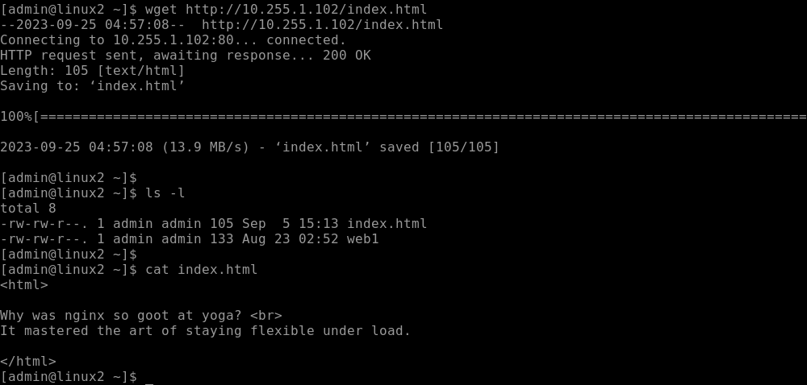
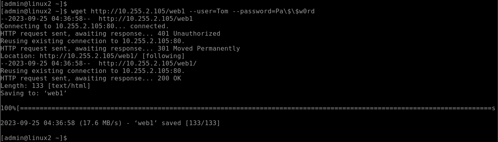
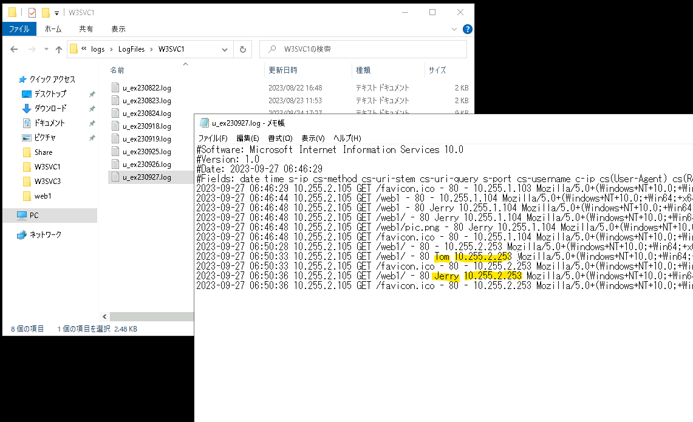

# Ciscoルータで実用的な企業ネットワークを構成する
---


## 演習の意図
    演習ガイドを参照して演習の意図をあらかじめ確認してください

## 演習の前提条件  
- Linux1のWebサーバー(NGINX)が構成済みであること
- Linux1のDNSサーバー(BIND)が構成済みであること
- Windows Server 2の Webサーバー(IIS)が構成済みであること
- Windows Server 2の DNSサーバーが構成済みであること

## 演習における役割と、環境のパラメータ
- X: ご自身のPod番号
- Router1: CSR1
- Router2: CSR2
- Network1: 10.X.1.0/24
- Network2: 10.X.2.0/24
- Network3: 10.X.3.0/24


## 注意
- 手順例の画像は<B>pod255</B>に準拠したパラメータのものです
- 手順内の<B>X</B>表記はご自身のpod番号に読み替えてください

---

## パケットフィルタ実装前の動作確認

1. Linux2の管理画面に接続する  

1. Linux2からWindows Server 1にDNS問い合わせができることを確認する  
    1. Linux2のコマンドラインで以下のコマンドを実行し、nslookupツールを開始する  
        ＞ ***nslookup***    

        ```
        [admin@linux2 ~]$ nslookup
        > 
        ```

    1. Linux2のコマンドラインのnslookupツールで以下のコマンドを実行し、Windows Server 1に "Web1.example.local." の名前解決要求を送信できることを確認する  
        ＞ ***server 10.X.1.104***  
        ＞ ***Web1.example.local.***   
        ＞ ***exit***   

            ```
            > server 10.255.1.104
            Default server: 10.255.1.104
            Address: 10.255.1.104#53
            > 
            > Web1.example.local.
            Server:10.255.1.104
            Address:10.255.1.104#53

            Web1.example.local canonical name = WSrv2-230802255.example.local.
            Name:WSrv2-230802255.example.local
            Address: 10.255.2.105
            > 
            > exit
            [admin@linux2 ~]$ 
            ```


1. Linux2からLinux1のWebサービスに接続できることを確認する  

    1. Linux2の管理画面に接続する  

    1. Linux2のコマンドラインで以下のコマンドを実行し、Linux1のWebサービスに接続できることを確認する  
        ＞ ***`wget http://10.X.1.102/index.html`***  
        ＞ ***ls***  
        ＞ ***cat index.html***

        ```
        [admin@linux2 ~]$ wget http://10.255.1.102/index.html
        --2023-09-25 04:45:01--  http://10.255.1.102/index.html
        Connecting to 10.255.1.102:80... connected.
        HTTP request sent, awaiting response... 200 OK
        Length: 105 [text/html]
        Saving to: ‘index.html’

        100%[======================================================>] 105         --.-K/s   in 0s      

        2023-09-25 04:45:01 (7.76 MB/s) - ‘index.html’ saved [105/105]

        [admin@linux2 ~]$ 
        [admin@linux2 ~]$ ls -l
        total 8
        -rw-rw-r--. 1 admin admin 105 Sep  5 15:13 index.html
        -rw-rw-r--. 1 admin admin 133 Aug 23 02:52 web1
        [admin@linux2 ~]$ 
        [admin@linux2 ~]$ cat index.html 
        <html>

        Why was nginx so goot at yoga? <br>
        It mastered the art of staying flexible under load.

        </html>
        [admin@linux2 ~]$ 
        ```

        <kbd></kbd>  


<!--

1. DNS動作確認の準備をする  
    1. nslookupを実行する
    ＞ ***nslookup***


    > 【補足】  
    > nslookupが実行できない場合は以下の手順を実行し、nslookupツールをインストールする 
    > ＞ sudo yum -y install bind-utils
    > ＞ yum list installed | grep bind-utils


        <details>
        <summary>[参考]yum実行時のログ出力例 (クリックで表示):</summary>

            ```
            [admin@linux2 ~]$ sudo yum -y install bind-utils
            Loaded plugins: langpacks
            Resolving Dependencies
            ーー> Running transaction check
            ーーー> Package bind-utils.x86_64 32:9.11.4-26.P2.el7_9.14 will be installed
            ーー> Finished Dependency Resolution

            Dependencies Resolved

            ========================================================================================================================================================================================
            Package                                 Arch                                Version                                               Repository                                      Size
            ========================================================================================================================================================================================
            Installing:
            bind-utils                              x86_64                              32:9.11.4-26.P2.el7_9.14                              updates-openlogic                              262 k

            Transaction Summary
            ========================================================================================================================================================================================
            Install  1 Package

            Total download size: 262 k
            Installed size: 584 k
            Downloading packages:
            bind-utils-9.11.4-26.P2.el7_9.14.x86_64.rpm                                                                                                                      | 262 kB  00:00:00     
            Running transaction check
            Running transaction test
            Transaction test succeeded
            Running transaction
            Installing : 32:bind-utils-9.11.4-26.P2.el7_9.14.x86_64                                                                                                                           1/1 
            Verifying  : 32:bind-utils-9.11.4-26.P2.el7_9.14.x86_64                                                                                                                           1/1 

            Installed:
            bind-utils.x86_64 32:9.11.4-26.P2.el7_9.14                                                                                                                                            

            Complete!
            [admin@linux2 ~]$ yum list installed | grep bind-utils
            bind-utils.x86_64              32:9.11.4-26.P2.el7_9.14       @updates-openlogic
            [admin@linux2 ~]$ 
            ```

        </details>

-->


1. Linux2からWindows Server 2のWebサービスに接続できることを確認する  

    1. コマンドラインで以下のコマンドを実行し、Windows Server 2のWebサービスに接続できることを確認する  
        ＞ ***`wget http://10.X.2.105/web1 --user=Tom --password=Pa\$\$w0rd`***  
        ＞ ***ls***  
        ＞ ***cat web1***  


        > 【補足】  
        > \$記号はBashにおいて特別な効果がある記号文字です。  
        > そのため、パスワード文字列としてそのまま入力することはできません。  
        > \$記号をただの文字として使用するためには、バックスラッシュ(\もしくは￥)記号を付与してエスケープします。   


        ```
        [admin@linux2 ~]$ wget http://10.255.2.105/web1 --user=Tom --password=Pa\$\$w0rd
        --2023-09-25 04:36:58--  http://10.255.2.105/web1
        Connecting to 10.255.2.105:80... connected.
        HTTP request sent, awaiting response... 401 Unauthorized
        Reusing existing connection to 10.255.2.105:80.
        HTTP request sent, awaiting response... 301 Moved Permanently
        Location: http://10.255.2.105/web1/ [following]
        --2023-09-25 04:36:58--  http://10.255.2.105/web1/
        Reusing existing connection to 10.255.2.105:80.
        HTTP request sent, awaiting response... 200 OK
        Length: 133 [text/html]
        Saving to: ‘web1’

        100%[==============================================>] 133         --.-K/s   in 0s      

        2023-09-25 04:36:58 (17.6 MB/s) - ‘web1’ saved [133/133]

        [admin@linux2 ~]$ 
        [admin@linux2 ~]$ ls -l
        total 12
        -rw-rw-r--. 1 admin admin  133 Aug 23 02:52 web1
        [admin@linux2 ~]$ 
        [admin@linux2 ~]$ cat web1
        <html>

        <font size="7">
        Let's HTML document!
        </font>

        

        <a href="document.txt">
        link
        </a>

        </html>

        [admin@linux2 ~]$ 
        ```


         <kbd></kbd>  


1. Linux2からWindows Server 2にDNS問い合わせができることを確認する  

    1. Linux2のコマンドラインのnslookupツールで以下のコマンドを実行し、Windows Server 2に "Web2.example.local." の名前解決要求を送信できることを確認する  
        ＞ ***nslookup***  
        ＞ ***server 10.X.2.105***  
        ＞ ***Web2.example.local.***   
        ＞ ***exit***   

        ```
        [admin@linux2 ~]$
        > server 10.255.2.105
        Default server: 10.255.2.105
        Address: 10.255.2.105#53
        > 
        > Web2.example.local.
        Server:10.255.2.105
        Address:10.255.2.105#53

        Web2.example.localc anonical name = Linux1.example.local.
        Name:Linux1.example.local
        Address: 10.255.1.102
        > 
        > exit
        [admin@linux2 ~]$
        ```


## Router2(CSR2)のACLを構成する  

<!--
- [x] Linux2(10.X.3.106)からWindows Server 1(10.X.1.104)へのDNS問い合わせを許可する   
- [x] 平日(月~金)は、NW3(10.X.3.0/24)からNW1(10.X.1.0/24)へのアクセスを禁止する   
- [x] 全ホストから、Windows Server 2のWebサービスへのアクセスを許可する   
- [x] これ以外のすべての通信を拒否し、logにカウントする   
-->


1. Router2(CSR2)の管理画面に接続する  

1. 拡張ACL "ACL_PACKETFILTER" を作成する 
    1. Router2(CSR2)で以下のコマンドを実行し、"ACL_PACKETFILTER"という名前の拡張ACLを作成する    
        CSR2# ***conf t***  
        CSR2(config)# ***ip access-list extended ACL_PACKETFILTER***   

        ```    
        CSR2# conf t  
        CSR2(config)# ip access-list extended ACL_PACKETFILTER   
        CSR2(config-ext-nacl)#  
        ```


    1. Router2(CSR2)で以下のコマンドを実行し、作成した拡張ACL "ACL_PACKETFILTER" にはまだエントリが登録されていないことを確認する    
        CSR2(config-ext-nacl)# ***do show ip access-list ACL_PACKETFILTER***  
        Extended IP access list ACL_PACKETFILTER   
        CSR2(config-ext-nacl)#   

        ```
        CSR2(config-ext-nacl)# do show ip access-list ACL_PACKETFILTER
        Extended IP access list ACL_PACKETFILTER
        CSR2(config-ext-nacl)#
        ```

1. Linux2からWindows Server 1へのDNS通信を許可する  

    1. Router2(CSR2)で以下のコマンドを実行し、Linux2(10.X.3.106)からWindows Server 1(10.X.1.104)へのDNS問い合わせを許可するエントリ (Access Control 条件式) を拡張ACL "ACL_PACKETFILTER" に登録する      
        CSR2(config-ext-nacl)# ***permit udp host 10.X.3.106 host 10.X.1.104 eq 53***  


        ```
        CSR2(config-ext-nacl)# permit udp host 10.255.3.106 host 10.255.1.104 eq 53  
        ```

    1. Router2(CSR2)で以下のコマンドを実行し、拡張ACL "ACL_PACKETFILTER" に登録されたエントリを確認する       
        CSR2(config-ext-nacl)# ***end***      
        CSR2# ***show ip access-list ACL_PACKETFILTER***   

        ```
        CSR2(config-ext-nacl)# end    
        CSR2# show ip access-list ACL_PACKETFILTER             
        Extended IP access list ACL_PACKETFILTER
            10 permit udp host 10.255.3.106 host 10.255.1.104 eq domain
        CSR2# 
        ```

        >【確認ポイント】  
        > 要件に沿ったAccess Control条件式が記述できていることを確認する  
        > - [x] Linux2(10.X.3.106)を送信元とし、Windows Server 1(10.X.1.104)のudp53番(DNS)を宛先とする通信をpermitしていること  

        >【補足】  
        > show ip access-list で表記されるdomainは、UDP 53番で通信するDNS(Domain Name System)を意味します。    

1. 平日(月~金)は、NW3(10.X.3.0/24)からNW1(10.X.1.0/24)へのアクセスを禁止する 

    1. Router2(CSR2)で以下のコマンドを実行し、タイムゾーン設定がUTCであることを確認する  
        CSR2# ***show clock***    
        7:58:03.663 UTC Mon Sep 25 2023  
        CSR2#   

        ```    
        CSR2# show clock  
        7:58:03.663 UTC Mon Sep 25 2023
        CSR2# 
        ```

    1. Router2(CSR2)で以下のコマンドを実行し、タイムゾーン設定をJSTに変更する    
        CSR2# ***conf t***  
        CSR2(config)# ***timezone JST 9***  
        CSR2(config)# ***end***  
        CSR2# ***show clock***  


        ```    
        CSR2# conf t
        CSR2(config)# timezone JST 9 
        CSR2(config)# end
        CSR2#
        CSR2# show clock  
        16:00:03.663 JST Mon Sep 25 2023
        CSR2#
        ```

    1. (オプション.省略可) もしも現在時刻が大きくズレている場合は、Router2(CSR2)で以下のコマンドを実行し、正しい現在時刻を設定する      
        CSR2# ***clock set 16:00:00 Sep 25 2023**  
        
        ```
        CSR2# show clock  
        15:00:03.663 JST Mon Sep 24 2022
        CSR2# 
        CSR2# clock set 16:00:00 Sep 25 2023
        CSR2# 
        CSR2# show clock  
        16:00:03.663 JST Mon Sep 25 2023
        CSR2# 
        ```

    1. Router2(CSR2)で以下のコマンドを実行し、平日(月~金)を定義するTime Range "WEEKDAYS" を構成する      
        CSR2# ***conf t***   
        CSR2(config)# ***time-range WEEKDAYS***    
        CSR2(config-time-range)# ***periodic Monday Friday 00:00 to 23:59***    
        CSR2(config-time-range)# ***end***   
        CSR2# ***show time-range***        


        ```
        CSR2# conf t
        CSR2(config)# 
        CSR2(config)# time-range WEEKDAYS 
        CSR2(config-time-range)# periodic Monday Friday 00:00 to 23:59 
        CSR2(config-time-range)# end
        CSR2# show time-range        
        time-range entry: WEEKDAYS (active)
        periodic Monday Friday 0:00 to 23:59
        CSR2#  
        ```


    1. Router2(CSR2)で以下のコマンドを実行し、Time Range "WEEKDAYS" (月~金)の期間はNW3(10.X.3.0/24)からNW1(10.X.1.0/24)へのアクセスを禁止するエントリ (Access Control 条件式) を拡張ACL "ACL_PACKETFILTER" に登録する          
        CSR2# ***conf t***  
        CSR2(config)# ***ip access-list extended ACL_PACKETFILTER***    
        CSR2(config-ext-nacl)# ***20 deny ip 10.X.3.0 0.0.0.255 10.X.1.0 0.0.0.255 time-range WEEKDAYS***  
        CSR2(config-ext-nacl)# ***do show ip access-list ACL_PACKETFILTER***    

        ```
        CSR2# conf t
        CSR2(config)# ip access-list extended ACL_PACKETFILTER  
        CSR2(config-ext-nacl)# 20 deny ip 10.255.3.0 0.0.0.255 10.255.1.0 0.0.0.255 time-range WEEKDAYS
        CSR2(config-ext-nacl)# do show ip access-list ACL_PACKETFILTER                            
        Extended IP access list ACL_PACKETFILTER
            10 permit udp host 10.255.3.106 host 10.255.1.104 eq domain
            20 deny ip 10.255.3.0 0.0.0.255 10.255.1.0 0.0.0.255 time-range WEEKDAYS (active)
        CSR2(config-ext-nacl)#
        ```

1. Windows Server 2のWebサービスへのアクセスを、全ての送信元IPアドレスに対して許可する  
    1. Router2(CSR2)で以下のコマンドを実行し、全ての送信元IPアドレスからWindows Server 2のWebサービスへのWeb通信を許可するエントリ (Access Control 条件式) を拡張ACL "ACL_PACKETFILTER" に登録する             
        CSR2(config-ext-nacl)# ***30 permit tcp any host 10.X.2.105 eq 80 443 1080***   
        CSR2(config-ext-nacl)# ***do show ip access-list ACL_PACKETFILTER***   


        ```
        CSR2(config-ext-nacl)# 30 permit tcp any host 10.255.2.105 eq 80 443 1080  
        CSR2(config-ext-nacl)# do show ip access-list ACL_PACKETFILTER 
        Extended IP access list ACL_PACKETFILTER
            10 permit udp host 10.255.3.106 host 10.255.1.104 eq domain
            20 deny ip 10.255.3.0 0.0.0.255 10.255.1.0 0.0.0.255 time-range WEEKDAYS (active)
            30 permit tcp any host 10.255.2.105 eq www 443 1080
        CSR2(config-ext-nacl)#
        ```

        > 【補足】  
        > Windows Server 2(WinSrv2)のIISでは、TCP80とTCP1080のサービスを現在提供しています。  
        > 後の演習で、TCP443番のサービスも提供するように構成します。  
        > TCP443番は、HTTPS通信で使用されます。  


1. ここまで条件で許可されなかった残りすべての通信を拒否し、マッチ回数をlogにカウントする   
    1. Router2(CSR2)で以下のコマンドを実行し、ここまでの条件で許可されなかったすべての通信を禁止してログにカウントするエントリ (Access Control 条件式) を拡張ACL "ACL_PACKETFILTER" に登録する             
        CSR2(config-ext-nacl)# ***99 deny ip any any log***   

        ```
        CSR2(config-ext-nacl)# 99 deny ip any any log   
        ```

    1. ここまでの手順で定義された拡張ACL "ACL_PACKETFILTER" のconfigを確認する  
        CSR2(config-ext-nacl)# ***end***   
        CSR2# ***show ip access-list ACL_PACKETFILTER***   

        ```
        CSR2(config-ext-nacl)# end   
        CSR2# sh ip access-list ACL_PACKETFILTER              
        Extended IP access list ACL_PACKETFILTER
            10 permit udp host 10.255.3.106 host 10.255.1.104 eq domain
            20 deny ip 10.255.3.0 0.0.0.255 10.255.1.0 0.0.0.255 time-range WEEKDAYS (active)
            30 permit tcp any host 10.255.2.105 eq www 443 1080
            99 deny ip any any log
        CSR2#  
        ```


## 拡張ACL(Access Control List)をインターフェイスに適用し、パケットフィルタを実装する  

1. 以下のコマンドを実行し、インターフェイス コンフィギュレーションのために GigabitEthernet 2を選択する  
    CSR2# ***conf t***  
    CSR2(config)# ***interface GigabitEthernet 2***   

    ```
    CSR2# ***conf t***
    CSR2(config)# interface GigabitEthernet 2
    CSR2(config-if)# 
    ```

1. 以下のコマンドを実行し、GigabitEthernet 2のインターフェイスにパケットフィルタとしての拡張ACLを着信方向(in)で適用する    
    CSR2(config-if)# ***ip access-group ACL_PACKETFILTER in***  
    CSR2(config-if)# ***end***  

    ```
    CSR2(config-if)# ip access-group ACL_PACKETFILTER in  
    CSR2(config-if)# end  
    CSR2#   
    ```


1. 以下のコマンドを実行し、GigabitEthernet 2のインターフェイスにパケットフィルタとして適用されたACLを確認する      
    CSR2# ***show ip interface GigabitEthernet 2***  
    
    ```
    CSR2# 
    CSR2#show ip interface GigabitEthernet 2 
    GigabitEthernet2 is up, line protocol is up
    Internet address is 10.255.3.254/24
    Broadcast address is 255.255.255.255
    Address determined by DHCP
    MTU is 1500 bytes
    Helper address is not set
    Directed broadcast forwarding is disabled
    Outgoing Common access list is not set 
    Outgoing access list is not set
    Inbound Common access list is not set 
    Inbound  access list is ACL_PACKETFILTER             ← "ACL_PACKETFILTER"がインターフェイスに適用されていることを確認する  
    Proxy ARP is enabled
    Local Proxy ARP is disabled
    CSR2# 
    ```

## パケットフィルターの動作を確認する  

1. Linux2の管理画面に接続する  

1. Linux2からWindows Server 2のWebサービスへの通信が成功することを確認する  
    ＞ ***`wget http://10.X.2.105/web1 --user=Tom --password=Pa\$\$w0rd`***  
    ＞ ***ls***  
    ＞ ***cat web1.1***  

    ```
    [admin@linux2 ~]$ wget http://10.255.2.105/web1 --user=Tom --password=Pa\$\$w0rd
    --2023-09-25 08:29:18--  http://10.255.2.105/web1
    Connecting to 10.255.2.105:80... connected.
    HTTP request sent, awaiting response... 401 Unauthorized
    Reusing existing connection to 10.255.2.105:80.
    HTTP request sent, awaiting response... 301 Moved Permanently
    Location: http://10.255.2.105/web1/ [following]
    --2023-09-25 08:29:18--  http://10.255.2.105/web1/
    Reusing existing connection to 10.255.2.105:80.
    HTTP request sent, awaiting response... 200 OK
    Length: 133 [text/html]
    Saving to: ‘web1.1’

    100%[=======================================>] 133         --.-K/s   in 0s      

    2023-09-25 08:29:18 (19.5 MB/s) - ‘web1.1’ saved [133/133]

    [admin@linux2 ~]$ 
    [admin@linux2 ~]$ ls -l
    total 16
    -rw-rw-r--. 1 admin admin 105 Sep  5 15:13 index.html
    -rw-rw-r--. 1 admin admin 133 Aug 23 02:52 web1
    -rw-rw-r--. 1 admin admin 133 Aug 23 02:52 web1.1
    [admin@linux2 ~]$ 
    [admin@linux2 ~]$ cat web1.1
    <html>

    <font size="7">
    Let's HTML document!
    </font>

    

    <a href="document.txt">
    link
    </a>

    </html>

    [admin@linux2 ~]$ 
    ```

    > 【補足】  
    > "30 permit tcp any host 10.255.2.105 eq www 443 1080"の条件を満たすためpermitと判定され、パケットフィルタで通信が許可されます。  

1. Linux2から、Linux1のWebサービスへの通信ができないことを確認する   
    ＞ wget http://10.X.1.102/index.html


    ```
    [admin@linux2 ~]$ wget http://10.255.1.102/index.html
    --2023-09-25 08:19:23--  http://10.255.1.102/index.html
    Connecting to 10.255.1.102:80... failed: No route to host.
    [admin@linux2 ~]$ 
    ```
    > 【補足】  
    > "20 deny ip 10.255.3.0 0.0.0.255 10.255.1.0 0.0.0.255 time-range WEEKDAYS"の条件を満たすためdenyと判定され、パケットフィルタで通信が禁止されます。  

1. Linux2からWindows Server 1にDNS問い合わせができることを確認する  
    1. Linux2のコマンドラインで以下のコマンドを実行し、nslookupツールを開始する  
        ＞ ***nslookup***    

    1. Linux2のコマンドラインのnslookupツールで以下のコマンドを実行し、Windows Server 1に "Web1.example.local." の名前解決要求を送信できることを確認する  
        ＞ ***server 10.X.1.104***  
        ＞ ***Web1.example.local.***   

        ```
        [admin@linux2 ~]$ nslookup
        > server 10.255.1.104
        Default server: 10.255.1.104
        Address: 10.255.1.104#53
        > 
        > Web1.example.local.
        Server:10.255.1.104
        Address:10.255.1.104#53

        Web1.example.local canonical name = WSrv2-230802255.example.local.
        Name:WSrv2-230802255.example.local
        Address: 10.255.2.105
        > 
        ```

        > 【補足】  
        > "10 permit udp host 10.255.3.106 host 10.255.1.104 eq domain"の条件を満たすためpermitと判定され、パケットフィルタで通信が許可されます。  


1. Linux2からWindows Server 2にDNS問い合わせができないことを確認する  

    1. Linux2のコマンドラインのnslookupツールで以下のコマンドを実行し、Windows Server 2に名前解決要求送信できないことを確認する  
        ＞ ***server 10.X.2.105***  
        ＞ ***Web2.example.local.***   
        ＞ ***exit***   

        ```
        > server 10.255.2.105
        Default server: 10.255.2.105
        Address: 10.255.2.105#53

        > 
        > Web2.example.local.

        ;; connection timed out; no servers could be reached
        > 
        > exit
        [admin@linux2 ~]$
        ```

        > 【補足】  
        > "99 deny ip any any log"の条件を満たすためdenyと判定され、パケットフィルタで通信が禁止されます。  

1. Router2(CSR2)で以下のコマンドを実行し、configを保存する      
    CSR2# ***write***


---  

## NAPTを構成する  

1. Router1(CSR1)の管理画面に接続する  

1. Router1(CSR1)で以下のコマンドを実行し、10.X.1.0/24のIPアドレスをpermitする標準ACLを作成する    

    CSR1# ***conf t***   
    CSR1(config)# ***ip access-list Standard ACL_NAPT***   
    CSR1(config-std-nacl)# ***permit 10.X.1.0 0.0.0.255 log***   
    CSR1(config-std-nacl)# ***exit***   

    ```
    CSR1#conf t
    Enter configuration commands, one per line.  End with CNTL/Z.
    CSR1(config)#ip access-list Standard ACL_NAPT  
    CSR1(config-std-nacl)#permit 10.255.1.0 0.0.0.255 log  
    CSR1(config-std-nacl)#exit  
    CSR1(config)#
    ```

1. Router1(CSR1)で以下のコマンドを実行し、内部ネットワークの送信元アドレスをGigabitEhternet2インターフェイスのIPアドレスに変換するNAPTを構成する    

    CSR1(config)# ***ip nat inside source list ACL_NAPT interface GigabitEthernet 2 overload***   

    ```
    CSR1(config)# ip nat inside source list ACL_NAPT interface GigabitEthernet 2 overload   
    ```

    > 【補足】  
    > overloadオプションは、1つのIPアドレスを共有するオプションです。  
    > NAPT(PAT、IPマスカレード、拡張NATとも)を構成します。  


1. Router1(CSR1)で以下のコマンドを実行し、GigabitEthernet1インターフェイスを内部(inside)に設定し、GigabitEthernet2インターフェイスを外部(outside)に設定する  
    CSR1(config)# ***interface gigabitEthernet 1***   
    CSR1(config-if)# ***ip nat inside***    
    CSR1(config-if)# ***exit***   
    CSR1(config)# ***interface gigabitEthernet 2***   
    CSR1(config-if)# ***ip nat outside***  
    CSR1(config-if)# ***end***    
    CSR1#   

    ```
    CSR1(config)# interface gigabitEthernet 1
    CSR1(config-if)# ip nat inside 
    CSR1(config-if)# exit 
    CSR1(config)# interface gigabitEthernet 2
    CSR1(config-if)# ip nat outside 
    CSR1(config-if)# end  
    CSR1#   
    ```


## NAPTの動作を確認する  

1. ClientのWebブラウザからWebアクセスし、NAPT経由でWebサーバー(Windows Server 2)と通信する      
    1. 操作コンピュータを変更するため、演習環境のトップページに戻る  
    1. Windows Client(WinClient)の管理画面に "admin" で接続する   
    1. WinClientでWebブラウザ(Google Chrome)を起動する  
    1. Webブラウザのアドレス欄に [http://Web1.example.local/web1] と入力し、[Enter]キーを押下する  
    1. 認証情報を入力するポップアップが表示されたことを確認する  
    1. 以下のパラメータを入力する  
        | 項目 | パラメータ |  
        | :----- | :----- |  
        | ユーザー名 | Tom |   
        | パスワード | Pa$$w0rd |   
    1. 上のパラメータを入力し、[ログイン]をクリックする  
    1. Webコンテンツにアクセスできることを確認する  


1. Windows Server 1のWebブラウザからWebアクセスし、NAPT経由でWebサーバー(Windows Server 2)と通信する      
    1. 操作コンピュータを変更するため、演習環境のトップページに戻る  
    1. Windows Server 1(WinSrv1)の管理画面に "admin" で接続する   
    1. WinSrv1(Google Chrome)を起動する  
    1. Webブラウザのアドレス欄に [http://Web1.example.local/web1] と入力し、[Enter]キーを押下する  
    1. 認証情報を入力するポップアップが表示されたことを確認する  
    1. 以下のパラメータを入力する  
        | 項目 | パラメータ |  
        | :----- | :----- |  
        | ユーザー名 | Jerry |   
        | パスワード | Pa$$w0rd |   
    1. 上のパラメータを入力し、[ログイン]をクリックする  
    1. Webコンテンツにアクセスできることを確認する  
  


1. Router1(CSR1)でアドレス変換の記録を確認する  
    1. Router1(CSR1)で以下のコマンドを実行してアドレス変換テーブルを表示し、WidClientとWinSrv1のアドレスがRouter1(CSR1)のGigabitEthernet2のIPアドレスに変換されていることを確認する        
    CSR1# ***show ip nat translations***


    ```
    CSR1#show ip nat translations 
    Total number of translations: 0

    CSR1#show ip nat translations 
    Pro  Inside global         Inside local          Outside local         Outside global
    tcp  10.255.2.253:5072     10.255.1.104:56706    10.255.2.105:3260     10.255.2.105:3260
    tcp  10.255.2.253:5066     10.255.1.104:56676    10.255.2.105:3260     10.255.2.105:3260
    tcp  10.255.2.253:5070     10.255.1.104:56679    10.255.2.105:80       10.255.2.105:80
    tcp  10.255.2.253:5065     10.255.1.103:60241    10.255.2.105:80       10.255.2.105:80
    tcp  10.255.2.253:5068     10.255.1.104:56677    10.255.2.105:3260     10.255.2.105:3260
    tcp  10.255.2.253:5062     10.255.1.104:63422    10.255.2.105:3260     10.255.2.105:3260
    tcp  10.255.2.253:5069     10.255.1.104:56678    10.255.2.105:80       10.255.2.105:80
    tcp  10.255.2.253:5064     10.255.1.103:60240    10.255.2.105:80       10.255.2.105:80
    tcp  10.255.2.253:5063     10.255.1.104:56675    10.255.2.105:3260     10.255.2.105:3260
    tcp  10.255.2.253:5071     10.255.1.104:56696    10.255.2.105:1080     10.255.2.105:1080
    tcp  10.255.2.253:5067     10.255.1.103:60243    10.255.2.105:1080     10.255.2.105:1080
    Total number of translations: 11

    CSR1#
    ```

    > 【確認ポイント】  
    > "Outside global" が "10.X.2.105:80" (Web1.example.local) であるNATエントリについて確認します。  
    > - [x] "Inside global" がCSR1のIPアドレスであること
    > - [x] "Inside local" がWidClientとWinSrv1のIPアドレスであること


    > 【補足】  
    > show ip nat translations で表示されるアドレス変換テーブルの各項目について、説明します。
    >
    > - "Inside global":   
    >   - 変換後の送信元IPアドレス  
    >   - 今回の構成では、CSR1のGigabitEther2のIPアドレス(10.X.2.253)  が使用される
    > 
    > - "Inside local":  
    >   - 変換前の送信元IPアドレス  
    >   - Windows ClientやWindows Server 1に設定されているIPアドレス(10.X.1.103や10.X.1.104)が表示される  
    > 
    > - "Outside local": 
    >   - 宛先IPアドレスについての内部ネットワーク固有の識別情報
    >   - 一部のNATシナリオで重要になる場合があるが、今回の演習では無視してよい
    > 
    > - "Outside global":
    >   - 宛先IPアドレス
    >   - 今回の動作確認においては、Web1.example.local(Windows Server 2)のIPアドレス(10.X.2.105)が表示される  
    > 　


1. Webサーバー(WinSrv2)のアクセスログを確認し、接続してきたクライアントの送信元IPアドレスが変換されていることを確認する  
    1. 操作コンピュータを変更するため、演習環境のトップページに戻る  
    1. Windows Server 2(WinSrv2)の管理画面に "admin" で接続する   
    1. "C:\\inetpub\\logs\\LogFiles\\W3SV1" フォルダを開く  
    1. logファイルを確認する  
        <kbd></kbd>   

        > 【確認ポイント】  
        > WinClientとWinSrv1が、1つのIPアドレス共用するNAPTを経てWebサーバー(Windows Server 2)と通信していることを確認する  
        > - [x] WinClient(Tom)の送信元IPアドレスが、10.X.2.253であること
        > - [x] WinSrv1(Jerry)の送信元IPアドレスが、10.X.2.253であること


## NAPTの構成を削除する  

> 【補足】  
> NAPT処理が演習環境で動作する一部のサービスの正常な動作を妨げる場合があります。  
> 後の演習を円滑に進めるために、NAPTの動作を確認して学習に区切りをつけた後、NAPT構成を削除します。  


1. Router1(CSR1)の管理画面に接続する 

1. Router1(CSR1)で以下のコマンドを実行し、NAPT構成を削除する    

    CSR1# ***conf t***   
    CSR1(config)# ***no ip nat inside source list ACL_NAPT interface GigabitEthernet 2 overload***   
    CSR1(config)# ***end***   

    ```
    CSR1#conf t
    Enter configuration commands, one per lin
    CSR1(config)# no ip nat inside source list ACL_NAPT interface GigabitEthernet 2 overload  
    CSR1(config)# end  
    CSR1#
    ``` 

1. Router1(CSR1)でconfigを保存する  
    CSR1# ***write***   


---  


## 静的ルーティングを削除する  

1. Router1(CSR1)のStatic Routeを削除する  
    1. Router1(CSR1)の管理画面に接続する 

    1. 以下のコマンドを実行し、10.0.0.0/8ネットワークについて現在のルーティングエントリを確認する    
        ＞ ***show ip route 10.0.0.0***  

        ```
        CSR1#show ip route 10.0.0.0
        Routing entry for 10.0.0.0/8, 5 known subnets
        Attached (4 connections)
        Variably subnetted with 2 masks
        C        10.255.1.0/24 is directly connected, GigabitEthernet1
        L        10.255.1.254/32 is directly connected, GigabitEthernet1
        C        10.255.2.0/24 is directly connected, GigabitEthernet2
        L        10.255.2.253/32 is directly connected, GigabitEthernet2
        S        10.255.3.0/24 [1/0] via 10.255.2.254
        CSR1#
        ```

        > 【確認ポイント】  
        > 10.X.3.0/24ネットワーク宛のルーティング情報として、Router2(CSR2)をNextHopとするStatic Routeが認識されていることを確認する  


    1. 以下のコマンドを実行し、特権モードからグローバルコンフィギュレーションモードに遷移する  
        ＞ ***conf t***  

        ```
        CSR1#conf t
        Enter configuration commands, one per line.  End with CNTL/Z.
        CSR1(config)#
        CSR1(config)#
        ```

    1. 以下のコマンドを実行し、Router1(CSR1)に作成されているStatic Routeを削除する    
        ＞ ***no ip route 10.X.3.0 255.255.255.0 10.X.2.254***  
        ＞ ***end***  
        ＞ ***show ip route 10.0.0.0***  

        ```
        CSR1(config)#no ip route 10.255.3.0 255.255.255.0 10.255.2.254
        CSR1(config)#end
        CSR1#show ip route 10.0.0.0
        Routing entry for 10.0.0.0/8, 4 known subnets
        Attached (4 connections)
        Variably subnetted with 2 masks
        C        10.255.1.0/24 is directly connected, GigabitEthernet1
        L        10.255.1.254/32 is directly connected, GigabitEthernet1
        C        10.255.2.0/24 is directly connected, GigabitEthernet2
        L        10.255.2.253/32 is directly connected, GigabitEthernet2
        CSR1#
        ```

1. Router2(CSR2)のStatic Routeを削除する  
    1. Router2(CSR2)の管理画面に接続する 

    1. 以下のコマンドを実行し、10.0.0.0/8ネットワークについて現在のルーティングエントリを確認する    
        ＞ ***show ip route 10.0.0.0***  

        ```
        CSR2#show ip route 10.0.0.0
        Routing entry for 10.0.0.0/8, 5 known subnets
        Attached (4 connections)
        Variably subnetted with 2 masks
        S        10.255.1.0/24 [1/0] via 10.255.2.253
        C        10.255.2.0/24 is directly connected, GigabitEthernet1
        L        10.255.2.254/32 is directly connected, GigabitEthernet1
        C        10.255.3.0/24 is directly connected, GigabitEthernet2
        L        10.255.3.254/32 is directly connected, GigabitEthernet2
        CSR2#
        ```

        > 【確認ポイント】  
        > 10.X.1.0/24ネットワーク宛のルーティング情報として、Router1(CSR1)をNextHopとするStatic Routeが認識されていることを確認する  


    1. 以下のコマンドを実行し、Router2(CSR2)に作成されているStatic Routeを削除する    
        ＞ ***conf t***  
        ＞ ***no ip route 10.X.1.0 255.255.255.0 10.X.2.253***  
        ＞ ***end***  
        ＞ ***show ip route 10.0.0.0***  

        ```
        CSR2#show ip route 10.0.0.0
        CSR2#conf t
        Enter configuration commands, one per line.  End with CNTL/Z.
        CSR2(config)#   
        CSR2(config)#no ip route 10.255.1.0 255.255.255.0 10.255.2.253
        CSR2(config)#end
        CSR2#show ip route 10.0.0.0
        Routing entry for 10.0.0.0/8, 4 known subnets
        Attached (4 connections)
        Variably subnetted with 2 masks
        C        10.255.2.0/24 is directly connected, GigabitEthernet1
        L        10.255.2.254/32 is directly connected, GigabitEthernet1
        C        10.255.3.0/24 is directly connected, GigabitEthernet2
        L        10.255.3.254/32 is directly connected, GigabitEthernet2
        CSR2#
        ```

1. リモートネットワーク間(10.X.1.0/24と10.X.3.0//24間)の通信ができなくなったことを確認する
    1. Router2(CSR2)の管理画面に接続する 

    1. 以下のコマンドを実行し、10.0.0.0/8ネットワークについて現在のルーティングエントリを確認する    
        ＞ ***ping 10.X.1.254 source 10.X.3.254***  

        ```
        CSR2#ping 10.255.1.254 source 10.255.3.254
        Type escape sequence to abort.
        Sending 5, 100-byte ICMP Echos to 10.255.1.254, timeout is 2 seconds:
        Packet sent with a source address of 10.255.3.254 
        .....
        Success rate is 0 percent (0/5)
        CSR2#
        ```


## Router1(CSR1)で、BGPを構成する  

1. Router1(CSR1)の管理画面に接続する 

1. 以下のコマンドを実行し、特権モードからグローバルコンフィギュレーションモードに遷移する  
    ＞ ***conf t***  

    ```
    CSR1#conf t
    Enter configuration commands, one per line.  End with CNTL/Z.
    CSR1(config)#
    ```


1. 以下のコマンドを実行し、AS番号 65001 としてBGPプロセスをRouter-ID 10.X.100.1で開始する  
    CSR1(config)# ***router bgp 65001***  
    CSR1(config-router)# ***bgp router-id 10.X.100.1***  


1. 以下のコマンドを実行し、BGPプロセスが開始されたことを確認する    
    CSR1(config-router)# ***do show ip protocols***

    ```
    CSR1(config-router)#do show ip protocols
    *** IP Routing is NSF aware ***

    Routing Protocol is "application"
    Sending updates every 0 seconds
    Invalid after 0 seconds, hold down 0, flushed after 0
    Outgoing update filter list for all interfaces is not set
    Incoming update filter list for all interfaces is not set
    Maximum path: 32
    Routing for Networks:
    Routing Information Sources:
        Gateway         Distance      Last Update
    Distance: (default is 4)

    Routing Protocol is "bgp 65001"
    Outgoing update filter list for all interfaces is not set
    Incoming update filter list for all interfaces is not set
    IGP synchronization is disabled
    Automatic route summarization is disabled
    Maximum path: 1
    Routing Information Sources:
        Gateway         Distance      Last Update
    Distance: external 20 internal 200 local 200

    CSR1(config-router)#
    ```

    > 【確認ポイント】  
    > Routing Protocol is "bgp 65001" のセクションが表示されていることを確認する  


1. 以下のコマンドを実行し、BGPネイバーとしてRouter2(CSR2)を指定する      
    CSR1(config-router)# ***neighbor 10.X.2.254 remote-as 65002***

    ```
    CSR1(config-router)#neighbor 10.255.2.254 remote-as 65002
    CSR1(config-router)#
    ```

1. 以下のコマンドを実行し、BGPネイバーのステータスを確認する  
    CSR1(config-router)# ***do show ip bgp summary***

    ```
    CSR1(config-router)#do show ip bgp summary
    BGP router identifier 10.255.100.1, local AS number 65001
    BGP table version is 1, main routing table version 1

    Neighbor        V           AS MsgRcvd MsgSent   TblVer  InQ OutQ Up/Down  State/PfxRcd
    10.255.2.254    4        65002       0       0        1    0    0 00:00:03 Idle

    CSR1(config-router)#
    ```

    > 【確認ポイント】  
    > Router2(CSR2)をBGPネイバーとして指定するパラメータが正しいことを確認する  
    > - [x] NeighborのIPアドレスが、Router2(CSR2)のIPアドレスであること  
    > - [x] AS番号が 65002 であること  
    > - [x] State/PfxRcdがIdleであること  
    
    > 【補足】  
    > State/PfxRcdの項には、ネイバーから受信した経路情報の個数が表示されます。    
    > 現時点ではまだRouter2(CSR2)のBGPが構成されていないため、数字ではなく Idle と表示されています。  


## Router2(CSR2)で、BGPを構成する  

1. Router2(CSR2)の管理画面に接続する 

1. 以下のコマンドを実行し、AS番号 65002 としてBGPプロセスをRouter-ID 10.X.100.2で開始する  

    CSR2(config)# ***router bgp  65002***  
    CSR2(config-router)# ***bgp router-id 10.X.100.2***   

1. 以下のコマンドを実行し、BGPプロセスが開始されたことを確認する    
    CSR2(config-router)# ***do show ip protocols***  


    ```
    CSR2(config)#router bgp  65002
    CSR2(config-router)#bgp router-id 10.255.100.2
    CSR2(config-router)#do show ip protocols
    *** IP Routing is NSF aware ***

    Routing Protocol is "application"
    Sending updates every 0 seconds
    Invalid after 0 seconds, hold down 0, flushed after 0
    Outgoing update filter list for all interfaces is not set
    Incoming update filter list for all interfaces is not set
    Maximum path: 32
    Routing for Networks:
    Routing Information Sources:
        Gateway         Distance      Last Update
    Distance: (default is 4)

    Routing Protocol is "bgp 65002"
    Outgoing update filter list for all interfaces is not set
    Incoming update filter list for all interfaces is not set
    IGP synchronization is disabled
    Automatic route summarization is disabled
    Maximum path: 1
    Routing Information Sources:
        Gateway         Distance      Last Update
    Distance: external 20 internal 200 local 200

    CSR2(config-router)#
    ```

    > 【確認ポイント】  
    > Routing Protocol is "bgp 65002" のセクションが表示されていることを確認する  


1. 以下のコマンドを実行し、Router1(CSR1)をAS番号65001のBGPネイバーとして構成する   
    CSR2(config-router)# ***neighbor 10.X.2.253 remote-as 65001***  

    ```
    CSR2(config-router)#neighbor 10.255.2.253 remote-as 65001
    ```


## BGPネイバー関係を確認する  

1. Router2(CSR2)の管理画面に接続する 

1. Router2(CSR2)で以下のコマンドを実行し、Router1(CSR1)とRouter2(CSR2)がBGPのネイバー(ピアリング)関係を構築していることを確認する  
    CSR2(config-router)# ***do show ip bgp summary***  

    ```
    CSR2(config-router)#do show ip bgp summary
    BGP router identifier 10.255.100.2, local AS number 65002
    BGP table version is 1, main routing table version 1

    Neighbor        V           AS MsgRcvd MsgSent   TblVer  InQ OutQ Up/Down  State/PfxRcd
    10.255.2.253    4        65001       4       4        1    0    0 00:00:02        0

    CSR2(config-router)#
    ```

    
    > 【確認ポイント】  
    > 10.X.2.253(Router1/CSR1)のエントリの "State/PfxRcd" が 0 であること (Idleでないこと) を確認する。  


1. Router2(CSR2)で以下のコマンドを実行し、Router2(CSR2)がまだ経路情報をRouter1(CSR1)から受信していないことを確認する   
    CSR2(config-router)# ***do show ip route***  

    ```
    CSR2(config-router)#do show ip route
    Codes: L - local, C - connected, S - static, R - RIP, M - mobile, B - BGP
        D - EIGRP, EX - EIGRP external, O - OSPF, IA - OSPF inter area 
        N1 - OSPF NSSA external type 1, N2 - OSPF NSSA external type 2
        E1 - OSPF external type 1, E2 - OSPF external type 2, m - OMP
        n - NAT, Ni - NAT inside, No - NAT outside, Nd - NAT DIA
        i - IS-IS, su - IS-IS summary, L1 - IS-IS level-1, L2 - IS-IS level-2
        ia - IS-IS inter area, * - candidate default, U - per-user static route
        H - NHRP, G - NHRP registered, g - NHRP registration summary
        o - ODR, P - periodic downloaded static route, l - LISP
        a - application route
        + - replicated route, % - next hop override, p - overrides from PfR
        & - replicated local route overrides by connected

    Gateway of last resort is 10.255.2.1 to network 0.0.0.0

    S*    0.0.0.0/0 [1/0] via 10.255.2.1
        10.0.0.0/8 is variably subnetted, 4 subnets, 2 masks
    C        10.255.2.0/24 is directly connected, GigabitEthernet1
    L        10.255.2.254/32 is directly connected, GigabitEthernet1
    C        10.255.3.0/24 is directly connected, GigabitEthernet2
    L        10.255.3.254/32 is directly connected, GigabitEthernet2
        168.63.0.0/32 is subnetted, 1 subnets
    S        168.63.129.16 [254/0] via 10.255.2.1
        169.254.0.0/32 is subnetted, 1 subnets
    S        169.254.169.254 [254/0] via 10.255.2.1
    CSR2(config-router)#
    ```

    > 【確認ポイント】  
    > ルーティングエントリ左端のCodeが "B" (BGP)である経路は、まだRouter1(CSR1)のルーティングテーブルには存在しないことを確認する。  


1. Router1(CSR1)の管理画面に接続する 

1. Router1(CSR1)で以下のコマンドを実行し、Router1(CSR1)がまだ経路情報をRouter2(CSR2)から受信していないことを確認する  
    CSR1(config-router)#  ***do show ip route***  

    ```
    CSR1(config-router)#do show ip route
    Codes: L - local, C - connected, S - static, R - RIP, M - mobile, B - BGP
        D - EIGRP, EX - EIGRP external, O - OSPF, IA - OSPF inter area 
        N1 - OSPF NSSA external type 1, N2 - OSPF NSSA external type 2
        E1 - OSPF external type 1, E2 - OSPF external type 2, m - OMP
        n - NAT, Ni - NAT inside, No - NAT outside, Nd - NAT DIA
        i - IS-IS, su - IS-IS summary, L1 - IS-IS level-1, L2 - IS-IS level-2
        ia - IS-IS inter area, * - candidate default, U - per-user static route
        H - NHRP, G - NHRP registered, g - NHRP registration summary
        o - ODR, P - periodic downloaded static route, l - LISP
        a - application route
        + - replicated route, % - next hop override, p - overrides from PfR
        & - replicated local route overrides by connected

    Gateway of last resort is 10.255.1.1 to network 0.0.0.0

    S*    0.0.0.0/0 [1/0] via 10.255.1.1
        10.0.0.0/8 is variably subnetted, 4 subnets, 2 masks
    C        10.255.1.0/24 is directly connected, GigabitEthernet1
    L        10.255.1.254/32 is directly connected, GigabitEthernet1
    C        10.255.2.0/24 is directly connected, GigabitEthernet2
    L        10.255.2.253/32 is directly connected, GigabitEthernet2
        168.63.0.0/32 is subnetted, 1 subnets
    S        168.63.129.16 [254/0] via 10.255.1.1
        169.254.0.0/32 is subnetted, 1 subnets
    S        169.254.169.254 [254/0] via 10.255.1.1
    CSR1(config-router)#
    ```

    > 【確認ポイント】  
    > ルーティングエントリ左端のCodeが "B" (BGP)である経路は、まだRouter1(CSR1)のルーティングテーブルには存在しないことを確認する。  


## BGPでネットワーク情報をアドバタイズする  

1. Router1(CSR1)の管理画面に接続する  

1. Router1(CSR1)で以下のコマンドを実行し、アドバタイズ対象のNW情報を確認する    
    CSR1(config-router)# ***do show ip route connected***   

    ```
    CSR1(config-router)#do show ip route connected 
    Codes: L - local, C - connected, S - static, R - RIP, M - mobile, B - BGP
        D - EIGRP, EX - EIGRP external, O - OSPF, IA - OSPF inter area 
        N1 - OSPF NSSA external type 1, N2 - OSPF NSSA external type 2
        E1 - OSPF external type 1, E2 - OSPF external type 2, m - OMP
        n - NAT, Ni - NAT inside, No - NAT outside, Nd - NAT DIA
        i - IS-IS, su - IS-IS summary, L1 - IS-IS level-1, L2 - IS-IS level-2
        ia - IS-IS inter area, * - candidate default, U - per-user static route
        H - NHRP, G - NHRP registered, g - NHRP registration summary
        o - ODR, P - periodic downloaded static route, l - LISP
        a - application route
        + - replicated route, % - next hop override, p - overrides from PfR
        & - replicated local route overrides by connected

    Gateway of last resort is 10.255.1.1 to network 0.0.0.0

        10.0.0.0/8 is variably subnetted, 5 subnets, 2 masks
    C        10.255.1.0/24 is directly connected, GigabitEthernet1
    L        10.255.1.254/32 is directly connected, GigabitEthernet1
    C        10.255.2.0/24 is directly connected, GigabitEthernet2
    L        10.255.2.253/32 is directly connected, GigabitEthernet2
    CSR1(config-router)#
    ```

    > 【確認ポイント】  
    > アドバタイズ対象のNWの情報を確認する   
    > - [x] 10.X.1.0/24の経路情報がルーティングテーブルにインストールされていること  


1. Router1(CSR1)で以下のコマンドを実行し、ネットワーク情報(10.X.1.0/24)をBGPでアドバタイズする    
    CSR1(config-router)# ***network 10.X.1.0 mask 255.255.255.0***  

    ```
    CSR1(config-router)#network 10.255.1.0 mask 255.255.255.0 
    ```

1. Router1(CSR1)で以下のコマンドを実行し、ネイバー(CSR2)にアドバタイズしている経路を確認する      
    CSR1(config-router)# ***do show ip bgp neighbors 10.255.2.254 advertised-routes***  

    ```
    CSR1(config-router)#do show ip bgp neighbors 10.255.2.254 advertised-routes
    BGP table version is 2, local router ID is 10.255.100.1
    Status codes: s suppressed, d damped, h history, * valid, > best, i - internal, 
                r RIB-failure, S Stale, m multipath, b backup-path, f RT-Filter, 
                x best-external, a additional-path, c RIB-compressed, 
                t secondary path, L long-lived-stale,
    Origin codes: i - IGP, e - EGP, ? - incomplete
    RPKI validation codes: V valid, I invalid, N Not found

        Network          Next Hop            Metric LocPrf Weight Path
    *>   10.255.1.0/24    0.0.0.0                  0         32768 i

    Total number of prefixes 1 
    CSR1(config-router)#
    ```


    > 【確認ポイント】  
    > 10.X.1.0/24のNWの情報がRouter2(CSR2)にアドバタイズされていることを確認する   
    > - [x] 10.X.1.0/24の経路情報が表示されていること  


1. Router2(CSR2)の管理画面に接続する  

1. Router2(CSR2)で以下のコマンドを実行してルーティングテーブルを表示し、Router1(CSR1)からBGPでアドバタイズされた経路を学習していることを確認する      
    CSR2(config-router)# ***do show ip route***   

    ```
    CSR2(config-router)#do show ip route                                 
    Codes: L - local, C - connected, S - static, R - RIP, M - mobile, B - BGP
        D - EIGRP, EX - EIGRP external, O - OSPF, IA - OSPF inter area 
        N1 - OSPF NSSA external type 1, N2 - OSPF NSSA external type 2
        E1 - OSPF external type 1, E2 - OSPF external type 2, m - OMP
        n - NAT, Ni - NAT inside, No - NAT outside, Nd - NAT DIA
        i - IS-IS, su - IS-IS summary, L1 - IS-IS level-1, L2 - IS-IS level-2
        ia - IS-IS inter area, * - candidate default, U - per-user static route
        H - NHRP, G - NHRP registered, g - NHRP registration summary
        o - ODR, P - periodic downloaded static route, l - LISP
        a - application route
        + - replicated route, % - next hop override, p - overrides from PfR
        & - replicated local route overrides by connected

    Gateway of last resort is 10.255.2.1 to network 0.0.0.0

    S*    0.0.0.0/0 [1/0] via 10.255.2.1
        10.0.0.0/8 is variably subnetted, 5 subnets, 2 masks
    B        10.255.1.0/24 [20/0] via 10.255.2.253, 00:00:12
    C        10.255.2.0/24 is directly connected, GigabitEthernet1
    L        10.255.2.254/32 is directly connected, GigabitEthernet1
    C        10.255.3.0/24 is directly connected, GigabitEthernet2
    L        10.255.3.254/32 is directly connected, GigabitEthernet2
        168.63.0.0/32 is subnetted, 1 subnets
    S        168.63.129.16 [254/0] via 10.255.2.1
        169.254.0.0/32 is subnetted, 1 subnets
    S        169.254.169.254 [254/0] via 10.255.2.1
    CSR2(config-router)#
    ```

    > 【確認ポイント】  
    > 10.X.1.0/24のNWの情報がRouter2(CSR2)にBGPでアドバタイズされていることを確認する   
    > - [x] 10.X.1.0/24の経路情報が、ルーティングテーブルにインストールされていること  
    > - [x] 10.X.1.0/24の経路情報をBGPで学習していること(左端にBと表記されていること)   
    > - [x] 10.X.1.0/24のNextHopがRouter2(10.X.2.253)であること  


1. Router2(CSR2)で以下のコマンドを実行し、アドバタイズ対象のNW情報を確認する    
    CSR2(config-router)# ***do show ip route connected***   

    ```
    CSR2(config-router)#do show ip route connected
    Codes: L - local, C - connected, S - static, R - RIP, M - mobile, B - BGP
        D - EIGRP, EX - EIGRP external, O - OSPF, IA - OSPF inter area 
        N1 - OSPF NSSA external type 1, N2 - OSPF NSSA external type 2
        E1 - OSPF external type 1, E2 - OSPF external type 2, m - OMP
        n - NAT, Ni - NAT inside, No - NAT outside, Nd - NAT DIA
        i - IS-IS, su - IS-IS summary, L1 - IS-IS level-1, L2 - IS-IS level-2
        ia - IS-IS inter area, * - candidate default, U - per-user static route
        H - NHRP, G - NHRP registered, g - NHRP registration summary
        o - ODR, P - periodic downloaded static route, l - LISP
        a - application route
        + - replicated route, % - next hop override, p - overrides from PfR
        & - replicated local route overrides by connected

    Gateway of last resort is 10.255.2.1 to network 0.0.0.0

        10.0.0.0/8 is variably subnetted, 5 subnets, 2 masks
    C        10.255.2.0/24 is directly connected, GigabitEthernet1
    L        10.255.2.254/32 is directly connected, GigabitEthernet1
    C        10.255.3.0/24 is directly connected, GigabitEthernet2
    L        10.255.3.254/32 is directly connected, GigabitEthernet2
    CSR2(config-router)#
    ```

    > 【確認ポイント】  
    > アドバタイズ対象のNWの情報を確認する   
    > - [x] 10.X.3.0/24の経路情報がルーティングテーブルにインストールされていること  


1. Router2(CSR2)で以下のコマンドを実行し、ネットワーク情報(10.X.3.0/24)をBGPでアドバタイズする    
    CSR2(config-router)# ***network 10.X.3.0 mask 255.255.255.0***


1. Router2(CSR2)で以下のコマンドを実行し、ネイバー(CSR1)にアドバタイズしている経路を確認する      
    CSR2(config-router)# ***do show ip bgp neighbors 10.X.2.253 advertised-routes***  

    ```
    CSR2(config-router)#do show ip bgp neighbors 10.255.2.253 advertised-routes
    BGP table version is 3, local router ID is 10.255.100.2
    Status codes: s suppressed, d damped, h history, * valid, > best, i - internal, 
                r RIB-failure, S Stale, m multipath, b backup-path, f RT-Filter, 
                x best-external, a additional-path, c RIB-compressed, 
                t secondary path, L long-lived-stale,
    Origin codes: i - IGP, e - EGP, ? - incomplete
    RPKI validation codes: V valid, I invalid, N Not found

        Network          Next Hop            Metric LocPrf Weight Path
    *>   10.255.3.0/24    0.0.0.0                  0         32768 i

    Total number of prefixes 1 
    CSR2(config-router)#
    ```

    > 【確認ポイント】  
    > 10.X.3.0/24のNWの情報がRouter1(CSR1)にアドバタイズされていることを確認する   
    > - [x] 10.X.3.0/24の経路情報が表示されていること  


1. Router1(CSR1)の管理画面に接続する  

1. Router1(CSR1)で以下のコマンドを実行してルーティングテーブルを表示し、Router2(CSR2)からBGPでアドバタイズされた経路を学習していることを確認する      
    CSR1(config-router)# ***do show ip route***   


    ```
    CSR1(config-router)#do show ip route                                 
    Codes: L - local, C - connected, S - static, R - RIP, M - mobile, B - BGP
        D - EIGRP, EX - EIGRP external, O - OSPF, IA - OSPF inter area 
        N1 - OSPF NSSA external type 1, N2 - OSPF NSSA external type 2
        E1 - OSPF external type 1, E2 - OSPF external type 2, m - OMP
        n - NAT, Ni - NAT inside, No - NAT outside, Nd - NAT DIA
        i - IS-IS, su - IS-IS summary, L1 - IS-IS level-1, L2 - IS-IS level-2
        ia - IS-IS inter area, * - candidate default, U - per-user static route
        H - NHRP, G - NHRP registered, g - NHRP registration summary
        o - ODR, P - periodic downloaded static route, l - LISP
        a - application route
        + - replicated route, % - next hop override, p - overrides from PfR
        & - replicated local route overrides by connected

    Gateway of last resort is 10.255.1.1 to network 0.0.0.0

    S*    0.0.0.0/0 [1/0] via 10.255.1.1
        10.0.0.0/8 is variably subnetted, 5 subnets, 2 masks
    C        10.255.1.0/24 is directly connected, GigabitEthernet1
    L        10.255.1.254/32 is directly connected, GigabitEthernet1
    C        10.255.2.0/24 is directly connected, GigabitEthernet2
    L        10.255.2.253/32 is directly connected, GigabitEthernet2
    B        10.255.3.0/24 [20/0] via 10.255.2.254, 00:00:06
        168.63.0.0/32 is subnetted, 1 subnets
    S        168.63.129.16 [254/0] via 10.255.1.1
        169.254.0.0/32 is subnetted, 1 subnets
    S        169.254.169.254 [254/0] via 10.255.1.1
    CSR1(config-router)#
    ```


## リモートネットワーク間の疎通を確認する  

1. Router1(CSR1)の管理画面に接続する  

1. Router1(CSR1)で以下のコマンドを実行し、リモートネットワーク間(10.X.1.0/24と10.X.3.0/24間)で通信できることを確認する      
    CSR1(config-router)# ***end***   
    CSR1# ***ping 10.X.3.254 source 10.X.1.254***  

    ```
    CSR1(config-router)#end
    CSR1#ping 10.255.3.254 source 10.255.1.254
    Type escape sequence to abort.
    Sending 5, 100-byte ICMP Echos to 10.255.3.254, timeout is 2 seconds:
    Packet sent with a source address of 10.255.1.254 
    !!!!!
    Success rate is 100 percent (5/5), round-trip min/avg/max = 1/1/2 ms
    CSR1#
    ```

    > 【確認ポイント】  
    > 10.X.1.254と10.X.3.254の間でping疎通が確立できることを確認する   
    > - [x] pingコマンドの実行結果が ! であること

1. Router1(CSR1)で以下のコマンドを実行し、configを保存する        
    CSR1# ***write***   

    ```    
    CSR1#write
    Building configuration...
    [OK]
    CSR1#
    ```


1. Router2(CSR2)の管理画面に接続する  

1. Router2(CSR2)で以下のコマンドを実行し、configを保存する        
    CSR2# ***write***   

    ```    
    CSR2#write
    Building configuration...
    [OK]
    CSR2#
    ```


## 演習完了  
ここまでの手順で、以下の項目を学習できました。
- [x] ACL(Access Control List)を構成する  
- [x] ACLでパケットフィルタを実装する  
- [x] アドレス変換(NAPT)を構成する  
- [x] リモートルーターとBGPピアリングを構成する  
- [x] networkコマンドでBGPルートを生成し、BGPネイバーにアドバタイズする
