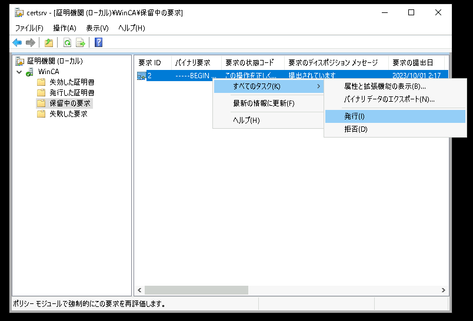
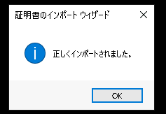

# Windows ServerでPKI環境を構築する

---

## 演習における役割と、環境のパラメータ
- X: ご自身のPod番号  
- 認証局(証明書サーバー)役: WinSrv1(WSrv1-yyMMddX)  
- HTTPS Webサーバー役: WinSrv2(WSrv2-yyMMddX)
- クライアント デスクトップ環境: WinClient(WC1-yyMMddX)  

## 注意
- 手順例の画像は<B>pod255</B>に準拠したパラメータのものです
- 手順内の<B>X</B>表記はご自身のpod番号に読み替えてください

---

## Active Directory証明書サービスの役割を追加  
1. Windows 認証局(WinSrv1)の管理画面に接続する  

1. 役割と機能の追加ウィザードを開始する  
    1. [スタートメニュー]をクリックする  
    1. スタートメニュー内の[サーバー マネージャー]をクリックし、サーバーマネージャを起動する    
    1. サーバーマネージャーのダッシュボード画面内の[役割と機能の追加]をクリックする   
    1. [役割と機能の追加ウィザード]ウィンドウが起動したことを確認する  

1. Active Directory証明書サービスの役割を追加する
    1. [役割と機能の追加ウィザード]ウィンドウの[開始する前に]画面で、[次へ]をクリックする  
    1. [インストールの種類]画面で、[次へ]をクリックする  
    1. [サーバーの選択]画面で、[次へ]をクリックする  
    1. [サーバーの役割]画面で、以下のパラメータを選択する  

        - [x] Active Directory証明書サービス   
    
        > 【補足】  
        > "Active Directory証明書サービス"のチェックをつけると、[Active Directory証明書サービスに必要な機能を追加しますか？]の確認ポップアップが表示されます。  
        > [Active Directory証明書サービスに必要な機能を追加しますか？]ウィンドウで、[機能の追加] をクリックします。  

        <kbd></kbd>  

    1. [サーバーの役割]画面で、上のパラメータを選択したことを確認し、[次へ]をクリックする  
    1. [機能の選択]画面で、[次へ]をクリックする  
    1. [AD CS]画面で、[次へ]をクリックする   
    1. [役割サービス]画面で、以下のパラメータを選択する  

        - [x] 証明機関
        - [ ] オンラインレスポンダー
        - [ ] ネットワークデバイス登録サービス  
        - [x] 証明機関Web登録
        - [ ] 証明書の登録Webサービス  
        - [ ] 証明書の登録ポリシーWebサービス   

        > 【補足】  
        > "証明機関Web登録"のチェックをつけると、[証明機関Web登録 に必要な機能を追加しますか？]の確認ポップアップが表示されます。  
        > [証明機関Web登録 に必要な機能を追加しますか？]ウィンドウで、[機能の追加] をクリックします。  

    1. [役割サービス]画面で、[次へ]をクリックする  
    1. [Webサーバーの役割(IIS)]画面で、[次へ]をクリックする  
    1. [役割サービスの選択]画面で、[次へ]をクリックする  
        <kbd></kbd>  
    1. [確認]画面で、[インストール]をクリックする  
    1. [結果]画面で、インストール進捗を示すプログレスバーが右端に到達するまで数分間待機する  
    1. [結果]画面で、インストールが正常に完了したことを確認し、[閉じる]をクリックする  
        <kbd></kbd> 

## Active Directory証明書サービスを構成する   
1. Windows 認証局(WinSrv1)の管理画面に接続する  

1. Active Directory証明書サービス構成ウィザードを開始する  
    1. サーバーマネージャを起動する    
    1. サーバーマネージャーのダッシュボード画面上部の通知アイコンをクリックし、"展開後構成"の[対象サーバーにActive Directory証明書サービスを構成する]をクリックする  
        <kbd></kbd>      
    1. [AD CSの構成]ウィンドウが起動したことを確認する  
        <kbd></kbd>  

1. AD CS(Active Directory証明書サービス)を構成する    

    1. [AD CS構成]ウィンドウの[資格情報]画面で、[次へ]をクリックする  
    1. [AD CS構成]ウィンドウの[役割サービス]画面で、以下のパラメータを選択する   

        構成する役割サービスの選択:  
        - [x] 証明機関  
        - [x] 証明機関Web登録
        - [ ] オンラインレスポンダー
        - [ ] ネットワークデバイス登録サービス
        - [ ] 証明書の登録Webサービス  
        - [ ] 証明書の登録ポリシーWebサービス   

        <kbd></kbd>  

    1. [AD CS構成]ウィンドウの[役割サービス]画面で、[次へ]をクリックする    

    1. [AD CS構成]ウィンドウの[セットアップの種類]画面で、以下のパラメータを選択する   
        
        - [ ] エンタープライズCA
        - [x] スタンドアロンCA  

        <kbd></kbd>  

    1. [AD CS構成]ウィンドウの[セットアップの種類]画面で、[次へ]をクリックする    

    1. [AD CS構成]ウィンドウの[CAの種類]画面で、以下のパラメータを選択する   
        
        - [x] ルートCA
        - [ ] 下位CA   

        <kbd></kbd>  

    1. [AD CS構成]ウィンドウの[CAの種類]画面で、[次へ]をクリックする    

    1. [AD CS構成]ウィンドウの[秘密キー]画面で、以下のパラメータを選択する   
        
        - [x] 新しい秘密キーを作成する
        - [ ] 既存の秘密キーを使用する     
            - [ ] 証明書を選択し、関連付けられている秘密キーを使用する       
            - [ ] このコンピューターの既存の秘密キーを選択する       

        <kbd></kbd>  

    1. [AD CS構成]ウィンドウの[秘密キー]画面で、[次へ]をクリックする    

    1. [AD CS構成]ウィンドウの[暗号化]画面で、以下のパラメータを選択する   
        
        暗号化プロバイダーの選択:  
        | RSA#Microsoft Software Key Storage Privoder | 
        | :----- | 

        キー長の選択:  
        | 2048 | 
        | :----- | 

        このCAから発行された証明書の署名に使用するハッシュアルゴリズムを選択:  
        | SHA256 | 
        | :----- | 

        - [ ] CAが秘密キーにアクセスするときに、管理者による操作を許可する       
   

        <kbd></kbd>  

    1. [AD CS構成]ウィンドウの[暗号化]画面で、[次へ]をクリックする    

    1. [AD CS構成]ウィンドウの[CAの名前]画面で、以下のパラメータを入力する   
        
        このCAの共通名:  
        | WinCA | 
        | :----- | 

        識別名のサフィックス:  
        | DC=example, DC=local | 
        | :----- | 

        識別名のプレビュー:  
        | CN=WinCA, DC=example, DC=local | 
        | :----- | 
   

        <kbd></kbd>  

    1. [AD CS構成]ウィンドウの[CAの名前]画面で、[次へ]をクリックする    

    1. [AD CS構成]ウィンドウの[有効期間]画面で、以下のパラメータを入力する   
        
        この証明機関(CA)に対して生成される証明書の有効期間を選択:  
        | 5 年間 | 
        | :----- | 

        <kbd></kbd>  

    1. [AD CS構成]ウィンドウの[有効期間]画面で、[次へ]をクリックする    

    1. [AD CS構成]ウィンドウの[CAデータベース]画面で、以下のパラメータを入力する   
        
        証明書データベースの場所:   
        | C:\\Windows\\system32\\CertLog | 
        | :----- | 

        証明書データベースのログの場所:   
        | C:\\Windows\\system32\\CertLog | 
        | :----- | 

        <kbd></kbd>  

    1. [AD CS構成]ウィンドウの[CAデータベース]画面で、[次へ]をクリックする    

    1. [AD CS構成]ウィンドウの[確認]画面で、[構成]をクリックする  
         <kbd></kbd>         

    1. [AD CS構成]ウィンドウの[結果]画面で、[閉じる]をクリックする  
         <kbd></kbd>         

## Active Directory証明書サービスを構成後の確認   

1. Windows 認証局(WinSrv1)の管理画面に接続する  

1. 証明機関管理コンソールを起動できることを確認する    
    1. サーバーマネージャーウィンドウ右上の[ツール]をクリックする  
    1. メニュー内の[証明機関]をクリックし、証明機関管理コンソールを起動する  
        <kbd></kbd> 
    1. [証明機関]管理コンソールが起動したことを確認する
        <kbd></kbd> 

1. 認証局としての自己署名証明書(ルート証明書)が作成されていることを確認する  
    1. [証明書]管理コンソールを起動する
        1. Windows スタートメニューを右クリックし、コンテキストメニュー内の[ファイル名を指定して実行]をクリックする  
        1. [ファイル名を指定して実行]ウィンドウが起動したことを確認する  
        1. [ファイル名を指定して実行]ウィンドウで、以下のパラメータを入力する  

            名前:   
            | certlm.msc | 
            | :----- | 

            <kbd></kbd> 

        1. [ファイル名を指定して実行]ウィンドウで、[OK]をクリックする    

        1. [ユーザーアカウント制御]のポップアップで、[はい]をクリックする  

        1. [証明書]管理コンソールが起動したことを確認する  

            <kbd></kbd>  

    1. Windows Server 2が所有している電子証明書を確認する          
        1. 左側コンソールツリーの[証明書 - ローカル コンピューター]-[個人]-[証明書]をクリックする  
            <kbd></kbd>  
        1. ウィンドウ右側ペインの証明書の一覧を参照し、発行者が "WinCA" である証明書をクリックして選択する  
        1. "WinCA" の証明書を右クリックし、コンテキストメニュー内の[開く]をクリックする    
            <kbd></kbd>  
        1. [証明書]ウィンドウが表示されたことを確認する  
            <kbd></kbd>  
    
    1. 証明書のパラメータを確認する   

        1. [証明書]ウィンドウの[全般]タブに記載されているパラメータを確認する  

            > 【確認ポイント】  
            > - [x] 発行先 が "WinCA" であること   
            > - [x] 発行者 が "WinCA" であること    
            > - [x] "この証明書に対応する秘密キーを持っています"と表記されていること  

        1. [証明書]ウィンドウの[詳細]タブに記載されているパラメータを確認する  

            > 【確認ポイント】  
            > - [x] 有効期間の開始 が 現在日時よりも前であること   
            > - [x] 有効期間の終了 が 現在日時よりも後であること   
            > - [x] 発行者 が "WinCA, example, local" であること   
            > - [x] サブジェクト が "WinCA, example, local" であること   
            
            <kbd></kbd>  
    
        1. [証明書]ウィンドウの[証明のパス]タブに記載されているパラメータを確認する  

            > 【確認ポイント】  
            > - [x] "WinCA"の"証明書の状態"が "この証明書は問題ありません。" であること  

            <kbd></kbd>  

1. 証明機関Web登録サービスが起動していることを確認する  

    1. IIS管理コンソールを起動する  
        1. サーバーマネージャーウィンドウ右上の[ツール]をクリックする  
        1. メニュー内の[インターネット インフォメーション サービス(IIS) マネージャー]をクリックし、IIS管理コンソールを起動する  
        1. [インターネット インフォメーション サービス(IIS) マネージャー]が起動したことを確認する  
    
    1. CertSrvアプリケーションが動作していることを確認する  
        1. 左側コンソールツリーの[＜サーバー名＞]-[サイト]-[Default Web Site]-[CertSrv]をクリックする          
        1. ウィンドウ右側ペインの[アプリケーションの管理]メニューの[*:80(http)参照]をクリックする  
            <kbd></kbd>  
        1. Webブラウザ(Microsoft Edge)が起動したことを確認する  

    1. 証明機関Web登録サービスのWebアプリケーションにアクセスできることを確認する  
            <kbd></kbd>  

---  

## Window Server 2で証明書署名要求(CSR)を作成する  

1. HTTPS Webサーバー(WinSrv2)の管理画面に接続する  

1. [証明書]管理コンソールを起動する
    1. Windows スタートメニューを右クリックし、コンテキストメニュー内の[ファイル名を指定して実行]をクリックする  
    1. [ファイル名を指定して実行]ウィンドウが起動したことを確認する  
    1. [ファイル名を指定して実行]ウィンドウで、以下のパラメータを入力する  

        名前:   
        | certlm.msc | 
        | :----- | 

    1. [ファイル名を指定して実行]ウィンドウで、[OK]をクリックする    
    1. [ユーザーアカウント制御]のポップアップで、[はい]をクリックする  
    1. [証明書]管理コンソールが起動したことを確認する  

1. カスタム要求の作成ウィザードを起動する  
    1. 左側コンソールツリーの[証明書 - ローカル コンピューター]-[個人]-[証明書]をクリックする  
    1. 左側コンソールツリーの[証明書 - ローカル コンピューター]-[個人]-[証明書]を右クリックし、コンテキストメニュー内の[すべてのタスク]-[詳細設定操作]-[カスタム要求の作成]をクリックする  
        <kbd></kbd> 
    1. [証明書の登録]ウィンドウが表示されたことを確認する  
        <kbd></kbd> 

1. カスタム要求を作成する  
    1. [証明書の登録]ウィンドウの[開始する前に]画面で、[次へ]をクリックする  
        <kbd></kbd> 
    1. [証明書の登録]ウィンドウの[証明書の登録ポリシーの選択]画面で、[次へ]をクリックする  
        <kbd></kbd> 
    1. [証明書の登録]ウィンドウの[カスタム要求]画面で、[次へ]をクリックする  
        <kbd></kbd> 
    1. [証明書の登録]ウィンドウの[証明書情報]画面で、[詳細]の展開ボタンをクリックする  
    1. [証明書の登録]ウィンドウの[証明書情報]画面で、[プロパティ]をクリックする  
        <kbd></kbd> 
    1. [証明書のプロパティ]ウィンドウが表示されたことを確認する    
        <kbd></kbd> 

    1. [証明書のプロパティ]ウィンドウの[全般]タブで、以下のパラメータを入力する     

        フレンドリ名:   
        | HttpsCert | 
        | :----- | 

        説明:   
        | <空欄> | 

        <kbd></kbd> 

    1. [証明書のプロパティ]ウィンドウの[全般]タブで、[適用]をクリックする      
    1. [証明書のプロパティ]ウィンドウの[サブジェクト]タブをクリックして選択する  
        <kbd></kbd>  

    1. [証明書のプロパティ]ウィンドウの[サブジェクト]タブで、以下のパラメータを入力する     

        共通名:   
        | CN=WinSrv2.example.local |     
        | :----- | 

        別名:   
        | DNS | 
        | :----- | 
        | Web1.example.local |

        | IPアドレス(v4) | 
        | :----- | 
        | 10.X.2.105 |

        <kbd></kbd> 

        詳細手順:  

        1. "サブジェクト名" の "種類" で、 "共通名" を選択する  
        1. "サブジェクト名" の "値" に、"WinSrv2.example.local" を入力する
        1. "サブジェクト名" の [追加] をクリックする  
        1. "サブジェクト名" として "CN=WinSrv2.example.local" が追加されたことを確認する  
        1. "別名" の "種類" で、 "DNS" を選択する  
        1. "別名" の "値" に、"Web1.example.local" を入力する
        1. "別名" の [追加] をクリックする  
        1. "別名" として "DNS Web1.example.local" が追加されたことを確認する  
        1. "別名" の "種類" で、 "IPアドレス(v4)" を選択する  
        1. "別名" の "値" に、"10.X.2.105" を入力する
        1. "別名" の [追加] をクリックする  
        1. "別名" として "IPアドレス(v4) 10.X.2.105" が追加されたことを確認する  

    1. [証明書のプロパティ]ウィンドウの[サブジェクト]タブで、[適用]をクリックする  

    1. [証明書のプロパティ]ウィンドウの[拡張機能]タブをクリックして選択する    
        <kbd></kbd>  

    1. [証明書のプロパティ]ウィンドウの[拡張機能]タブの[キー使用法]の展開ボタンをクリックする      
        <kbd></kbd>  

    1. [証明書のプロパティ]ウィンドウの[拡張機能]タブの[キー使用法]で、以下のパラメータを選択する        

        | 選択されたオプション |     
        | :----- | 
        | デジタル署名 |
        | キーの暗号化 |

        <kbd></kbd>  

        詳細手順:  

        1. "キー使用法" の "利用可能なオプション" で、 "デジタル署名" をクリックして選択する  
        1. "キー使用法" の [追加] をクリックする  
        1. "キー使用法" の "利用可能なオプション" で、 "キーの暗号化" をクリックして選択する  
        1. "キー使用法" の [追加] をクリックする  

    1. [証明書のプロパティ]ウィンドウの[拡張機能]タブの[拡張キー使用法]の展開ボタンをクリックする      
        <kbd></kbd>  

    1. [証明書のプロパティ]ウィンドウの[拡張機能]タブの[拡張キー使用法]で、以下のパラメータを選択する        

        | 選択されたオプション |     
        | :----- | 
        | サーバー認証 |

        詳細手順:  

        1. "拡張キー使用法" の "利用可能なオプション" で、 "サーバー認証" をクリックして選択する   
        1. "拡張キー使用法" の [追加] をクリックする   

        <kbd></kbd>  

    1. [証明書のプロパティ]ウィンドウの[拡張機能]タブで、[適用]をクリックする   

    1. [証明書のプロパティ]ウィンドウの[秘密キー]タブをクリックして選択する    
        <kbd></kbd>  

    1. [証明書のプロパティ]ウィンドウの[秘密キー]タブの[キーのオプション]の展開ボタンをクリックする      
        <kbd></kbd>  
    1. [証明書のプロパティ]ウィンドウの[秘密キー]タブの[キーのオプション]で、以下のパラメータを選択する        

        キーのサイズ: 
        | 2048 |     
        | :----- |  

        - [x] 秘密キーをエクスポート可能にする  
        - [ ] 秘密キーのアーカイブを許可する   
        - [ ] 強力な秘密キーの保護     

        <kbd></kbd>  

    1. [証明書のプロパティ]ウィンドウの[秘密キー]タブの[ハッシュアルゴリズムの選択]の展開ボタンをクリックする      
        <kbd></kbd>  

    1. [証明書のプロパティ]ウィンドウの[秘密キー]タブの[ハッシュアルゴリズムの選択]で、以下のパラメータを選択する   

        ハッシュアルゴリズム: 
        | sha256 |    
        | :----- |  

        <kbd></kbd>  

    1. [証明書のプロパティ]ウィンドウの[ハッシュアルゴリズムの選択]タブで、[適用]をクリックする   

    1. [証明書のプロパティ]ウィンドウで、[OK]をクリックする   

    1. [証明書の登録]ウィンドウの[証明書情報]画面で、[次へ]をクリックする  
        <kbd></kbd> 

    1. [証明書の登録]ウィンドウの[オフライン要求を保存する場所を指定してください]画面で、以下のパラメータを入力する  

        ファイル名: 
        | C:\\Share\\HttpsCert.csr |    
        | :----- |  

        ファイル形式:
        - [x] Base64
        - [ ] バイナリ

        <kbd></kbd> 

    1. [証明書の登録]ウィンドウの[オフライン要求を保存する場所を指定してください]画面で、[完了]をクリックする  

1. 証明書署名要求(CSRファイル)が作成されていることを確認する  
    
    1. "C:\\Share" フォルダを開く  
    1. "HttpsCert.csr" ファイルが保存されていることを確認する  

        <kbd></kbd> 

1. (オプション.省略可) "HttpsCert.csr" ファイルをメモ帳(notepad)で開き、Base64エンコードされた証明書署名要求が記述されていることを確認する 
    <kbd></kbd> 

1. (オプション.省略可) 秘密キーが "C:\\ProgramData\\Microsoft\\Crypto\\RSA\\MachineKeys" フォルダに保存されていることを確認する  
    <kbd></kbd> 

---  

<!--
【補足】  
NAPTのconfigがCSR1に残っている場合、WinSrv2からWinSrv1に通信できません。  
これは、戻りのパケットの送信元IPアドレスがNAPT変換されて、WinSrv2の認識とは異なる値になるためです。  

例: DNS Query src 10.X.2.105 dest 10.X.1.104  
    DNS Response src 10.X.2.253 dest 10.X.2.105  

WinSrv2で通信パケット(DNS Response)は受信できていますが、アプリケーションでは正しく処理されません。  
興味のある方は、Wiresharkでパケットキャプチャーしてみてください。  
-->

## 証明書の発行を要求する   

1. HTTPS Webサーバー(WinSrv2)の管理画面に接続する  

1. 証明機関Web登録サービスにアクセスする    

    1. WinSrv2でWebブラウザ(Google Chrome)を起動する  
    1. Webブラウザのアドレス欄に [http:/AD.example.local/certsrv] と入力し、[Enter]キーを押下する  
    1. 証明機関Web登録サービスにアクセスしたことを確認する 

        <kbd></kbd> 

1. 証明機関Web登録サービスで、証明書の発行を要求する  
    1. [証明書を要求する]をクリックする  
    1. [証明書の要求の詳細設定]をクリックする  
    1. [証明書の要求または更新要求の送信]ページで、以下のパラメータを入力する  
        
        保存された要求:  
        | <"C:\\Share\\HttpsCert.csr"ファイルの中身の文字列全文を貼り付ける> |    
        | :----- |  

        追加属性:  
        | <空欄> |    
        | :----- |  

        手順:
        1. メモ帳(notepad)を起動し、"C:\\Share\\HttpsCert.csr" ファイルを開く
        1. 先頭の"-----BEGIN NEW CERTIFICATE REQUEST-----"行から、末尾の"-----END NEW CERTIFICATE REQUEST-----"行までの全文をコピーする  
        1. Webページのフォームに貼りつける  

        <kbd></kbd> 

    1. [証明書の要求または更新要求の送信]ページで、[送信>]をクリックする  
    1. [保留中の証明書]ページで、"要求ID" の数字を確認する  

        <kbd></kbd> 

        > 【補足】  
        > 画像例の場合、要求IDは2です。  
        > この要求IDの数字は、次手順の証明書発行操作の際に必要です。  

## 証明書要求を承認し、証明書を発行する   

1. Windows 認証局(WinSrv1)の管理画面に接続する   

1. 証明機関管理コンソールを起動する     
    1. サーバーマネージャーウィンドウ右上の[ツール]をクリックする  
    1. メニュー内の[証明機関]をクリックし、証明機関管理コンソールを起動する  
    1. [証明機関]管理コンソールが起動したことを確認する

1. 証明書の要求を承認する  
    1. 左側コンソールツリーの[証明機関]-[WinCA]-[保留中の要求]をクリックして選択する  
        <kbd></kbd> 
    1. 右側ペインの証明書の要求の一覧から、前の操作(証明機関Web登録サービスで、証明書の発行を要求する)で送信された要求をクリックして選択する  
        
        > 【補足】  
        > 要求IDの数字を参照し、前の作業で表示されたIDと合致するものを選択する  
    
    1. 該当する要求を右クリックし、コンテキストメニュー内の[すべてのタスク]-[発行]をクリックする  
        <kbd></kbd> 
        <kbd></kbd> 

1. 証明書が発行されたことを確認する    
    1. 左側コンソールツリーの[証明機関]-[WinCA]-[発行した証明書]をクリックして選択する  
        <kbd></kbd> 

    1. 右側ペインの発行した証明書の一覧から、前の操作(証明機関Web登録サービスで証明書の発行を要求する)で送信された要求をクリックして選択する  
        
        > 【補足】  
        > 要求IDの数字を参照し、前の作業で表示されたIDと合致するものを選択する  
    
    1. 該当する要求を右クリックし、コンテキストメニュー内の[開く]をクリックする  
        <kbd></kbd> 
    
    1. [証明書]ウィンドウが表示されたことを確認する  
    1. [証明書]ウィンドウの[全般]タブのパラメータを確認する    

        > 【確認ポイント】  
        > - [x] 発行先が "WinSrv2.example.local" であること  
        > - [x] 発行者が "WinCA" であること  
        > - [x] 現在の日付と時刻が、有効期間の範囲内であること  

        <kbd></kbd> 

    1. [証明書]ウィンドウの[全般]タブで、[OK]をクリックする      

## 発行された証明書をダウンロードする  

1. HTTPS Webサーバー(WinSrv2)の管理画面に接続する  

1. 証明機関Web登録サービスにアクセスする    

    1. WinSrv2でWebブラウザ(Google Chrome)を起動する  
    1. Webブラウザのアドレス欄に [http:/AD.example.local/certsrv] と入力し、[Enter]キーを押下する  
    1. 証明機関Web登録サービスにアクセスしたことを確認する  
        <kbd></kbd> 

1. 証明書をファイルとしてダウンロードする  
    1. [保留中の証明書の要求の状態]をクリックする  
    1. [保留中の証明書の要求の状態]ページで、[保存された要求証明書]をクリックする  
    1. [証明書は発行されました]ページで、以下のパラメータを選択する  

        - [ ] DERエンコード  
        - [x] Base64エンコード   
        
        <kbd></kbd> 

    1. [証明書は発行されました]ページで、[証明書のダウンロード]をクリックする  
    1. ファイルのダウンロードが完了するまで待機する    
    1. ダウンロードフォルダ(C:\\Users\\admin\\Downloads)を開き、"certnew.cer" ファイルが保存されていることを確認する  
        <kbd></kbd> 
    1. ダウンロードした"certnew.cer"ファイル(サーバー証明書)の名前を、"ServerCrt.cer" に変更する    

        > 【補足】  
        > この後の手順で、別の証明書もダウンロードします。  
        > ファイルの混同を避けるため、いまダウンロードしたファイルの名前を変更してください。  

## 証明書をインストールする  

1. HTTPS Webサーバー(WinSrv2)の管理画面に接続する  
 
1. [証明書]管理コンソールを起動する
    1. Windows スタートメニューを右クリックし、コンテキストメニュー内の[ファイル名を指定して実行]をクリックする  
    1. [ファイル名を指定して実行]ウィンドウが起動したことを確認する  
    1. [ファイル名を指定して実行]ウィンドウで、以下のパラメータを入力する  

        名前:   
        | certlm.msc | 
        | :----- | 

    1. [ファイル名を指定して実行]ウィンドウで、[OK]をクリックする    

    1. [ユーザーアカウント制御]のポップアップで、[はい]をクリックする  

    1. [証明書]管理コンソールが起動したことを確認する  

1. 証明書のインポートウィザードを実行する  

    1. 左側コンソールツリーの[証明書 - ローカル コンピューター]-[個人]-[証明書]をクリックして選択する  
    1. 左側コンソールツリーの[証明書 - ローカル コンピューター]-[個人]-[証明書]を右クリックし、コンテキストメニュー内の[すべてのタスク]-[インポート]をクリックする    
        <kbd></kbd>  

    1. [証明書のインポートウィザード]ウィンドウが表示されたことを確認する  
        <kbd></kbd>  
    
    1. [証明書のインポートウィザード]ウィンドウの[証明書のインポートウィザードの開始]画面で、[次へ]をクリックする  

    1. [証明書のインポートウィザード]ウィンドウの[インポートする証明書ファイル]画面で、以下のパラメータを入力する  
    
        ファイル名:   
        | C:\\Users\\admin\\Downloads\\ServerCrt.cer | 
        | :----- | 
    
        <kbd></kbd>  
    

    1. [証明書のインポートウィザード]ウィンドウの[インポートする証明書ファイル]画面で、[次へ]をクリックする     

    1. [証明書のインポートウィザード]ウィンドウの[証明書ストア]画面で、以下のパラメータを選択する  

        - [ ] 証明書の種類に基づいて、自動的に証明書ストアを選択する  
        - [x] 証明書をすべて次のストアに配置する  

        証明書ストア:   
        | 個人 | 
        | :----- | 
    
        <kbd></kbd>      

    1. [証明書のインポートウィザード]ウィンドウの[証明書ストア]画面で、[次へ]をクリックする     

    1. [証明書のインポートウィザード]ウィンドウの[証明書のインポートウィザードの完了]画面で、[完了]をクリックする     

        <kbd></kbd>  
    

    1. [証明書のインポートウィザード]のポップアップとして、"正しくインポートされました"のステータスが通知されるのを確認する     

        <kbd></kbd>  

    1. [証明書のインポートウィザード]のポップアップで、[OK]をクリックする      

1. インポートされた証明書のパラメータやステータスを確認する  

    1. サーバー証明書が"個人"ストアにインポートされていることを確認する  
        1. 左側コンソールツリーの[証明書 - ローカル コンピューター]-[個人]-[証明書]をクリックして選択する  
        1. 画面右側ペインの所有する証明書一覧の中に、[WinSrv2.example.local]の証明書が表示されていることを確認する  
            <kbd></kbd>  
    1. サーバー証明書の検証に失敗する状態であることを確認する   
        1. 右側ペインの所有する証明書一覧の中の[WinSrv2.example.local]をクリックして選択する  
        1. 右側ペインの所有する証明書一覧の中の[WinSrv2.example.local]を右クリックし、コンテキストメニュー内の[開く]をクリックする   
            <kbd></kbd>  
        1. 証明書のステータスを確認する          

            <kbd></kbd>  

            <kbd></kbd>  

            > 【確認ポイント】  
            > - [x] 証明書(の公開鍵)に対応する秘密鍵を保有していること  
            > - [x] 証明書の検証に失敗していること        

            > 【補足】  
            > このサーバーでCSR(証明書署名要求)を作成した段階で、証明書に対応する秘密鍵も自動的に作成されています。 
            > ただし、証明書を発行した認証局(CA)の妥当性を検証するCA証明書を保持していないため、インポートしたサーバー証明書は現時点では無効な状態です。  

## ルートCA証明書をインストールする  

1. HTTPS Webサーバー(WinSrv2)の管理画面に接続する  

1. 証明機関Web登録サービスにアクセスする    
    1. WinSrv2でWebブラウザ(Google Chrome)を起動する  
    1. Webブラウザのアドレス欄に [http:/AD.example.local/certsrv] と入力し、[Enter]キーを押下する  
    1. 証明機関Web登録サービスにアクセスしたことを確認する  

1. ルートCA証明書をファイルとしてダウンロードする  
    1. [CA証明書、証明書チェーン、またはCRLのダウンロード]をクリックする  
    1. [CA証明書、証明書チェーン、またはCRLのダウンロード]ページで、[CA証明書のダウンロード]をクリックする  
        kbd></kbd>  
    1. ダウンロードフォルダ(C:\\Users\\admin\\Downloads)を開き、"certnew.cer" ファイルが保存されていることを確認する  
        <kbd></kbd>  

    1. ダウンロードした"certnew.cer"ファイル(ルートCA証明書)の名前を、"RootCaCrt.cer" に変更する    

        > 【補足】  
        > 証明書ファイルの混同を避けるため、いまダウンロードしたファイルの名前を変更してください。  

        <kbd></kbd>   

1. 証明書のインポート ウィザードを実行する  

    1. 左側コンソールツリーの[証明書 - ローカル コンピューター]-[信頼されたルート証明機関]-[証明書]をクリックして選択する  
    1. 左側コンソールツリーの[証明書 - ローカル コンピューター]-[信頼されたルート証明機関]-[証明書]を右クリックし、コンテキストメニュー内の[すべてのタスク]-[インポート]をクリックする    
        <kbd></kbd>  

    1. [証明書のインポートウィザード]ウィンドウが表示されたことを確認する  
        <kbd></kbd>  
    
    1. [証明書のインポートウィザード]ウィンドウの[証明書のインポートウィザードの開始]画面で、[次へ]をクリックする  

    1. [証明書のインポートウィザード]ウィンドウの[インポートする証明書ファイル]画面で、以下のパラメータを入力する  
    
        ファイル名:   
        | C:\\Users\\admin\\Downloads\\RootCaCrt.cer | 
        | :----- | 
    
        <kbd></kbd>  
    
    1. [証明書のインポートウィザード]ウィンドウの[インポートする証明書ファイル]画面で、[次へ]をクリックする     

    1. [証明書のインポートウィザード]ウィンドウの[証明書ストア]画面で、以下のパラメータを選択する  

        - [ ] 証明書の種類に基づいて、自動的に証明書ストアを選択する  
        - [x] 証明書をすべて次のストアに配置する  

        証明書ストア:   
        | 信頼されたルート証明機関 | 
        | :----- | 
    
        <kbd></kbd>      

    1. [証明書のインポートウィザード]ウィンドウの[証明書ストア]画面で、[次へ]をクリックする     

    1. [証明書のインポートウィザード]ウィンドウの[証明書のインポートウィザードの完了]画面で、[完了]をクリックする     

        <kbd></kbd>  
    
    1. [証明書のインポートウィザード]のポップアップとして、"正しくインポートされました"のステータスが通知されるのを確認する     

        <kbd></kbd>  

    1. [証明書のインポートウィザード]のポップアップで、[OK]をクリックする      

1. インストールされたルートCA証明書のステータスを確認する  

    1. 左側コンソールツリーの[証明書 - ローカル コンピューター]-[信頼されたルート証明機関]-[証明書]をクリックして選択する  
    1. 画面右側ペインの所有する証明書一覧の中に、[WinCA]の証明書が表示されていることを確認する  
        <kbd></kbd>  

1. サーバー証明書のステータスを確認する  

    1. 左側コンソールツリーの[証明書 - ローカル コンピューター]-[個人]-[証明書]をクリックして選択する  
    1. 右側ペインの所有する証明書一覧の中の[WinSrv2.example.local]をクリックして選択する  
    1. 右側ペインの所有する証明書一覧の中の[WinSrv2.example.local]を右クリックし、コンテキストメニュー内の[開く]をクリックする   
        <kbd></kbd>  
    1. 証明書のステータスを確認する          

        <kbd></kbd>  

        <kbd></kbd>  

        > 【確認ポイント】  
        > - [x] 証明書の検証に成功すること  

        > 【補足】  
        > WinSrv1に構築したWinCA認証局(ルートCA)の証明書を"信頼されたルート証明機関"ストアにインストールしたことで、サーバー証明書の妥当性検証に成功する状態になりました。    

## 証明書をWebサーバー証明書として利用する  

1. HTTPS Webサーバー(WinSrv2)の管理画面に接続する  

1. IIS管理コンソールを起動する  
    1. サーバーマネージャーウィンドウ右上の[ツール]をクリックする  
    1. メニュー内の[インターネット インフォメーション サービス(IIS) マネージャー]をクリックし、IIS管理コンソールを起動する  
    1. [インターネット インフォメーション サービス(IIS) マネージャー]が起動したことを確認する

1. "Default Web Site" サイトに新しいバインドを追加する
    1. 左側コンソールツリーの[＜サーバー名＞]-[サイト]-[Default Web Site]をクリックする   
    1. 左側コンソールツリーの[＜サーバー名＞]-[サイト]-[Default Web Site]を右クリックし、コンテキストメニュー内の[バインドの編集]をクリックする  
        <kbd></kbd>  
    1. [サイト バインド]ウィンドウが表示されたことを確認する  
        <kbd></kbd>  
    1. [サイト バインド]ウィンドウで、[追加]をクリックする  
    1. [サイト バインドの追加]ウィンドウが表示されたことを確認する     
        <kbd></kbd>  

    1. [サイト バインドの追加]ウィンドウで、以下のパラメータを入力する  

        種類:   
        | https | 
        | :----- | 
    
        IPアドレス:   
        | 未使用のIPアドレスすべて | 
        | :----- | 

        ポート:   
        | 443 | 
        | :----- | 

        ホスト名:   
        |  <空欄>  | 
        | :----- | 

        - [ ] サーバー名表示を要求する  
        - [ ] TLS 1.3 over TCPを無効にする  
        - [ ] QUICを無効にする  
        - [ ] レガシTLSを無効にする  
        - [ ] HTTP/2を無効にする  
        - [ ] OCSPステープリングを無効にする  

        SSL証明書:   
        |  HttpsCert  | 
        | :----- | 

        <kbd></kbd>  
 
    1. [サイト バインドの追加]ウィンドウで、[OK]をクリックする   
    1. [サイト バインド]ウィンドウで、[閉じる]をクリックする  

        <kbd></kbd>  

1. "Default Web Site" サイトのバインドを確認する  
    1. ウィンドウ右側ペインの[操作]メニューの[Webサイトの参照]に "*:443(https)参照" の表記があることを確認する   

        <kbd></kbd>  

## ClientからHTTPS Webサービスにアクセスして動作確認をする  

1. ClientのWebブラウザからWebアクセスする  
    1. 操作コンピュータを変更するため、演習環境のトップページに戻る  
    1. Windows Client(WinClient)の管理画面に "admin" で接続する   

1. WebサービスにHTTPSで接続する  
    1. WinClientでWebブラウザ(Google Chrome)を起動する  
    1. Webブラウザのアドレス欄に [https://web1.example.local/web1] と入力し、[Enter]キーを押下する  

        > 【注意】  
        > プロトコルスキームの指定に注意してください。  
        > ここでは http ではなく https を指定します。  

    1. セキュリティ警告(Cert Authority Invalid)が表示されることを確認する  

        <kbd></kbd>  

        > 【補足】  
        > この警告は、Webサーバーが提示するサーバー証明書の検証ができないことを通知します。  
        > サーバー証明書に署名したCAの証明書(ルートCA証明書)を、Clientが保有していないことが原因です。  
        > この後手順でルートCA証明書をClientにインストールすることで、原因が解消されて、この警告は表示されなくなります。   
                
    1.  画面下部の[詳細設定] をクリックする  
    1. [web1.example.localにアクセスする (安全ではありません)] をクリックする  

        <kbd></kbd>  

    1. 認証情報を入力するポップアップが表示されたことを確認し、以下のパラメータを入力する  

        | 項目 | パラメータ |  
        | :----- | :----- |  
        | ユーザー名 | Tom |   
        | パスワード | Pa$$w0rd |   

    1. 上のパラメータを入力し、[ログイン]をクリックする  

    1. 基本認証を経て、Webコンテンツを利用できることを確認する
        <kbd></kbd> 
 
        > 【補足】  
        > Webブラウザ上部のアドレス欄の左において、サーバー証明書についての警告が表示されていることに注目してください。  
        > HTTPS通信においてサーバーが提示するサーバー証明書に不審な箇所がある場合、Webブラウザはユーザーにその旨を警告します。    

1. サーバー証明書の検証に失敗していることを確認する  

    > 【補足】  
    > Webブラウザからサーバー証明書をファイルとしてエクスポート(ダウンロード)して参照することで、Clientがサーバー証明書をどのように認識している状態であるかを確認します。  

    1. Webブラウザ上部のアドレス欄の左の [保護されていない通信] をクリックする  
    1. メニュー内の [証明書が無効です] をクリックする  
        <kbd></kbd> 
    1. [詳細]タブの[エクスポート]をクリックする  
        <kbd></kbd> 
    1. 任意のフォルダ(例:デスクトップなど)にファイルを保存する  
        <kbd></kbd> 
    1. 保存されたファイル(サーバー証明書)を右クリックし、コンテキストメニュー内の[開く]をクリックする  
        <kbd></kbd> 
    1. Clientがサーバー証明書の検証に失敗する状態であることを確認する  
        <kbd></kbd> 
        <kbd></kbd> 

## (オプション)GPOでルートCA証明書をClientに配布する  

1. Windows 認証局 兼 Active Directory ドメインコントローラー サーバー (WinSrv1)の管理画面に接続する  

1. Active Directory ドメイン メンバーに配布するルート証明書ファイルを準備する  
    1. 証明機関管理コンソールを起動する    
        1. サーバーマネージャーウィンドウ右上の[ツール]をクリックする  
        1. メニュー内の[証明機関]をクリックし、証明機関管理コンソールを起動する  
        1. [証明機関]管理コンソールが起動したことを確認する  

    1. ルート証明書をファイルとして保存する  
        1. [証明機関]管理コンソールの左側コンソールツリーの[WinCA]をクリックして選択する  
        1. [WinCA]を右クリックし、コンテキストメニュー内の[プロパティ]をクリックする  
        1. [WinCAのプロパティ]ウィンドウが表示されたことを確認する  
        1. [WinCAのプロパティ]ウィンドウの[全般]タブの[証明書の表示]をクリックする  
            <kbd></kbd>  
        1. [証明書]ウィンドウが表示されたことを確認する  
        1. [証明書]ウィンドウの[詳細]タブをクリックして選択する  
        1. [証明書]ウィンドウの[詳細]タブの[ファイルにコピー]をクリックする  
            <kbd></kbd>  
        1. [証明書のエクスポート ウィザード]が起動したことを確認する  
            <kbd></kbd>  

        1. [証明書のエクスポート ウィザード]の[証明書のエクスポート ウィザードの開始]画面で、[次へ]をクリックする  
        1. [証明書のエクスポート ウィザード]の[エクスポート ファイルの形式]画面で、[次へ]をクリックする  
            <kbd></kbd>  

        1. [証明書のエクスポート ウィザード]の[エクスポートするファイル]画面で、デスクトップをファイルの保存先として指定する  

            ファイル名:  
            | C:\\User\\admin\\Desktop\\RootCaCrt.cer | 
            | :----- | 

            <kbd></kbd>  

        1. [証明書のエクスポート ウィザード]の[エクスポートするファイル]画面で、[次へ]をクリックする  
        1. [証明書のエクスポート ウィザード]の[証明書エクスポート ウィザードの完了]画面で、[完了]をクリックする  
            <kbd></kbd>  
        1. [証明書のエクスポート ウィザード]ポップアップで、[OK]をクリックする  
            <kbd></kbd>  

        1. ルートCA証明書がファイルとしてデスクトップに保存されたことを確認する  
            <kbd></kbd>  

        > 【補足】  
        > 証明書をファイルとして入手するにはさまざまな手順がありますが、いずれの手順でも全く同一の証明書を入手できます。  
        > PKI環境において厳重に保護されるのは、証明書(の公開鍵)とペアになる秘密鍵のデータのみです。  
        > 証明書と秘密鍵をセットにしてエクスポートすることも可能ですが、セキュリティリスクを認識した慎重な操作が必要です。  

1. [グループポリシーの管理]を起動する  
    1. サーバーマネージャーウィンドウ右上の[ツール]をクリックする  
    1. メニュー内の[Active Directoryユーザーとコンピューター]をクリックし、[グループポリシーの管理]を起動する  

1. "ClientComputers" OUにリンクされた新しいグループポリシーオブジェクト "DeployRootCA" を作成する  
    1. [ClientComputers]をクリックして選択する
    1. [ClientComputers]を右クリックし、コンテキストメニューの[このドメインにGPOを作成し、このコンテナーにリンクする]をクリックする  
    1. [新しいGPO]ウィンドウが表示されたことを確認する  
    1. [新しいGPO]ウィンドウで、以下のパラメータを入力する  

        | 項目 | パラメータ |
        | :----- | :----- |
        | 名前 | DeployRootCA |
        | ソーススターター GPO | (なし) |

    1. [新しいGPO]ウィンドウで、[OK]をクリックする    
    1. 右側ペインのグループポリシーオブジェクトの一覧を参照し、[DeployRootCA]が作成されていることを確認する      
    > 【補足】  
    > [グループポリシーオブジェクト(GPO)へのリンクを選択しました。~]のポップアップが表示された場合は、[OK]をクリックする  

1. [グループポリシー管理エディター]を起動する  
    1. グループポリシーオブジェクトの一覧を参照し、[DeployRootCA]をクリックして選択する  
    1. [DeployRootCA]を右クリックし、コンテキストメニューの[編集]をクリックする  
    1. [グループポリシー管理エディター]が起動したことを確認する  

1. グループポリシーオブジェクト("DeployRootCA")を編集する  
    1. [グループポリシー管理エディター]の左側コンソールツリーの[コンピューターの構成]-[ポリシー]-[Windowsの設定]-[セキュリティの設定]-[公開キーのポリシー]-[信頼されたルート証明機関]をクリックして選択する    
    1. 左側コンソールツリーの[信頼されたルート証明機関]を右クリックし、コンテキストメニュー内の[インポート]をクリックする  
        <kbd></kbd>  
    1. [証明書のインポートウィザード]が起動したことを確認する  
        <kbd></kbd>  
    1. [証明書のインポートウィザード]の[証明書のインポート ウィザードの開始]画面で、[次へ]をクリックする  
    1. [証明書のインポートウィザード]の[インポートする証明書ファイル]画面で、デスクトップに保存したルートCA証明書ファイルを指定する    
        <kbd></kbd>  
    1. [証明書のインポートウィザード]の[インポートする証明書ファイル]画面で、[次へ]をクリックする 
    1. [証明書のインポートウィザード]の[証明書ストア]画面で、[次へ]をクリックする 
        <kbd></kbd>  
    1. [証明書のインポートウィザード]の[証明書のインポート ウィザードの完了]画面で、[完了]をクリックする 
        <kbd></kbd>  
    1. [証明書のインポートウィザード]ポップアップで、[OK]をクリックする 
        <kbd></kbd>  
    1. [グループポリシー管理エディター]の[信頼されたルート証明機関]の一覧に、[WinCA]が表示されていることを確認する  
    1. [グループポリシー管理エディター]を終了する  

1. Clientでグループポリシーを更新する    
    1. 操作コンピュータを変更するため、演習環境のトップページに戻る  
    1. Windows Client(WinClient)の管理画面に "admin" で接続する   

    1. Windows PowerShellでグループポリシーの即時適用コマンドを実行する  
        1. Windowsスタートメニューを右クリックし、コンテキスト メニュー内の[Windows PowerShell(管理者)]をクリックする  
            <kbd></kbd>  
        
        1. [ユーザー アカウント制御]のポップアップで[はい]をクリックする 

        1. Windows PowerShellで以下のコマンドを実行し、グループポリシーオブジェクトを即時適用する    
            ＞ ***gpupdate /force***  

            <kbd></kbd>  

1. (オプション.省略可) Clientに適用されたグループポリシーを確認する  

    1. Windows PowerShellで以下のコマンドを実行し、グループポリシーオブジェクトの適用状態をレポートファイルとしてデスクトップに出力する    
        ＞ ***gpresult /h C:\\Users\\admin\\Desktop\\RootCaCrtUpdate.html***  
            <kbd></kbd>  

    1.  生成されたレポートファイル("RootCaCrtUpdate.html")を参照し、適用されたグループポリシーを調査する     
            <kbd></kbd>  

        > 【補足】  
        > [コンピュータの詳細]-[設定]-[ポリシー]-[Windowsの設定]-[セキュリティの設定]-[公開キーのポリシー/信頼されたルート証明機関] に、グループポリシーで配布されたルートCA証明書が表示されます。  

1. WebサービスにHTTPSで接続する  
    1. WinClientでWebブラウザ(Google Chrome)を起動する  
    1. Webブラウザのアドレス欄に [https://web1.example.local/web1] と入力し、[Enter]キーを押下する  

        > 【注意】  
        > プロトコルスキームの指定に注意してください。  
        > ここでは http ではなく https を指定します。  

    1. 認証情報を入力するポップアップが表示されたことを確認し、以下のパラメータを入力する  

        | 項目 | パラメータ |  
        | :----- | :----- |  
        | ユーザー名 | Tom |   
        | パスワード | Pa$$w0rd |   

    1. 上のパラメータを入力し、[ログイン]をクリックする  

    1. 基本認証を経て、Webコンテンツを利用できることを確認する
        <kbd></kbd> 

        > 【補足】  
        > Webサーバー証明書を発行したWinCAのルートCA証明書をインポートしたことで、証明書についての警告が表示されない状態になったことを確認してください。    

---

## 演習完了  
ここまでの手順で、以下の項目を学習できました。
- [x] Windows Serverで認証局(証明機関)を構築する  
- [x] 署名所署名要求(CSR)を作成し、証明書の発行を要求する  
- [x] 署名所署名要求(CSR)に基づいて、認証局(証明機関)から証明書を発行する  
- [x] 証明書をインポートし、WebサーバーでSSL通信(HTTPS)を有効化する  
- [x] ルートCA証明書をグループポリシーでメンバーコンピュータに配布する  

