# (オプション)WebサーバーでWindows認証を提供する  

---

## 演習における役割と、環境のパラメータ
- X: ご自身のPod番号
- Windows Webサーバー役: WinSrv2(WSrv2-yyMMddX)
- クライアント デスクトップ環境: WinClient(WC1-yyMMddX)

## 注意
- 手順例の画像は<B>pod255</B>に準拠したパラメータのものです
- 手順内の<B>X</B>表記はご自身のpod番号に読み替えてください

---

## 1. IISの役割サービス(Windows認証)を追加インストールする

1. 役割と機能の追加ウィザードを開始する  
    1. 操作コンピュータを変更するため、演習環境のトップページに戻る  
    1. Windows Webサーバー(WinSrv2)の管理画面に接続する   
    1. [スタートメニュー]をクリックする  
    1. スタートメニュー内の[サーバー マネージャー]をクリックし、サーバーマネージャを起動する    
    1. サーバーマネージャーのダッシュボード画面内の[役割と機能の追加]をクリックする   
    1. [役割と機能の追加ウィザード]ウィンドウが起動したことを確認する  

1. Webサーバー(IIS)の役割サービスを追加する
    1. [役割と機能の追加ウィザード]ウィンドウの[開始する前に]画面で、[次へ]をクリックする  
    1. [インストールの種類]画面で、[次へ]をクリックする  
    1. [サーバーの選択]画面で、[次へ]をクリックする  
    1. [サーバーの役割]画面で、以下のパラメータを追加選択する  

        - [x] [Webサーバー(IIS)]-[Webサーバー]-[セキュリティ]-[Windows認証]  
        <kbd>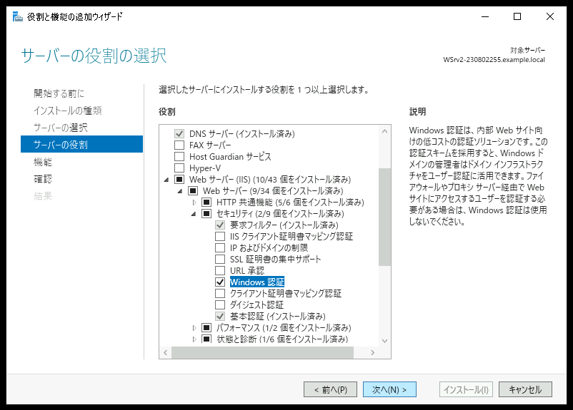</kbd> 

    1. [サーバーの役割]画面で、上のパラメータを選択したことを確認し、[次へ]をクリックする  
    1. [機能の選択]画面で、[次へ]をクリックする  
    1. [確認]画面で、[インストール]をクリックする  
    1. [結果]画面で、インストール進捗を示すプログレスバーが右端に到達するまで数分間待機する  
    1. [結果]画面で、インストールが正常に完了したことを確認し、[閉じる]をクリックする  
 

## 2. Windows認証を有効化する  

1. IIS管理コンソールを起動する  

    1. IIS管理コンソール(インターネット インフォメーション サービス(IIS) マネージャー)をすでに起動している場合は、IIS管理コンソールのウィンドウを閉じて終了します。   
    > 【補足】  
    > 前の手順で追加インストールした役割サービスを管理コンソール画面に表示するために、IIS管理コンソールの再起動が必要です。
    1. [サーバーマネージャー]ウィンドウ右上の[ツール]をクリックする  
    1. メニュー内の[インターネット インフォメーション サービス(IIS) マネージャー]をクリックし、IIS管理コンソールを起動する  
        <kbd>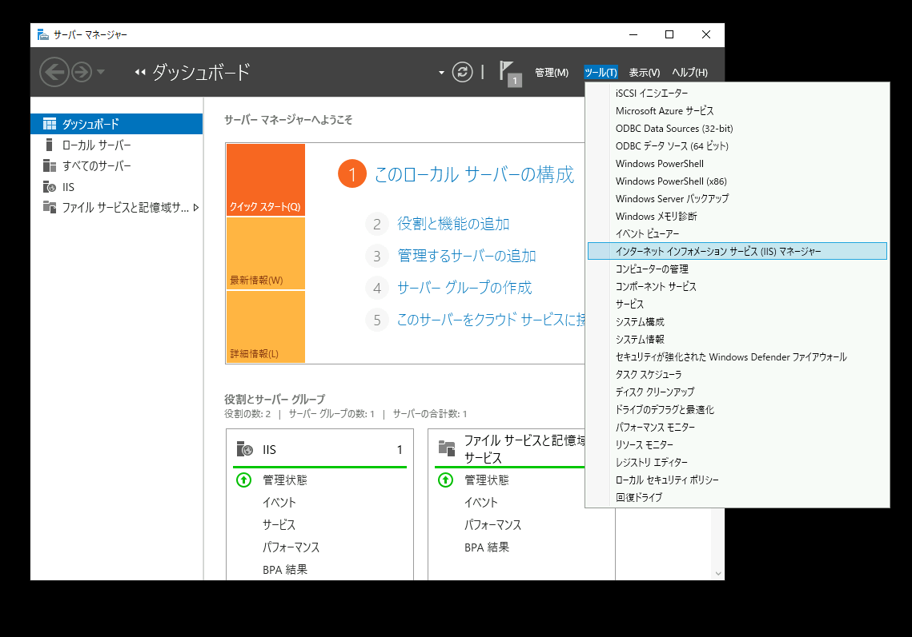</kbd> 
    1. [インターネット インフォメーション サービス(IIS) マネージャー]が起動したことを確認する

1. Windows認証を有効化する

    1. 左側コンソールツリーの[＜サーバー名＞]-[サイト]-[Web Share]をクリックする  
    1. ウィンドウ中央ペインの[認証]をダブルクリックする  
        <kbd>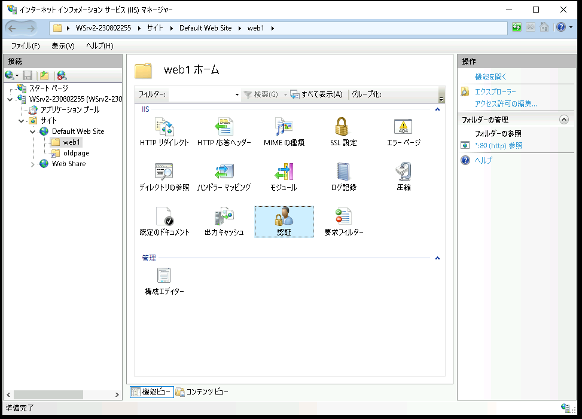</kbd>  
    1. Windows認証を有効化する    
        1. ウィンドウ中央ペインで、[Windows認証]のエントリをクリックして選択する  
        1. ウィンドウ右側ペインの[操作]メニューの[有効にする]をクリックする  
        1. [Windows認証]のエントリの状態が "有効" であることを確認する  
            <kbd>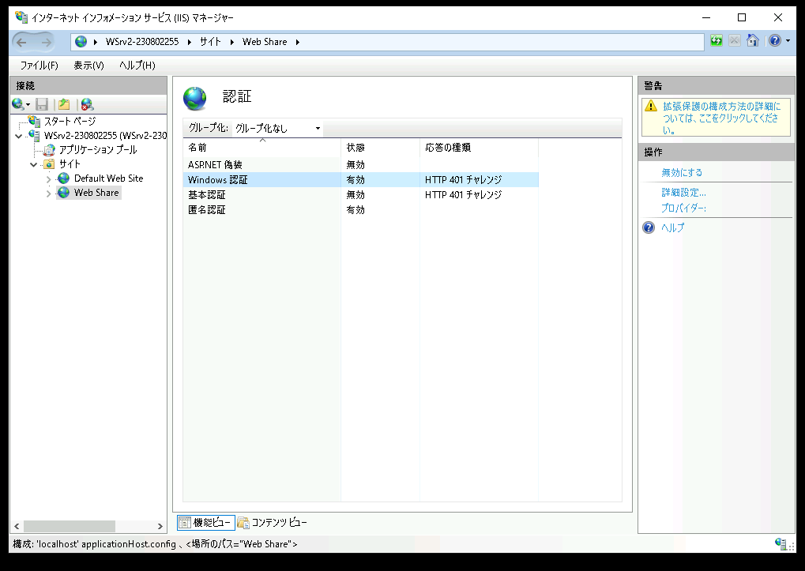</kbd> 

    1. 匿名アクセス(匿名認証)を無効にする    
        1. ウィンドウ中央ペインで、[匿名認証]のエントリをクリックして選択する  
        1. ウィンドウ右側ペインの[操作]メニューの[無効にする]をクリックする  
        1. [匿名認証]のエントリの状態が "無効" であることを確認する  
            <kbd>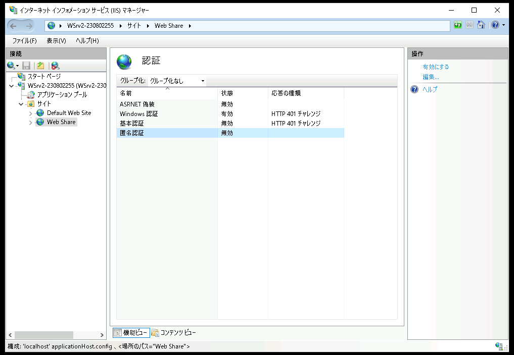</kbd> 

## 3. Windows認証をWebブラウザに許可する    

1. Windows Clientに、Active DirectoryユーザーのTomでログオンする     
    1. 操作コンピュータを変更するため、演習環境のトップページに戻る  
    1. Windows Client(WinClient)の管理画面に "AD Tom" で接続する   

1. [インターネットのプロパティ]ウィンドウを表示する  
    1. Windowsスタートメニューの[Windowwsシステムツール]-[コントロール パネル]をクリックする  
        <kbd>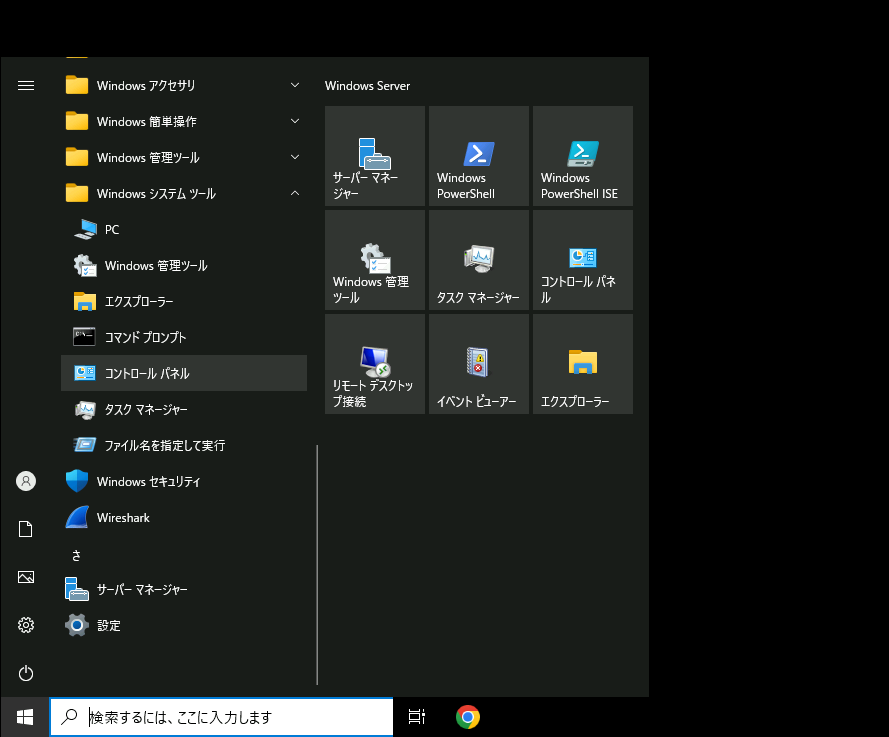</kbd> 
    1. [コントロール パネル]ウィンドウが起動したことを確認する  
    1. [コントロール パネル]ウィンドウで、[ネットワークとインターネット]をクリックする  
        <kbd>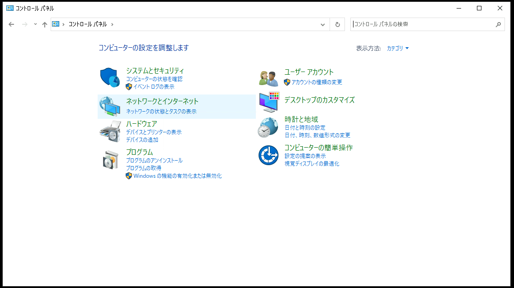</kbd> 
    1. [コントロール パネル-ネットワークとインターネット]画面で、[インターネット オプション]をクリックする  
        <kbd>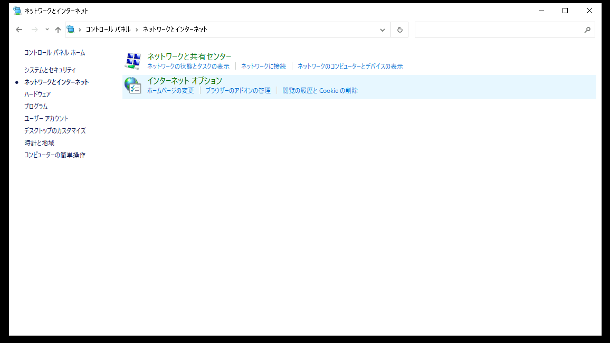</kbd> 
    1. [インターネットのプロパティ]ウィンドウが起動したことを確認する  
        <kbd>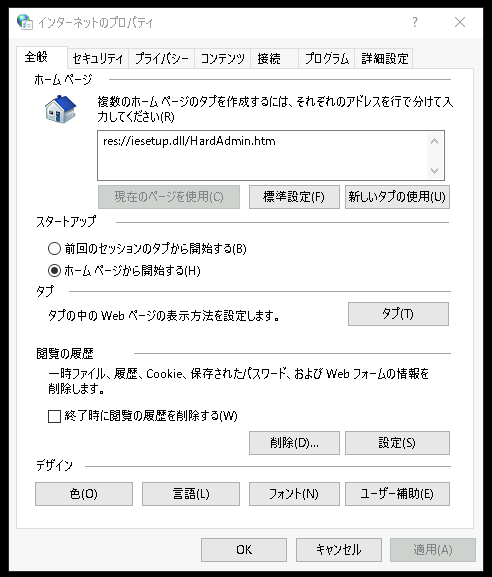</kbd>    

1. 信頼済みサイトとして Windows Server 2("Web1.example.local") を登録する  
    1. [インターネットのプロパティ]ウィンドウで、[セキュリティ]タブをクリックする  
    1. [インターネットのプロパティ]ウィンドウの[セキュリティ]タブで、[信頼済みサイト]をクリックして選択する  
        <kbd>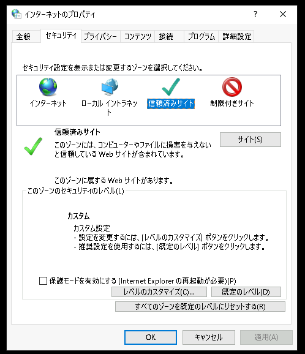</kbd>   
    1. "信頼済みサイト"項の右の[サイト]をクリックする  
        <kbd>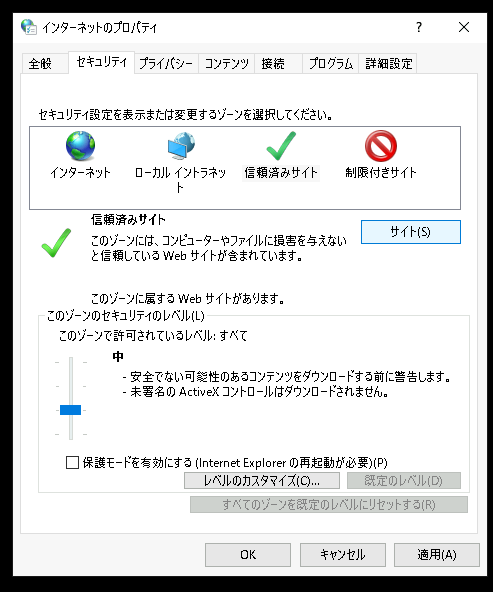</kbd>   
    1. [信頼済みサイト]ウィンドウが表示されたことを確認する  
    1. [信頼済みサイト]ウィンドウで、以下のパラメータを入力する  

        このWebサイトをゾーンに追加する: 
        | `http://web1.example.local/` | 
        | :----- |

        <kbd>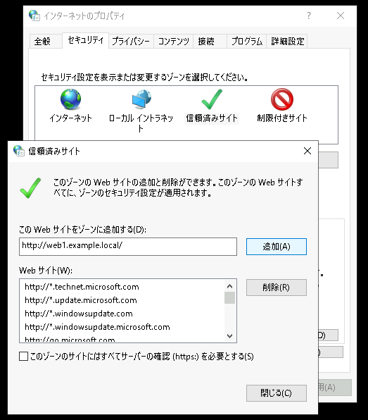</kbd>   

    1. [信頼済みサイト]ウィンドウで、[追加]をクリックする  
    1. [信頼済みサイト]ウィンドウの "Webサイト"項の一覧に "http://web1.example.local" が追加されていることを確認する  
        <kbd>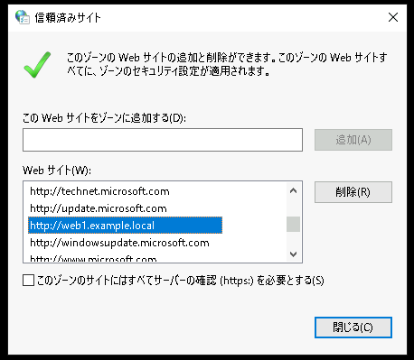</kbd>   
    1. [信頼済みサイト]ウィンドウで、[閉じる]をクリックする  

1. 信頼済みゾーンのセキュリティレベルを変更し、ログオンしているユーザーの認証情報を自動的にWebサイトに送信することを許可する   
    1. [インターネットのプロパティ]ウィンドウの[セキュリティ]の[レベルのカスタマイズ]をクリックする  
            <kbd>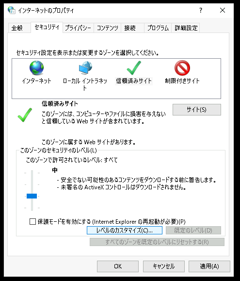</kbd>   
    1. [セキュリティ設定-信頼されたゾーン]ウィンドウが表示されたことを確認する  
    1. "ユーザー認証" 項のログオン設定として、以下のパラメータを選択する  

        [ユーザー認証]-[ログオン]:  
        - [ ] イントラネット ゾーンでのみ自動的にログオンする  
        - [ ] ユーザー名とパスワードを入力してログオンする  
        - [x] 現在のユーザー名とパスワードで自動的にログオンする  
        - [ ] 匿名でログオンする  

        <kbd>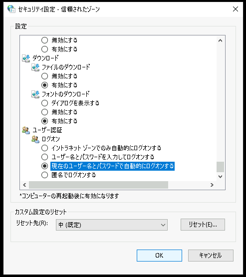</kbd>   
    
    1. [セキュリティ設定-信頼されたゾーン]ウィンドウで、[OK]をクリックする    

    1. [インターネットのプロパティ]ウィンドウで、[OK]をクリックする  

<!--
インターネットオプションの[詳細]タブの[統合Windows認証を使用する]のチェックボックスは、Windows認証の可否には影響しません。   
有効:Keberosを試みた後にNTLMする
無効:最初からNTLMする
-->

---  

## 4. Windows認証の動作を確認する      

1. ClientのWebブラウザでWebアクセスし、Windows認証の動作を確認する      
    1. Windows Client(WinClient)の管理画面に "AD Tom" で接続する   
    1. WinClientでWebブラウザ(Google Chrome)を起動する  
    1. Webブラウザのアドレス欄に [`http://Web1.example.local:1080/`] と入力し、[Enter]キーを押下する  
    1. 認証情報を入力するポップアップが表示されずに、Webコンテンツにシームレスにアクセスできたことを確認する  
        > 【補足】  
        > Windows認証により、Webサイト接続時に自動的にEXAMPLE\TOMの認証情報が送信されます。 
 
 1. (オプション) IISのログを参照する  
    1. 操作コンピュータを変更するため、演習環境のトップページに戻る  
    1. Windows Webサーバー(WinSrv2)の管理画面に接続する   
    1. ファイルエクスプローラーを起動し、"C:\\inetpub\\logs\\LogFiles"にアクセスする  
    1. IISのログファイルを参照し、EXAMPLE\\Tomからのアクセスが記録されていることを確認する  
        <kbd>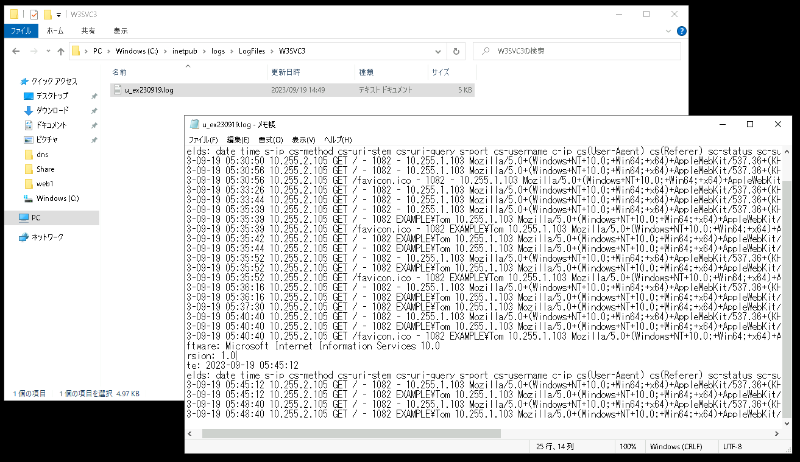</kbd>   

---

## 演習完了  
ここまでの手順で、以下の項目を学習できました。
- [x] Webサーバー(IIS)でWindows認証を有効化する  
- [x] Windows認証を使用できるようにWindows OSのインターネットオプションを構成する  

