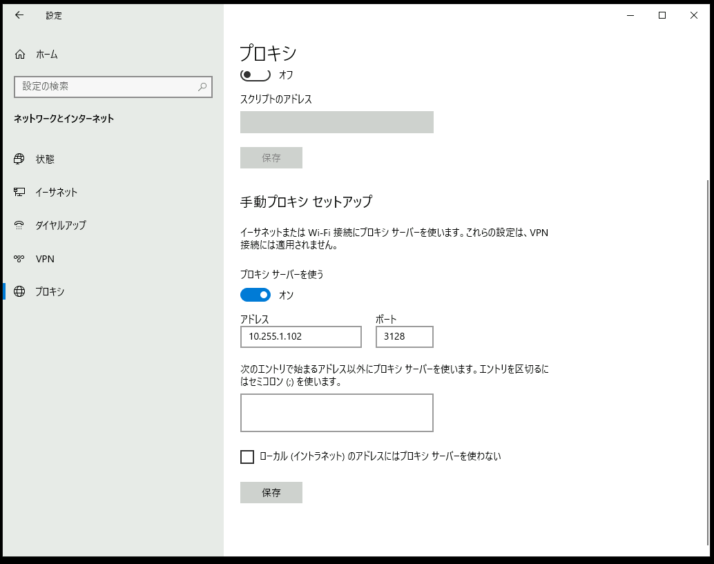
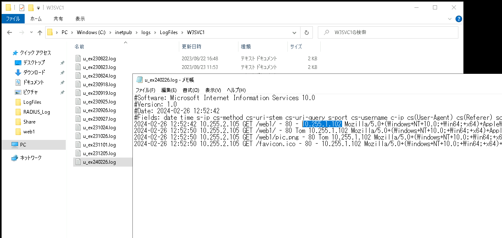

# Linux ServerでProxyサーバーを構築する

---

## 演習における役割と、環境のパラメータ
- X: ご自身のPod番号
- Proxyサーバー役: Linux1
- Webサーバー役: WinSrv2
- クライアント デスクトップ環境: WinClient(WC1-yyMMddX)

## 注意
- 手順例の画像は<B>pod255</B>に準拠したパラメータのものです
- 手順内の<B>X</B>表記はご自身のpod番号に読み替えてください

---

# Linux Proxyサーバー(Squid)構築の準備
1. Linux1の管理画面に接続する  

1. Squidをインストールする  
    ＞ ***sudo yum install squid***  
    ＞ ***y***  

    ```
    [admin@linux1 ~]$ sudo yum install squid  
    (略)
    Is this ok [y/d/N]: y
    (略)
    Complete!
    [admin@linux1 ~]$ 
    ```

    <details>
    <summary>[参考]yum実行時のログ出力例 (クリックで表示):</summary>  
 
        [admin@linux1 ~]$ sudo yum install squid
        Loaded plugins: langpacks
        base-openlogic                                                                                         | 3.1 kB  00:00:00     
        extras-openlogic                                                                                       | 2.5 kB  00:00:00     
        updates-openlogic                                                                                      | 2.6 kB  00:00:00     
        base                                                                                                   | 3.6 kB  00:00:00     
        docker-ce-stable                                                                                       | 3.5 kB  00:00:00     
        extras                                                                                                 | 2.9 kB  00:00:00     
        kibana-7.x                                                                                             | 1.3 kB  00:00:00     
        logstash-7.x                                                                                           | 1.3 kB  00:00:00     
        openlogic                                                                                              | 2.9 kB  00:00:00     
        updates                                                                                                | 2.9 kB  00:00:00     
        (1/7): extras-openlogic/7/x86_64/primary_db                                                            | 251 kB  00:00:00     
        (2/7): kibana-7.x/primary                                                                              | 553 kB  00:00:00     
        (3/7): docker-ce-stable/7/x86_64/primary_db                                                            | 133 kB  00:00:00     
        (4/7): logstash-7.x/primary                                                                            | 553 kB  00:00:00     
        (5/7): extras/7/x86_64/primary_db                                                                      | 250 kB  00:00:00     
        (6/7): updates-openlogic/7/x86_64/primary_db                                                           |  25 MB  00:00:00     
        (7/7): updates/7/x86_64/primary_db                                                                     |  25 MB  00:00:00     
        kibana-7.x                                                                                                          1740/1740
        logstash-7.x                                                                                                        1740/1740
        Resolving Dependencies
        --> Running transaction check
        ---> Package squid.x86_64 7:3.5.20-17.el7_9.9 will be installed
        --> Processing Dependency: squid-migration-script for package: 7:squid-3.5.20-17.el7_9.9.x86_64
        --> Processing Dependency: perl(Digest::MD5) for package: 7:squid-3.5.20-17.el7_9.9.x86_64
        --> Processing Dependency: perl(DBI) for package: 7:squid-3.5.20-17.el7_9.9.x86_64
        --> Processing Dependency: libltdl.so.7()(64bit) for package: 7:squid-3.5.20-17.el7_9.9.x86_64
        --> Processing Dependency: libecap.so.3()(64bit) for package: 7:squid-3.5.20-17.el7_9.9.x86_64
        --> Running transaction check
        ---> Package libecap.x86_64 0:1.0.0-1.el7 will be installed
        ---> Package libtool-ltdl.x86_64 0:2.4.2-22.el7_3 will be installed
        ---> Package perl-DBI.x86_64 0:1.627-4.el7 will be installed
        --> Processing Dependency: perl(RPC::PlServer) >= 0.2001 for package: perl-DBI-1.627-4.el7.x86_64
        --> Processing Dependency: perl(RPC::PlClient) >= 0.2000 for package: perl-DBI-1.627-4.el7.x86_64
        ---> Package perl-Digest-MD5.x86_64 0:2.52-3.el7 will be installed
        --> Processing Dependency: perl(Digest::base) >= 1.00 for package: perl-Digest-MD5-2.52-3.el7.x86_64
        ---> Package squid-migration-script.x86_64 7:3.5.20-17.el7_9.9 will be installed
        --> Running transaction check
        ---> Package perl-Digest.noarch 0:1.17-245.el7 will be installed
        ---> Package perl-PlRPC.noarch 0:0.2020-14.el7 will be installed
        --> Processing Dependency: perl(Net::Daemon) >= 0.13 for package: perl-PlRPC-0.2020-14.el7.noarch
        --> Processing Dependency: perl(Net::Daemon::Test) for package: perl-PlRPC-0.2020-14.el7.noarch
        --> Processing Dependency: perl(Net::Daemon::Log) for package: perl-PlRPC-0.2020-14.el7.noarch
        --> Processing Dependency: perl(Compress::Zlib) for package: perl-PlRPC-0.2020-14.el7.noarch
        --> Running transaction check
        ---> Package perl-IO-Compress.noarch 0:2.061-2.el7 will be installed
        --> Processing Dependency: perl(Compress::Raw::Zlib) >= 2.061 for package: perl-IO-Compress-2.061-2.el7.noarch
        --> Processing Dependency: perl(Compress::Raw::Bzip2) >= 2.061 for package: perl-IO-Compress-2.061-2.el7.noarch
        ---> Package perl-Net-Daemon.noarch 0:0.48-5.el7 will be installed
        --> Running transaction check
        ---> Package perl-Compress-Raw-Bzip2.x86_64 0:2.061-3.el7 will be installed
        ---> Package perl-Compress-Raw-Zlib.x86_64 1:2.061-4.el7 will be installed
        --> Finished Dependency Resolution

        Dependencies Resolved

        ==============================================================================================================================
        Package                             Arch               Version                           Repository                     Size
        ==============================================================================================================================
        Installing:
        squid                               x86_64             7:3.5.20-17.el7_9.9               updates-openlogic             3.1 M
        Installing for dependencies:
        libecap                             x86_64             1.0.0-1.el7                       base-openlogic                 21 k
        libtool-ltdl                        x86_64             2.4.2-22.el7_3                    base-openlogic                 49 k
        perl-Compress-Raw-Bzip2             x86_64             2.061-3.el7                       base-openlogic                 32 k
        perl-Compress-Raw-Zlib              x86_64             1:2.061-4.el7                     base-openlogic                 57 k
        perl-DBI                            x86_64             1.627-4.el7                       base-openlogic                802 k
        perl-Digest                         noarch             1.17-245.el7                      base-openlogic                 23 k
        perl-Digest-MD5                     x86_64             2.52-3.el7                        base-openlogic                 30 k
        perl-IO-Compress                    noarch             2.061-2.el7                       base-openlogic                260 k
        perl-Net-Daemon                     noarch             0.48-5.el7                        base-openlogic                 51 k
        perl-PlRPC                          noarch             0.2020-14.el7                     base-openlogic                 36 k
        squid-migration-script              x86_64             7:3.5.20-17.el7_9.9               updates-openlogic              51 k

        Transaction Summary
        ==============================================================================================================================
        Install  1 Package (+11 Dependent packages)

        Total download size: 4.5 M
        Installed size: 14 M
        Is this ok [y/d/N]: y
        Downloading packages:
        (1/12): libecap-1.0.0-1.el7.x86_64.rpm                                                                 |  21 kB  00:00:00     
        (2/12): libtool-ltdl-2.4.2-22.el7_3.x86_64.rpm                                                         |  49 kB  00:00:00     
        (3/12): perl-Compress-Raw-Bzip2-2.061-3.el7.x86_64.rpm                                                 |  32 kB  00:00:00     
        (4/12): perl-Compress-Raw-Zlib-2.061-4.el7.x86_64.rpm                                                  |  57 kB  00:00:00     
        (5/12): perl-Digest-1.17-245.el7.noarch.rpm                                                            |  23 kB  00:00:00     
        (6/12): perl-Digest-MD5-2.52-3.el7.x86_64.rpm                                                          |  30 kB  00:00:00     
        (7/12): perl-IO-Compress-2.061-2.el7.noarch.rpm                                                        | 260 kB  00:00:00     
        (8/12): perl-Net-Daemon-0.48-5.el7.noarch.rpm                                                          |  51 kB  00:00:00     
        (9/12): perl-DBI-1.627-4.el7.x86_64.rpm                                                                | 802 kB  00:00:00     
        (10/12): perl-PlRPC-0.2020-14.el7.noarch.rpm                                                           |  36 kB  00:00:00     
        (11/12): squid-migration-script-3.5.20-17.el7_9.9.x86_64.rpm                                           |  51 kB  00:00:00     
        (12/12): squid-3.5.20-17.el7_9.9.x86_64.rpm                                                            | 3.1 MB  00:00:00     
        ------------------------------------------------------------------------------------------------------------------------------
        Total                                                                                          11 MB/s | 4.5 MB  00:00:00     
        Running transaction check
        Running transaction test
        Transaction test succeeded
        Running transaction
        Installing : 1:perl-Compress-Raw-Zlib-2.061-4.el7.x86_64                                                               1/12 
        Installing : perl-Compress-Raw-Bzip2-2.061-3.el7.x86_64                                                                2/12 
        Installing : perl-IO-Compress-2.061-2.el7.noarch                                                                       3/12 
        Installing : perl-Digest-1.17-245.el7.noarch                                                                           4/12 
        Installing : perl-Digest-MD5-2.52-3.el7.x86_64                                                                         5/12 
        Installing : 7:squid-migration-script-3.5.20-17.el7_9.9.x86_64                                                         6/12 
        Installing : libtool-ltdl-2.4.2-22.el7_3.x86_64                                                                        7/12 
        Installing : libecap-1.0.0-1.el7.x86_64                                                                                8/12 
        Installing : perl-Net-Daemon-0.48-5.el7.noarch                                                                         9/12 
        Installing : perl-PlRPC-0.2020-14.el7.noarch                                                                          10/12 
        Installing : perl-DBI-1.627-4.el7.x86_64                                                                              11/12 
        Installing : 7:squid-3.5.20-17.el7_9.9.x86_64                                                                         12/12 
        Verifying  : perl-Net-Daemon-0.48-5.el7.noarch                                                                         1/12 
        Verifying  : 7:squid-3.5.20-17.el7_9.9.x86_64                                                                          2/12 
        Verifying  : perl-Digest-MD5-2.52-3.el7.x86_64                                                                         3/12 
        Verifying  : libecap-1.0.0-1.el7.x86_64                                                                                4/12 
        Verifying  : perl-IO-Compress-2.061-2.el7.noarch                                                                       5/12 
        Verifying  : libtool-ltdl-2.4.2-22.el7_3.x86_64                                                                        6/12 
        Verifying  : 7:squid-migration-script-3.5.20-17.el7_9.9.x86_64                                                         7/12 
        Verifying  : perl-Digest-1.17-245.el7.noarch                                                                           8/12 
        Verifying  : perl-DBI-1.627-4.el7.x86_64                                                                               9/12 
        Verifying  : perl-Compress-Raw-Bzip2-2.061-3.el7.x86_64                                                               10/12 
        Verifying  : 1:perl-Compress-Raw-Zlib-2.061-4.el7.x86_64                                                              11/12 
        Verifying  : perl-PlRPC-0.2020-14.el7.noarch                                                                          12/12 

        Installed:
        squid.x86_64 7:3.5.20-17.el7_9.9                                                                                            

        Dependency Installed:
        libecap.x86_64 0:1.0.0-1.el7                                     libtool-ltdl.x86_64 0:2.4.2-22.el7_3                      
        perl-Compress-Raw-Bzip2.x86_64 0:2.061-3.el7                     perl-Compress-Raw-Zlib.x86_64 1:2.061-4.el7               
        perl-DBI.x86_64 0:1.627-4.el7                                    perl-Digest.noarch 0:1.17-245.el7                         
        perl-Digest-MD5.x86_64 0:2.52-3.el7                              perl-IO-Compress.noarch 0:2.061-2.el7                     
        perl-Net-Daemon.noarch 0:0.48-5.el7                              perl-PlRPC.noarch 0:0.2020-14.el7                         
        squid-migration-script.x86_64 7:3.5.20-17.el7_9.9               

        Complete!
        [admin@linux1 ~]$ 

    </details>


<!--
【補足】
詳細なconfigを完成させた後にインストール処理の不備が発覚した場合、構築作業のロールバックが発生する恐れがあります。  
ソフトウェアインストール直後にいちどサービスの起動可否を確認することで、手戻りの発生を防止できる場合があります。  
-->


1. SquidサービスのStatusを確認する  
    ＞ ***systemctl status squid***  
 
    > 【確認ポイント】  
    > 'Active:' が 'inactive (dead)'であることを確認する  
    - [x] Squidが、サービスとして認識されていること  
    - [x] Squidサービスが、まだ起動していないこと  

    ```
    [admin@linux1 ~]$ systemctl status squid
    ● squid.service - Squid caching proxy
    Loaded: loaded (/usr/lib/systemd/system/squid.service; disabled; vendor preset: disabled)
    Active: inactive (dead)
    [admin@linux1 ~]$ 
    ```


1. Squidサービスを自動起動に設定する  
    ＞ ***sudo systemctl enable squid***  

    ```
    [admin@linux1 ~]$ sudo systemctl enable squid
    Created symlink from /etc/systemd/system/multi-user.target.wants/squid.service to /usr/lib/systemd/system/squid.service.
    [admin@linux1 ~]$     
    ```

1. Squidサービスを起動する  
    ＞ ***sudo systemctl start squid***  

    ```
    [admin@linux1 ~]$ sudo systemctl start squid
    [admin@linux1 ~]$ 
    ```

1. SquidサービスのStatusを確認する  
    ＞ ***systemctl status squid***  
 
    > 【確認ポイント】  
    > 'Active:' が 'active(running)'であることを確認する  
    - [x] Squidサービスが起動していること   

    ```
    [admin@linux1 ~]$ systemctl status squid
    ● squid.service - Squid caching proxy
    Loaded: loaded (/usr/lib/systemd/system/squid.service; enabled; vendor preset: disabled)
    Active: active (running) since Mon 2024-02-26 08:05:48 UTC; 7min ago
    Process: 8955 ExecStart=/usr/sbin/squid $SQUID_OPTS -f $SQUID_CONF (code=exited, status=0/SUCCESS)
    Process: 8949 ExecStartPre=/usr/libexec/squid/cache_swap.sh (code=exited, status=0/SUCCESS)
    Main PID: 8957 (squid)
        Tasks: 3
    Memory: 13.5M
    CGroup: /system.slice/squid.service
            ├─8957 /usr/sbin/squid -f /etc/squid/squid.conf
            ├─8959 (squid-1) -f /etc/squid/squid.conf
            └─8960 (logfile-daemon) /var/log/squid/access.log

    Feb 26 08:05:48 linux1 systemd[1]: Starting Squid caching proxy...
    Feb 26 08:05:48 linux1 squid[8957]: Squid Parent: will start 1 kids
    Feb 26 08:05:48 linux1 squid[8957]: Squid Parent: (squid-1) process 8959 started
    Feb 26 08:05:48 linux1 systemd[1]: Started Squid caching proxy.
    [admin@linux1 ~]$ 
    ```


---  

# Squidをプロキシサーバーとして構成する   

1. Squidのconfigファイルを編集し、プロキシ サーバーとしての要件を実装する   
    ＞ ***sudo cp /etc/squid/squid.conf /etc/squid/squid.conf.bak***  
    ＞ ***sudo vi /etc/squid/squid.conf***  
    ＞ ***sudo diff /etc/squid/squid.conf /etc/squid/squid.conf.bak***  

    【要件】  
    - [x] WinClient(10.X.1.103/32)からのプロキシ接続のみを許可する  
    - [x] クライアントの本来IPアドレスを隠蔽する  
    - [x] Squidが使用するDNS問い合わせ先として、WinSrv1(10.X.1.104)を指定する  

    ```
    [admin@linux1 ~]$ sudo cp /etc/squid/squid.conf /etc/squid/squid.conf.bak
    [admin@linux1 ~]$ sudo vi /etc/squid/squid.conf
    [admin@linux1 ~]$ sudo diff /etc/squid/squid.conf /etc/squid/squid.conf.bak
    13,14d13
    < acl my_client src 10.255.1.103/32
    < 
    53,56c52,53
    < 
    < #http_access allow localnet
    < #http_access allow localhost
    < http_access allow my_client
    ---
    > http_access allow localnet
    > http_access allow localhost
    77,81d73
    < 
    < forwarded_for off
    < 
    < dns_nameservers 10.255.1.104
    < 
    [admin@linux1 ~]$ 
    ```


    [参考]squid.conf全文:
    ```
    [admin@linux1 ~]$ sudo cat /etc/squid/squid.conf
    #
    # Recommended minimum configuration:
    #

    # Example rule allowing access from your local networks.
    # Adapt to list your (internal) IP networks from where browsing
    # should be allowed
    acl localnet src 10.0.0.0/8# RFC1918 possible internal network
    acl localnet src 172.16.0.0/12# RFC1918 possible internal network
    acl localnet src 192.168.0.0/16# RFC1918 possible internal network
    acl localnet src fc00::/7       # RFC 4193 local private network range
    acl localnet src fe80::/10      # RFC 4291 link-local (directly plugged) machines

    acl my_client src 10.255.1.103/32                                                  # ←追記. addressは読み替えること

    acl SSL_ports port 443
    acl Safe_ports port 80# http
    acl Safe_ports port 21# ftp
    acl Safe_ports port 443# https
    acl Safe_ports port 70# gopher
    acl Safe_ports port 210# wais
    acl Safe_ports port 1025-65535# unregistered ports
    acl Safe_ports port 280# http-mgmt
    acl Safe_ports port 488# gss-http
    acl Safe_ports port 591# filemaker
    acl Safe_ports port 777# multiling http
    acl CONNECT method CONNECT

    #
    # Recommended minimum Access Permission configuration:
    #
    # Deny requests to certain unsafe ports
    http_access deny !Safe_ports

    # Deny CONNECT to other than secure SSL ports
    http_access deny CONNECT !SSL_ports

    # Only allow cachemgr access from localhost
    http_access allow localhost manager
    http_access deny manager

    # We strongly recommend the following be uncommented to protect innocent
    # web applications running on the proxy server who think the only
    # one who can access services on "localhost" is a local user
    #http_access deny to_localhost

    #
    # INSERT YOUR OWN RULE(S) HERE TO ALLOW ACCESS FROM YOUR CLIENTS
    #

    # Example rule allowing access from your local networks.
    # Adapt localnet in the ACL section to list your (internal) IP networks
    # from where browsing should be allowed

    #http_access allow localnet                                                    # 行頭に#をつけてコメントアウト
    #http_access allow localhost                                                   # 行頭に#をつけてコメントアウト
    http_access allow my_client                                                    # ←追記

    # And finally deny all other access to this proxy
    http_access deny all

    # Squid normally listens to port 3128
    http_port 3128

    # Uncomment and adjust the following to add a disk cache directory.
    #cache_dir ufs /var/spool/squid 100 16 256

    # Leave coredumps in the first cache dir
    coredump_dir /var/spool/squid

    #
    # Add any of your own refresh_pattern entries above these.
    #
    refresh_pattern ^ftp:144020%10080
    refresh_pattern ^gopher:14400%1440
    refresh_pattern -i (/cgi-bin/|\?) 00%0
    refresh_pattern .020%4320

    forwarded_for off                                                              # ←追記

    dns_nameservers 10.255.1.104                                                   # ←追記

    [admin@linux1 ~]$ 
    ```
    </summary>


1. Squidサービスを再起動する  
    ＞ ***sudo systemctl restart squid***  

    ```
    [admin@linux1 ~]$ sudo systemctl restart squid
    [admin@linux1 ~]$ 
    ```

    > 【補足】
    > 再起動に失敗した場合はsquid.confの編集作業で意図しない記述をしたためにエラーが発生している疑いがあります。
    > 以下のコマンドを実行し、エラー原因を調査してください。
    > journalctl -xe | grep squid.conf


1. SquidサービスのStatusを確認する  
    ＞ ***systemctl status squid***  
 
    > 【確認ポイント】  
    > 'Active:' が 'active(running)'であることを確認する  
    - [x] Squidサービスが起動していること   

    ```
    [admin@linux1 ~]$ systemctl status squid
    ● squid.service - Squid caching proxy
    Loaded: loaded (/usr/lib/systemd/system/squid.service; enabled; vendor preset: disabled)
    Active: active (running) since Mon 2024-02-26 08:05:48 UTC; 7min ago
    Process: 8955 ExecStart=/usr/sbin/squid $SQUID_OPTS -f $SQUID_CONF (code=exited, status=0/SUCCESS)
    Process: 8949 ExecStartPre=/usr/libexec/squid/cache_swap.sh (code=exited, status=0/SUCCESS)
    Main PID: 8957 (squid)
        Tasks: 3
    Memory: 13.5M
    CGroup: /system.slice/squid.service
            ├─8957 /usr/sbin/squid -f /etc/squid/squid.conf
            ├─8959 (squid-1) -f /etc/squid/squid.conf
            └─8960 (logfile-daemon) /var/log/squid/access.log

    Feb 26 08:05:48 linux1 systemd[1]: Starting Squid caching proxy...
    Feb 26 08:05:48 linux1 squid[8957]: Squid Parent: will start 1 kids
    Feb 26 08:05:48 linux1 squid[8957]: Squid Parent: (squid-1) process 8959 started
    Feb 26 08:05:48 linux1 systemd[1]: Started Squid caching proxy.
    [admin@linux1 ~]$ 
    ```


---  

# Squidの動作を確認する   

1. Windows Clientに"admin"で接続する  

1. プロキシの設定メニューにアクセスする  

    1. [スタートメニュー]を右クリックし、コンテキストメニュー内の[設定]をクリックする 
    1. [Windowsの設定]画面が表示されたことを確認する   
    1. [Windowsの設定]画面で、[ネットワークとインターネット]をクリックする  
    1. [(ネットワークとインターネット画面の)ネットワークの状態]画面が表示されたことを確認する   
    1. [ネットワークとインターネット]画面の左側メニューの[プロキシ]をクリックする  
    1. [プロキシ]画面が表示されたことを確認する    

<!--
【補足】
以下の操作でも[設定]の[プロキシ]を操作できます。

ファイル名を指定して実行:  
ms-settings:network-proxy  

PowerShellもしくはコマンドプロンプト:    
start ms-settings:network-proxy  
-->

1. プロキシ サーバーとしてSquidを設定する  

    1. [プロキシ]画面の"手動プロキシ セットアップ"の項目で、以下のパラメータを入力する

        | 項目 | パラメータ |
        | :----- | :----- |
        | プロキシ サーバーを使う | オン |
        | アドレス | 10.X.1.102 |
        | ポート | 3128 |  
        | 次のエントリで始まるアドレス以外に<br />プロキシサーバーを使います。<br />エントリを区切るにはセミコロン(;)を使います。 | <空欄> |  
        | ローカル(イントラネット)のアドレスには<br />プロキシサーバーを使わない | <なし> |  

        <kbd></kbd> 

    1. [プロキシ]画面で、[保存]をクリックする  


1. Webサーバーにアクセスする

    1. Webブラウザを起動し、http://web1.example.local/web1 にアクセスする  
    1. 認証情報として、以下のパラメータを入力する  
        | 項目 | パラメータ |
        | :----- | :----- |
        | ユーザー名 | Tom |
        | パスワード | Pa$$w0rd |
    1. Webページが表示できたことを確認する    

1. Webサーバーのログを確認する
    1. WinSrv2に接続する  
    1. IISのログファイル(C:\inetpub\logs\LogFiles\ 以下) を参照する  
    1. Windows Client(10.X.1.103)ではなく、プロキシサーバー(10.X.1.102)からのアクセスが記録されていることを確認する  

        <kbd></kbd> 


---

## 演習完了  
ここまでの手順で、以下の項目を学習できました。
- [x] Squidをインストールし、構成する  
- [x] Windows OSでプロキシを指定する    


